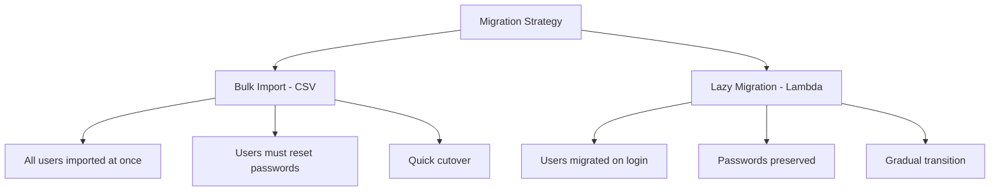

# How to Migrate Users to Cognito from an Existing Database

Author: [nawazdhandala](https://github.com/nawazdhandala)

Tags: AWS, Cognito, Migration, Authentication

Description: A practical guide to migrating existing users to AWS Cognito from a custom database, covering bulk import with CSV, lazy migration with Lambda triggers, and handling password hashes.

---

Moving your existing user base to Cognito is one of those projects that sounds straightforward but has some real gotchas. You can't just dump password hashes into Cognito because it uses its own hashing scheme. You've got to decide between migrating everyone at once or doing it lazily as users log in. And you need to handle the transition period where some users are in Cognito and others aren't.

Let's look at the two main approaches and when to use each.

## Migration Strategies

There are two primary ways to migrate users to Cognito:

1. **Bulk Import (CSV)** - upload all users at once. Users must reset their passwords since you can't import password hashes.
2. **Lazy Migration (Lambda Trigger)** - migrate users one at a time when they log in. Validates credentials against your old database and creates the Cognito account on the fly.



Most teams use lazy migration because it preserves user passwords and doesn't require a mass password reset email.

## Lazy Migration with Lambda Triggers

Cognito has a built-in User Migration Lambda trigger. When a user tries to sign in and doesn't exist in the user pool, Cognito calls your Lambda. Your Lambda checks the old database, validates the password, and returns the user data. Cognito then creates the user automatically.

Here's the migration Lambda:

```javascript
// user-migration/index.js
const mysql = require('mysql2/promise');
const bcrypt = require('bcryptjs');

// Connection to your existing user database
let dbPool = null;

function getPool() {
    if (!dbPool) {
        dbPool = mysql.createPool({
            host: process.env.DB_HOST,
            user: process.env.DB_USER,
            password: process.env.DB_PASSWORD,
            database: process.env.DB_NAME,
            connectionLimit: 5
        });
    }
    return dbPool;
}

exports.handler = async (event) => {
    console.log('Migration trigger:', event.triggerSource);

    if (event.triggerSource === 'UserMigration_Authentication') {
        // User is trying to sign in - validate credentials
        return handleSignIn(event);
    }

    if (event.triggerSource === 'UserMigration_ForgotPassword') {
        // User is resetting password - just verify they exist
        return handleForgotPassword(event);
    }

    return event;
};

async function handleSignIn(event) {
    const username = event.userName;
    const password = event.request.password;

    const pool = getPool();

    // Look up the user in the old database
    const [rows] = await pool.execute(
        'SELECT id, email, name, password_hash, role FROM users WHERE email = ?',
        [username]
    );

    if (rows.length === 0) {
        throw new Error('User not found');
    }

    const user = rows[0];

    // Verify the password against the old hash
    const passwordValid = await bcrypt.compare(password, user.password_hash);
    if (!passwordValid) {
        throw new Error('Invalid credentials');
    }

    // Return user attributes for Cognito to create the account
    event.response.userAttributes = {
        email: user.email,
        email_verified: 'true',
        name: user.name,
        'custom:legacy_id': String(user.id),
        'custom:role': user.role || 'user'
    };

    // Don't require password change after migration
    event.response.finalUserStatus = 'CONFIRMED';

    // Suppress the welcome email
    event.response.messageAction = 'SUPPRESS';

    // Force alias creation if using email as alias
    event.response.forceAliasCreation = false;

    console.log(`Migrated user: ${username}`);
    return event;
}

async function handleForgotPassword(event) {
    const username = event.userName;
    const pool = getPool();

    const [rows] = await pool.execute(
        'SELECT id, email, name FROM users WHERE email = ?',
        [username]
    );

    if (rows.length === 0) {
        throw new Error('User not found');
    }

    const user = rows[0];

    event.response.userAttributes = {
        email: user.email,
        email_verified: 'true',
        name: user.name,
        'custom:legacy_id': String(user.id)
    };

    event.response.finalUserStatus = 'CONFIRMED';
    event.response.messageAction = 'SUPPRESS';

    return event;
}
```

Attach the trigger to your user pool:

```bash
# Set the user migration Lambda trigger
aws cognito-idp update-user-pool \
    --user-pool-id us-east-1_XXXXXXXXX \
    --lambda-config UserMigration=arn:aws:lambda:us-east-1:123456789:function:user-migration

# Grant Cognito permission to invoke the Lambda
aws lambda add-permission \
    --function-name user-migration \
    --statement-id cognito-migration \
    --action lambda:InvokeFunction \
    --principal cognito-idp.amazonaws.com \
    --source-arn arn:aws:cognito-idp:us-east-1:123456789:userpool/us-east-1_XXXXXXXXX
```

## Handling Different Password Hash Formats

Your old database might use various hashing algorithms. Here's how to handle common ones.

Support multiple hash formats in validation:

```javascript
const bcrypt = require('bcryptjs');
const crypto = require('crypto');

async function verifyPassword(password, storedHash, hashFormat) {
    switch (hashFormat) {
        case 'bcrypt':
            return bcrypt.compare(password, storedHash);

        case 'sha256': {
            const hash = crypto.createHash('sha256').update(password).digest('hex');
            return hash === storedHash;
        }

        case 'sha256_salted': {
            // Format: hash:salt
            const [hashValue, salt] = storedHash.split(':');
            const computed = crypto.createHash('sha256')
                .update(password + salt)
                .digest('hex');
            return computed === hashValue;
        }

        case 'pbkdf2': {
            // Format: iterations:salt:hash
            const [iterations, salt, hash] = storedHash.split(':');
            return new Promise((resolve, reject) => {
                crypto.pbkdf2(
                    password, salt, parseInt(iterations), 64, 'sha512',
                    (err, derivedKey) => {
                        if (err) reject(err);
                        resolve(derivedKey.toString('hex') === hash);
                    }
                );
            });
        }

        default:
            throw new Error(`Unsupported hash format: ${hashFormat}`);
    }
}
```

## Bulk Import with CSV

For scenarios where you can't use lazy migration (maybe you're decommissioning the old database), bulk import is the way to go. Users won't have their passwords, but they can use the forgot password flow to set new ones.

Prepare the CSV file in Cognito's required format:

```csv
cognito:username,email,email_verified,name,custom:legacy_id,cognito:mfa_enabled
user1@example.com,user1@example.com,true,John Doe,1001,false
user2@example.com,user2@example.com,true,Jane Smith,1002,false
user3@example.com,user3@example.com,true,Bob Wilson,1003,false
```

Here's a script to generate the CSV from your database:

```javascript
const mysql = require('mysql2/promise');
const fs = require('fs');

async function generateImportCSV() {
    const pool = await mysql.createPool({
        host: process.env.DB_HOST,
        user: process.env.DB_USER,
        password: process.env.DB_PASSWORD,
        database: process.env.DB_NAME
    });

    const [users] = await pool.execute(
        'SELECT id, email, name FROM users WHERE active = 1'
    );

    // CSV header must match Cognito's expected format
    const header = 'cognito:username,email,email_verified,name,custom:legacy_id,cognito:mfa_enabled';
    const rows = users.map(user =>
        `${user.email},${user.email},true,${user.name.replace(/,/g, '')},${user.id},false`
    );

    const csv = [header, ...rows].join('\n');
    fs.writeFileSync('cognito-import.csv', csv);

    console.log(`Generated CSV with ${users.length} users`);
    await pool.end();
}

generateImportCSV();
```

Run the import job:

```bash
# Create an import job
JOB_ID=$(aws cognito-idp create-user-import-job \
    --user-pool-id us-east-1_XXXXXXXXX \
    --job-name "migration-$(date +%Y%m%d)" \
    --cloud-watch-logs-role-arn arn:aws:iam::123456789:role/CognitoImportRole \
    --query 'UserImportJob.JobId' --output text)

# Get the pre-signed URL to upload the CSV
UPLOAD_URL=$(aws cognito-idp describe-user-import-job \
    --user-pool-id us-east-1_XXXXXXXXX \
    --job-id $JOB_ID \
    --query 'UserImportJob.PreSignedUrl' --output text)

# Upload the CSV
curl -X PUT "$UPLOAD_URL" \
    -H "Content-Type: text/csv" \
    --data-binary @cognito-import.csv

# Start the import job
aws cognito-idp start-user-import-job \
    --user-pool-id us-east-1_XXXXXXXXX \
    --job-id $JOB_ID

# Check import status
aws cognito-idp describe-user-import-job \
    --user-pool-id us-east-1_XXXXXXXXX \
    --job-id $JOB_ID
```

## Tracking Migration Progress

For lazy migration, you'll want to know how many users have been migrated.

Track migration progress:

```javascript
async function getMigrationStats() {
    const pool = getPool();

    // Count total users in old database
    const [[{ totalOld }]] = await pool.execute(
        'SELECT COUNT(*) as totalOld FROM users WHERE active = 1'
    );

    // Count users in Cognito
    let totalCognito = 0;
    let paginationToken = null;

    do {
        const params = { UserPoolId: USER_POOL_ID, Limit: 60 };
        if (paginationToken) params.PaginationToken = paginationToken;

        const response = await client.send(new ListUsersCommand(params));
        totalCognito += response.Users.length;
        paginationToken = response.PaginationToken;
    } while (paginationToken);

    const percentage = ((totalCognito / totalOld) * 100).toFixed(1);

    return {
        totalInOldDB: totalOld,
        totalInCognito: totalCognito,
        migrated: `${percentage}%`,
        remaining: totalOld - totalCognito
    };
}
```

## Post-Migration: Decommissioning the Old Database

Don't rush to shut down the old database. Keep it running in read-only mode until you've hit an acceptable migration percentage. For lazy migration, you might find that some percentage of users never log in again. After a reasonable period (say, 6 months), force-migrate the remaining users via CSV bulk import and send them password reset instructions.

For managing the migrated users once they're in Cognito, see [using Cognito Admin APIs for user management](https://oneuptime.com/blog/post/2026-02-12-cognito-admin-apis-user-management/view).

## Wrapping Up

User migration is never as simple as moving data from one place to another. The lazy migration approach is usually best because it preserves passwords and creates zero disruption for active users. Bulk import works for clean cutover scenarios when you're okay with everyone resetting their password. Most teams end up using lazy migration for the majority and then bulk-importing the stragglers after a few months. Whichever approach you choose, keep the old database around as a safety net until you're confident everything is working.
