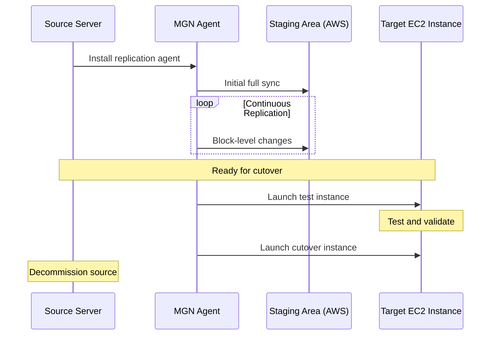

# How to Migrate VMs to AWS with AWS Application Migration Service (MGN)

Author: [nawazdhandala](https://github.com/nawazdhandala)

Tags: AWS, Application Migration Service, MGN, VM Migration, Lift and Shift, EC2

Description: Learn how to migrate virtual machines to AWS using Application Migration Service (MGN) with continuous replication and minimal downtime cutover.

---

AWS Application Migration Service (MGN) is the recommended tool for lift-and-shift server migrations to AWS. It replaces the older Server Migration Service (SMS) and provides continuous block-level replication from your source servers to AWS. The key advantage is that your source servers keep running normally during replication, and you only experience a brief cutover window when you switch to the AWS instances.

This guide covers the entire MGN migration process from initial setup to final cutover.

## How MGN Works



MGN installs a lightweight replication agent on your source servers. The agent performs an initial full sync of all disks to a staging area in AWS (low-cost EBS volumes behind the scenes). After that, it continuously replicates block-level changes. When you are ready, you launch test or cutover instances from the replicated data.

## Prerequisites

Before starting, ensure you have:
- An AWS account with MGN initialized in the target region
- Network connectivity from source servers to AWS (direct, VPN, or internet)
- Source servers running a supported OS (most Linux and Windows versions)
- Sufficient IAM permissions for MGN operations

## Initializing MGN

Initialize the service in your target region:

```python
# Initialize MGN in the target region
import boto3

mgn = boto3.client('mgn', region_name='us-east-1')

# Initialize the service (one-time setup per region)
response = mgn.initialize_service()
print("MGN initialized successfully")
```

## Installing the Replication Agent

### Linux Servers

```bash
# Download and install the MGN replication agent on Linux
wget -O ./aws-replication-installer-init.py \
  https://aws-application-migration-service-us-east-1.s3.amazonaws.com/latest/linux/aws-replication-installer-init.py

sudo python3 aws-replication-installer-init.py \
  --region us-east-1 \
  --aws-access-key-id YOUR_ACCESS_KEY \
  --aws-secret-access-key YOUR_SECRET_KEY
```

### Windows Servers

```powershell
# Download and install the MGN replication agent on Windows
# Run PowerShell as Administrator
Invoke-WebRequest -Uri "https://aws-application-migration-service-us-east-1.s3.amazonaws.com/latest/windows/AwsReplicationWindowsInstaller.exe" -OutFile "AwsReplicationWindowsInstaller.exe"

.\AwsReplicationWindowsInstaller.exe `
  --region us-east-1 `
  --aws-access-key-id YOUR_ACCESS_KEY `
  --aws-secret-access-key YOUR_SECRET_KEY
```

For production environments, use temporary credentials or an IAM role instead of long-lived access keys.

## Monitoring Replication Status

After agent installation, the initial sync begins. Monitor replication progress:

```python
# Monitor replication status for all source servers
import boto3

mgn = boto3.client('mgn')

# List all source servers
response = mgn.describe_source_servers(
    filters={}
)

for server in response['items']:
    server_id = server['sourceServerID']
    hostname = server.get('sourceProperties', {}).get('identificationHints', {}).get('hostname', 'Unknown')
    state = server.get('dataReplicationInfo', {}).get('dataReplicationState', 'Unknown')

    print(f"\nServer: {hostname} ({server_id})")
    print(f"  Replication State: {state}")

    # Show disk replication details
    disks = server.get('dataReplicationInfo', {}).get('replicatedDisks', [])
    for disk in disks:
        device = disk.get('deviceName', 'Unknown')
        total_gb = disk.get('totalStorageBytes', 0) / (1024**3)
        replicated_gb = disk.get('replicatedStorageBytes', 0) / (1024**3)
        backlog_gb = disk.get('backloggedStorageBytes', 0) / (1024**3)

        print(f"  Disk {device}: {replicated_gb:.1f}/{total_gb:.1f} GB replicated, {backlog_gb:.1f} GB backlog")

    # Show lag
    lag = server.get('dataReplicationInfo', {}).get('dataReplicationInfo', {}).get('lagDuration', 'N/A')
    print(f"  Replication Lag: {lag}")
```

## Configuring Launch Settings

Before launching test or cutover instances, configure how the target EC2 instances should be set up:

```python
# Configure launch settings for a source server
import boto3

mgn = boto3.client('mgn')

mgn.update_launch_configuration(
    sourceServerID='s-abc123def456',
    name='web-server-prod',
    ec2LaunchTemplateID='lt-0123456789abcdef0',
    launchDisposition='STARTED',  # Instance starts automatically after launch
    licensing={
        'osByol': True  # Bring your own license
    },
    targetInstanceTypeRightSizingMethod='BASIC',  # or NONE for exact match
    bootMode='LEGACY_BIOS',  # or UEFI
    postLaunchActions={
        'deployment': 'TEST_AND_CUTOVER',
        's3LogBucket': 'mgn-post-launch-logs',
        'ssmDocuments': [
            {
                'ssmDocumentName': 'AWS-RunShellScript',
                'timeoutSeconds': 300,
                'parameters': {
                    'commands': ['#!/bin/bash', 'echo "Post-launch script running"', 'systemctl restart httpd']
                }
            }
        ]
    }
)
```

## Configuring Target EC2 Instance

Set the target instance type, subnet, security groups, and other EC2 settings:

```python
# Configure the target EC2 instance template
import boto3

ec2 = boto3.client('ec2')

# Create a launch template for MGN target instances
response = ec2.create_launch_template(
    LaunchTemplateName='mgn-web-server',
    LaunchTemplateData={
        'InstanceType': 'm5.large',
        'NetworkInterfaces': [
            {
                'DeviceIndex': 0,
                'SubnetId': 'subnet-abc123',
                'Groups': ['sg-web-server'],
                'AssociatePublicIpAddress': False
            }
        ],
        'TagSpecifications': [
            {
                'ResourceType': 'instance',
                'Tags': [
                    {'Key': 'Environment', 'Value': 'Production'},
                    {'Key': 'MigratedFrom', 'Value': 'on-premises'},
                    {'Key': 'MigrationTool', 'Value': 'MGN'}
                ]
            }
        ]
    }
)
```

## Running a Test Launch

Always test before doing the actual cutover. A test launch creates a new EC2 instance from the replicated data without affecting the source server or replication.

```python
# Launch a test instance
import boto3

mgn = boto3.client('mgn')

response = mgn.start_test(
    sourceServerIDs=['s-abc123def456']
)

for server in response['items']:
    print(f"Test launched for: {server['sourceServerID']}")
    print(f"  Job ID: {server.get('lifeCycle', {}).get('lastTest', {}).get('initiated', {}).get('jobID', 'N/A')}")
```

After the test instance launches, validate:
- Application starts and functions correctly
- Network connectivity works (DNS, load balancers, etc.)
- Data integrity (databases, file systems)
- Performance meets expectations

```python
# Mark test as complete after validation
mgn.finalize_test(
    sourceServerIDs=['s-abc123def456']
)
```

## Executing the Cutover

When testing is successful and you are ready for the real migration:

```python
# Execute the cutover
import boto3

mgn = boto3.client('mgn')

# Start cutover - this creates the final EC2 instance
response = mgn.start_cutover(
    sourceServerIDs=['s-abc123def456']
)

for server in response['items']:
    job_id = server.get('lifeCycle', {}).get('lastCutover', {}).get('initiated', {}).get('jobID')
    print(f"Cutover started for: {server['sourceServerID']}")
    print(f"  Job ID: {job_id}")
```

The cutover process:
1. Final replication sync (brief pause in I/O)
2. Launch new EC2 instance from replicated data
3. Instance boots and runs post-launch actions
4. You validate and switch DNS/load balancers

```python
# After validation, finalize the cutover
mgn.finalize_cutover(
    sourceServerIDs=['s-abc123def456']
)

# Mark the source server as archived
mgn.mark_as_archived(
    sourceServerIDs=['s-abc123def456']
)
```

## Post-Migration Steps

After cutover, there are several housekeeping tasks:

1. **Update DNS records** to point to new AWS instances
2. **Update monitoring** to track the new instances
3. **Remove replication agents** from source servers
4. **Decommission source servers** after a stabilization period
5. **Clean up staging resources** in AWS

```python
# Disconnect and clean up source server
import boto3

mgn = boto3.client('mgn')

# Disconnect from replication
mgn.disconnect_from_service(
    sourceServerID='s-abc123def456'
)
```

## Migrating at Scale

For large migrations with hundreds of servers, automate the process:

```python
# Batch migration automation
import boto3
import json
import time

mgn = boto3.client('mgn')

def migrate_wave(server_ids, wave_name):
    print(f"\nStarting migration wave: {wave_name}")
    print(f"Servers: {len(server_ids)}")

    # Step 1: Verify all servers are ready
    for sid in server_ids:
        server = mgn.describe_source_servers(
            filters={'sourceServerIDs': [sid]}
        )['items'][0]

        state = server['dataReplicationInfo']['dataReplicationState']
        if state != 'CONTINUOUS':
            print(f"  WARNING: {sid} is not in CONTINUOUS replication state ({state})")
            return False

    # Step 2: Launch test instances
    print("Launching test instances...")
    mgn.start_test(sourceServerIDs=server_ids)

    # Step 3: Wait for tests to launch
    # (In production, add proper wait logic and validation)
    time.sleep(600)

    # Step 4: After manual validation, proceed to cutover
    # mgn.start_cutover(sourceServerIDs=server_ids)

    return True

# Define migration waves
waves = {
    'wave-1': ['s-server1', 's-server2', 's-server3'],
    'wave-2': ['s-server4', 's-server5'],
}

for wave_name, servers in waves.items():
    migrate_wave(servers, wave_name)
```

## Troubleshooting Common Issues

- **Replication agent cannot connect**: Check security groups, NACLs, and ensure port 1500 (TCP) is open from source to AWS
- **Initial sync is slow**: Increase the bandwidth allocation in replication settings or use a dedicated replication network
- **Test instance fails to boot**: Check that the boot mode (BIOS/UEFI) matches the source and that drivers are compatible

For monitoring your migrated workloads, check out our guide on [migrating from on-premises to AWS step by step](https://oneuptime.com/blog/post/migrate-from-on-premises-to-aws-step-by-step/view) which covers post-migration monitoring setup.

## Wrapping Up

AWS Application Migration Service makes lift-and-shift migrations as painless as they can be. The continuous replication model means your source servers keep running normally, and you only experience downtime during the brief cutover window. Test thoroughly before cutting over, automate the process for large migrations, and always have a rollback plan. MGN handles the heavy lifting of disk replication and instance creation, but the success of your migration still depends on thorough planning and testing.
