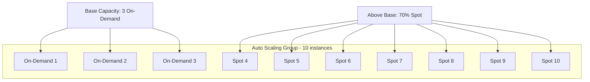

# How to Mix On-Demand and Spot Instances in Auto Scaling Groups

Author: [nawazdhandala](https://github.com/nawazdhandala)

Tags: AWS, EC2, Auto Scaling, Spot Instances, On-Demand, Cost Optimization

Description: Learn how to configure AWS Auto Scaling groups with a mix of On-Demand and Spot Instances to balance cost savings with reliability.

---

Running 100% Spot Instances gives you the biggest savings, but it comes with risk. Running 100% On-Demand is safe but expensive. The sweet spot for most production workloads is somewhere in between - a base of On-Demand instances for guaranteed capacity, topped up with Spot Instances for cost savings.

AWS Auto Scaling groups support this mixed approach natively through mixed instances policies. Let's set one up.

## The Mixed Instances Model

The idea is simple. You define a base of On-Demand instances that always run, ensuring minimum capacity even during widespread Spot interruptions. Everything above that base uses Spot Instances. If Spot capacity isn't available, the ASG can optionally fall back to On-Demand.



In this example, 3 instances are always On-Demand (your safety net), and the remaining 7 are Spot. If all Spot instances get interrupted simultaneously, you still have 3 instances handling traffic.

## Setting Up Mixed Instances via CLI

The key parameters in a mixed instances policy are:

- **OnDemandBaseCapacity** - The minimum number of On-Demand instances
- **OnDemandPercentageAboveBaseCapacity** - What percentage of instances above the base should be On-Demand (0 means all Spot)
- **SpotAllocationStrategy** - How Spot instances are distributed across pools

This command creates an ASG with a mixed instances policy - 2 On-Demand base with all additional capacity as Spot:

```bash
aws autoscaling create-auto-scaling-group \
  --auto-scaling-group-name mixed-asg \
  --min-size 2 \
  --max-size 20 \
  --desired-capacity 10 \
  --vpc-zone-identifier "subnet-111,subnet-222,subnet-333" \
  --mixed-instances-policy '{
    "LaunchTemplate": {
      "LaunchTemplateSpecification": {
        "LaunchTemplateId": "lt-0123456789abcdef0",
        "Version": "$Latest"
      },
      "Overrides": [
        {"InstanceType": "m5.large"},
        {"InstanceType": "m5a.large"},
        {"InstanceType": "m5d.large"},
        {"InstanceType": "m4.large"},
        {"InstanceType": "c5.large"},
        {"InstanceType": "c5a.large"}
      ]
    },
    "InstancesDistribution": {
      "OnDemandBaseCapacity": 2,
      "OnDemandPercentageAboveBaseCapacity": 0,
      "SpotAllocationStrategy": "capacity-optimized",
      "SpotMaxPrice": ""
    }
  }'
```

Setting `SpotMaxPrice` to an empty string means there's no cap - you'll pay whatever the current Spot price is (which is almost always way below On-Demand).

## Terraform Configuration

Here's the full Terraform setup. This is what most production teams end up using:

```hcl
resource "aws_launch_template" "app" {
  name_prefix   = "app-"
  image_id      = var.ami_id
  key_name      = var.key_name

  vpc_security_group_ids = [aws_security_group.app.id]

  iam_instance_profile {
    name = aws_iam_instance_profile.app.name
  }

  user_data = base64encode(templatefile("user-data.sh", {
    app_version = var.app_version
  }))

  tag_specifications {
    resource_type = "instance"
    tags = {
      Name = "app-server"
    }
  }
}

resource "aws_autoscaling_group" "app" {
  name                = "app-mixed-asg"
  min_size            = 4
  max_size            = 40
  desired_capacity    = 10
  vpc_zone_identifier = var.private_subnet_ids
  health_check_type   = "ELB"
  health_check_grace_period = 300

  mixed_instances_policy {
    instances_distribution {
      # Always keep 4 On-Demand instances as a baseline
      on_demand_base_capacity = 4

      # Everything above the base is Spot
      on_demand_percentage_above_base_capacity = 0

      # Use capacity-optimized to minimize interruptions
      spot_allocation_strategy = "capacity-optimized"
    }

    launch_template {
      launch_template_specification {
        launch_template_id = aws_launch_template.app.id
        version            = "$Latest"
      }

      # Define at least 6 instance types for good diversification
      override {
        instance_type     = "m5.large"
        weighted_capacity = "1"
      }
      override {
        instance_type     = "m5a.large"
        weighted_capacity = "1"
      }
      override {
        instance_type     = "m5d.large"
        weighted_capacity = "1"
      }
      override {
        instance_type     = "m4.large"
        weighted_capacity = "1"
      }
      override {
        instance_type     = "c5.large"
        weighted_capacity = "1"
      }
      override {
        instance_type     = "c5a.large"
        weighted_capacity = "1"
      }
      override {
        instance_type     = "r5.large"
        weighted_capacity = "1"
      }
    }
  }

  target_group_arns = [aws_lb_target_group.app.arn]

  tag {
    key                 = "Environment"
    value               = "production"
    propagate_at_launch = true
  }
}
```

## Choosing the Right On-Demand Base

How many On-Demand instances should you keep as your base? It depends on your tolerance for reduced capacity during a worst-case Spot interruption event.

Here's a practical framework:

- **Minimum viable capacity** - How many instances can handle your lowest acceptable traffic level? That's your On-Demand base.
- **Peak handling** - Use Spot for everything above the minimum. Dynamic scaling policies will add more Spot (or On-Demand as fallback) when needed.
- **Regulatory or SLA requirements** - If you have strict SLA commitments, a higher On-Demand base might be justified.

A common split for production web applications is 20-30% On-Demand and 70-80% Spot. For batch processing workloads with no SLA, you might go 0% On-Demand and 100% Spot.

## Capacity Rebalancing

Enable capacity rebalancing to proactively replace Spot instances that are at risk of interruption:

```bash
# Enable capacity rebalancing on an existing ASG
aws autoscaling update-auto-scaling-group \
  --auto-scaling-group-name mixed-asg \
  --capacity-rebalance
```

With this enabled, when AWS detects that a Spot instance might be interrupted (via a rebalance recommendation), the ASG launches a replacement before the original is terminated. This keeps your desired capacity more stable.

## Instance Refresh with Mixed Instances

When you need to roll out a new AMI or configuration change, instance refresh works with mixed instances policies:

```bash
# Trigger an instance refresh
aws autoscaling start-instance-refresh \
  --auto-scaling-group-name mixed-asg \
  --preferences '{
    "MinHealthyPercentage": 90,
    "InstanceWarmup": 300,
    "SkipMatching": true
  }'
```

The `SkipMatching` option is useful - it skips instances that already match the desired configuration, so only instances with the old config get replaced.

## Adding Dynamic Scaling on Top

A mixed instances ASG works best with a target tracking scaling policy on top:

```bash
# Add target tracking for CPU
aws autoscaling put-scaling-policy \
  --auto-scaling-group-name mixed-asg \
  --policy-name cpu-target-tracking \
  --policy-type TargetTrackingScaling \
  --target-tracking-configuration '{
    "PredefinedMetricSpecification": {
      "PredefinedMetricType": "ASGAverageCPUUtilization"
    },
    "TargetValue": 60.0,
    "ScaleInCooldown": 300,
    "ScaleOutCooldown": 60
  }'
```

When the policy scales out, new instances follow the mixed instances policy - On-Demand up to the base, then Spot above. When scaling in, Spot instances are terminated before On-Demand instances, preserving your guaranteed base.

## Monitoring Mixed Workloads

Keep track of your instance mix to make sure you're actually saving money:

```bash
# Check the current instance distribution
aws autoscaling describe-auto-scaling-groups \
  --auto-scaling-group-names mixed-asg \
  --query 'AutoScalingGroups[0].Instances[].{
    ID:InstanceId,
    Type:InstanceType,
    AZ:AvailabilityZone,
    Lifecycle:LifecycleState
  }' \
  --output table
```

You can also tag instances differently based on their lifecycle (Spot vs On-Demand) and use AWS Cost Explorer to track spending by purchase type.

For real-time monitoring of your mixed ASG, including health checks and instance lifecycle events, consider setting up [comprehensive health checks](https://oneuptime.com/blog/post/2026-02-12-configure-health-checks-ec2-load-balancer/view) to catch issues quickly.

## Handling Spot Fallback to On-Demand

If Spot capacity is completely unavailable, you might want the ASG to launch On-Demand instances instead. You can control this by adjusting the `OnDemandPercentageAboveBaseCapacity`:

```bash
# Temporarily switch to 100% On-Demand during a Spot shortage
aws autoscaling update-auto-scaling-group \
  --auto-scaling-group-name mixed-asg \
  --mixed-instances-policy '{
    "InstancesDistribution": {
      "OnDemandBaseCapacity": 2,
      "OnDemandPercentageAboveBaseCapacity": 100
    }
  }'
```

This is a manual intervention, but you can automate it with a Lambda function that monitors Spot fulfillment and adjusts the policy.

## Summary

Mixing On-Demand and Spot Instances in an ASG gives you the best of both worlds - guaranteed baseline capacity with significant cost savings on top. Set your On-Demand base to your minimum viable capacity, use Spot for everything else, diversify across at least 6 instance types and 3 AZs, and enable capacity rebalancing. Combined with target tracking scaling, this setup handles both predictable and unpredictable traffic patterns while keeping your EC2 bill in check.
