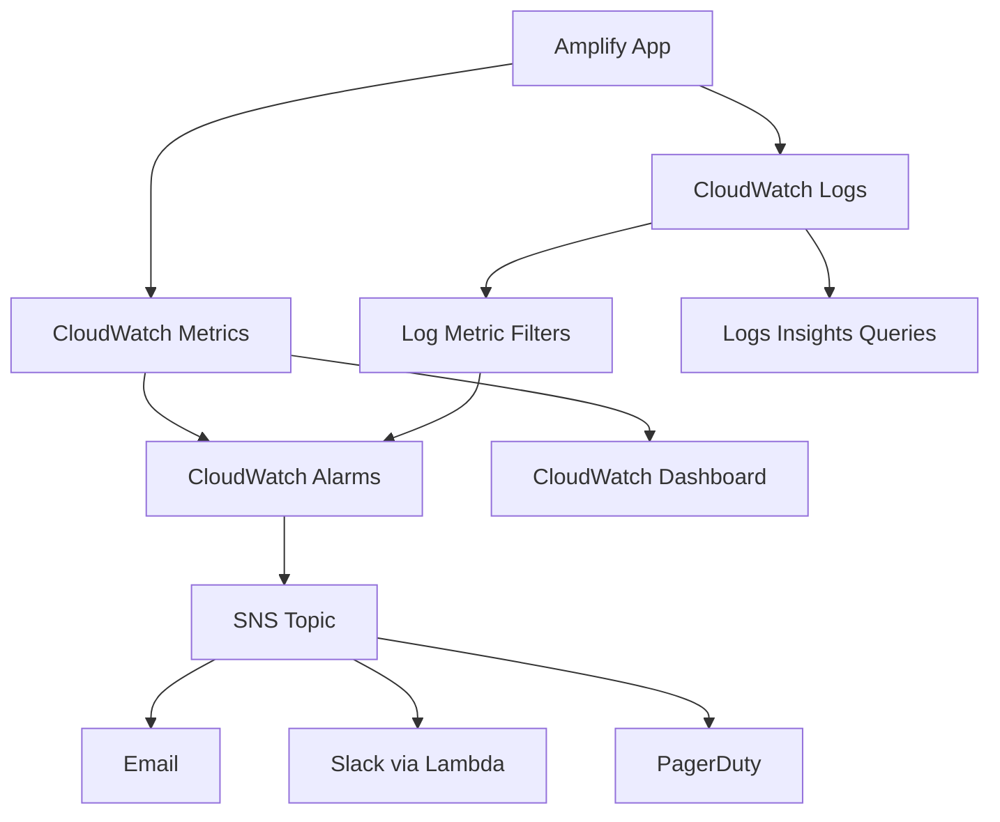

# How to Monitor Amplify Hosting with CloudWatch

Author: [nawazdhandala](https://github.com/nawazdhandala)

Tags: AWS, Amplify, CloudWatch, Monitoring, Observability, Alerts, DevOps

Description: Set up comprehensive monitoring for your AWS Amplify hosted applications using CloudWatch metrics, alarms, and dashboards

---

Deploying your app on AWS Amplify is only half the job. Once it is live, you need to know when things go wrong, when performance degrades, and when your users are having a bad experience. CloudWatch is the native AWS monitoring service, and it integrates directly with Amplify to give you metrics on builds, hosting, and SSR performance.

This guide walks through setting up CloudWatch monitoring for Amplify, including custom dashboards, alarms, and log analysis.

## What Amplify Reports to CloudWatch

Amplify automatically publishes several categories of metrics to CloudWatch:

**Build metrics**:
- Build duration
- Build success/failure counts

**Hosting metrics** (for SSR apps):
- Request count
- 4xx error count
- 5xx error count
- Lambda function duration
- Lambda cold starts
- Data transfer out

**Hosting metrics** (for static sites):
- Request count through CloudFront
- Error rates
- Bytes transferred

These metrics appear in the `AWS/AmplifyHosting` namespace in CloudWatch.

## Step 1: View Default Metrics

The simplest way to see Amplify metrics is through the Amplify console itself. Navigate to your app, then "Hosting" and "Monitoring." You will see basic graphs for requests, errors, and data transfer.

But the Amplify console view is limited. For real monitoring, you need CloudWatch directly.

In the CloudWatch console:

1. Go to "Metrics" then "All metrics"
2. Search for "AmplifyHosting"
3. Select your app by its App ID
4. Browse available metrics

```bash
# You can also query metrics via the CLI
aws cloudwatch list-metrics \
  --namespace "AWS/AmplifyHosting" \
  --dimensions Name=App,Value=d1234abcde
```

## Step 2: Create a CloudWatch Dashboard

A dashboard gives you a single view of all your Amplify metrics. Create one using the AWS CLI or the console.

```bash
# Create a CloudWatch dashboard for your Amplify app
aws cloudwatch put-dashboard \
  --dashboard-name "Amplify-MyApp-Production" \
  --dashboard-body file://dashboard.json
```

Here is a dashboard definition that covers the essential metrics:

```json
{
  "widgets": [
    {
      "type": "metric",
      "properties": {
        "title": "Request Count",
        "metrics": [
          ["AWS/AmplifyHosting", "Requests", "App", "d1234abcde"]
        ],
        "period": 300,
        "stat": "Sum",
        "region": "us-east-1"
      }
    },
    {
      "type": "metric",
      "properties": {
        "title": "Error Rates",
        "metrics": [
          ["AWS/AmplifyHosting", "4xxErrors", "App", "d1234abcde"],
          ["AWS/AmplifyHosting", "5xxErrors", "App", "d1234abcde"]
        ],
        "period": 300,
        "stat": "Sum",
        "region": "us-east-1"
      }
    },
    {
      "type": "metric",
      "properties": {
        "title": "SSR Lambda Duration",
        "metrics": [
          ["AWS/AmplifyHosting", "Latency", "App", "d1234abcde"]
        ],
        "period": 300,
        "stat": "Average",
        "region": "us-east-1"
      }
    },
    {
      "type": "metric",
      "properties": {
        "title": "Data Transfer",
        "metrics": [
          ["AWS/AmplifyHosting", "BytesDownloaded", "App", "d1234abcde"]
        ],
        "period": 3600,
        "stat": "Sum",
        "region": "us-east-1"
      }
    }
  ]
}
```

Replace `d1234abcde` with your actual Amplify App ID.

## Step 3: Set Up CloudWatch Alarms

Dashboards are for humans to look at. Alarms are for automated notifications when something goes wrong.

**Alarm for high 5xx error rate**:

```bash
# Alert when 5xx errors exceed 10 in a 5-minute window
aws cloudwatch put-metric-alarm \
  --alarm-name "Amplify-MyApp-High-5xx" \
  --namespace "AWS/AmplifyHosting" \
  --metric-name "5xxErrors" \
  --dimensions Name=App,Value=d1234abcde \
  --statistic Sum \
  --period 300 \
  --threshold 10 \
  --comparison-operator GreaterThanThreshold \
  --evaluation-periods 1 \
  --alarm-actions arn:aws:sns:us-east-1:123456789:alerts-topic
```

**Alarm for high latency**:

```bash
# Alert when average latency exceeds 3 seconds
aws cloudwatch put-metric-alarm \
  --alarm-name "Amplify-MyApp-High-Latency" \
  --namespace "AWS/AmplifyHosting" \
  --metric-name "Latency" \
  --dimensions Name=App,Value=d1234abcde \
  --statistic Average \
  --period 300 \
  --threshold 3000 \
  --comparison-operator GreaterThanThreshold \
  --evaluation-periods 2 \
  --alarm-actions arn:aws:sns:us-east-1:123456789:alerts-topic
```

**Alarm for build failures**:

```bash
# Alert on any build failure
aws cloudwatch put-metric-alarm \
  --alarm-name "Amplify-MyApp-Build-Failure" \
  --namespace "AWS/AmplifyHosting" \
  --metric-name "BuildFailures" \
  --dimensions Name=App,Value=d1234abcde \
  --statistic Sum \
  --period 300 \
  --threshold 0 \
  --comparison-operator GreaterThanThreshold \
  --evaluation-periods 1 \
  --alarm-actions arn:aws:sns:us-east-1:123456789:alerts-topic
```

## Step 4: Monitor SSR Lambda Logs

For SSR applications, Amplify creates Lambda functions that handle server-side rendering. These functions write logs to CloudWatch Logs. The log group name follows this pattern:

```
/aws/amplify/d1234abcde/main
```

You can query these logs using CloudWatch Logs Insights:

```sql
-- Find the slowest SSR renders in the last hour
fields @timestamp, @duration, @message
| filter @type = "REPORT"
| sort @duration desc
| limit 20
```

```sql
-- Count errors by type in the last 24 hours
fields @timestamp, @message
| filter @message like /ERROR/
| stats count() by bin(1h)
```

```sql
-- Find cold starts and their impact on latency
fields @timestamp, @duration, @initDuration
| filter @type = "REPORT" and @initDuration > 0
| sort @initDuration desc
| limit 50
```

## Step 5: Set Up Log-Based Alerts

Sometimes the metrics Amplify publishes are not granular enough. You can create metric filters on logs to extract custom metrics:

```bash
# Create a metric filter for application errors
aws logs put-metric-filter \
  --log-group-name "/aws/amplify/d1234abcde/main" \
  --filter-name "ApplicationErrors" \
  --filter-pattern "ERROR" \
  --metric-transformations \
    metricName=ApplicationErrors,\
    metricNamespace=CustomAmplify,\
    metricValue=1
```

Then create an alarm on the custom metric:

```bash
aws cloudwatch put-metric-alarm \
  --alarm-name "Amplify-MyApp-Application-Errors" \
  --namespace "CustomAmplify" \
  --metric-name "ApplicationErrors" \
  --statistic Sum \
  --period 300 \
  --threshold 5 \
  --comparison-operator GreaterThanThreshold \
  --evaluation-periods 1 \
  --alarm-actions arn:aws:sns:us-east-1:123456789:alerts-topic
```

## Architecture Overview

Here is how monitoring data flows from your Amplify app to your alert channels:



## Step 6: Forward Alerts to Slack

Most teams want alerts in Slack rather than email. Set up a Lambda function to forward SNS notifications:

```javascript
// index.js - Lambda function to forward CloudWatch alarms to Slack
const https = require('https');

// Slack webhook URL - store this in Secrets Manager in production
const SLACK_WEBHOOK = process.env.SLACK_WEBHOOK_URL;

exports.handler = async (event) => {
  const snsMessage = JSON.parse(event.Records[0].Sns.Message);

  const slackMessage = {
    text: `Amplify Alert: ${snsMessage.AlarmName}`,
    blocks: [
      {
        type: 'section',
        text: {
          type: 'mrkdwn',
          text: `*${snsMessage.AlarmName}*\nState: ${snsMessage.NewStateValue}\nReason: ${snsMessage.NewStateReason}`
        }
      }
    ]
  };

  // Post to Slack webhook
  const options = {
    hostname: 'hooks.slack.com',
    path: SLACK_WEBHOOK.replace('https://hooks.slack.com', ''),
    method: 'POST',
    headers: { 'Content-Type': 'application/json' }
  };

  return new Promise((resolve, reject) => {
    const req = https.request(options, (res) => resolve(res.statusCode));
    req.write(JSON.stringify(slackMessage));
    req.end();
  });
};
```

## Step 7: Monitor Build Performance Over Time

Track build duration trends to catch regressions early. If builds start taking longer, it usually means dependencies are growing or build steps are becoming more complex.

```sql
-- CloudWatch Logs Insights query for build duration trends
fields @timestamp, @message
| filter @message like /Build duration/
| parse @message "Build duration: * seconds" as buildDuration
| stats avg(buildDuration), max(buildDuration) by bin(1d)
```

Set an alarm if builds consistently exceed your acceptable threshold:

```bash
aws cloudwatch put-metric-alarm \
  --alarm-name "Amplify-MyApp-Slow-Builds" \
  --namespace "AWS/AmplifyHosting" \
  --metric-name "BuildDuration" \
  --dimensions Name=App,Value=d1234abcde \
  --statistic Average \
  --period 86400 \
  --threshold 600 \
  --comparison-operator GreaterThanThreshold \
  --evaluation-periods 1 \
  --alarm-actions arn:aws:sns:us-east-1:123456789:alerts-topic
```

## Beyond CloudWatch

CloudWatch gives you the basics, but for production applications you might want more comprehensive monitoring. Consider complementing CloudWatch with:

- **Real User Monitoring (RUM)** for client-side performance metrics
- **AWS X-Ray** for distributed tracing across your SSR functions and API calls
- **Synthetic monitoring** to proactively test your application from different regions

For a broader view of your monitoring strategy, check out our post on [building a metrics collection system on AWS](https://oneuptime.com/blog/post/2026-02-12-build-a-metrics-collection-system-on-aws/view).

## Wrapping Up

Monitoring your Amplify app with CloudWatch is not glamorous work, but it is the difference between finding out about issues from your users and finding out from your alarms. Start with a basic dashboard and a few alarms for error rates and latency, then expand as your app grows. The investment in monitoring always pays off when that first alarm fires at 2am and you catch a problem before your users notice.
