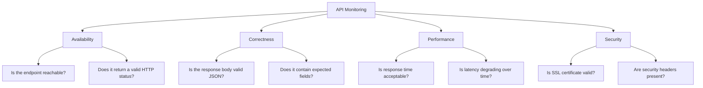

# How to Monitor API Endpoints with CloudWatch Synthetics

Author: [nawazdhandala](https://github.com/nawazdhandala)

Tags: AWS, CloudWatch, Synthetics, API Monitoring, Canaries, Observability

Description: Set up comprehensive API endpoint monitoring with CloudWatch Synthetics canaries including latency tracking, response validation, and multi-region checks

---

APIs are the backbone of modern applications. When an API endpoint goes down or starts responding slowly, the impact cascades through your entire system. Frontend applications show errors, mobile apps fail to load data, and partner integrations break.

CloudWatch Synthetics gives you proactive API monitoring. Instead of waiting for users to report problems, you run automated checks that continuously verify your API endpoints are responding correctly. You can validate response codes, check response body content, monitor latency trends, and detect SSL certificate issues - all before your users notice anything.

This guide covers setting up comprehensive API monitoring with Synthetics, from basic health checks to sophisticated multi-endpoint validation workflows.

## What API Monitoring Should Cover

Effective API monitoring goes beyond just checking if a URL returns 200. Here is what a comprehensive monitoring setup covers.



## Step 1: Design Your Monitoring Strategy

Before creating canaries, decide what to monitor and how often.

| Endpoint Type | Frequency | Checks |
|--------------|-----------|--------|
| Health/status | Every 1 min | Status code, response time |
| Core business APIs | Every 5 min | Status, body validation, latency |
| Authentication endpoints | Every 5 min | Status, token generation, error handling |
| Third-party integrations | Every 10 min | Status, response format |
| Internal microservice APIs | Every 5 min | Status, contract validation |

## Step 2: Create a Canary Blueprint for API Monitoring

Here is a reusable canary that monitors multiple API endpoints with configurable checks.

```javascript
// api-monitor.js - Comprehensive API monitoring canary
const synthetics = require('Synthetics');
const log = require('SyntheticsLogger');
const https = require('https');
const http = require('http');

// Configuration - customize per deployment via environment variables
const BASE_URL = process.env.BASE_URL || 'https://api.example.com';
const API_KEY = process.env.API_KEY || '';
const LATENCY_THRESHOLD_MS = parseInt(process.env.LATENCY_THRESHOLD || '3000');

// Define the endpoints to monitor
const endpoints = [
  {
    name: 'Health Check',
    path: '/health',
    method: 'GET',
    expectedStatus: 200,
    validateBody: (body) => {
      const data = JSON.parse(body);
      if (data.status !== 'healthy') {
        throw new Error(`Health status is ${data.status}, expected healthy`);
      }
    },
  },
  {
    name: 'List Products',
    path: '/v1/products?limit=5',
    method: 'GET',
    expectedStatus: 200,
    requireAuth: true,
    validateBody: (body) => {
      const data = JSON.parse(body);
      if (!Array.isArray(data.products)) {
        throw new Error('Response missing products array');
      }
      if (!data.hasOwnProperty('total')) {
        throw new Error('Response missing total count');
      }
    },
  },
  {
    name: 'Search Products',
    path: '/v1/products/search?q=widget',
    method: 'GET',
    expectedStatus: 200,
    requireAuth: true,
    validateBody: (body) => {
      const data = JSON.parse(body);
      if (!Array.isArray(data.results)) {
        throw new Error('Search response missing results array');
      }
    },
  },
  {
    name: 'Create Order (Dry Run)',
    path: '/v1/orders/validate',
    method: 'POST',
    expectedStatus: 200,
    requireAuth: true,
    body: JSON.stringify({
      items: [{ sku: 'TEST-001', quantity: 1 }],
      dryRun: true,
    }),
    validateBody: (body) => {
      const data = JSON.parse(body);
      if (!data.valid) {
        throw new Error('Order validation failed: ' + JSON.stringify(data.errors));
      }
    },
  },
  {
    name: 'User Profile',
    path: '/v1/users/me',
    method: 'GET',
    expectedStatus: 200,
    requireAuth: true,
    validateBody: (body) => {
      const data = JSON.parse(body);
      if (!data.email || !data.id) {
        throw new Error('Profile response missing required fields');
      }
    },
  },
];

const apiMonitor = async function () {
  let failures = 0;

  for (const endpoint of endpoints) {
    try {
      await checkEndpoint(endpoint);
    } catch (error) {
      failures++;
      log.error(`FAILED: ${endpoint.name} - ${error.message}`);
    }
  }

  if (failures > 0) {
    throw new Error(`${failures} of ${endpoints.length} endpoint checks failed`);
  }

  log.info(`All ${endpoints.length} endpoint checks passed`);
};

async function checkEndpoint(endpoint) {
  const url = new URL(endpoint.path, BASE_URL);

  const headers = {
    'Content-Type': 'application/json',
    'User-Agent': 'CloudWatch-Synthetics-Monitor',
  };

  if (endpoint.requireAuth && API_KEY) {
    headers['Authorization'] = `Bearer ${API_KEY}`;
  }

  const requestOptions = {
    hostname: url.hostname,
    path: url.pathname + url.search,
    port: url.port || (url.protocol === 'https:' ? 443 : 80),
    protocol: url.protocol,
    method: endpoint.method,
    headers: headers,
  };

  if (endpoint.body) {
    requestOptions.headers['Content-Length'] = Buffer.byteLength(endpoint.body);
  }

  await synthetics.executeHttpStep(
    endpoint.name,
    requestOptions,
    (response, responseBody) => {
      // Check status code
      if (response.statusCode !== endpoint.expectedStatus) {
        throw new Error(
          `Expected status ${endpoint.expectedStatus}, got ${response.statusCode}`
        );
      }

      // Check content type
      const contentType = response.headers['content-type'] || '';
      if (!contentType.includes('application/json') && endpoint.validateBody) {
        throw new Error(`Expected JSON content type, got: ${contentType}`);
      }

      // Validate response body if configured
      if (endpoint.validateBody && responseBody) {
        endpoint.validateBody(responseBody);
      }

      // Check security headers
      checkSecurityHeaders(response, endpoint.name);

      log.info(`PASSED: ${endpoint.name} (${response.statusCode})`);
    },
    endpoint.body  // Request body for POST/PUT requests
  );
}

function checkSecurityHeaders(response, endpointName) {
  const securityHeaders = {
    'x-content-type-options': 'nosniff',
    'x-frame-options': null,  // Just check existence
    'strict-transport-security': null,
  };

  for (const [header, expectedValue] of Object.entries(securityHeaders)) {
    const actualValue = response.headers[header];

    if (!actualValue) {
      log.warn(`${endpointName}: Missing security header ${header}`);
      continue;
    }

    if (expectedValue && actualValue !== expectedValue) {
      log.warn(
        `${endpointName}: Header ${header} is ${actualValue}, expected ${expectedValue}`
      );
    }
  }
}

exports.handler = async () => {
  return await apiMonitor();
};
```

## Step 3: Set Up Multi-Region Monitoring

Deploy the same canary across multiple AWS regions to detect regional issues and measure global latency.

```bash
# Deploy canary in us-east-1
aws synthetics create-canary \
  --region us-east-1 \
  --name api-monitor-us-east \
  --artifact-s3-location "s3://canary-artifacts-us-east-1/api-monitor/" \
  --execution-role-arn arn:aws:iam::123456789012:role/canary-role \
  --schedule '{"Expression": "rate(5 minutes)"}' \
  --runtime-version syn-nodejs-puppeteer-6.1 \
  --code '{"S3Bucket": "canary-artifacts-us-east-1", "S3Key": "api-monitor.zip", "Handler": "api-monitor.handler"}'

# Deploy canary in eu-west-1
aws synthetics create-canary \
  --region eu-west-1 \
  --name api-monitor-eu-west \
  --artifact-s3-location "s3://canary-artifacts-eu-west-1/api-monitor/" \
  --execution-role-arn arn:aws:iam::123456789012:role/canary-role \
  --schedule '{"Expression": "rate(5 minutes)"}' \
  --runtime-version syn-nodejs-puppeteer-6.1 \
  --code '{"S3Bucket": "canary-artifacts-eu-west-1", "S3Key": "api-monitor.zip", "Handler": "api-monitor.handler"}'

# Deploy canary in ap-southeast-1
aws synthetics create-canary \
  --region ap-southeast-1 \
  --name api-monitor-ap-southeast \
  --artifact-s3-location "s3://canary-artifacts-ap-southeast-1/api-monitor/" \
  --execution-role-arn arn:aws:iam::123456789012:role/canary-role \
  --schedule '{"Expression": "rate(5 minutes)"}' \
  --runtime-version syn-nodejs-puppeteer-6.1 \
  --code '{"S3Bucket": "canary-artifacts-ap-southeast-1", "S3Key": "api-monitor.zip", "Handler": "api-monitor.handler"}'
```

This gives you monitoring from three continents. If only the EU canary fails, you know the issue is regional, not global.

## Step 4: Monitor SSL Certificates

Create a dedicated canary that checks SSL certificate expiration.

```javascript
// ssl-canary.js - Monitor SSL certificate expiration
const synthetics = require('Synthetics');
const log = require('SyntheticsLogger');
const tls = require('tls');

const DOMAINS = [
  'api.example.com',
  'www.example.com',
  'app.example.com',
];

const WARN_DAYS = 30;  // Warn 30 days before expiration

const sslCanary = async function () {
  for (const domain of DOMAINS) {
    await checkCertificate(domain);
  }
};

function checkCertificate(domain) {
  return new Promise((resolve, reject) => {
    const socket = tls.connect(443, domain, { servername: domain }, () => {
      const cert = socket.getPeerCertificate();
      socket.destroy();

      if (!cert || !cert.valid_to) {
        reject(new Error(`Could not get certificate for ${domain}`));
        return;
      }

      const expiryDate = new Date(cert.valid_to);
      const now = new Date();
      const daysRemaining = Math.floor((expiryDate - now) / (1000 * 60 * 60 * 24));

      log.info(`${domain}: Certificate expires in ${daysRemaining} days (${cert.valid_to})`);
      log.info(`${domain}: Issuer: ${cert.issuer.O || cert.issuer.CN}`);

      if (daysRemaining < 0) {
        reject(new Error(`${domain}: Certificate has EXPIRED`));
      } else if (daysRemaining < WARN_DAYS) {
        reject(new Error(`${domain}: Certificate expires in ${daysRemaining} days`));
      } else {
        resolve();
      }
    });

    socket.on('error', (err) => {
      reject(new Error(`${domain}: TLS connection failed - ${err.message}`));
    });

    socket.setTimeout(10000, () => {
      socket.destroy();
      reject(new Error(`${domain}: Connection timed out`));
    });
  });
}

exports.handler = async () => {
  return await sslCanary();
};
```

## Step 5: Build a Monitoring Dashboard

Create a CloudWatch dashboard that aggregates all your canary results.

```bash
# Create a dashboard for canary monitoring
aws cloudwatch put-dashboard \
  --dashboard-name API-Monitoring \
  --dashboard-body '{
    "widgets": [
      {
        "type": "metric",
        "properties": {
          "title": "API Canary Success Rate",
          "metrics": [
            ["CloudWatchSynthetics", "SuccessPercent", "CanaryName", "api-monitor-us-east"],
            ["CloudWatchSynthetics", "SuccessPercent", "CanaryName", "api-monitor-eu-west"],
            ["CloudWatchSynthetics", "SuccessPercent", "CanaryName", "api-monitor-ap-southeast"]
          ],
          "period": 300,
          "stat": "Average"
        }
      },
      {
        "type": "metric",
        "properties": {
          "title": "API Canary Duration",
          "metrics": [
            ["CloudWatchSynthetics", "Duration", "CanaryName", "api-monitor-us-east"],
            ["CloudWatchSynthetics", "Duration", "CanaryName", "api-monitor-eu-west"],
            ["CloudWatchSynthetics", "Duration", "CanaryName", "api-monitor-ap-southeast"]
          ],
          "period": 300,
          "stat": "Average"
        }
      }
    ]
  }'
```

For more advanced dashboards, consider using [Amazon Managed Grafana](https://oneuptime.com/blog/post/set-up-amazon-managed-grafana/view) which provides richer visualization options.

## Step 6: Configure Comprehensive Alerting

Set up alerts for different failure scenarios.

```bash
# Alert on any canary failure (critical)
aws cloudwatch put-metric-alarm \
  --alarm-name api-monitor-any-failure \
  --namespace CloudWatchSynthetics \
  --metric-name SuccessPercent \
  --dimensions Name=CanaryName,Value=api-monitor-us-east \
  --statistic Average \
  --period 300 \
  --threshold 100 \
  --comparison-operator LessThanThreshold \
  --evaluation-periods 1 \
  --alarm-actions arn:aws:sns:us-east-1:123456789012:critical-alerts

# Alert on sustained latency increase (warning)
aws cloudwatch put-metric-alarm \
  --alarm-name api-monitor-high-latency \
  --namespace CloudWatchSynthetics \
  --metric-name Duration \
  --dimensions Name=CanaryName,Value=api-monitor-us-east \
  --statistic p90 \
  --period 300 \
  --threshold 5000 \
  --comparison-operator GreaterThanThreshold \
  --evaluation-periods 3 \
  --alarm-actions arn:aws:sns:us-east-1:123456789012:warning-alerts

# Composite alarm: all regions failing
aws cloudwatch put-composite-alarm \
  --alarm-name api-monitor-global-outage \
  --alarm-rule 'ALARM("api-monitor-us-east-failure") AND ALARM("api-monitor-eu-west-failure") AND ALARM("api-monitor-ap-southeast-failure")' \
  --alarm-actions arn:aws:sns:us-east-1:123456789012:critical-alerts
```

The composite alarm is key. A single region failing might be a regional issue. All regions failing simultaneously signals a global outage that needs immediate attention.

## Cost Management

Canary costs come from three sources: Lambda invocations, S3 storage for artifacts, and CloudWatch metrics.

| Canary Frequency | Monthly Lambda Invocations | Approximate Cost |
|-----------------|--------------------------|-----------------|
| Every 1 minute | 43,200 | ~$0.50 Lambda + S3 |
| Every 5 minutes | 8,640 | ~$0.10 Lambda + S3 |
| Every 10 minutes | 4,320 | ~$0.05 Lambda + S3 |

For most API monitoring, 5-minute intervals provide a good balance between detection speed and cost. Reserve 1-minute intervals for your most critical endpoints.

## Wrapping Up

API monitoring with CloudWatch Synthetics gives you confidence that your endpoints are working from your users' perspective. The key is being thorough: check status codes, validate response bodies, monitor latency, verify SSL certificates, and test from multiple regions. Start with your most critical endpoints, set up alarms, and expand coverage as you build confidence in the pattern. Proactive monitoring is always cheaper than reactive incident response.
