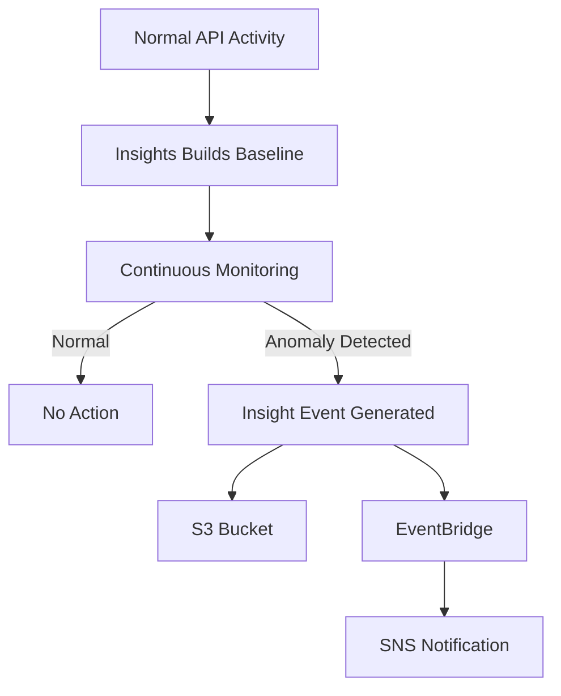

# How to Monitor AWS API Call Patterns with CloudTrail Insights

Author: [nawazdhandala](https://github.com/nawazdhandala)

Tags: AWS, CloudTrail, Insights, API Monitoring, Anomaly Detection, Security

Description: Enable CloudTrail Insights to automatically detect unusual API call patterns and volume anomalies across your AWS account activity.

---

Your AWS account makes thousands (sometimes millions) of API calls every day. Most of this activity is normal - auto scaling groups launching instances, Lambda functions invoking other services, CI/CD pipelines deploying code. But buried in that normal traffic can be anomalous patterns: a sudden spike in `DeleteBucket` calls, an unusual surge in `DescribeInstances` from an unknown principal, or an unexpected drop in write API volume that signals a broken deployment.

CloudTrail Insights detects these anomalies automatically. It analyzes your API call volume and error rate patterns, builds a baseline of normal behavior, and alerts you when something deviates significantly.

## What CloudTrail Insights Detects

Insights looks at two types of anomalies:

1. **API call rate anomalies**: Unusual increases or decreases in the volume of management API calls
2. **API error rate anomalies**: Unusual spikes in error rates for management API calls

For each anomaly, Insights tells you which API action is anomalous, the baseline call rate, the actual call rate during the anomaly, and the associated identity and source IP.



## Prerequisites

- An active CloudTrail trail (or use the default trail)
- An S3 bucket for insight events (can be the same as your trail bucket)
- AWS CLI configured with admin permissions

## Step 1: Enable Insights on Your Trail

Insights is not enabled by default. You need to turn it on for a specific trail.

```bash
# Enable both types of Insights on your trail
aws cloudtrail put-insight-selectors \
  --trail-name my-trail \
  --insight-selectors '[
    {"InsightType": "ApiCallRateInsight"},
    {"InsightType": "ApiErrorRateInsight"}
  ]'
```

If you are using an organization trail, enable insights on it to cover all accounts:

```bash
# Enable Insights on an organization trail
aws cloudtrail put-insight-selectors \
  --trail-name org-trail \
  --insight-selectors '[
    {"InsightType": "ApiCallRateInsight"},
    {"InsightType": "ApiErrorRateInsight"}
  ]'
```

After enabling, Insights needs about 36 hours to establish a baseline. During this period, it is learning what normal looks like for your account. Do not expect insight events right away.

## Step 2: Verify Insights Configuration

```bash
# Verify insights are enabled
aws cloudtrail get-insight-selectors --trail-name my-trail
```

The output should list both insight types as enabled.

## Step 3: Set Up EventBridge Rules for Insight Events

When Insights detects an anomaly, it generates an event in EventBridge. Set up a rule to catch these events and route them to your alerting system.

```bash
# Create EventBridge rule for CloudTrail Insight events
aws events put-rule \
  --name cloudtrail-insights-detected \
  --event-pattern '{
    "source": ["aws.cloudtrail"],
    "detail-type": ["AWS Insight via CloudTrail"]
  }' \
  --description "Alert when CloudTrail Insights detects an anomaly"

# Create SNS topic for insight alerts
aws sns create-topic --name cloudtrail-insights-alerts
aws sns subscribe \
  --topic-arn arn:aws:sns:us-east-1:123456789012:cloudtrail-insights-alerts \
  --protocol email \
  --notification-endpoint ops-team@example.com

# Route insight events to SNS with formatted message
aws events put-targets \
  --rule cloudtrail-insights-detected \
  --targets '[{
    "Id": "insights-sns",
    "Arn": "arn:aws:sns:us-east-1:123456789012:cloudtrail-insights-alerts",
    "InputTransformer": {
      "InputPathsMap": {
        "insightType": "$.detail.insightType",
        "eventName": "$.detail.insightDetails.eventName",
        "eventSource": "$.detail.insightDetails.eventSource",
        "baseline": "$.detail.insightDetails.insightContext.statistics.baseline.average",
        "insight": "$.detail.insightDetails.insightContext.statistics.insight.average",
        "startTime": "$.detail.insightDetails.insightContext.startTime"
      },
      "InputTemplate": "\"CloudTrail Insight Detected\\n\\nType: <insightType>\\nAPI: <eventName>\\nService: <eventSource>\\nBaseline Rate: <baseline> calls/min\\nAnomalous Rate: <insight> calls/min\\nStarted: <startTime>\""
    }
  }]'
```

## Step 4: Understand Insight Event Structure

When an anomaly is detected, the insight event contains rich detail. Here is what a typical event looks like:

```json
// Sample CloudTrail Insight event for an API call rate anomaly
{
  "version": "0",
  "source": "aws.cloudtrail",
  "detail-type": "AWS Insight via CloudTrail",
  "detail": {
    "insightType": "ApiCallRateInsight",
    "insightDetails": {
      "state": "Start",
      "eventSource": "ec2.amazonaws.com",
      "eventName": "DescribeInstances",
      "insightContext": {
        "statistics": {
          "baseline": {
            "average": 12.5
          },
          "insight": {
            "average": 245.0
          }
        },
        "attributions": [
          {
            "attribute": "userIdentityArn",
            "insight": [
              {
                "value": "arn:aws:iam::123456789012:role/suspicious-role",
                "average": 230.0
              }
            ],
            "baseline": [
              {
                "value": "arn:aws:iam::123456789012:role/normal-role",
                "average": 10.0
              }
            ]
          }
        ],
        "startTime": "2026-02-12T14:30:00Z",
        "endTime": null
      }
    }
  }
}
```

The `attributions` section is particularly useful. It shows which identity caused the anomaly, making investigation much faster.

## Step 5: Build a Lambda for Automated Response

For more sophisticated handling, route insight events to a Lambda function that can take automated action.

```python
# Lambda function to process CloudTrail Insight events
import json
import boto3

sns = boto3.client('sns')
iam = boto3.client('iam')

def handler(event, context):
    detail = event['detail']
    insight_type = detail['insightType']
    insight_details = detail['insightDetails']
    event_name = insight_details['eventName']
    event_source = insight_details['eventSource']

    # Get the attribution data
    attributions = insight_details.get('insightContext', {}).get('attributions', [])
    baseline_avg = insight_details['insightContext']['statistics']['baseline']['average']
    insight_avg = insight_details['insightContext']['statistics']['insight']['average']

    # Calculate how many times above baseline
    multiplier = insight_avg / baseline_avg if baseline_avg > 0 else float('inf')

    # Find the top contributor
    top_contributor = 'Unknown'
    for attr in attributions:
        if attr['attribute'] == 'userIdentityArn':
            if attr.get('insight'):
                top_contributor = attr['insight'][0]['value']

    # Build the alert message
    message = f"""
    CloudTrail Insight Anomaly Detected
    ====================================
    Type: {insight_type}
    API Action: {event_name}
    Service: {event_source}
    Baseline Rate: {baseline_avg:.1f} calls/min
    Anomalous Rate: {insight_avg:.1f} calls/min
    Multiplier: {multiplier:.1f}x above normal
    Top Contributor: {top_contributor}
    State: {insight_details.get('state', 'Unknown')}
    """

    # If the anomaly is extreme (50x baseline), take defensive action
    if multiplier > 50 and 'Delete' in event_name:
        message += "\n\nWARNING: Extreme anomaly detected for destructive API."
        message += "\nConsider investigating immediately."

    sns.publish(
        TopicArn='arn:aws:sns:us-east-1:123456789012:cloudtrail-insights-alerts',
        Subject=f'Insight: {event_name} - {multiplier:.0f}x above baseline',
        Message=message
    )

    return {'statusCode': 200}
```

## Step 6: Review Insights in the Console

The CloudTrail console has a dedicated Insights page where you can browse detected anomalies. Each insight includes:

- A timeline chart showing the baseline and anomalous activity
- The specific API action involved
- Top contributing identities and source IPs
- Start and end times

This visual view is excellent for post-incident investigation.

## Step 7: Query Insights in CloudTrail Lake

If you have CloudTrail Lake set up, you can query insights events using SQL:

```sql
-- Find all insights in the last 30 days
SELECT
    eventTime,
    eventName,
    insightDetails.eventSource,
    insightDetails.insightContext.statistics.baseline.average AS baseline_rate,
    insightDetails.insightContext.statistics.insight.average AS anomaly_rate
FROM
    abc123_event_data_store
WHERE
    eventCategory = 'Insight'
    AND eventTime > '2026-01-13 00:00:00'
ORDER BY
    eventTime DESC
```

## What Insights Does NOT Detect

Insights is focused on API call volume and error rate patterns. It does not detect:

- Data exfiltration (someone slowly downloading S3 objects at normal rates)
- Credential compromise where the attacker mimics normal usage patterns
- Lateral movement within normal API call volumes

For these threats, you need AWS GuardDuty, which uses ML models trained on known attack patterns.

## Cost Considerations

CloudTrail Insights pricing is based on the number of events analyzed. It processes only management events, not data events. For most accounts, the cost is modest, but it scales with your API call volume. If your account generates millions of management API calls per day, the Insights cost can add up.

You can reduce costs by enabling Insights only on your production trail, not on every trail.

## Best Practices

**Enable both insight types**: API call rate and error rate anomalies catch different problems. The call rate catches unusual activity volume, while the error rate catches potential permission probing.

**Wait for the baseline**: Do not expect useful insights immediately. The 36-hour baseline period is important. If you make major changes to your workload during this period, the baseline may be inaccurate.

**Combine with other detection methods**: Insights is one layer in a defense-in-depth strategy. Pair it with EventBridge rules for specific API patterns (see [detecting unauthorized API calls](https://oneuptime.com/blog/post/2026-02-12-detect-unauthorized-api-calls-with-cloudtrail-and-eventbridge/view)) and GuardDuty for ML-based threat detection.

**Review resolved insights too**: Sometimes anomalies resolve on their own (like a deployment spike). Reviewing these helps you understand your normal patterns and reduce false positives.

## Wrapping Up

CloudTrail Insights is a low-effort, high-value security feature. Enable it once, and you get automated anomaly detection across your entire AWS API activity. The baseline learning means it adapts to your specific usage patterns, so you are not drowning in generic alerts. Combined with EventBridge routing, you can build a responsive detection and alerting pipeline in under an hour.

For more advanced event analysis, see our guide on [CloudTrail Lake for advanced event analysis](https://oneuptime.com/blog/post/2026-02-12-use-cloudtrail-lake-for-advanced-event-analysis/view). And for centralizing trails across your organization, check out [CloudTrail Organization Trail for multi-account](https://oneuptime.com/blog/post/2026-02-12-set-up-cloudtrail-organization-trail-for-multi-account/view).
