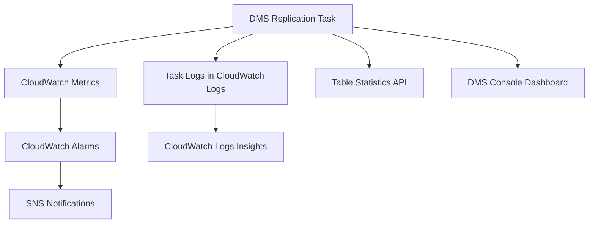

# How to Monitor DMS Replication Tasks

Author: [nawazdhandala](https://github.com/nawazdhandala)

Tags: AWS, DMS, Database Migration, Monitoring, CloudWatch

Description: Complete guide to monitoring AWS DMS replication tasks using CloudWatch metrics, task logs, and table statistics

---

Running a DMS replication task is only half the battle. The other half is knowing whether it is actually working correctly. Is data flowing? Are there errors? How far behind is your CDC stream? Without proper monitoring, you are flying blind during one of the most critical operations your team will perform.

This guide covers every angle of DMS monitoring, from CloudWatch metrics to task-level statistics to setting up alerts that wake you up before things go sideways.

## The DMS Monitoring Landscape

DMS gives you monitoring data through several channels:



Each channel serves a different purpose. CloudWatch metrics give you real-time numerical data. Task logs give you detailed event-level information. Table statistics tell you exactly how many rows have been processed per table.

## Key CloudWatch Metrics

DMS publishes metrics to CloudWatch under the `AWS/DMS` namespace. Here are the ones that matter most.

### CDC Latency Metrics

These are the most important metrics for ongoing replication tasks.

**CDCLatencySource** - Time in seconds between the last event on the source database and the current time on the DMS instance. If this number climbs, DMS is falling behind reading changes from the source.

**CDCLatencyTarget** - Time in seconds between the first event timestamp not yet committed on the target and the current time on the DMS instance. If this number climbs, DMS is falling behind applying changes to the target.

```bash
# Query CDCLatencyTarget for the last hour to spot trending issues
aws cloudwatch get-metric-statistics \
  --namespace AWS/DMS \
  --metric-name CDCLatencyTarget \
  --dimensions Name=ReplicationInstanceIdentifier,Value=my-replication-instance \
               Name=ReplicationTaskIdentifier,Value=my-task \
  --start-time $(date -u -v-1H +%Y-%m-%dT%H:%M:%S) \
  --end-time $(date -u +%Y-%m-%dT%H:%M:%S) \
  --period 300 \
  --statistics Average Maximum
```

### Throughput Metrics

**CDCThroughputRowsSource** - Number of rows per second read from the source during CDC.

**CDCThroughputRowsTarget** - Number of rows per second written to the target during CDC.

**CDCThroughputBandwidthTarget** - Outgoing bandwidth to the target in KB/second.

A healthy replication task should show source and target throughput numbers that are roughly in sync. If source throughput is consistently higher than target, the gap is growing and you have a bottleneck at the target.

### Full Load Metrics

During the initial full load phase, watch these:

**FullLoadThroughputRowsSource** - Rows per second being read from source during full load.

**FullLoadThroughputBandwidthTarget** - Bandwidth being written to target during full load.

## Setting Up CloudWatch Alarms

You should have alarms on at least CDC latency and error metrics. Here is a CloudFormation snippet for a latency alarm.

```yaml
# CloudWatch alarm that triggers when CDC target latency exceeds 5 minutes
Resources:
  CDCLatencyAlarm:
    Type: AWS::CloudWatch::Alarm
    Properties:
      AlarmName: dms-cdc-latency-high
      AlarmDescription: CDC target latency exceeds 300 seconds
      Namespace: AWS/DMS
      MetricName: CDCLatencyTarget
      Dimensions:
        - Name: ReplicationInstanceIdentifier
          Value: my-replication-instance
        - Name: ReplicationTaskIdentifier
          Value: my-task
      Statistic: Maximum
      Period: 300
      EvaluationPeriods: 2
      Threshold: 300
      ComparisonOperator: GreaterThanThreshold
      AlarmActions:
        - !Ref AlertSNSTopic
```

Setting the threshold at 300 seconds (5 minutes) with 2 evaluation periods means the alarm fires when latency exceeds 5 minutes for 10 consecutive minutes. Adjust these numbers based on your tolerance for replication lag.

## Enabling and Using Task Logs

DMS can write detailed logs to CloudWatch Logs. You need to enable logging when creating or modifying a task.

```bash
# Enable detailed logging on an existing replication task
aws dms modify-replication-task \
  --replication-task-arn arn:aws:dms:us-east-1:123456789012:task:TASK_ARN \
  --replication-task-settings '{
    "Logging": {
      "EnableLogging": true,
      "LogComponents": [
        {"Id": "TRANSFORMATION", "Severity": "LOGGER_SEVERITY_DEFAULT"},
        {"Id": "SOURCE_UNLOAD", "Severity": "LOGGER_SEVERITY_DEFAULT"},
        {"Id": "TARGET_LOAD", "Severity": "LOGGER_SEVERITY_DEFAULT"},
        {"Id": "SOURCE_CAPTURE", "Severity": "LOGGER_SEVERITY_DEFAULT"},
        {"Id": "TARGET_APPLY", "Severity": "LOGGER_SEVERITY_DEFAULT"},
        {"Id": "TASK_MANAGER", "Severity": "LOGGER_SEVERITY_DEFAULT"}
      ]
    }
  }'
```

The log components each cover a different aspect of the replication:

- **SOURCE_UNLOAD**: Reading data during full load
- **SOURCE_CAPTURE**: Reading CDC events from source
- **TARGET_LOAD**: Writing data during full load
- **TARGET_APPLY**: Applying CDC events to target
- **TRANSFORMATION**: Table mapping and transformation rules
- **TASK_MANAGER**: Overall task coordination

For troubleshooting, set severity to `LOGGER_SEVERITY_DETAILED_DEBUG` on the component you are investigating. But do not leave debug logging on in production - it generates massive log volumes.

## Querying Logs with CloudWatch Logs Insights

Once logs are flowing, use Logs Insights to search them efficiently.

```
# Find all error messages in DMS task logs from the last 24 hours
fields @timestamp, @message
| filter @message like /ERROR/
| sort @timestamp desc
| limit 50
```

```
# Count errors by component to identify the problem area
fields @timestamp, @message
| filter @message like /ERROR/
| parse @message "[*]" as component
| stats count(*) by component
| sort count desc
```

## Table Statistics

The `describe-table-statistics` API gives you per-table progress information. This is incredibly valuable during full load to see which tables have completed.

```bash
# Get per-table row counts and status for your replication task
aws dms describe-table-statistics \
  --replication-task-arn arn:aws:dms:us-east-1:123456789012:task:TASK_ARN \
  --query 'TableStatistics[].{
    Schema: SchemaName,
    Table: TableName,
    Inserts: Inserts,
    Deletes: Deletes,
    Updates: Updates,
    FullLoadRows: FullLoadRows,
    State: TableState
  }' \
  --output table
```

The output shows you exactly how many rows have been loaded, inserted, updated, and deleted for each table. Table states include:

- `Table does not exist` - Not yet started
- `Before load` - Queued for loading
- `Full load` - Currently loading
- `Table completed` - Full load done, CDC active
- `Table error` - Something went wrong

## Building a Monitoring Dashboard

Pull all these metrics into a single CloudWatch dashboard for at-a-glance monitoring.

```bash
# Create a CloudWatch dashboard with DMS replication metrics
aws cloudwatch put-dashboard \
  --dashboard-name DMS-Migration-Monitor \
  --dashboard-body '{
    "widgets": [
      {
        "type": "metric",
        "properties": {
          "title": "CDC Latency",
          "metrics": [
            ["AWS/DMS", "CDCLatencySource", "ReplicationInstanceIdentifier", "my-instance", "ReplicationTaskIdentifier", "my-task"],
            ["AWS/DMS", "CDCLatencyTarget", "ReplicationInstanceIdentifier", "my-instance", "ReplicationTaskIdentifier", "my-task"]
          ],
          "period": 60,
          "stat": "Maximum"
        }
      },
      {
        "type": "metric",
        "properties": {
          "title": "Throughput (rows/sec)",
          "metrics": [
            ["AWS/DMS", "CDCThroughputRowsSource", "ReplicationInstanceIdentifier", "my-instance", "ReplicationTaskIdentifier", "my-task"],
            ["AWS/DMS", "CDCThroughputRowsTarget", "ReplicationInstanceIdentifier", "my-instance", "ReplicationTaskIdentifier", "my-task"]
          ],
          "period": 60,
          "stat": "Average"
        }
      }
    ]
  }'
```

## Automated Health Checks

For production migrations, build a simple health check script that runs on a schedule.

```python
# Lambda function that checks DMS task health every 5 minutes
import boto3
import json

def lambda_handler(event, context):
    dms = boto3.client('dms')
    sns = boto3.client('sns')

    # Get task status
    response = dms.describe_replication_tasks(
        Filters=[{
            'Name': 'replication-task-arn',
            'Values': ['arn:aws:dms:us-east-1:123456789012:task:TASK_ARN']
        }]
    )

    task = response['ReplicationTasks'][0]
    status = task['Status']

    # Alert if task is not running
    if status not in ['running', 'starting']:
        sns.publish(
            TopicArn='arn:aws:sns:us-east-1:123456789012:dms-alerts',
            Subject=f'DMS Task Status: {status}',
            Message=f'DMS replication task is in state: {status}. '
                    f'Last error: {task.get("LastFailureMessage", "None")}'
        )

    # Check table statistics for errors
    tables = dms.describe_table_statistics(
        ReplicationTaskArn='arn:aws:dms:us-east-1:123456789012:task:TASK_ARN'
    )

    error_tables = [t for t in tables['TableStatistics'] if t['TableState'] == 'Table error']

    if error_tables:
        table_names = [f"{t['SchemaName']}.{t['TableName']}" for t in error_tables]
        sns.publish(
            TopicArn='arn:aws:sns:us-east-1:123456789012:dms-alerts',
            Subject='DMS Tables in Error State',
            Message=f'Tables with errors: {", ".join(table_names)}'
        )

    return {'statusCode': 200, 'body': json.dumps({'status': status})}
```

Schedule this with EventBridge to run every 5 minutes. For more on building scheduled Lambda functions, see our guide on [building serverless cron jobs](https://oneuptime.com/blog/post/build-a-serverless-cron-job-with-eventbridge-and-lambda/view).

## Wrapping Up

Monitoring DMS replication tasks is not optional - it is essential. Set up CloudWatch alarms for latency, enable task logging, track table statistics, and build automated health checks. The few hours you invest in monitoring upfront will save you from discovering problems after they have already caused data inconsistencies.

If you are seeing latency numbers that keep climbing, head over to our guide on [handling DMS CDC latency issues](https://oneuptime.com/blog/post/handle-dms-cdc-latency-issues/view) for specific troubleshooting steps.
