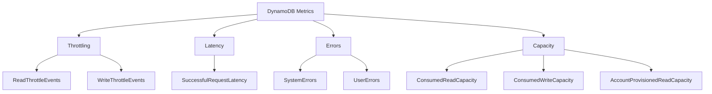

# How to Monitor DynamoDB with CloudWatch Alarms

Author: [nawazdhandala](https://github.com/nawazdhandala)

Tags: AWS, DynamoDB, CloudWatch, Monitoring, Alerting

Description: Learn how to set up CloudWatch alarms for DynamoDB to monitor throttling, latency, errors, and capacity usage with practical alarm configurations.

---

DynamoDB publishes a rich set of metrics to CloudWatch, but the default experience gives you almost nothing in terms of alerting. If you're not setting up alarms proactively, you'll find out about problems from your users instead of your monitoring. That's never a fun conversation.

Let's set up the alarms that actually matter for production DynamoDB tables.

## Key Metrics You Should Monitor

Not all DynamoDB metrics are equally important. Here are the ones that deserve alarms.



## Throttling Alarms

Throttling is the number one thing to watch. When DynamoDB throttles your requests, your application starts throwing errors or retrying, which leads to higher latency and potentially cascading failures.

Here's how to set up throttle alarms for both reads and writes.

```bash
# Alarm for read throttle events
# Triggers when any read throttling occurs in a 5-minute period
aws cloudwatch put-metric-alarm \
  --alarm-name "DynamoDB-Users-ReadThrottleEvents" \
  --alarm-description "Read throttling detected on Users table" \
  --namespace "AWS/DynamoDB" \
  --metric-name "ReadThrottleEvents" \
  --dimensions Name=TableName,Value=Users \
  --statistic Sum \
  --period 300 \
  --threshold 1 \
  --comparison-operator GreaterThanOrEqualToThreshold \
  --evaluation-periods 1 \
  --alarm-actions arn:aws:sns:us-east-1:123456789012:dynamodb-alerts \
  --treat-missing-data notBreaching
```

```bash
# Alarm for write throttle events
aws cloudwatch put-metric-alarm \
  --alarm-name "DynamoDB-Users-WriteThrottleEvents" \
  --alarm-description "Write throttling detected on Users table" \
  --namespace "AWS/DynamoDB" \
  --metric-name "WriteThrottleEvents" \
  --dimensions Name=TableName,Value=Users \
  --statistic Sum \
  --period 300 \
  --threshold 1 \
  --comparison-operator GreaterThanOrEqualToThreshold \
  --evaluation-periods 1 \
  --alarm-actions arn:aws:sns:us-east-1:123456789012:dynamodb-alerts \
  --treat-missing-data notBreaching
```

The `treat-missing-data notBreaching` setting is important here. Missing data points mean zero throttle events, which is a good thing - don't let the alarm fire when there's no data.

## Latency Alarms

High latency on DynamoDB operations usually points to hot partitions, large items, or inefficient queries. Set alarms on the p99 latency to catch tail latency issues.

```bash
# Alarm for high read latency (p99 over 50ms for GetItem)
aws cloudwatch put-metric-alarm \
  --alarm-name "DynamoDB-Users-HighReadLatency" \
  --alarm-description "GetItem p99 latency exceeding 50ms on Users table" \
  --namespace "AWS/DynamoDB" \
  --metric-name "SuccessfulRequestLatency" \
  --dimensions Name=TableName,Value=Users Name=Operation,Value=GetItem \
  --extended-statistic p99 \
  --period 300 \
  --threshold 50 \
  --comparison-operator GreaterThanThreshold \
  --evaluation-periods 3 \
  --alarm-actions arn:aws:sns:us-east-1:123456789012:dynamodb-alerts
```

Notice we're using 3 evaluation periods here. A single spike in latency usually isn't worth waking someone up - you want to see sustained high latency before alerting.

## System Error Alarms

System errors are DynamoDB's fault, not yours - HTTP 500 responses. They're rare, but when they happen you need to know immediately because there's nothing you can do on your end except retry.

```bash
# Alarm for DynamoDB system errors
aws cloudwatch put-metric-alarm \
  --alarm-name "DynamoDB-Users-SystemErrors" \
  --alarm-description "System errors on Users table - DynamoDB service issue" \
  --namespace "AWS/DynamoDB" \
  --metric-name "SystemErrors" \
  --dimensions Name=TableName,Value=Users \
  --statistic Sum \
  --period 60 \
  --threshold 5 \
  --comparison-operator GreaterThanThreshold \
  --evaluation-periods 1 \
  --alarm-actions arn:aws:sns:us-east-1:123456789012:dynamodb-alerts-critical \
  --treat-missing-data notBreaching
```

## Capacity Consumption Alarms

For tables using provisioned capacity, you want to know when you're approaching your limits before throttling starts.

```bash
# Alarm when consumed read capacity exceeds 80% of provisioned
aws cloudwatch put-metric-alarm \
  --alarm-name "DynamoDB-Users-HighReadCapacity" \
  --alarm-description "Read capacity consumption above 80% on Users table" \
  --namespace "AWS/DynamoDB" \
  --metric-name "ConsumedReadCapacityUnits" \
  --dimensions Name=TableName,Value=Users \
  --statistic Sum \
  --period 300 \
  --threshold 4000 \
  --comparison-operator GreaterThanThreshold \
  --evaluation-periods 2 \
  --alarm-actions arn:aws:sns:us-east-1:123456789012:dynamodb-alerts
```

The threshold of 4000 assumes your provisioned read capacity is 1000 RCUs. Over 5 minutes, that's 5000 consumed units at full capacity (1000 * 5 seconds... wait, no). Let me be precise: DynamoDB reports ConsumedReadCapacityUnits as the total number consumed during the period. With 1000 provisioned RCUs and a 300-second period, maximum consumption is 300,000. Setting the threshold at 240,000 (80%) is more accurate.

```bash
# Corrected: alarm at 80% of provisioned capacity over 5 minutes
# With 1000 RCU provisioned, max per 5 min = 1000 * 300 = 300,000
aws cloudwatch put-metric-alarm \
  --alarm-name "DynamoDB-Users-HighReadCapacity" \
  --alarm-description "Read capacity above 80% on Users table" \
  --namespace "AWS/DynamoDB" \
  --metric-name "ConsumedReadCapacityUnits" \
  --dimensions Name=TableName,Value=Users \
  --statistic Sum \
  --period 300 \
  --threshold 240000 \
  --comparison-operator GreaterThanThreshold \
  --evaluation-periods 2 \
  --alarm-actions arn:aws:sns:us-east-1:123456789012:dynamodb-alerts
```

## Automating Alarm Creation with Python

Creating alarms one at a time gets tedious fast. Here's a script that sets up a standard set of alarms for any DynamoDB table.

```python
import boto3

cloudwatch = boto3.client('cloudwatch')

def create_dynamodb_alarms(table_name, sns_topic_arn):
    """Create a standard set of CloudWatch alarms for a DynamoDB table."""

    alarms = [
        {
            'name': f'{table_name}-ReadThrottles',
            'description': f'Read throttling on {table_name}',
            'metric': 'ReadThrottleEvents',
            'statistic': 'Sum',
            'threshold': 1,
            'period': 300,
            'eval_periods': 1,
        },
        {
            'name': f'{table_name}-WriteThrottles',
            'description': f'Write throttling on {table_name}',
            'metric': 'WriteThrottleEvents',
            'statistic': 'Sum',
            'threshold': 1,
            'period': 300,
            'eval_periods': 1,
        },
        {
            'name': f'{table_name}-SystemErrors',
            'description': f'System errors on {table_name}',
            'metric': 'SystemErrors',
            'statistic': 'Sum',
            'threshold': 5,
            'period': 60,
            'eval_periods': 1,
        },
        {
            'name': f'{table_name}-UserErrors',
            'description': f'High user error rate on {table_name}',
            'metric': 'UserErrors',
            'statistic': 'Sum',
            'threshold': 50,
            'period': 300,
            'eval_periods': 2,
        },
    ]

    for alarm in alarms:
        cloudwatch.put_metric_alarm(
            AlarmName=alarm['name'],
            AlarmDescription=alarm['description'],
            Namespace='AWS/DynamoDB',
            MetricName=alarm['metric'],
            Dimensions=[
                {'Name': 'TableName', 'Value': table_name}
            ],
            Statistic=alarm['statistic'],
            Period=alarm['period'],
            Threshold=alarm['threshold'],
            ComparisonOperator='GreaterThanOrEqualToThreshold',
            EvaluationPeriods=alarm['eval_periods'],
            AlarmActions=[sns_topic_arn],
            TreatMissingData='notBreaching',
        )
        print(f'Created alarm: {alarm["name"]}')

# Set up alarms for all your tables
tables = ['Users', 'Orders', 'Products', 'Sessions']
sns_topic = 'arn:aws:sns:us-east-1:123456789012:dynamodb-alerts'

for table in tables:
    create_dynamodb_alarms(table, sns_topic)
```

## GSI-Specific Alarms

Don't forget your Global Secondary Indexes. They have their own provisioned capacity (if you're not using on-demand) and can be throttled independently of the base table.

```bash
# Alarm for GSI throttling
aws cloudwatch put-metric-alarm \
  --alarm-name "DynamoDB-Users-GSI-EmailIndex-ReadThrottles" \
  --alarm-description "Read throttling on email-index GSI" \
  --namespace "AWS/DynamoDB" \
  --metric-name "ReadThrottleEvents" \
  --dimensions Name=TableName,Value=Users Name=GlobalSecondaryIndexName,Value=email-index \
  --statistic Sum \
  --period 300 \
  --threshold 1 \
  --comparison-operator GreaterThanOrEqualToThreshold \
  --evaluation-periods 1 \
  --alarm-actions arn:aws:sns:us-east-1:123456789012:dynamodb-alerts \
  --treat-missing-data notBreaching
```

## Composite Alarms

Sometimes a single metric isn't enough to determine if there's a real problem. CloudWatch composite alarms let you combine multiple alarms with AND/OR logic.

```bash
# Create a composite alarm that only fires when both
# read throttling AND high latency occur together
aws cloudwatch put-composite-alarm \
  --alarm-name "DynamoDB-Users-ReadDegradation" \
  --alarm-description "Read performance degradation - throttling and high latency" \
  --alarm-rule "ALARM(DynamoDB-Users-ReadThrottleEvents) AND ALARM(DynamoDB-Users-HighReadLatency)" \
  --alarm-actions arn:aws:sns:us-east-1:123456789012:dynamodb-alerts-critical
```

This reduces alert fatigue by only notifying you when there's a genuine performance problem, not just a brief spike in one metric.

## Dashboard for Quick Visibility

Create a CloudWatch dashboard to visualize all your DynamoDB metrics in one place. Combined with alarms, this gives you both proactive alerting and reactive investigation capabilities.

For a more comprehensive monitoring solution that covers DynamoDB alongside your entire stack, consider setting up [DynamoDB Contributor Insights](https://oneuptime.com/blog/post/enable-dynamodb-contributor-insights/view) for deeper visibility into access patterns and hot keys.

The key takeaway: set up throttle alarms with a threshold of 1 (any throttling is worth knowing about), use multiple evaluation periods for latency alarms, and automate alarm creation so every table gets consistent coverage.
