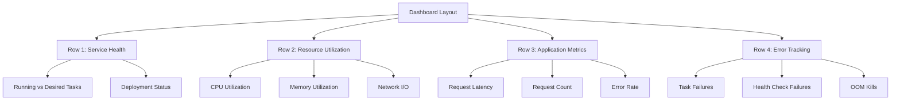

# How to Monitor ECS Tasks with CloudWatch Metrics

Author: [nawazdhandala](https://github.com/nawazdhandala)

Tags: AWS, ECS, CloudWatch, Monitoring

Description: Learn how to effectively monitor Amazon ECS tasks using CloudWatch metrics, including key metrics to track, alarm configuration, and dashboard setup.

---

When you're running production workloads on ECS, knowing what's happening inside your tasks isn't optional. A task might be running but barely functioning - consuming all its allocated memory, burning through CPU, or failing health checks intermittently. CloudWatch metrics give you the visibility to catch these problems before they become outages.

This guide covers the built-in ECS metrics available in CloudWatch, how to set up useful alarms, and how to build dashboards that actually help during incidents.

## Default ECS Metrics in CloudWatch

ECS automatically publishes metrics to CloudWatch at the service level. You don't need to enable anything - these are available by default in the `AWS/ECS` namespace.

The default metrics are:

| Metric | Description | Useful For |
|--------|-------------|------------|
| CPUUtilization | Percentage of CPU units used vs reserved | Capacity planning, autoscaling |
| MemoryUtilization | Percentage of memory used vs reserved | OOM prevention, right-sizing |

These are aggregated at the service level and reported every minute. While they're helpful, they only give you the service-wide average. If you need per-task or per-container metrics, you'll want to enable Container Insights (covered in our [Container Insights guide](https://oneuptime.com/blog/post/monitor-ecs-container-insights/view)).

## Querying ECS Metrics with the CLI

Let's pull some real data. Here's how to check CPU utilization for a specific service:

```bash
# Get average CPU utilization over the last 3 hours in 5-minute intervals
aws cloudwatch get-metric-statistics \
  --namespace "AWS/ECS" \
  --metric-name CPUUtilization \
  --dimensions \
    Name=ClusterName,Value=production \
    Name=ServiceName,Value=api-service \
  --start-time "$(date -u -v-3H +%Y-%m-%dT%H:%M:%SZ)" \
  --end-time "$(date -u +%Y-%m-%dT%H:%M:%SZ)" \
  --period 300 \
  --statistics Average Maximum
```

And for memory utilization:

```bash
# Get memory utilization with both average and peak values
aws cloudwatch get-metric-statistics \
  --namespace "AWS/ECS" \
  --metric-name MemoryUtilization \
  --dimensions \
    Name=ClusterName,Value=production \
    Name=ServiceName,Value=api-service \
  --start-time "$(date -u -v-3H +%Y-%m-%dT%H:%M:%SZ)" \
  --end-time "$(date -u +%Y-%m-%dT%H:%M:%SZ)" \
  --period 300 \
  --statistics Average Maximum Minimum
```

The `Maximum` statistic is particularly important for memory. Your average might be 60%, but if the maximum regularly hits 95%, you're one burst away from an OOM kill.

## Custom Metrics from Your Applications

The default metrics only cover CPU and memory. For application-specific monitoring, you'll need to push custom metrics to CloudWatch from within your containers.

Here's a simple Python example that publishes request latency as a custom metric:

```python
import boto3
import time
from datetime import datetime

# Initialize the CloudWatch client
cloudwatch = boto3.client('cloudwatch', region_name='us-east-1')

def publish_latency_metric(service_name, latency_ms):
    """Publish a request latency metric to CloudWatch."""
    cloudwatch.put_metric_data(
        Namespace='Custom/ECS',
        MetricData=[
            {
                'MetricName': 'RequestLatency',
                'Dimensions': [
                    {
                        'Name': 'ServiceName',
                        'Value': service_name
                    }
                ],
                'Timestamp': datetime.utcnow(),
                'Value': latency_ms,
                'Unit': 'Milliseconds',
                'StorageResolution': 60  # standard resolution
            }
        ]
    )

# Usage in a request handler
start = time.time()
# ... handle request ...
latency = (time.time() - start) * 1000
publish_latency_metric('api-service', latency)
```

Make sure your ECS task role has the `cloudwatch:PutMetricData` permission:

```json
{
  "Version": "2012-10-17",
  "Statement": [
    {
      "Effect": "Allow",
      "Action": "cloudwatch:PutMetricData",
      "Resource": "*",
      "Condition": {
        "StringEquals": {
          "cloudwatch:namespace": "Custom/ECS"
        }
      }
    }
  ]
}
```

## Setting Up Metric Alarms

Metrics without alarms are just data. You need alarms to get notified when things go wrong. Here are the essential alarms every ECS service should have.

### High CPU Alarm

```bash
# Alarm when CPU exceeds 80% for 10 minutes
aws cloudwatch put-metric-alarm \
  --alarm-name "ecs-api-service-high-cpu" \
  --alarm-description "API service CPU utilization above 80 percent" \
  --namespace "AWS/ECS" \
  --metric-name CPUUtilization \
  --dimensions Name=ClusterName,Value=production Name=ServiceName,Value=api-service \
  --statistic Average \
  --period 300 \
  --threshold 80 \
  --comparison-operator GreaterThanThreshold \
  --evaluation-periods 2 \
  --treat-missing-data missing \
  --alarm-actions "arn:aws:sns:us-east-1:123456789012:ops-alerts"
```

### High Memory Alarm

```bash
# Alarm when memory exceeds 85% - memory pressure leads to OOM kills
aws cloudwatch put-metric-alarm \
  --alarm-name "ecs-api-service-high-memory" \
  --alarm-description "API service memory utilization above 85 percent" \
  --namespace "AWS/ECS" \
  --metric-name MemoryUtilization \
  --dimensions Name=ClusterName,Value=production Name=ServiceName,Value=api-service \
  --statistic Maximum \
  --period 300 \
  --threshold 85 \
  --comparison-operator GreaterThanThreshold \
  --evaluation-periods 2 \
  --treat-missing-data breaching \
  --alarm-actions "arn:aws:sns:us-east-1:123456789012:ops-alerts"
```

Notice I'm using `Maximum` for memory instead of `Average`. Memory issues are about peaks, not averages. Also, `treat-missing-data` is set to `breaching` for memory - if metrics stop arriving, that itself might indicate a problem.

### Service Stability Alarm Using Math Expressions

You can create more sophisticated alarms using metric math. Here's one that triggers when the running task count drops below the desired count:

```bash
# Alarm when running tasks are less than desired tasks
aws cloudwatch put-metric-alarm \
  --alarm-name "ecs-api-service-task-deficit" \
  --alarm-description "Running tasks below desired count" \
  --metrics '[
    {
      "Id": "running",
      "MetricStat": {
        "Metric": {
          "Namespace": "ECS/ContainerInsights",
          "MetricName": "RunningTaskCount",
          "Dimensions": [
            {"Name": "ClusterName", "Value": "production"},
            {"Name": "ServiceName", "Value": "api-service"}
          ]
        },
        "Period": 60,
        "Stat": "Average"
      },
      "ReturnData": false
    },
    {
      "Id": "desired",
      "MetricStat": {
        "Metric": {
          "Namespace": "ECS/ContainerInsights",
          "MetricName": "DesiredTaskCount",
          "Dimensions": [
            {"Name": "ClusterName", "Value": "production"},
            {"Name": "ServiceName", "Value": "api-service"}
          ]
        },
        "Period": 60,
        "Stat": "Average"
      },
      "ReturnData": false
    },
    {
      "Id": "deficit",
      "Expression": "desired - running",
      "ReturnData": true
    }
  ]' \
  --threshold 1 \
  --comparison-operator GreaterThanOrEqualToThreshold \
  --evaluation-periods 5 \
  --alarm-actions "arn:aws:sns:us-east-1:123456789012:ops-alerts"
```

This alarm fires when the task deficit is 1 or more for 5 consecutive minutes. It's a great early warning that something is preventing tasks from starting.

## Autoscaling with CloudWatch Metrics

CloudWatch metrics drive ECS Service Auto Scaling through target tracking policies. Here's how to set up CPU-based autoscaling:

```bash
# Register the service as a scalable target
aws application-autoscaling register-scalable-target \
  --service-namespace ecs \
  --resource-id service/production/api-service \
  --scalable-dimension ecs:service:DesiredCount \
  --min-capacity 2 \
  --max-capacity 20

# Create a target tracking policy based on CPU
aws application-autoscaling put-scaling-policy \
  --service-namespace ecs \
  --resource-id service/production/api-service \
  --scalable-dimension ecs:service:DesiredCount \
  --policy-name cpu-target-tracking \
  --policy-type TargetTrackingScaling \
  --target-tracking-scaling-policy-configuration '{
    "TargetValue": 70.0,
    "PredefinedMetricSpecification": {
      "PredefinedMetricType": "ECSServiceAverageCPUUtilization"
    },
    "ScaleInCooldown": 300,
    "ScaleOutCooldown": 60
  }'
```

Notice the asymmetric cooldowns - scale out quickly (60 seconds) but scale in slowly (300 seconds). This prevents flapping during traffic fluctuations.

## Building an Effective Dashboard

A good dashboard tells you the health story at a glance. Here's a layout that works well:



The first row should answer "is the service healthy?" at a glance. Running tasks matching desired tasks means things are stable. The second row shows resource pressure. The third and fourth rows show application-level behavior.

## Metric Resolution and Costs

Standard ECS metrics are published at 1-minute resolution. Custom metrics can be published at 1-second (high resolution) or 1-minute (standard resolution) intervals.

High-resolution metrics cost more but give you finer granularity during incidents. A practical approach is to use standard resolution for most metrics and high resolution only for your most critical indicators like latency and error rate.

Each custom metric costs about $0.30/month, and each alarm costs about $0.10/month. For a typical ECS deployment with 5-10 services and 3-4 alarms per service, you're looking at maybe $20-30/month in CloudWatch costs. That's pocket change compared to the cost of an undetected outage.

## Wrapping Up

CloudWatch metrics are the foundation of ECS monitoring. Start with the built-in CPU and memory metrics, add custom application metrics for business-critical indicators, set up alarms with appropriate thresholds, and build dashboards that help you quickly understand system health.

The key is to be intentional about what you monitor. Don't create alarms for everything - focus on the signals that indicate real problems and require human intervention. And always test your alarms by deliberately crossing thresholds in a staging environment before relying on them in production.

For more advanced monitoring setups, including per-container metrics, take a look at our [Container Insights guide](https://oneuptime.com/blog/post/monitor-ecs-container-insights/view).
