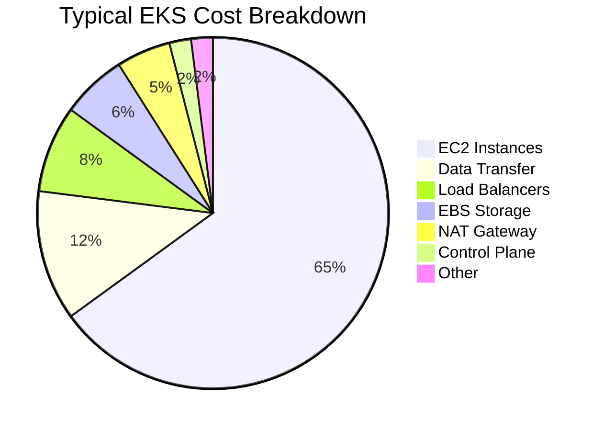

# How to Monitor EKS Costs and Optimize Spending

Author: [nawazdhandala](https://github.com/nawazdhandala)

Tags: AWS, EKS, Kubernetes, Cost Optimization, FinOps

Description: Practical strategies for monitoring, analyzing, and reducing Amazon EKS costs, including right-sizing, spot instances, and Kubecost integration.

---

EKS costs can spiral out of control faster than you'd expect. The control plane fee ($0.10/hour per cluster) is just the tip of the iceberg. The real costs come from EC2 instances, data transfer, load balancers, EBS volumes, and the dozens of other AWS services your cluster touches. Without visibility into where the money goes, you'll keep throwing resources at problems instead of solving them.

This guide covers how to track EKS costs, identify waste, and implement optimizations that can easily cut your bill by 30-60%.

## Where EKS Costs Come From

Let's break down the typical cost structure:

- **EC2 instances (nodes)** - 60-80% of total cost
- **EKS control plane** - $73/month per cluster
- **Data transfer** - cross-AZ traffic adds up fast
- **Load balancers** - ALBs, NLBs, each costs ~$20/month plus data processing
- **EBS volumes** - persistent storage for pods
- **NAT gateways** - $0.045/GB processed, often a surprise cost
- **CloudWatch logs** - ingestion and storage fees



## Step 1: Enable Cost Allocation Tags

First, make sure your EKS resources are tagged for cost tracking. Tags flow through to your AWS Cost Explorer reports.

```bash
# Tag your EKS cluster
aws eks tag-resource \
  --resource-arn arn:aws:eks:us-west-2:123456789012:cluster/my-cluster \
  --tags Environment=production,Team=platform,Project=web-app

# Activate cost allocation tags in the billing console
aws ce update-cost-allocation-tags-status \
  --cost-allocation-tags-status TagKey=Environment,Status=Active \
  --cost-allocation-tags-status TagKey=Team,Status=Active
```

## Step 2: Install Kubecost

Kubecost gives you cost visibility at the Kubernetes level - by namespace, deployment, pod, and label. It breaks down costs that AWS billing can't, showing you exactly which workloads are costing what.

```bash
# Install Kubecost with Helm
helm repo add kubecost https://kubecost.github.io/cost-analyzer/
helm repo update

helm install kubecost kubecost/cost-analyzer \
  --namespace kubecost \
  --create-namespace \
  --set kubecostToken="YOUR_TOKEN" \
  --set prometheus.server.persistentVolume.size=32Gi
```

Access the Kubecost dashboard:

```bash
# Port-forward Kubecost UI
kubectl port-forward -n kubecost svc/kubecost-cost-analyzer 9090:9090
```

Open http://localhost:9090 to see cost breakdowns by namespace, controller, and pod.

## Step 3: Right-Size Your Workloads

Overprovisioned resource requests are the number one source of waste. Pods requesting 1 CPU and 2GB memory but only using 100m CPU and 200MB memory are blocking resources that other pods could use.

Use kubectl top or [Prometheus metrics](https://oneuptime.com/blog/post/2026-02-12-set-up-prometheus-and-grafana-on-eks/view) to find overprovisioned workloads:

```bash
# Check actual resource usage vs. requests
kubectl top pods -n production --sort-by=cpu

# Compare with requested resources
kubectl get pods -n production -o custom-columns=\
NAME:.metadata.name,\
CPU_REQ:.spec.containers[0].resources.requests.cpu,\
MEM_REQ:.spec.containers[0].resources.requests.memory
```

Install the Vertical Pod Autoscaler (VPA) to get right-sizing recommendations:

```bash
# Install VPA
git clone https://github.com/kubernetes/autoscaler.git
cd autoscaler/vertical-pod-autoscaler
./hack/vpa-up.sh
```

```yaml
# vpa-recommendation.yaml - Get right-sizing recommendations
apiVersion: autoscaling.k8s.io/v1
kind: VerticalPodAutoscaler
metadata:
  name: my-app-vpa
spec:
  targetRef:
    apiVersion: apps/v1
    kind: Deployment
    name: my-app
  updatePolicy:
    updateMode: "Off"  # Just get recommendations, don't auto-apply
```

```bash
# Check VPA recommendations
kubectl describe vpa my-app-vpa
```

## Step 4: Use Spot Instances

Spot instances cost 60-90% less than on-demand. They can be interrupted, but with proper setup, your workloads handle this gracefully.

For managed node groups:

```bash
# Create a spot instance node group
eksctl create nodegroup \
  --cluster my-cluster \
  --name spot-workers \
  --instance-types m5.large,m5a.large,m5d.large,m4.large \
  --spot \
  --nodes-min 2 \
  --nodes-max 20
```

For [Karpenter](https://oneuptime.com/blog/post/2026-02-12-use-karpenter-for-eks-node-provisioning/view), configure your NodePool to prefer spot:

```yaml
# Karpenter NodePool with spot preference
spec:
  template:
    spec:
      requirements:
        - key: karpenter.sh/capacity-type
          operator: In
          values: ["spot", "on-demand"]
```

Karpenter will try spot first and fall back to on-demand if spot capacity isn't available.

## Step 5: Optimize Data Transfer Costs

Cross-AZ data transfer costs $0.01/GB in each direction. In a busy cluster, this adds up fast. Reduce it by using topology-aware routing:

```yaml
# service-topology.yaml - Prefer same-zone traffic
apiVersion: v1
kind: Service
metadata:
  name: my-service
  annotations:
    service.kubernetes.io/topology-mode: Auto
spec:
  selector:
    app: my-app
  ports:
    - port: 80
```

For pods that communicate frequently, use pod affinity to schedule them in the same AZ:

```yaml
# Pod affinity to co-locate communicating pods
spec:
  affinity:
    podAffinity:
      preferredDuringSchedulingIgnoredDuringExecution:
        - weight: 100
          podAffinityTerm:
            labelSelector:
              matchLabels:
                app: my-database
            topologyKey: topology.kubernetes.io/zone
```

## Step 6: Reduce NAT Gateway Costs

NAT gateways charge $0.045 per GB processed. If your pods pull large container images or make lots of external API calls, this cost adds up.

Strategies to reduce NAT costs:
- Use VPC endpoints for AWS services (S3, ECR, CloudWatch)
- Cache container images with a pull-through cache
- Use private ECR endpoints

```bash
# Create a VPC endpoint for ECR to avoid NAT costs
aws ec2 create-vpc-endpoint \
  --vpc-id vpc-0abc123 \
  --service-name com.amazonaws.us-west-2.ecr.dkr \
  --vpc-endpoint-type Interface \
  --subnet-ids subnet-0abc123 subnet-0def456 \
  --security-group-ids sg-0abc123

# Create endpoints for S3 (used by ECR for image layers)
aws ec2 create-vpc-endpoint \
  --vpc-id vpc-0abc123 \
  --service-name com.amazonaws.us-west-2.s3 \
  --vpc-endpoint-type Gateway \
  --route-table-ids rtb-0abc123
```

## Step 7: Implement Pod Autoscaling

Scale workloads down when demand drops. Horizontal Pod Autoscaler (HPA) reduces pods during low-traffic periods, which in turn allows the [Cluster Autoscaler](https://oneuptime.com/blog/post/2026-02-12-configure-eks-cluster-autoscaler/view) or Karpenter to remove underutilized nodes.

```yaml
# hpa.yaml - Scale based on CPU utilization
apiVersion: autoscaling/v2
kind: HorizontalPodAutoscaler
metadata:
  name: my-app
spec:
  scaleTargetRef:
    apiVersion: apps/v1
    kind: Deployment
    name: my-app
  minReplicas: 2
  maxReplicas: 20
  metrics:
    - type: Resource
      resource:
        name: cpu
        target:
          type: Utilization
          averageUtilization: 70
  behavior:
    scaleDown:
      stabilizationWindowSeconds: 300
      policies:
        - type: Percent
          value: 10
          periodSeconds: 60
```

## Step 8: Use Savings Plans and Reserved Instances

For baseline capacity that runs 24/7, Compute Savings Plans offer up to 66% savings. They're more flexible than Reserved Instances because they apply across instance families and sizes.

```bash
# Check Savings Plans recommendations
aws ce get-savings-plans-purchase-recommendation \
  --savings-plans-type COMPUTE_SP \
  --term-in-years ONE_YEAR \
  --payment-option NO_UPFRONT \
  --lookback-period-in-days SIXTY_DAYS
```

## Step 9: Clean Up Unused Resources

Regularly audit for waste:

```bash
# Find unused EBS volumes
aws ec2 describe-volumes \
  --filters Name=status,Values=available \
  --query "Volumes[*].{ID:VolumeId,Size:Size,Created:CreateTime}"

# Find unused load balancers
aws elbv2 describe-load-balancers \
  --query "LoadBalancers[*].{Name:LoadBalancerName,DNS:DNSName,Created:CreatedTime}"

# Find unattached Elastic IPs
aws ec2 describe-addresses \
  --query "Addresses[?AssociationId==null].{IP:PublicIp,AllocationId:AllocationId}"
```

## Ongoing Monitoring

Set up AWS Budget alerts to catch cost spikes early:

```bash
# Create a budget alert
aws budgets create-budget \
  --account-id 123456789012 \
  --budget '{
    "BudgetName": "EKS-Monthly",
    "BudgetLimit": {"Amount": "5000", "Unit": "USD"},
    "TimeUnit": "MONTHLY",
    "BudgetType": "COST",
    "CostFilters": {"TagKeyValue": ["user:Environment$production"]}
  }' \
  --notifications-with-subscribers '[{
    "Notification": {
      "NotificationType": "ACTUAL",
      "ComparisonOperator": "GREATER_THAN",
      "Threshold": 80
    },
    "Subscribers": [{"SubscriptionType": "EMAIL", "Address": "ops@example.com"}]
  }]'
```

Cost optimization isn't a one-time project. It's an ongoing practice. Set up dashboards, review costs weekly, and build a culture where teams understand and own their cloud spending. The savings compound over time.
