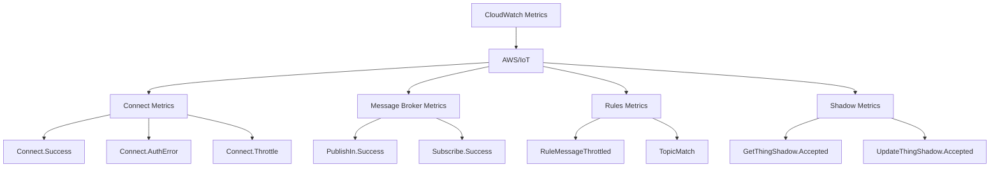

# How to Monitor IoT Devices with CloudWatch

Author: [nawazdhandala](https://github.com/nawazdhandala)

Tags: AWS, IoT, CloudWatch, Monitoring, Alerts, Device Management

Description: Learn how to monitor your IoT device fleet using Amazon CloudWatch with custom metrics, dashboards, alarms, and log insights for full observability.

---

You have deployed a fleet of IoT devices. They are sending data, triggering actions, and hopefully doing what they are supposed to. But how do you know when something goes wrong? How do you spot a device that is drifting offline, a sensor that is reporting garbage data, or a sudden spike in connection failures across your fleet?

Amazon CloudWatch is the natural monitoring backbone for AWS IoT deployments. IoT Core already publishes several built-in metrics to CloudWatch, and you can layer on custom metrics from your devices and backend logic to get a complete picture of fleet health.

## Built-in IoT Core Metrics

AWS IoT Core automatically publishes metrics to CloudWatch that cover connectivity, messaging, rules, and shadows. You do not need to configure anything to get these - they are available as soon as you start using IoT Core.

Here are the key metric namespaces and what they tell you:



**Connection metrics** tell you how many devices are connecting, disconnecting, and whether they are being throttled or hitting auth errors. A sudden spike in `Connect.AuthError` might mean certificates are expiring across a batch of devices.

**Message broker metrics** show publish and subscribe activity. `PublishIn.Success` and `PublishOut.Success` give you throughput numbers. If `PublishIn.Success` drops suddenly, devices might be going offline.

**Rule metrics** track your IoT rules engine activity. `TopicMatch` tells you how many messages matched each rule, and `RuleMessageThrottled` warns you if you are hitting throughput limits.

## Setting Up a CloudWatch Dashboard for IoT

A well-designed dashboard gives you a single-pane view of your fleet health. Here is how to create one using the AWS CLI:

```json
// dashboard-body.json - IoT fleet monitoring dashboard layout
{
  "widgets": [
    {
      "type": "metric",
      "x": 0,
      "y": 0,
      "width": 12,
      "height": 6,
      "properties": {
        "title": "Device Connections",
        "metrics": [
          ["AWS/IoT", "Connect.Success", {"stat": "Sum", "period": 300}],
          ["AWS/IoT", "Connect.AuthError", {"stat": "Sum", "period": 300}],
          ["AWS/IoT", "Connect.Throttle", {"stat": "Sum", "period": 300}]
        ],
        "view": "timeSeries",
        "region": "us-east-1",
        "period": 300
      }
    },
    {
      "type": "metric",
      "x": 12,
      "y": 0,
      "width": 12,
      "height": 6,
      "properties": {
        "title": "Message Throughput",
        "metrics": [
          ["AWS/IoT", "PublishIn.Success", {"stat": "Sum", "period": 60}],
          ["AWS/IoT", "PublishOut.Success", {"stat": "Sum", "period": 60}]
        ],
        "view": "timeSeries",
        "region": "us-east-1",
        "period": 60
      }
    },
    {
      "type": "metric",
      "x": 0,
      "y": 6,
      "width": 12,
      "height": 6,
      "properties": {
        "title": "Rules Engine Activity",
        "metrics": [
          ["AWS/IoT", "TopicMatch", {"stat": "Sum", "period": 300}],
          ["AWS/IoT", "RuleMessageThrottled", {"stat": "Sum", "period": 300}],
          ["AWS/IoT", "RuleNotFound", {"stat": "Sum", "period": 300}]
        ],
        "view": "timeSeries",
        "region": "us-east-1",
        "period": 300
      }
    }
  ]
}
```

```bash
# Create the CloudWatch dashboard from the definition
aws cloudwatch put-dashboard \
  --dashboard-name "IoTFleetMonitoring" \
  --dashboard-body file://dashboard-body.json
```

## Publishing Custom Metrics from Devices

The built-in metrics tell you about the IoT Core service, but they do not tell you about your devices. For that, you need custom metrics. There are a few ways to get device-level metrics into CloudWatch.

### Option 1: Via IoT Rules and Lambda

Route device telemetry through an IoT rule to a Lambda function that publishes custom CloudWatch metrics:

```python
# lambda_function.py - publishes device metrics to CloudWatch
import boto3
import json

cloudwatch = boto3.client('cloudwatch')

def lambda_handler(event, context):
    """Process device messages and publish custom metrics."""
    device_id = event.get('deviceId', 'unknown')

    metric_data = []

    # Publish battery level as a metric
    if 'battery' in event:
        metric_data.append({
            'MetricName': 'BatteryLevel',
            'Dimensions': [
                {'Name': 'DeviceId', 'Value': device_id},
                {'Name': 'DeviceType', 'Value': event.get('deviceType', 'sensor')}
            ],
            'Value': event['battery'],
            'Unit': 'Percent'
        })

    # Publish signal strength
    if 'rssi' in event:
        metric_data.append({
            'MetricName': 'SignalStrength',
            'Dimensions': [
                {'Name': 'DeviceId', 'Value': device_id}
            ],
            'Value': event['rssi'],
            'Unit': 'None'
        })

    # Publish message interval (time since last message)
    if 'messageInterval' in event:
        metric_data.append({
            'MetricName': 'MessageInterval',
            'Dimensions': [
                {'Name': 'DeviceId', 'Value': device_id}
            ],
            'Value': event['messageInterval'],
            'Unit': 'Seconds'
        })

    if metric_data:
        cloudwatch.put_metric_data(
            Namespace='IoT/DeviceMetrics',
            MetricData=metric_data
        )

    return {'statusCode': 200}
```

### Option 2: Via CloudWatch Agent on Gateway Devices

If your IoT devices connect through a gateway, you can install the CloudWatch agent on the gateway to collect system-level metrics and forward them. This works well for edge devices running Linux.

```json
// cloudwatch-agent-config.json - gateway device agent configuration
{
  "metrics": {
    "namespace": "IoT/GatewayMetrics",
    "metrics_collected": {
      "cpu": {
        "measurement": ["cpu_usage_idle", "cpu_usage_system"],
        "metrics_collection_interval": 60
      },
      "mem": {
        "measurement": ["mem_used_percent"],
        "metrics_collection_interval": 60
      },
      "disk": {
        "measurement": ["disk_used_percent"],
        "metrics_collection_interval": 300,
        "resources": ["/"]
      }
    },
    "append_dimensions": {
      "GatewayId": "${GATEWAY_ID}"
    }
  }
}
```

## Setting Up CloudWatch Alarms

Dashboards are great for visualization, but you need alarms to get notified when things go wrong. Here are the essential alarms for an IoT deployment:

```bash
# Alarm when auth errors spike - may indicate certificate expiration
aws cloudwatch put-metric-alarm \
  --alarm-name "IoT-AuthErrors-High" \
  --alarm-description "Too many IoT connection authentication errors" \
  --namespace "AWS/IoT" \
  --metric-name "Connect.AuthError" \
  --statistic "Sum" \
  --period 300 \
  --threshold 50 \
  --comparison-operator "GreaterThanThreshold" \
  --evaluation-periods 2 \
  --alarm-actions "arn:aws:sns:us-east-1:123456789012:IoTAlerts"

# Alarm when message throughput drops significantly
aws cloudwatch put-metric-alarm \
  --alarm-name "IoT-MessageDrop" \
  --alarm-description "IoT message throughput dropped below expected level" \
  --namespace "AWS/IoT" \
  --metric-name "PublishIn.Success" \
  --statistic "Sum" \
  --period 300 \
  --threshold 100 \
  --comparison-operator "LessThanThreshold" \
  --evaluation-periods 3 \
  --treat-missing-data "breaching" \
  --alarm-actions "arn:aws:sns:us-east-1:123456789012:IoTAlerts"

# Alarm when rules are being throttled
aws cloudwatch put-metric-alarm \
  --alarm-name "IoT-RulesThrottled" \
  --alarm-description "IoT rules engine throttling detected" \
  --namespace "AWS/IoT" \
  --metric-name "RuleMessageThrottled" \
  --statistic "Sum" \
  --period 60 \
  --threshold 10 \
  --comparison-operator "GreaterThanThreshold" \
  --evaluation-periods 2 \
  --alarm-actions "arn:aws:sns:us-east-1:123456789012:IoTAlerts"
```

## Using CloudWatch Logs Insights for IoT Debugging

Enable IoT Core logging to send detailed logs to CloudWatch Logs. This is invaluable for debugging connectivity issues, authorization failures, and rule execution errors.

```bash
# Enable IoT Core logging
aws iot set-v2-logging-options \
  --role-arn "arn:aws:iam::123456789012:role/IoTLoggingRole" \
  --default-log-level "INFO"
```

Then use CloudWatch Logs Insights to query these logs:

```
# Find all connection failures in the last hour
fields @timestamp, clientId, @message
| filter eventType = "Connect" and status = "Failure"
| sort @timestamp desc
| limit 50
```

```
# Find devices that disconnected unexpectedly
fields @timestamp, clientId, disconnectReason
| filter eventType = "Disconnect" and disconnectReason != "CLIENT_INITIATED_DISCONNECT"
| stats count() by clientId
| sort count desc
| limit 20
```

## Detecting Offline Devices

One of the trickiest monitoring challenges in IoT is detecting when a device has gone silent. CloudWatch alone does not track individual device presence, but you can build it.

Create a Lambda function that runs on a schedule and checks the IoT Device Registry for devices that have not been seen recently:

```python
# check_offline_devices.py - detect devices that stopped reporting
import boto3
from datetime import datetime, timedelta

iot = boto3.client('iot')
cloudwatch = boto3.client('cloudwatch')

def lambda_handler(event, context):
    """Check for devices that haven't reported recently."""
    offline_count = 0
    threshold = datetime.utcnow() - timedelta(minutes=30)

    paginator = iot.get_paginator('list_things')
    for page in paginator.paginate():
        for thing in page['things']:
            # Check the last connection time from device shadow or registry
            try:
                shadow = boto3.client('iot-data').get_thing_shadow(
                    thingName=thing['thingName']
                )
                # Parse shadow for last report timestamp
                # Increment offline_count if stale
            except Exception:
                offline_count += 1

    # Publish offline device count as a custom metric
    cloudwatch.put_metric_data(
        Namespace='IoT/FleetHealth',
        MetricData=[{
            'MetricName': 'OfflineDeviceCount',
            'Value': offline_count,
            'Unit': 'Count'
        }]
    )
```

For a more event-driven approach to detecting device issues, check out our guide on [using IoT Events for detecting complex events](https://oneuptime.com/blog/post/2026-02-12-use-iot-events-for-detecting-complex-events/view).

## Wrapping Up

Monitoring IoT devices with CloudWatch is a layered approach. Start with the built-in IoT Core metrics for a service-level view, add custom metrics for device-level visibility, set up alarms for the failure modes that matter most, and use Logs Insights for debugging. The goal is to catch problems before your users do - whether that is a single device going offline or a fleet-wide connectivity issue.
