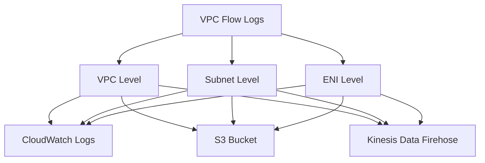

# How to Monitor Network Performance with VPC Flow Logs

Author: [nawazdhandala](https://github.com/nawazdhandala)

Tags: AWS, VPC, Networking, Monitoring, CloudWatch, Flow Logs

Description: Learn how to set up and use AWS VPC Flow Logs to monitor network performance, troubleshoot connectivity issues, and detect security threats.

---

If you have ever tried to debug a connectivity issue in AWS and found yourself staring at security group rules wondering what went wrong, VPC Flow Logs are the tool you have been missing. They capture information about the IP traffic going to and from network interfaces in your VPC, giving you visibility into what is actually happening on the wire.

In this guide, we will walk through setting up VPC Flow Logs, configuring them for performance monitoring, and building useful queries to extract actionable insights.

## What Are VPC Flow Logs?

VPC Flow Logs record metadata about IP traffic flowing through your VPC. Each flow log record includes information like source and destination IP addresses, ports, protocols, packet counts, byte counts, and whether the traffic was accepted or rejected.

You can create flow logs at three levels:

- **VPC level** - captures all traffic in the entire VPC
- **Subnet level** - captures traffic for all interfaces in a subnet
- **Network interface level** - captures traffic for a specific ENI



## Setting Up VPC Flow Logs

### Step 1: Create an IAM Role for Flow Logs

Before creating flow logs that publish to CloudWatch Logs, you need an IAM role that grants the necessary permissions.

```json
// IAM trust policy - allows VPC Flow Logs service to assume this role
{
  "Version": "2012-10-17",
  "Statement": [
    {
      "Effect": "Allow",
      "Principal": {
        "Service": "vpc-flow-logs.amazonaws.com"
      },
      "Action": "sts:AssumeRole"
    }
  ]
}
```

Attach a policy that allows writing to CloudWatch Logs.

```json
// IAM policy granting permissions to create and write to CloudWatch log groups
{
  "Version": "2012-10-17",
  "Statement": [
    {
      "Effect": "Allow",
      "Action": [
        "logs:CreateLogGroup",
        "logs:CreateLogStream",
        "logs:PutLogEvents",
        "logs:DescribeLogGroups",
        "logs:DescribeLogStreams"
      ],
      "Resource": "*"
    }
  ]
}
```

### Step 2: Create the Flow Log via CLI

This command creates a VPC-level flow log that publishes to CloudWatch Logs.

```bash
# Create a flow log for the entire VPC, publishing to CloudWatch Logs
aws ec2 create-flow-logs \
  --resource-type VPC \
  --resource-ids vpc-0abc123def456789 \
  --traffic-type ALL \
  --log-group-name /aws/vpc/flow-logs \
  --deliver-logs-permission-arn arn:aws:iam::123456789012:role/VPCFlowLogsRole \
  --max-aggregation-interval 60
```

The `--max-aggregation-interval 60` flag sets the capture window to 60 seconds (the minimum). The default is 600 seconds, but for performance monitoring you want the finer granularity.

### Step 3: Use a Custom Log Format

The default flow log format gives you the basics, but a custom format unlocks much richer data. Here is a format that includes fields useful for performance monitoring.

```bash
# Create flow log with custom format including TCP flags and traffic path
aws ec2 create-flow-logs \
  --resource-type VPC \
  --resource-ids vpc-0abc123def456789 \
  --traffic-type ALL \
  --log-destination-type s3 \
  --log-destination arn:aws:s3:::my-flow-logs-bucket \
  --log-format '${version} ${account-id} ${interface-id} ${srcaddr} ${dstaddr} ${srcport} ${dstport} ${protocol} ${packets} ${bytes} ${start} ${end} ${action} ${log-status} ${tcp-flags} ${traffic-path} ${flow-direction}'
```

The `tcp-flags` field is particularly valuable. It lets you identify SYN floods, connection resets, and incomplete TCP handshakes that indicate network problems.

## Querying Flow Logs for Performance Insights

### Finding Rejected Traffic

This CloudWatch Logs Insights query finds the top sources of rejected traffic, which often points to misconfigured security groups or NACLs.

```sql
-- Find top 10 source IPs with the most rejected connections
filter action = "REJECT"
| stats count(*) as rejectedCount by srcAddr
| sort rejectedCount desc
| limit 10
```

### Detecting High-Bandwidth Connections

Identify connections that are consuming the most bandwidth in your VPC.

```sql
-- Find connections transferring the most data in the last hour
filter logStatus = "OK"
| stats sum(bytes) as totalBytes by srcAddr, dstAddr, dstPort
| sort totalBytes desc
| limit 20
```

### Spotting TCP Connection Issues

Using the TCP flags field, you can find connections that are failing to complete the three-way handshake.

```sql
-- Find SYN packets without corresponding SYN-ACK (potential connectivity issues)
filter tcpFlags = 2
| stats count(*) as synCount by srcAddr, dstAddr, dstPort
| sort synCount desc
| limit 10
```

TCP flag value 2 represents SYN. If you see lots of SYN packets without corresponding established connections, something is blocking traffic or the destination is not responding.

## Publishing Flow Logs to S3 for Long-Term Analysis

For cost-effective long-term storage, publish flow logs to S3 and query them with Athena.

### Set Up an Athena Table

```sql
-- Create an Athena table to query flow logs stored in S3
CREATE EXTERNAL TABLE vpc_flow_logs (
  version int,
  account_id string,
  interface_id string,
  srcaddr string,
  dstaddr string,
  srcport int,
  dstport int,
  protocol bigint,
  packets bigint,
  bytes bigint,
  start bigint,
  `end` bigint,
  action string,
  log_status string
)
PARTITIONED BY (dt string)
ROW FORMAT DELIMITED
FIELDS TERMINATED BY ' '
LOCATION 's3://my-flow-logs-bucket/AWSLogs/123456789012/vpcflowlogs/us-east-1/'
TBLPROPERTIES ("skip.header.line.count"="1");
```

### Query for Network Performance Patterns

```sql
-- Find average bytes per connection by destination port over the last 7 days
SELECT dstport,
       COUNT(*) as connection_count,
       AVG(bytes) as avg_bytes,
       SUM(bytes) as total_bytes
FROM vpc_flow_logs
WHERE dt >= date_format(date_add('day', -7, now()), '%Y/%m/%d')
  AND action = 'ACCEPT'
GROUP BY dstport
ORDER BY total_bytes DESC
LIMIT 20;
```

## Setting Up CloudWatch Alarms

You can create metric filters and alarms to get notified when network anomalies occur.

```bash
# Create a metric filter that tracks rejected SSH traffic
aws logs put-metric-filter \
  --log-group-name /aws/vpc/flow-logs \
  --filter-name RejectedSSH \
  --filter-pattern '[version, account, eni, source, destination, srcport, destport="22", protocol, packets, bytes, windowstart, windowend, action="REJECT", flowlogstatus]' \
  --metric-transformations \
    metricName=RejectedSSHCount,metricNamespace=VPCFlowLogs,metricValue=1
```

Then create an alarm on that metric.

```bash
# Alarm when rejected SSH attempts exceed 100 in 5 minutes
aws cloudwatch put-metric-alarm \
  --alarm-name HighRejectedSSH \
  --metric-name RejectedSSHCount \
  --namespace VPCFlowLogs \
  --statistic Sum \
  --period 300 \
  --threshold 100 \
  --comparison-operator GreaterThanThreshold \
  --evaluation-periods 1 \
  --alarm-actions arn:aws:sns:us-east-1:123456789012:NetworkAlerts
```

## Cost Considerations

VPC Flow Logs can generate a lot of data. Here are some tips to keep costs under control:

- Use **S3 as the destination** instead of CloudWatch Logs for high-volume VPCs. S3 storage is significantly cheaper.
- Apply **S3 lifecycle policies** to transition older logs to Glacier or delete them after a retention period.
- Use **traffic-type filtering** to capture only REJECT traffic if you are primarily interested in security monitoring.
- Set the **aggregation interval** to 600 seconds if you do not need near-real-time data.

## Integrating with Monitoring Tools

VPC Flow Logs become even more powerful when combined with a monitoring platform. You can stream flow logs from CloudWatch or S3 into tools like [OneUptime](https://oneuptime.com/blog/post/2026-02-12-monitor-network-performance-with-vpc-flow-logs/view) for unified dashboards that correlate network events with application metrics.

For related networking topics, check out our guide on [using Reachability Analyzer for network troubleshooting](https://oneuptime.com/blog/post/2026-02-12-use-reachability-analyzer-for-network-troubleshooting/view) and [setting up AWS Site-to-Site VPN with BGP routing](https://oneuptime.com/blog/post/2026-02-12-set-up-aws-site-to-site-vpn-with-bgp-routing/view).

## Summary

VPC Flow Logs are one of the most underused networking tools in AWS. They give you deep visibility into traffic patterns without requiring any agents or packet capture tools. By publishing them to CloudWatch or S3, you can build queries that surface connectivity issues, bandwidth hogs, and security threats. The key is choosing the right log format, setting an appropriate aggregation interval, and building queries that answer the specific questions you have about your network.

Start with VPC-level flow logs in a staging environment, refine your queries, and then roll them out to production. The insights you gain will more than justify the storage costs.
