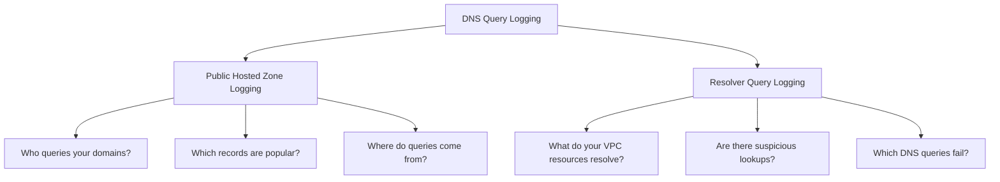

# How to Monitor Route 53 DNS Query Logging

Author: [nawazdhandala](https://github.com/nawazdhandala)

Tags: AWS, Route 53, DNS, Monitoring, Logging, Security

Description: Complete guide to setting up and monitoring Route 53 DNS query logging for security analysis, troubleshooting, and compliance including CloudWatch and S3 destinations.

---

Every DNS query tells a story. Who is resolving what, from where, and how often. Route 53 DNS query logging captures this data and makes it available for security analysis, troubleshooting, and compliance. Here is how to set it up and actually use the data.

## Two Types of DNS Query Logging

Route 53 offers two distinct logging features that serve different purposes:

**Public DNS query logging**: Logs queries made to your public hosted zones. This tells you who is looking up your public domain names.

**Resolver query logging**: Logs DNS queries made from within your VPCs. This tells you what your workloads are trying to resolve, including queries to external domains.



## Setting Up Public DNS Query Logging

### Step 1: Create a CloudWatch Log Group

Query logs for public hosted zones must go to CloudWatch Logs in the us-east-1 region (regardless of where your hosted zone is).

```bash
# Create a log group in us-east-1
aws logs create-log-group \
    --log-group-name /aws/route53/example.com \
    --region us-east-1

# Set retention to avoid unbounded costs
aws logs put-retention-policy \
    --log-group-name /aws/route53/example.com \
    --retention-in-days 30 \
    --region us-east-1
```

### Step 2: Create the Resource Policy

Route 53 needs permission to write to your log group:

```bash
# Create a resource policy allowing Route 53 to write logs
aws logs put-resource-policy \
    --policy-name route53-query-logging \
    --policy-document '{
        "Version": "2012-10-17",
        "Statement": [
            {
                "Sid": "Route53LogsToCloudWatchLogs",
                "Effect": "Allow",
                "Principal": {
                    "Service": "route53.amazonaws.com"
                },
                "Action": [
                    "logs:CreateLogStream",
                    "logs:PutLogEvents"
                ],
                "Resource": "arn:aws:logs:us-east-1:123456789012:log-group:/aws/route53/*"
            }
        ]
    }' \
    --region us-east-1
```

### Step 3: Enable Query Logging

```bash
# Enable query logging for your hosted zone
aws route53 create-query-logging-config \
    --hosted-zone-id Z1234567890 \
    --cloud-watch-logs-log-group-arn "arn:aws:logs:us-east-1:123456789012:log-group:/aws/route53/example.com"
```

## Setting Up Resolver Query Logging

Resolver query logging captures DNS queries from within your VPCs.

### Step 1: Create the Query Log Config

```bash
# Create resolver query log config sending to CloudWatch Logs
aws route53resolver create-resolver-query-log-config \
    --name vpc-dns-query-logs \
    --destination-arn "arn:aws:logs:us-east-1:123456789012:log-group:/aws/route53resolver/vpc-dns" \
    --creator-request-id "$(date +%s)" \
    --tags 'Key=Environment,Value=production'
```

You can also send logs to S3 for long-term storage and analysis:

```bash
# Create resolver query log config sending to S3
aws route53resolver create-resolver-query-log-config \
    --name vpc-dns-query-logs-s3 \
    --destination-arn "arn:aws:s3:::my-dns-query-logs" \
    --creator-request-id "$(date +%s)"
```

### Step 2: Associate with VPCs

```bash
# Associate the query log config with your VPCs
aws route53resolver associate-resolver-query-log-config \
    --resolver-query-log-config-id rqlc-0123456789abcdef0 \
    --resource-id vpc-production

aws route53resolver associate-resolver-query-log-config \
    --resolver-query-log-config-id rqlc-0123456789abcdef0 \
    --resource-id vpc-development
```

## Understanding the Log Format

### Public Query Logs

```
1.0 2026-02-12T10:30:00Z Z1234567890 example.com A NOERROR UDP
    192.0.2.1 -
```

Fields:
- Version
- Timestamp
- Hosted zone ID
- Query name
- Query type (A, AAAA, CNAME, MX, etc.)
- Response code
- Protocol (UDP/TCP)
- Source IP of the resolver
- EDNS client subnet (if present)

### Resolver Query Logs

```json
{
    "version": "1.100000",
    "account_id": "123456789012",
    "region": "us-east-1",
    "vpc_id": "vpc-production",
    "query_timestamp": "2026-02-12T10:30:00Z",
    "query_name": "api.external-service.com.",
    "query_type": "A",
    "query_class": "IN",
    "rcode": "NOERROR",
    "answers": [
        {
            "Rdata": "203.0.113.50",
            "Type": "A",
            "Class": "IN"
        }
    ],
    "srcaddr": "10.0.1.50",
    "srcport": "12345",
    "transport": "UDP",
    "srcids": {
        "instance": "i-0123456789abcdef0"
    }
}
```

Resolver logs are much richer - they include the source instance ID, the actual answers returned, and the source IP within your VPC.

## Analyzing DNS Query Logs

### CloudWatch Insights Queries

Use CloudWatch Logs Insights to analyze your DNS data.

```
# Top 20 most queried domain names
fields @timestamp, query_name
| stats count(*) as query_count by query_name
| sort query_count desc
| limit 20
```

```
# Find NXDOMAIN responses (domains that do not exist)
fields @timestamp, query_name, rcode, srcaddr
| filter rcode = "NXDOMAIN"
| stats count(*) as nxdomain_count by query_name
| sort nxdomain_count desc
| limit 20
```

```
# DNS queries from a specific instance
fields @timestamp, query_name, query_type, rcode
| filter srcids.instance = "i-0123456789abcdef0"
| sort @timestamp desc
| limit 100
```

```
# Detect potential DNS tunneling (unusually long domain names)
fields @timestamp, query_name, srcaddr
| filter strlen(query_name) > 50
| sort @timestamp desc
| limit 50
```

### Security Monitoring

DNS logs are valuable for detecting security threats:

```python
import json
import boto3
from collections import Counter

def analyze_dns_security(log_group, hours=24):
    """
    Analyze DNS query logs for security indicators.
    """
    client = boto3.client('logs')

    # Query for suspicious patterns
    queries = {
        "Long domain names (possible tunneling)": """
            fields query_name, srcaddr
            | filter strlen(query_name) > 60
            | stats count(*) as cnt by query_name
            | sort cnt desc
            | limit 20
        """,
        "High NXDOMAIN rate (possible DGA malware)": """
            fields srcaddr, rcode
            | filter rcode = "NXDOMAIN"
            | stats count(*) as nxdomain_count by srcaddr
            | sort nxdomain_count desc
            | limit 10
        """,
        "Queries to known bad TLDs": """
            fields query_name, srcaddr
            | filter query_name like /\.(xyz|top|club|work|loan)\./
            | stats count(*) as cnt by query_name
            | sort cnt desc
            | limit 20
        """,
        "TXT record queries (possible data exfiltration)": """
            fields query_name, srcaddr, query_type
            | filter query_type = "TXT"
            | stats count(*) as cnt by query_name
            | sort cnt desc
            | limit 20
        """
    }

    import time
    end_time = int(time.time())
    start_time = end_time - (hours * 3600)

    for description, query in queries.items():
        print(f"\n=== {description} ===")
        response = client.start_query(
            logGroupName=log_group,
            startTime=start_time,
            endTime=end_time,
            queryString=query
        )
        # In production, you would poll for results
        print(f"  Query ID: {response['queryId']}")

analyze_dns_security("/aws/route53resolver/vpc-dns")
```

## Setting Up Alerts

### NXDOMAIN Spike Alert

A sudden increase in NXDOMAIN responses can indicate malware using Domain Generation Algorithms (DGA):

```bash
# Create a metric filter for NXDOMAIN responses
aws logs put-metric-filter \
    --log-group-name /aws/route53resolver/vpc-dns \
    --filter-name nxdomain-count \
    --filter-pattern '{ $.rcode = "NXDOMAIN" }' \
    --metric-transformations \
        metricName=DNSNXDomainCount,metricNamespace=CustomDNS,metricValue=1 \
    --region us-east-1

# Create an alarm for NXDOMAIN spikes
aws cloudwatch put-metric-alarm \
    --alarm-name dns-nxdomain-spike \
    --metric-name DNSNXDomainCount \
    --namespace CustomDNS \
    --statistic Sum \
    --period 300 \
    --threshold 1000 \
    --comparison-operator GreaterThanThreshold \
    --evaluation-periods 1 \
    --alarm-actions arn:aws:sns:us-east-1:123456789012:security-alerts
```

### New Domain Detection

Alert when VPC resources query domains never seen before:

```bash
# Create a metric filter for queries to uncommon domains
aws logs put-metric-filter \
    --log-group-name /aws/route53resolver/vpc-dns \
    --filter-name txt-query-count \
    --filter-pattern '{ $.query_type = "TXT" }' \
    --metric-transformations \
        metricName=DNSTXTQueryCount,metricNamespace=CustomDNS,metricValue=1

# Alert on unusual TXT query volume
aws cloudwatch put-metric-alarm \
    --alarm-name dns-txt-query-spike \
    --metric-name DNSTXTQueryCount \
    --namespace CustomDNS \
    --statistic Sum \
    --period 300 \
    --threshold 100 \
    --comparison-operator GreaterThanThreshold \
    --evaluation-periods 1 \
    --alarm-actions arn:aws:sns:us-east-1:123456789012:security-alerts
```

## Cost Management

DNS query logging can generate significant log volume. Manage costs with:

- **Retention policies**: Set appropriate retention periods (30 days for active analysis, archive to S3 for long-term)
- **Log filtering**: Use subscription filters to only process interesting events
- **S3 storage classes**: Use Intelligent-Tiering or Glacier for archived logs

```bash
# Set up S3 lifecycle for archived DNS logs
aws s3api put-bucket-lifecycle-configuration \
    --bucket my-dns-query-logs \
    --lifecycle-configuration '{
        "Rules": [{
            "ID": "ArchiveDNSLogs",
            "Status": "Enabled",
            "Filter": {"Prefix": ""},
            "Transitions": [
                {"Days": 30, "StorageClass": "STANDARD_IA"},
                {"Days": 90, "StorageClass": "GLACIER"}
            ],
            "Expiration": {"Days": 365}
        }]
    }'
```

## Conclusion

Route 53 DNS query logging is one of those capabilities that seems optional until you need it. For security teams, it is a goldmine of threat intelligence. For operations teams, it is a powerful troubleshooting tool. For compliance teams, it is an audit requirement. Set it up for both public hosted zones and VPC resolver queries, build dashboards for visibility, and create alerts for anomalous patterns. The data is there - you just need to collect and analyze it.
