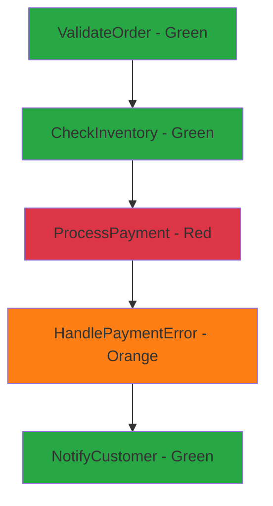

# Monitor Step Functions Executions in the Console

Author: [nawazdhandala](https://github.com/nawazdhandala)

Tags: AWS, Step Functions, Monitoring, CloudWatch

Description: A practical guide to monitoring AWS Step Functions executions using the console, CloudWatch metrics, and alerting for production workflows.

---

You've deployed your Step Functions workflow. It's running in production. But how do you know if it's actually working? The Step Functions console gives you a surprisingly good monitoring experience out of the box, and when you combine it with CloudWatch metrics and alarms, you get a robust observability setup.

Let's walk through everything you need to monitor your workflows effectively.

## The Execution List View

When you open a state machine in the Step Functions console, the first thing you see is the execution list. This shows every execution with its status, start time, and duration. You can filter by status (Running, Succeeded, Failed, Timed Out, Aborted) to quickly find problems.

The key metrics at a glance:
- **Running** - executions currently in progress
- **Succeeded** - completed successfully
- **Failed** - hit an unhandled error
- **Timed Out** - exceeded the state machine or state timeout
- **Aborted** - manually stopped

If your failure rate is climbing, this view tells you immediately. Sort by start time to see if failures are clustered (indicating a deployment issue or downstream service problem) or scattered (indicating intermittent issues).

## The Visual Workflow Inspector

Click on any execution and you get the visual workflow view. This is the killer feature. Each state is colored based on its status:

- Green: succeeded
- Red: failed
- Blue: currently running
- Gray: not yet reached
- Orange: caught error (recovered)



Click on any state to see its input, output, and any error details. For failed states, you get the exact error message and stack trace. For states with retries, you can see how many attempts were made.

## Setting Up CloudWatch Metrics

Step Functions automatically publishes metrics to CloudWatch. The most important ones are:

- `ExecutionsStarted` - how many workflows kicked off
- `ExecutionsSucceeded` - how many completed successfully
- `ExecutionsFailed` - how many hit unhandled errors
- `ExecutionsTimedOut` - how many exceeded their timeout
- `ExecutionsAborted` - how many were manually stopped
- `ExecutionTime` - how long executions take

You can create a dashboard that shows these at a glance.

This CLI command creates a CloudWatch dashboard for your state machine:

```bash
aws cloudwatch put-dashboard --dashboard-name StepFunctionsDashboard \
  --dashboard-body '{
    "widgets": [
      {
        "type": "metric",
        "properties": {
          "title": "Execution Status",
          "metrics": [
            ["AWS/States", "ExecutionsSucceeded", "StateMachineArn", "arn:aws:states:us-east-1:123456789:stateMachine:OrderProcessor"],
            ["AWS/States", "ExecutionsFailed", "StateMachineArn", "arn:aws:states:us-east-1:123456789:stateMachine:OrderProcessor"],
            ["AWS/States", "ExecutionsTimedOut", "StateMachineArn", "arn:aws:states:us-east-1:123456789:stateMachine:OrderProcessor"]
          ],
          "period": 300,
          "stat": "Sum",
          "view": "timeSeries"
        }
      },
      {
        "type": "metric",
        "properties": {
          "title": "Execution Duration",
          "metrics": [
            ["AWS/States", "ExecutionTime", "StateMachineArn", "arn:aws:states:us-east-1:123456789:stateMachine:OrderProcessor", {"stat": "p50"}],
            ["AWS/States", "ExecutionTime", "StateMachineArn", "arn:aws:states:us-east-1:123456789:stateMachine:OrderProcessor", {"stat": "p90"}],
            ["AWS/States", "ExecutionTime", "StateMachineArn", "arn:aws:states:us-east-1:123456789:stateMachine:OrderProcessor", {"stat": "p99"}]
          ],
          "period": 300,
          "view": "timeSeries"
        }
      }
    ]
  }'
```

## Setting Up Alarms

Dashboards are great for proactive monitoring, but you also need alarms that wake you up when things go wrong.

This creates an alarm that fires when more than 5 executions fail in 5 minutes:

```bash
aws cloudwatch put-metric-alarm \
  --alarm-name StepFunctions-HighFailureRate \
  --alarm-description "Step Functions execution failures exceeded threshold" \
  --metric-name ExecutionsFailed \
  --namespace AWS/States \
  --dimensions Name=StateMachineArn,Value=arn:aws:states:us-east-1:123456789:stateMachine:OrderProcessor \
  --statistic Sum \
  --period 300 \
  --threshold 5 \
  --comparison-operator GreaterThanThreshold \
  --evaluation-periods 1 \
  --alarm-actions arn:aws:sns:us-east-1:123456789:ops-alerts
```

And this one catches executions that are running longer than expected:

```bash
aws cloudwatch put-metric-alarm \
  --alarm-name StepFunctions-SlowExecutions \
  --alarm-description "Step Functions execution time exceeded normal range" \
  --metric-name ExecutionTime \
  --namespace AWS/States \
  --dimensions Name=StateMachineArn,Value=arn:aws:states:us-east-1:123456789:stateMachine:OrderProcessor \
  --statistic p90 \
  --period 300 \
  --threshold 30000 \
  --comparison-operator GreaterThanThreshold \
  --evaluation-periods 2 \
  --alarm-actions arn:aws:sns:us-east-1:123456789:ops-alerts
```

## Enabling Logging

For detailed debugging, enable execution logging to CloudWatch Logs. This captures the input, output, and state transitions for every execution.

This enables full logging on a state machine:

```bash
aws stepfunctions update-state-machine \
  --state-machine-arn arn:aws:states:us-east-1:123456789:stateMachine:OrderProcessor \
  --logging-configuration '{
    "level": "ALL",
    "includeExecutionData": true,
    "destinations": [
      {
        "cloudWatchLogsLogGroup": {
          "logGroupArn": "arn:aws:logs:us-east-1:123456789:log-group:/aws/states/OrderProcessor:*"
        }
      }
    ]
  }'
```

Log levels:
- `OFF` - no logging (default)
- `ERROR` - only log errors
- `FATAL` - only log fatal errors
- `ALL` - log everything including input/output data

Be careful with `ALL` and `includeExecutionData: true` if your workflows process sensitive data. The inputs and outputs will be logged in plaintext.

## Querying Logs with Insights

Once logging is enabled, you can use CloudWatch Logs Insights to query execution data.

This query finds the slowest executions in the last 24 hours:

```
fields @timestamp, execution_arn, type, details.name
| filter type = "ExecutionSucceeded" or type = "ExecutionFailed"
| stats count() as executions,
        avg(details.billedDurationInMilliseconds) as avg_duration,
        max(details.billedDurationInMilliseconds) as max_duration
  by bin(1h)
| sort @timestamp desc
```

And this one finds all failed states with their error messages:

```
fields @timestamp, execution_arn, details.name, details.error, details.cause
| filter type = "TaskFailed" or type = "ExecutionFailed"
| sort @timestamp desc
| limit 50
```

## Tracing with X-Ray

Step Functions integrates with AWS X-Ray for distributed tracing. Enable it to see the full request path including Lambda invocations and service calls.

This enables X-Ray tracing on your state machine:

```bash
aws stepfunctions update-state-machine \
  --state-machine-arn arn:aws:states:us-east-1:123456789:stateMachine:OrderProcessor \
  --tracing-configuration enabled=true
```

With X-Ray enabled, you can see a service map showing how your state machine connects to Lambda functions, DynamoDB tables, and other services. You can trace individual requests through the entire workflow and identify bottlenecks.

## Programmatic Monitoring

For custom monitoring, you can list and describe executions programmatically.

This Lambda function runs periodically to check for stuck executions:

```javascript
// checkStuckExecutions.js - Finds executions running too long
const { SFNClient, ListExecutionsCommand } = require('@aws-sdk/client-sfn');
const { SNSClient, PublishCommand } = require('@aws-sdk/client-sns');

const sfnClient = new SFNClient({});
const snsClient = new SNSClient({});

const STATE_MACHINE_ARN = process.env.STATE_MACHINE_ARN;
const MAX_RUNNING_MINUTES = 60;

exports.handler = async () => {
  // Get all running executions
  const result = await sfnClient.send(new ListExecutionsCommand({
    stateMachineArn: STATE_MACHINE_ARN,
    statusFilter: 'RUNNING',
    maxResults: 100
  }));

  const now = new Date();
  const stuckExecutions = result.executions.filter(exec => {
    const runningMinutes = (now - exec.startDate) / 1000 / 60;
    return runningMinutes > MAX_RUNNING_MINUTES;
  });

  if (stuckExecutions.length > 0) {
    await snsClient.send(new PublishCommand({
      TopicArn: process.env.ALERT_TOPIC_ARN,
      Subject: `${stuckExecutions.length} stuck Step Functions executions detected`,
      Message: JSON.stringify(stuckExecutions.map(e => ({
        executionArn: e.executionArn,
        startDate: e.startDate,
        runningMinutes: Math.round((now - e.startDate) / 1000 / 60)
      })), null, 2)
    }));
  }

  return {
    checked: result.executions.length,
    stuck: stuckExecutions.length
  };
};
```

Schedule this with EventBridge to run every 15 minutes.

## Express Workflow Monitoring

Express workflows don't store execution history in the console - they log to CloudWatch Logs instead. Make sure you create a log group and enable logging when you create Express state machines. Without this, you're flying blind.

For Express workflows, your primary monitoring tools are CloudWatch Logs Insights queries and CloudWatch metrics. The metrics (ExecutionsStarted, ExecutionsSucceeded, ExecutionsFailed) work the same way as Standard workflows.

## Monitoring Best Practices

Set up alarms before you need them, not after your first incident. Start with these three: execution failure rate above your baseline, execution duration above your expected P95, and any executions that timeout. Review your dashboards weekly to understand normal patterns so you can spot anomalies. Use execution names that include business identifiers (like order IDs) so you can search for specific executions easily.

For a broader monitoring strategy, check out our post on [setting up effective monitoring](https://oneuptime.com/blog/post/2026-01-24-apm-monitoring/view).

## Wrapping Up

Step Functions gives you better out-of-the-box monitoring than most workflow engines. The visual inspector alone is worth the price of admission for debugging. Layer on CloudWatch metrics, alarms, and execution logging, and you have comprehensive observability for your serverless workflows. The key is setting this up proactively - not after 3 AM when something breaks.
