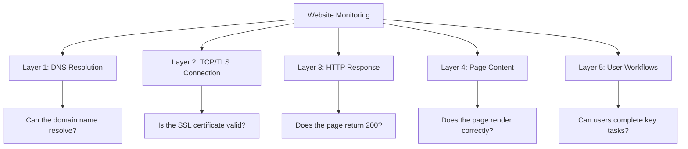

# How to Monitor Website Availability with CloudWatch Synthetics

Author: [nawazdhandala](https://github.com/nawazdhandala)

Tags: AWS, CloudWatch, Synthetics, Website Monitoring, Availability, Uptime

Description: Use CloudWatch Synthetics canaries to monitor website availability, track uptime, and detect visual and functional regressions proactively

---

Website availability monitoring answers the simplest and most important question: can your users access your website right now? It sounds basic, but downtime happens for all sorts of reasons - DNS issues, expired SSL certificates, deployment bugs, CDN outages, database failures, or a bad configuration push.

CloudWatch Synthetics provides automated website monitoring that goes beyond simple ping checks. Canaries can load your pages in a real browser, verify that key elements render correctly, check that forms work, and report exactly what broke when something goes wrong. Screenshots and HAR files give you visual proof of what happened.

This guide covers setting up website availability monitoring from basic URL checks to sophisticated visual regression testing.

## Availability Monitoring Strategy

A good monitoring setup covers multiple layers of your website.



Each layer catches different types of failures. A basic heartbeat canary covers layers 1-3. A browser canary covers layers 4-5.

## Step 1: Create a Heartbeat Monitor

The simplest and most essential canary - check if your website responds.

```javascript
// heartbeat.js - Basic availability check
const synthetics = require('Synthetics');
const log = require('SyntheticsLogger');

const URLS = [
  'https://www.example.com',
  'https://www.example.com/pricing',
  'https://www.example.com/docs',
  'https://app.example.com/login',
];

const heartbeat = async function () {
  for (const url of URLS) {
    const parsedUrl = new URL(url);

    await synthetics.executeHttpStep(
      `Check ${parsedUrl.pathname || '/'}`,
      {
        hostname: parsedUrl.hostname,
        path: parsedUrl.pathname + parsedUrl.search,
        port: 443,
        protocol: 'https:',
        method: 'GET',
      },
      (response) => {
        // Accept 200-399 as success (includes redirects)
        if (response.statusCode >= 400) {
          throw new Error(`${url} returned ${response.statusCode}`);
        }
        log.info(`${url}: ${response.statusCode} OK`);
      }
    );
  }
};

exports.handler = async () => {
  return await heartbeat();
};
```

Deploy it running every minute for maximum availability coverage.

```bash
# Create the heartbeat canary
aws synthetics create-canary \
  --name website-heartbeat \
  --artifact-s3-location "s3://canary-artifacts/heartbeat/" \
  --execution-role-arn arn:aws:iam::123456789012:role/canary-role \
  --schedule '{"Expression": "rate(1 minute)"}' \
  --runtime-version syn-nodejs-puppeteer-6.1 \
  --code '{"S3Bucket": "canary-artifacts", "S3Key": "heartbeat.zip", "Handler": "heartbeat.handler"}' \
  --run-config '{"TimeoutInSeconds": 30, "MemoryInMBs": 960}'

aws synthetics start-canary --name website-heartbeat
```

## Step 2: Create a Browser-Based Page Load Monitor

A browser canary actually renders the page and can verify that content appears correctly.

```javascript
// page-load-canary.js - Verify pages load and render correctly
const synthetics = require('Synthetics');
const log = require('SyntheticsLogger');

const pages = [
  {
    name: 'Homepage',
    url: 'https://www.example.com',
    selectors: ['#hero-section', '.navigation', '.footer'],
    titleContains: 'Example',
    maxLoadTime: 5000,
  },
  {
    name: 'Pricing Page',
    url: 'https://www.example.com/pricing',
    selectors: ['.pricing-table', '.plan-card', '.cta-button'],
    titleContains: 'Pricing',
    maxLoadTime: 5000,
  },
  {
    name: 'Documentation',
    url: 'https://www.example.com/docs',
    selectors: ['.docs-sidebar', '.docs-content', '.search-bar'],
    titleContains: 'Documentation',
    maxLoadTime: 8000,
  },
  {
    name: 'Login Page',
    url: 'https://app.example.com/login',
    selectors: ['#login-form', '#email-input', '#password-input', '#login-button'],
    titleContains: 'Login',
    maxLoadTime: 3000,
  },
];

const pageLoadCanary = async function () {
  const page = await synthetics.getPage();
  await page.setViewport({ width: 1920, height: 1080 });

  for (const pageConfig of pages) {
    await checkPage(page, pageConfig);
  }
};

async function checkPage(page, config) {
  await synthetics.executeStep(config.name, async function () {
    const startTime = Date.now();

    // Navigate to the page
    log.info(`Loading: ${config.url}`);
    const response = await page.goto(config.url, {
      waitUntil: 'networkidle2',
      timeout: 30000,
    });

    const loadTime = Date.now() - startTime;

    // Check HTTP status
    if (response.status() >= 400) {
      throw new Error(`${config.name} returned HTTP ${response.status()}`);
    }

    // Check page title
    const title = await page.title();
    if (config.titleContains && !title.includes(config.titleContains)) {
      throw new Error(
        `${config.name} title "${title}" does not contain "${config.titleContains}"`
      );
    }

    // Check that key elements are present
    for (const selector of config.selectors) {
      try {
        await page.waitForSelector(selector, { timeout: 5000 });
        log.info(`  Found element: ${selector}`);
      } catch (e) {
        await synthetics.takeScreenshot(config.name, 'missing-element');
        throw new Error(`${config.name}: Element ${selector} not found`);
      }
    }

    // Check page load time
    if (loadTime > config.maxLoadTime) {
      log.warn(
        `${config.name} loaded in ${loadTime}ms, exceeds ${config.maxLoadTime}ms threshold`
      );
    }

    // Check for JavaScript errors on the page
    const consoleErrors = [];
    page.on('pageerror', (error) => {
      consoleErrors.push(error.message);
    });

    if (consoleErrors.length > 0) {
      log.warn(`${config.name}: ${consoleErrors.length} JS errors detected`);
      for (const error of consoleErrors) {
        log.warn(`  JS Error: ${error}`);
      }
    }

    // Take a screenshot for the report
    await synthetics.takeScreenshot(config.name, 'loaded');

    log.info(
      `${config.name}: Loaded in ${loadTime}ms, status ${response.status()}, ` +
      `${config.selectors.length} elements verified`
    );
  });
}

exports.handler = async () => {
  return await pageLoadCanary();
};
```

## Step 3: Monitor Critical User Flows

Beyond page loads, monitor the workflows that matter most to your business.

```javascript
// signup-flow-canary.js - Monitor the signup process
const synthetics = require('Synthetics');
const log = require('SyntheticsLogger');

const signupFlowCanary = async function () {
  const page = await synthetics.getPage();
  await page.setViewport({ width: 1920, height: 1080 });

  // Step 1: Navigate to signup page
  await synthetics.executeStep('Load Signup Page', async function () {
    await page.goto('https://app.example.com/signup', {
      waitUntil: 'networkidle2',
    });
    await page.waitForSelector('#signup-form', { timeout: 10000 });
    await synthetics.takeScreenshot('signup', 'page-loaded');
    log.info('Signup page loaded');
  });

  // Step 2: Fill in the form
  await synthetics.executeStep('Fill Signup Form', async function () {
    const timestamp = Date.now();
    const testEmail = `canary-test-${timestamp}@example-test.com`;

    await page.type('#name', 'Canary Test User');
    await page.type('#email', testEmail);
    await page.type('#password', 'TestPassword123!');
    await page.type('#company', 'Test Company');

    // Select a plan
    await page.click('#plan-professional');

    await synthetics.takeScreenshot('signup', 'form-filled');
    log.info(`Form filled with email: ${testEmail}`);
  });

  // Step 3: Submit and verify
  await synthetics.executeStep('Submit and Verify', async function () {
    // Check terms checkbox
    await page.click('#accept-terms');

    // Click submit
    await page.click('#signup-submit');

    // Wait for success page or confirmation
    try {
      await page.waitForSelector('.signup-success', { timeout: 15000 });
      log.info('Signup success page displayed');
    } catch (e) {
      // Check if there is an error message
      const errorElement = await page.$('.error-message');
      if (errorElement) {
        const errorText = await page.evaluate(el => el.textContent, errorElement);
        // Some errors are expected for test accounts
        if (errorText.includes('already registered') || errorText.includes('test')) {
          log.info(`Expected error for test account: ${errorText}`);
          return;
        }
        throw new Error(`Signup failed with error: ${errorText}`);
      }
      throw new Error('Signup did not complete - no success or error message');
    }

    await synthetics.takeScreenshot('signup', 'completed');
  });
};

exports.handler = async () => {
  return await signupFlowCanary();
};
```

## Step 4: Set Up Multi-Region Availability Monitoring

Deploy canaries from multiple regions to measure availability from your users' perspective.

```bash
# Array of regions to deploy canaries
REGIONS=("us-east-1" "eu-west-1" "ap-northeast-1")

for REGION in "${REGIONS[@]}"; do
  aws synthetics create-canary \
    --region $REGION \
    --name "website-avail-${REGION}" \
    --artifact-s3-location "s3://canary-artifacts-${REGION}/website/" \
    --execution-role-arn arn:aws:iam::123456789012:role/canary-role \
    --schedule '{"Expression": "rate(5 minutes)"}' \
    --runtime-version syn-nodejs-puppeteer-6.1 \
    --code "{\"S3Bucket\": \"canary-artifacts-${REGION}\", \"S3Key\": \"page-load.zip\", \"Handler\": \"page-load-canary.handler\"}"

  aws synthetics start-canary --region $REGION --name "website-avail-${REGION}"
done
```

## Step 5: Calculate and Track Uptime

Use CloudWatch metrics to calculate your website's availability percentage.

```bash
# Create a CloudWatch metric math expression for uptime
# SuccessPercent metric from Synthetics gives you this directly

# Create an alarm that tracks 99.9% uptime SLO over a month
aws cloudwatch put-metric-alarm \
  --alarm-name website-slo-breach \
  --namespace CloudWatchSynthetics \
  --metric-name SuccessPercent \
  --dimensions Name=CanaryName,Value=website-heartbeat \
  --statistic Average \
  --period 3600 \
  --threshold 99.9 \
  --comparison-operator LessThanThreshold \
  --evaluation-periods 1 \
  --alarm-actions arn:aws:sns:us-east-1:123456789012:slo-alerts
```

For a broader view of your application's internet-facing availability, see our guide on [setting up CloudWatch Internet Monitor](https://oneuptime.com/blog/post/set-up-cloudwatch-internet-monitor-for-application-availability/view).

## Step 6: Review Canary Results

Access canary results through the console or CLI.

```bash
# Get recent canary runs
aws synthetics get-canary-runs \
  --name website-heartbeat \
  --max-results 5

# The output includes:
# - Status (PASSED/FAILED)
# - Duration
# - Artifact location (S3 path for screenshots and HAR files)
```

Screenshots are stored in S3 and are invaluable for debugging. When a canary fails, the screenshot shows exactly what the page looked like at the time of failure.

## Monitoring Dashboard Layout

Build a CloudWatch dashboard that gives you a single view of website health.

| Row | Widget | Metric |
|-----|--------|--------|
| 1 | Large number | Current Availability % (last 24h) |
| 1 | Large number | Current Availability % (last 30d) |
| 2 | Time series | Success rate over time (all regions) |
| 3 | Time series | Page load duration (per page) |
| 4 | Alarm status | All canary alarms |

## Best Practices

**Monitor from your users' locations**: If most of your users are in Europe, run canaries from eu-west-1 and eu-central-1. Do not just monitor from the region where your infrastructure lives.

**Test both authenticated and unauthenticated pages**: Your marketing site and your app behind login might fail independently.

**Check third-party dependencies**: If your site loads scripts from CDNs, fonts from Google, or analytics from third parties, a failure in any of those can affect your user experience.

**Set up status pages**: Use canary results to power a public status page. When availability drops, customers appreciate transparency.

**Baseline your metrics**: Know what normal looks like before setting alert thresholds. Run canaries for a week, observe the natural variation in latency, and set thresholds above the normal range.

## Wrapping Up

Website availability monitoring with CloudWatch Synthetics gives you objective, automated measurement of your users' experience. The heartbeat canary tells you if the site is reachable. The browser canary tells you if it renders correctly. The workflow canary tells you if critical features work. Together, they form a comprehensive monitoring layer that catches issues before users report them. Deploy across multiple regions, set up alerts with appropriate thresholds, and review the screenshots and metrics regularly to maintain confidence in your website's reliability.
