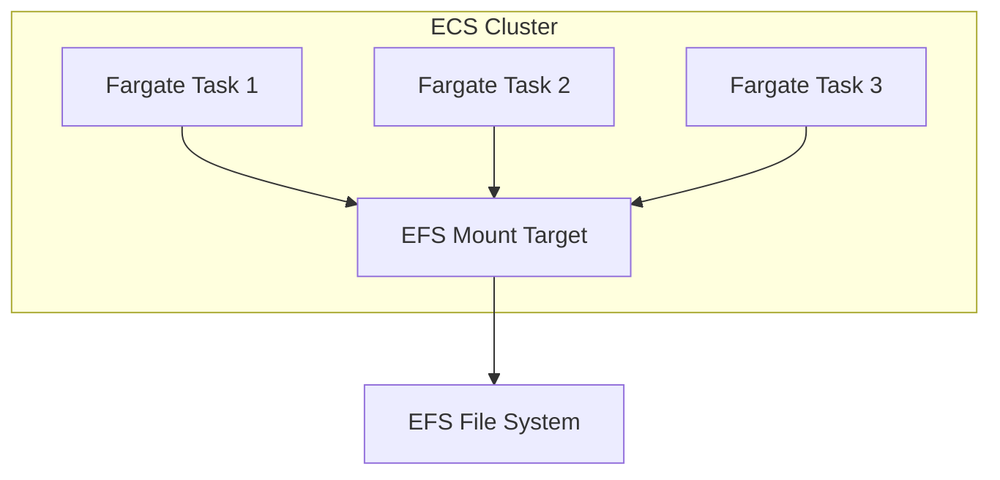

# How to Mount EFS on ECS Fargate Tasks

Author: [nawazdhandala](https://github.com/nawazdhandala)

Tags: AWS, EFS, ECS, Fargate, Containers

Description: Learn how to mount Amazon EFS file systems on ECS Fargate tasks for persistent, shared storage across containerized workloads.

---

One of the biggest complaints about Fargate has always been the lack of persistent storage. Containers are ephemeral by design - when a task stops, its local storage disappears. For stateless applications, that's fine. But many workloads need to persist data between task restarts, share files across multiple tasks, or access large datasets that don't fit in the container image.

EFS support for Fargate solves this. You can mount an EFS file system directly into your Fargate tasks, giving them access to a shared, persistent file system that survives task restarts and works across multiple tasks simultaneously.

## How It Works

When you configure a Fargate task to use EFS, the EFS volume is mounted into the task's container at a path you specify. Under the hood, Fargate uses the EFS mount helper with NFS v4.1 and optionally TLS encryption. Each task gets its own NFS connection, and multiple tasks can read from and write to the same file system concurrently.

The architecture looks like this:



## Prerequisites

You'll need:

1. An EFS file system with mount targets in the subnets where your Fargate tasks run
2. A security group on the EFS mount targets that allows inbound NFS (port 2049) from your Fargate task security group
3. An ECS cluster with Fargate capacity
4. Platform version 1.4.0 or later (this is the default now)

If you don't have an EFS file system yet, see our guide on [creating an Amazon EFS file system](https://oneuptime.com/blog/post/amazon-efs-file-system/view).

## Configuring the Task Definition

EFS volumes are configured in two places in the task definition: the `volumes` section (which defines the EFS connection) and the container's `mountPoints` (which maps the volume into the container's filesystem).

Here's a task definition with EFS:

```json
{
  "family": "web-app-with-efs",
  "networkMode": "awsvpc",
  "requiresCompatibilities": ["FARGATE"],
  "cpu": "256",
  "memory": "512",
  "executionRoleArn": "arn:aws:iam::123456789012:role/ecsTaskExecutionRole",
  "taskRoleArn": "arn:aws:iam::123456789012:role/ecsTaskRole",
  "volumes": [
    {
      "name": "shared-data",
      "efsVolumeConfiguration": {
        "fileSystemId": "fs-0abc123def456789",
        "rootDirectory": "/",
        "transitEncryption": "ENABLED",
        "authorizationConfig": {
          "iam": "ENABLED"
        }
      }
    }
  ],
  "containerDefinitions": [
    {
      "name": "web-app",
      "image": "nginx:latest",
      "essential": true,
      "portMappings": [
        {
          "containerPort": 80,
          "protocol": "tcp"
        }
      ],
      "mountPoints": [
        {
          "sourceVolume": "shared-data",
          "containerPath": "/usr/share/nginx/html",
          "readOnly": false
        }
      ],
      "logConfiguration": {
        "logDriver": "awslogs",
        "options": {
          "awslogs-group": "/ecs/web-app",
          "awslogs-region": "us-east-1",
          "awslogs-stream-prefix": "ecs"
        }
      }
    }
  ]
}
```

Register the task definition:

```bash
# Register the task definition
aws ecs register-task-definition \
  --cli-input-json file://task-definition.json
```

## Using EFS Access Points

Access points provide application-specific entry points into the file system. They're especially useful with Fargate because you can enforce a POSIX user/group and root directory per application.

First, create an access point:

```bash
# Create an access point for the web app
aws efs create-access-point \
  --file-system-id "fs-0abc123def456789" \
  --posix-user "Uid=1000,Gid=1000" \
  --root-directory "Path=/web-app,CreationInfo={OwnerUid=1000,OwnerGid=1000,Permissions=755}" \
  --tags "Key=Name,Value=web-app-access-point"
```

Then reference the access point in your task definition:

```json
{
  "volumes": [
    {
      "name": "app-data",
      "efsVolumeConfiguration": {
        "fileSystemId": "fs-0abc123def456789",
        "transitEncryption": "ENABLED",
        "authorizationConfig": {
          "accessPointId": "fsap-0abc123def456",
          "iam": "ENABLED"
        }
      }
    }
  ]
}
```

For more on access points, check out our post on [EFS access points for application-specific access](https://oneuptime.com/blog/post/efs-access-points-application-specific-access/view).

## IAM Permissions

When using IAM authorization (which you should), the task role needs permissions to mount the EFS file system.

Here's the policy for the ECS task role:

```json
{
  "Version": "2012-10-17",
  "Statement": [
    {
      "Effect": "Allow",
      "Action": [
        "elasticfilesystem:ClientMount",
        "elasticfilesystem:ClientWrite",
        "elasticfilesystem:ClientRootAccess"
      ],
      "Resource": "arn:aws:elasticfilesystem:us-east-1:123456789012:file-system/fs-0abc123def456789",
      "Condition": {
        "StringEquals": {
          "elasticfilesystem:AccessPointArn": "arn:aws:elasticfilesystem:us-east-1:123456789012:access-point/fsap-0abc123def456"
        }
      }
    }
  ]
}
```

If you don't need to restrict to a specific access point, remove the Condition block. If the container only needs read access, remove `ClientWrite` and `ClientRootAccess`.

## Running the Service

Create a service that runs these tasks:

```bash
# Create the ECS service
aws ecs create-service \
  --cluster "my-cluster" \
  --service-name "web-app" \
  --task-definition "web-app-with-efs" \
  --desired-count 3 \
  --launch-type FARGATE \
  --platform-version "1.4.0" \
  --network-configuration '{
    "awsvpcConfiguration": {
      "subnets": ["subnet-0aaaa111", "subnet-0bbbb222"],
      "securityGroups": ["sg-0fargate123"],
      "assignPublicIp": "DISABLED"
    }
  }'
```

All three tasks will mount the same EFS file system. Files created by one task are immediately visible to the others.

## CloudFormation Example

Here's a complete CloudFormation template for an ECS service with EFS:

```yaml
AWSTemplateFormatVersion: '2010-09-09'
Description: ECS Fargate service with EFS

Parameters:
  ClusterArn:
    Type: String
  EFSFileSystemId:
    Type: String
  SubnetIds:
    Type: List<AWS::EC2::Subnet::Id>
  VpcId:
    Type: AWS::EC2::VPC::Id

Resources:
  TaskSecurityGroup:
    Type: AWS::EC2::SecurityGroup
    Properties:
      GroupDescription: Fargate task security group
      VpcId: !Ref VpcId

  # Allow Fargate tasks to reach EFS
  EFSIngressRule:
    Type: AWS::EC2::SecurityGroupIngress
    Properties:
      GroupId: !ImportValue efs-security-group-id
      IpProtocol: tcp
      FromPort: 2049
      ToPort: 2049
      SourceSecurityGroupId: !Ref TaskSecurityGroup

  TaskDefinition:
    Type: AWS::ECS::TaskDefinition
    Properties:
      Family: web-app-efs
      Cpu: '256'
      Memory: '512'
      NetworkMode: awsvpc
      RequiresCompatibilities:
        - FARGATE
      ExecutionRoleArn: !GetAtt ExecutionRole.Arn
      TaskRoleArn: !GetAtt TaskRole.Arn
      Volumes:
        - Name: shared-data
          EFSVolumeConfiguration:
            FilesystemId: !Ref EFSFileSystemId
            TransitEncryption: ENABLED
            AuthorizationConfig:
              IAM: ENABLED
      ContainerDefinitions:
        - Name: web-app
          Image: nginx:latest
          Essential: true
          PortMappings:
            - ContainerPort: 80
          MountPoints:
            - SourceVolume: shared-data
              ContainerPath: /usr/share/nginx/html
              ReadOnly: false

  Service:
    Type: AWS::ECS::Service
    Properties:
      Cluster: !Ref ClusterArn
      TaskDefinition: !Ref TaskDefinition
      DesiredCount: 2
      LaunchType: FARGATE
      PlatformVersion: '1.4.0'
      NetworkConfiguration:
        AwsvpcConfiguration:
          Subnets: !Ref SubnetIds
          SecurityGroups:
            - !Ref TaskSecurityGroup

  TaskRole:
    Type: AWS::IAM::Role
    Properties:
      AssumeRolePolicyDocument:
        Statement:
          - Effect: Allow
            Principal:
              Service: ecs-tasks.amazonaws.com
            Action: sts:AssumeRole
      Policies:
        - PolicyName: efs-access
          PolicyDocument:
            Statement:
              - Effect: Allow
                Action:
                  - elasticfilesystem:ClientMount
                  - elasticfilesystem:ClientWrite
                Resource: !Sub 'arn:aws:elasticfilesystem:${AWS::Region}:${AWS::AccountId}:file-system/${EFSFileSystemId}'

  ExecutionRole:
    Type: AWS::IAM::Role
    Properties:
      AssumeRolePolicyDocument:
        Statement:
          - Effect: Allow
            Principal:
              Service: ecs-tasks.amazonaws.com
            Action: sts:AssumeRole
      ManagedPolicyArns:
        - arn:aws:iam::aws:policy/service-role/AmazonECSTaskExecutionRolePolicy
```

## Common Use Cases

**CMS with shared uploads**: Multiple web server tasks serving the same uploaded files.

**ML model serving**: Store model files on EFS so multiple inference tasks can access them without downloading from S3 each time.

**Log aggregation**: Tasks write logs to EFS where a separate processing task picks them up.

**Configuration sharing**: Store configuration files on EFS and mount them into tasks instead of baking them into container images.

## Performance Considerations

EFS with Fargate performs well for most use cases, but keep these in mind:

- **First access latency**: The first read of a file may be slower as it's fetched from EFS. Subsequent reads benefit from the OS page cache.
- **Throughput**: EFS throughput scales with the size of the file system in bursting mode. If your file system is small but needs high throughput, consider provisioned throughput mode.
- **Metadata operations**: Operations like `ls` on directories with thousands of files can be slow. Structure your data to minimize directory listings.

## Troubleshooting

**Task fails to start with "ResourceInitializationError"**: This usually means the task can't reach the EFS mount target. Check security groups and subnet configuration. The task must run in a subnet that has an EFS mount target.

**Permission denied inside the container**: The container's user might not have permission to read/write the mounted directory. Use EFS access points with a posixUser to set the UID/GID.

**Slow startup**: If your EFS file system has encryption in transit enabled (which it should), TLS handshake adds a small amount of startup latency. This is usually under 2 seconds.

## Wrapping Up

EFS on Fargate gives you persistent, shared storage for containerized workloads without managing any infrastructure. The setup involves defining the EFS volume in your task definition, configuring security groups for NFS access, and setting up IAM permissions. Once it's running, your tasks have a reliable shared file system that works just like a local directory.
