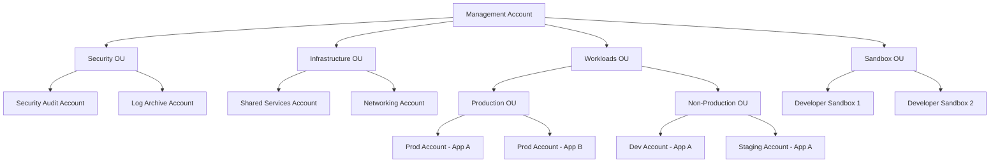

# How to Implement Multi-Account Strategy on AWS

Author: [nawazdhandala](https://github.com/nawazdhandala)

Tags: AWS, Organizations, Multi-Account, Cloud Architecture, Security

Description: A practical guide to implementing a multi-account strategy on AWS using AWS Organizations, SCPs, and cross-account access for security isolation and governance.

---

Running everything in a single AWS account is fine for a hobby project. For anything serious, it's a recipe for trouble. A single account means shared blast radius - one misconfigured IAM policy can affect everything. Shared billing means you can't easily attribute costs. Shared service quotas mean one workload can starve another. And when it's time for an audit, good luck separating production data from development experiments.

A multi-account strategy gives you isolation, governance, and clarity. Let's build one properly.

## Account Structure

The exact number of accounts varies by organization, but the pattern is consistent.



The management account should contain only Organizations configuration and billing. Don't run any workloads in it.

## Setting Up AWS Organizations

This Terraform configuration creates the organizational structure.

```hcl
# AWS Organization
resource "aws_organizations_organization" "org" {
  feature_set = "ALL"

  # Enable AWS service integrations
  aws_service_access_principals = [
    "cloudtrail.amazonaws.com",
    "config.amazonaws.com",
    "guardduty.amazonaws.com",
    "securityhub.amazonaws.com",
    "sso.amazonaws.com",
    "tagpolicies.tag.amazonaws.com",
    "ram.amazonaws.com"
  ]

  enabled_policy_types = [
    "SERVICE_CONTROL_POLICY",
    "TAG_POLICY"
  ]
}

# Organizational Units
resource "aws_organizations_organizational_unit" "security" {
  name      = "Security"
  parent_id = aws_organizations_organization.org.roots[0].id
}

resource "aws_organizations_organizational_unit" "infrastructure" {
  name      = "Infrastructure"
  parent_id = aws_organizations_organization.org.roots[0].id
}

resource "aws_organizations_organizational_unit" "workloads" {
  name      = "Workloads"
  parent_id = aws_organizations_organization.org.roots[0].id
}

resource "aws_organizations_organizational_unit" "production" {
  name      = "Production"
  parent_id = aws_organizations_organizational_unit.workloads.id
}

resource "aws_organizations_organizational_unit" "non_production" {
  name      = "Non-Production"
  parent_id = aws_organizations_organizational_unit.workloads.id
}

resource "aws_organizations_organizational_unit" "sandbox" {
  name      = "Sandbox"
  parent_id = aws_organizations_organization.org.roots[0].id
}
```

## Service Control Policies

SCPs are guardrails that apply to entire OUs. They define the maximum permissions available in an account.

This SCP prevents dangerous actions in production accounts.

```json
{
  "Version": "2012-10-17",
  "Statement": [
    {
      "Sid": "DenyLeavingOrganization",
      "Effect": "Deny",
      "Action": "organizations:LeaveOrganization",
      "Resource": "*"
    },
    {
      "Sid": "DenyDisablingCloudTrail",
      "Effect": "Deny",
      "Action": [
        "cloudtrail:StopLogging",
        "cloudtrail:DeleteTrail"
      ],
      "Resource": "*"
    },
    {
      "Sid": "DenyDisablingGuardDuty",
      "Effect": "Deny",
      "Action": [
        "guardduty:DeleteDetector",
        "guardduty:DisassociateFromMasterAccount"
      ],
      "Resource": "*"
    },
    {
      "Sid": "DenyDeletingFlowLogs",
      "Effect": "Deny",
      "Action": "ec2:DeleteFlowLogs",
      "Resource": "*"
    },
    {
      "Sid": "RequireIMDSv2",
      "Effect": "Deny",
      "Action": "ec2:RunInstances",
      "Resource": "arn:aws:ec2:*:*:instance/*",
      "Condition": {
        "StringNotEquals": {
          "ec2:MetadataHttpTokens": "required"
        }
      }
    },
    {
      "Sid": "DenyPublicS3",
      "Effect": "Deny",
      "Action": [
        "s3:PutBucketPublicAccessBlock",
        "s3:PutAccountPublicAccessBlock"
      ],
      "Resource": "*",
      "Condition": {
        "StringNotEquals": {
          "s3:PublicAccessBlockConfiguration/BlockPublicAcls": "true"
        }
      }
    }
  ]
}
```

For sandbox accounts, you might have a different SCP that restricts which services can be used and limits instance sizes.

```json
{
  "Version": "2012-10-17",
  "Statement": [
    {
      "Sid": "DenyExpensiveInstances",
      "Effect": "Deny",
      "Action": "ec2:RunInstances",
      "Resource": "arn:aws:ec2:*:*:instance/*",
      "Condition": {
        "ForAnyValue:StringNotLike": {
          "ec2:InstanceType": ["t3.*", "t3a.*", "t4g.*"]
        }
      }
    },
    {
      "Sid": "DenyExpensiveRegions",
      "Effect": "Deny",
      "Action": "*",
      "Resource": "*",
      "Condition": {
        "StringNotEquals": {
          "aws:RequestedRegion": ["us-east-1", "us-west-2"]
        }
      }
    }
  ]
}
```

## Cross-Account Access

Teams need to move between accounts. Use IAM Identity Center (SSO) for human access and cross-account IAM roles for service access.

This sets up a cross-account role that allows the CI/CD account to deploy to production.

```hcl
# In the production account
resource "aws_iam_role" "deploy_role" {
  name = "cicd-deploy-role"

  assume_role_policy = jsonencode({
    Version = "2012-10-17"
    Statement = [
      {
        Effect = "Allow"
        Principal = {
          AWS = "arn:aws:iam::${var.cicd_account_id}:role/codebuild-role"
        }
        Action = "sts:AssumeRole"
        Condition = {
          StringEquals = {
            "sts:ExternalId" = var.external_id  # Extra security for cross-account
          }
        }
      }
    ]
  })

  # Limit session duration
  max_session_duration = 3600  # 1 hour
}

resource "aws_iam_role_policy" "deploy_permissions" {
  name = "deploy-permissions"
  role = aws_iam_role.deploy_role.id

  policy = jsonencode({
    Version = "2012-10-17"
    Statement = [
      {
        Effect = "Allow"
        Action = [
          "ecs:UpdateService",
          "ecs:DescribeServices",
          "ecs:RegisterTaskDefinition",
          "codedeploy:CreateDeployment",
          "codedeploy:GetDeployment"
        ]
        Resource = "*"
        Condition = {
          StringEquals = {
            "aws:ResourceTag/Environment" = "production"
          }
        }
      }
    ]
  })
}
```

## Centralized Logging

All accounts should send their logs to a dedicated log archive account that nobody can tamper with.

```hcl
# In the log archive account
resource "aws_s3_bucket" "org_logs" {
  bucket = "${var.org_id}-centralized-logs"
}

resource "aws_s3_bucket_policy" "org_logs" {
  bucket = aws_s3_bucket.org_logs.id

  policy = jsonencode({
    Version = "2012-10-17"
    Statement = [
      {
        Sid    = "AllowOrganizationCloudTrail"
        Effect = "Allow"
        Principal = {
          Service = "cloudtrail.amazonaws.com"
        }
        Action   = "s3:PutObject"
        Resource = "${aws_s3_bucket.org_logs.arn}/cloudtrail/*"
        Condition = {
          StringEquals = {
            "aws:SourceOrgID" = var.org_id
          }
        }
      },
      {
        Sid    = "AllowOrganizationConfig"
        Effect = "Allow"
        Principal = {
          Service = "config.amazonaws.com"
        }
        Action   = "s3:PutObject"
        Resource = "${aws_s3_bucket.org_logs.arn}/config/*"
        Condition = {
          StringEquals = {
            "aws:SourceOrgID" = var.org_id
          }
        }
      }
    ]
  })
}
```

## Account Vending Machine

Automate the creation of new accounts so they're provisioned consistently with all security baselines.

```python
import boto3
import json
import time

def create_account(account_name, email, ou_id):
    """Create a new AWS account with security baselines."""
    org = boto3.client('organizations')

    # Create the account
    response = org.create_account(
        Email=email,
        AccountName=account_name,
        RoleName='OrganizationAccountAccessRole',
        IamUserAccessToBilling='DENY'
    )

    request_id = response['CreateAccountStatus']['Id']

    # Wait for account creation
    while True:
        status = org.describe_create_account_status(
            CreateAccountStatusId=request_id
        )['CreateAccountStatus']

        if status['State'] == 'SUCCEEDED':
            account_id = status['AccountId']
            print(f"Account created: {account_id}")
            break
        elif status['State'] == 'FAILED':
            raise Exception(f"Account creation failed: {status['FailureReason']}")

        time.sleep(10)

    # Move to the correct OU
    roots = org.list_roots()['Roots']
    org.move_account(
        AccountId=account_id,
        SourceParentId=roots[0]['Id'],
        DestinationParentId=ou_id
    )

    # Apply security baselines via CloudFormation StackSets
    cf = boto3.client('cloudformation')
    cf.create_stack_instances(
        StackSetName='security-baseline',
        Accounts=[account_id],
        Regions=['us-east-1'],
        OperationPreferences={
            'MaxConcurrentCount': 1,
            'FailureToleranceCount': 0
        }
    )

    print(f"Account {account_id} created and baseline applied")
    return account_id

# Create a new production account
create_account(
    account_name='app-b-production',
    email='aws-app-b-prod@company.com',
    ou_id='ou-abc123-production'
)
```

## Cost Allocation

With multiple accounts, you can track costs per account, per team, and per project.

```hcl
# Enable cost allocation tags at the organization level
resource "aws_ce_cost_allocation_tag" "environment" {
  tag_key = "Environment"
  status  = "Active"
}

resource "aws_ce_cost_allocation_tag" "team" {
  tag_key = "Team"
  status  = "Active"
}

resource "aws_ce_cost_allocation_tag" "project" {
  tag_key = "Project"
  status  = "Active"
}
```

## Wrapping Up

A multi-account strategy is an investment that pays off quickly. You get better security isolation, clearer cost attribution, and easier governance. The key is automation - don't create accounts manually. Use an account vending machine that applies security baselines automatically.

Start with the basic structure: management, security, log archive, and workload accounts. Then expand as your organization grows. The OUs and SCPs can be adjusted over time, but the foundational separation is hard to retrofit later.

For implementing your landing zone, see our guide on [landing zone best practices on AWS](https://oneuptime.com/blog/post/2026-02-12-landing-zone-best-practices-aws/view). For cost management, check out [cost governance best practices on AWS](https://oneuptime.com/blog/post/2026-02-12-cost-governance-best-practices-aws/view).
