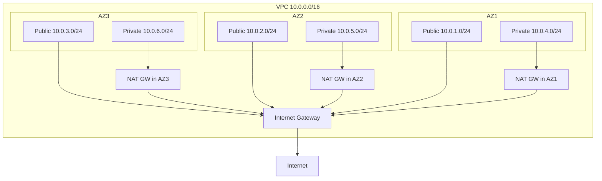

# How to Create a Multi-AZ VPC with CloudFormation

Author: [nawazdhandala](https://github.com/nawazdhandala)

Tags: AWS, VPC, CloudFormation, Infrastructure as Code

Description: Complete CloudFormation template and walkthrough for creating a production-ready multi-AZ VPC with public and private subnets, NAT gateways, and routing.

---

Building a multi-AZ VPC by clicking through the console is tedious and error-prone. With CloudFormation, you define the entire network stack in a template and deploy it consistently every time. This guide provides a production-ready template with public subnets, private subnets, NAT gateways, and proper routing across three availability zones.

## What We're Building

The template creates a standard three-tier network architecture:



Each AZ gets its own NAT gateway for resilience. If one AZ goes down, the other AZs continue functioning independently.

## The Complete Template

Here's the full CloudFormation template:

```yaml
AWSTemplateFormatVersion: '2010-09-09'
Description: Production-ready Multi-AZ VPC with public and private subnets

Parameters:
  EnvironmentName:
    Type: String
    Default: production
    Description: Environment name used for tagging and naming resources

  VpcCidr:
    Type: String
    Default: 10.0.0.0/16
    Description: CIDR block for the VPC

  PublicSubnet1Cidr:
    Type: String
    Default: 10.0.1.0/24
    Description: CIDR for public subnet in AZ1

  PublicSubnet2Cidr:
    Type: String
    Default: 10.0.2.0/24
    Description: CIDR for public subnet in AZ2

  PublicSubnet3Cidr:
    Type: String
    Default: 10.0.3.0/24
    Description: CIDR for public subnet in AZ3

  PrivateSubnet1Cidr:
    Type: String
    Default: 10.0.4.0/24
    Description: CIDR for private subnet in AZ1

  PrivateSubnet2Cidr:
    Type: String
    Default: 10.0.5.0/24
    Description: CIDR for private subnet in AZ2

  PrivateSubnet3Cidr:
    Type: String
    Default: 10.0.6.0/24
    Description: CIDR for private subnet in AZ3

  EnableNatGateway:
    Type: String
    Default: 'true'
    AllowedValues: ['true', 'false']
    Description: Whether to create NAT gateways (costs ~$32/month each)

  SingleNatGateway:
    Type: String
    Default: 'false'
    AllowedValues: ['true', 'false']
    Description: Use a single NAT gateway instead of one per AZ (saves money but reduces HA)

Conditions:
  CreateNatGateways: !Equals [!Ref EnableNatGateway, 'true']
  CreateMultipleNatGateways:
    !And
      - !Equals [!Ref EnableNatGateway, 'true']
      - !Equals [!Ref SingleNatGateway, 'false']

Resources:
  # VPC
  VPC:
    Type: AWS::EC2::VPC
    Properties:
      CidrBlock: !Ref VpcCidr
      EnableDnsSupport: true
      EnableDnsHostnames: true
      Tags:
        - Key: Name
          Value: !Sub '${EnvironmentName}-vpc'

  # Internet Gateway
  InternetGateway:
    Type: AWS::EC2::InternetGateway
    Properties:
      Tags:
        - Key: Name
          Value: !Sub '${EnvironmentName}-igw'

  InternetGatewayAttachment:
    Type: AWS::EC2::VPCGatewayAttachment
    Properties:
      InternetGatewayId: !Ref InternetGateway
      VpcId: !Ref VPC

  # Public Subnets
  PublicSubnet1:
    Type: AWS::EC2::Subnet
    Properties:
      VpcId: !Ref VPC
      AvailabilityZone: !Select [0, !GetAZs '']
      CidrBlock: !Ref PublicSubnet1Cidr
      MapPublicIpOnLaunch: true
      Tags:
        - Key: Name
          Value: !Sub '${EnvironmentName}-public-1'
        - Key: kubernetes.io/role/elb
          Value: '1'

  PublicSubnet2:
    Type: AWS::EC2::Subnet
    Properties:
      VpcId: !Ref VPC
      AvailabilityZone: !Select [1, !GetAZs '']
      CidrBlock: !Ref PublicSubnet2Cidr
      MapPublicIpOnLaunch: true
      Tags:
        - Key: Name
          Value: !Sub '${EnvironmentName}-public-2'
        - Key: kubernetes.io/role/elb
          Value: '1'

  PublicSubnet3:
    Type: AWS::EC2::Subnet
    Properties:
      VpcId: !Ref VPC
      AvailabilityZone: !Select [2, !GetAZs '']
      CidrBlock: !Ref PublicSubnet3Cidr
      MapPublicIpOnLaunch: true
      Tags:
        - Key: Name
          Value: !Sub '${EnvironmentName}-public-3'
        - Key: kubernetes.io/role/elb
          Value: '1'

  # Private Subnets
  PrivateSubnet1:
    Type: AWS::EC2::Subnet
    Properties:
      VpcId: !Ref VPC
      AvailabilityZone: !Select [0, !GetAZs '']
      CidrBlock: !Ref PrivateSubnet1Cidr
      Tags:
        - Key: Name
          Value: !Sub '${EnvironmentName}-private-1'
        - Key: kubernetes.io/role/internal-elb
          Value: '1'

  PrivateSubnet2:
    Type: AWS::EC2::Subnet
    Properties:
      VpcId: !Ref VPC
      AvailabilityZone: !Select [1, !GetAZs '']
      CidrBlock: !Ref PrivateSubnet2Cidr
      Tags:
        - Key: Name
          Value: !Sub '${EnvironmentName}-private-2'
        - Key: kubernetes.io/role/internal-elb
          Value: '1'

  PrivateSubnet3:
    Type: AWS::EC2::Subnet
    Properties:
      VpcId: !Ref VPC
      AvailabilityZone: !Select [2, !GetAZs '']
      CidrBlock: !Ref PrivateSubnet3Cidr
      Tags:
        - Key: Name
          Value: !Sub '${EnvironmentName}-private-3'
        - Key: kubernetes.io/role/internal-elb
          Value: '1'

  # Elastic IPs for NAT Gateways
  NatGateway1EIP:
    Type: AWS::EC2::EIP
    Condition: CreateNatGateways
    DependsOn: InternetGatewayAttachment
    Properties:
      Domain: vpc
      Tags:
        - Key: Name
          Value: !Sub '${EnvironmentName}-nat-eip-1'

  NatGateway2EIP:
    Type: AWS::EC2::EIP
    Condition: CreateMultipleNatGateways
    DependsOn: InternetGatewayAttachment
    Properties:
      Domain: vpc
      Tags:
        - Key: Name
          Value: !Sub '${EnvironmentName}-nat-eip-2'

  NatGateway3EIP:
    Type: AWS::EC2::EIP
    Condition: CreateMultipleNatGateways
    DependsOn: InternetGatewayAttachment
    Properties:
      Domain: vpc
      Tags:
        - Key: Name
          Value: !Sub '${EnvironmentName}-nat-eip-3'

  # NAT Gateways
  NatGateway1:
    Type: AWS::EC2::NatGateway
    Condition: CreateNatGateways
    Properties:
      AllocationId: !GetAtt NatGateway1EIP.AllocationId
      SubnetId: !Ref PublicSubnet1
      Tags:
        - Key: Name
          Value: !Sub '${EnvironmentName}-nat-1'

  NatGateway2:
    Type: AWS::EC2::NatGateway
    Condition: CreateMultipleNatGateways
    Properties:
      AllocationId: !GetAtt NatGateway2EIP.AllocationId
      SubnetId: !Ref PublicSubnet2
      Tags:
        - Key: Name
          Value: !Sub '${EnvironmentName}-nat-2'

  NatGateway3:
    Type: AWS::EC2::NatGateway
    Condition: CreateMultipleNatGateways
    Properties:
      AllocationId: !GetAtt NatGateway3EIP.AllocationId
      SubnetId: !Ref PublicSubnet3
      Tags:
        - Key: Name
          Value: !Sub '${EnvironmentName}-nat-3'

  # Public Route Table
  PublicRouteTable:
    Type: AWS::EC2::RouteTable
    Properties:
      VpcId: !Ref VPC
      Tags:
        - Key: Name
          Value: !Sub '${EnvironmentName}-public-rt'

  DefaultPublicRoute:
    Type: AWS::EC2::Route
    DependsOn: InternetGatewayAttachment
    Properties:
      RouteTableId: !Ref PublicRouteTable
      DestinationCidrBlock: 0.0.0.0/0
      GatewayId: !Ref InternetGateway

  PublicSubnet1RouteTableAssociation:
    Type: AWS::EC2::SubnetRouteTableAssociation
    Properties:
      RouteTableId: !Ref PublicRouteTable
      SubnetId: !Ref PublicSubnet1

  PublicSubnet2RouteTableAssociation:
    Type: AWS::EC2::SubnetRouteTableAssociation
    Properties:
      RouteTableId: !Ref PublicRouteTable
      SubnetId: !Ref PublicSubnet2

  PublicSubnet3RouteTableAssociation:
    Type: AWS::EC2::SubnetRouteTableAssociation
    Properties:
      RouteTableId: !Ref PublicRouteTable
      SubnetId: !Ref PublicSubnet3

  # Private Route Tables (one per AZ for NAT gateway isolation)
  PrivateRouteTable1:
    Type: AWS::EC2::RouteTable
    Properties:
      VpcId: !Ref VPC
      Tags:
        - Key: Name
          Value: !Sub '${EnvironmentName}-private-rt-1'

  DefaultPrivateRoute1:
    Type: AWS::EC2::Route
    Condition: CreateNatGateways
    Properties:
      RouteTableId: !Ref PrivateRouteTable1
      DestinationCidrBlock: 0.0.0.0/0
      NatGatewayId: !Ref NatGateway1

  PrivateSubnet1RouteTableAssociation:
    Type: AWS::EC2::SubnetRouteTableAssociation
    Properties:
      RouteTableId: !Ref PrivateRouteTable1
      SubnetId: !Ref PrivateSubnet1

  PrivateRouteTable2:
    Type: AWS::EC2::RouteTable
    Properties:
      VpcId: !Ref VPC
      Tags:
        - Key: Name
          Value: !Sub '${EnvironmentName}-private-rt-2'

  DefaultPrivateRoute2:
    Type: AWS::EC2::Route
    Condition: CreateMultipleNatGateways
    Properties:
      RouteTableId: !Ref PrivateRouteTable2
      DestinationCidrBlock: 0.0.0.0/0
      NatGatewayId: !Ref NatGateway2

  PrivateSubnet2RouteTableAssociation:
    Type: AWS::EC2::SubnetRouteTableAssociation
    Properties:
      RouteTableId: !Ref PrivateRouteTable2
      SubnetId: !Ref PrivateSubnet2

  PrivateRouteTable3:
    Type: AWS::EC2::RouteTable
    Properties:
      VpcId: !Ref VPC
      Tags:
        - Key: Name
          Value: !Sub '${EnvironmentName}-private-rt-3'

  DefaultPrivateRoute3:
    Type: AWS::EC2::Route
    Condition: CreateMultipleNatGateways
    Properties:
      RouteTableId: !Ref PrivateRouteTable3
      DestinationCidrBlock: 0.0.0.0/0
      NatGatewayId: !Ref NatGateway3

  PrivateSubnet3RouteTableAssociation:
    Type: AWS::EC2::SubnetRouteTableAssociation
    Properties:
      RouteTableId: !Ref PrivateRouteTable3
      SubnetId: !Ref PrivateSubnet3

  # VPC Flow Logs
  FlowLogGroup:
    Type: AWS::Logs::LogGroup
    Properties:
      LogGroupName: !Sub '/vpc/${EnvironmentName}/flow-logs'
      RetentionInDays: 14

  FlowLogRole:
    Type: AWS::IAM::Role
    Properties:
      AssumeRolePolicyDocument:
        Version: '2012-10-17'
        Statement:
          - Effect: Allow
            Principal:
              Service: vpc-flow-logs.amazonaws.com
            Action: sts:AssumeRole
      Policies:
        - PolicyName: FlowLogPolicy
          PolicyDocument:
            Version: '2012-10-17'
            Statement:
              - Effect: Allow
                Action:
                  - logs:CreateLogStream
                  - logs:PutLogEvents
                  - logs:DescribeLogGroups
                  - logs:DescribeLogStreams
                Resource: '*'

  VPCFlowLog:
    Type: AWS::EC2::FlowLog
    Properties:
      ResourceId: !Ref VPC
      ResourceType: VPC
      TrafficType: ALL
      LogGroupName: !Ref FlowLogGroup
      DeliverLogsPermissionArn: !GetAtt FlowLogRole.Arn

Outputs:
  VpcId:
    Description: VPC ID
    Value: !Ref VPC
    Export:
      Name: !Sub '${EnvironmentName}-VpcId'

  PublicSubnets:
    Description: Public subnet IDs
    Value: !Join [',', [!Ref PublicSubnet1, !Ref PublicSubnet2, !Ref PublicSubnet3]]
    Export:
      Name: !Sub '${EnvironmentName}-PublicSubnets'

  PrivateSubnets:
    Description: Private subnet IDs
    Value: !Join [',', [!Ref PrivateSubnet1, !Ref PrivateSubnet2, !Ref PrivateSubnet3]]
    Export:
      Name: !Sub '${EnvironmentName}-PrivateSubnets'

  VpcCidrBlock:
    Description: VPC CIDR block
    Value: !GetAtt VPC.CidrBlock
    Export:
      Name: !Sub '${EnvironmentName}-VpcCidr'
```

## Deploying the Stack

```bash
# Deploy with default settings (3 NAT gateways, full HA)
aws cloudformation create-stack \
  --stack-name production-vpc \
  --template-body file://vpc-template.yaml \
  --parameters \
    ParameterKey=EnvironmentName,ParameterValue=production \
  --capabilities CAPABILITY_IAM

# Deploy with a single NAT gateway (saves ~$64/month)
aws cloudformation create-stack \
  --stack-name staging-vpc \
  --template-body file://vpc-template.yaml \
  --parameters \
    ParameterKey=EnvironmentName,ParameterValue=staging \
    ParameterKey=SingleNatGateway,ParameterValue=true \
  --capabilities CAPABILITY_IAM

# Deploy without NAT gateways (dev environment)
aws cloudformation create-stack \
  --stack-name dev-vpc \
  --template-body file://vpc-template.yaml \
  --parameters \
    ParameterKey=EnvironmentName,ParameterValue=dev \
    ParameterKey=EnableNatGateway,ParameterValue=false \
  --capabilities CAPABILITY_IAM
```

Monitor the deployment:

```bash
# Watch stack creation progress
aws cloudformation describe-stack-events \
  --stack-name production-vpc \
  --query 'StackEvents[?ResourceStatus!=`CREATE_COMPLETE`].{Resource:LogicalResourceId,Status:ResourceStatus,Reason:ResourceStatusReason}' \
  --output table
```

## Using the Exported Values

The template exports VPC and subnet IDs so other stacks can reference them:

```yaml
# In another CloudFormation template
Resources:
  MyALB:
    Type: AWS::ElasticLoadBalancingV2::LoadBalancer
    Properties:
      Subnets: !Split [',', !ImportValue 'production-PublicSubnets']
      SecurityGroups:
        - !Ref ALBSecurityGroup

  MyECSService:
    Type: AWS::ECS::Service
    Properties:
      NetworkConfiguration:
        AwsvpcConfiguration:
          Subnets: !Split [',', !ImportValue 'production-PrivateSubnets']
```

## Cost Breakdown

NAT gateways are the main cost driver:

- 3 NAT gateways: ~$97/month ($0.045/hour each)
- 1 NAT gateway: ~$32/month
- 0 NAT gateways: $0 (but private subnets can't reach the internet)

The VPC, subnets, route tables, and internet gateway are free.

## Summary

This CloudFormation template creates a production-ready multi-AZ VPC with configurable NAT gateway options. The key design decisions - separate route tables per AZ, NAT gateways in public subnets, Kubernetes-compatible subnet tags, and VPC flow logs - reflect real-world requirements. Use the parameterized NAT gateway options to balance cost and availability across environments. Export the resource IDs so other stacks can easily reference the network infrastructure.
