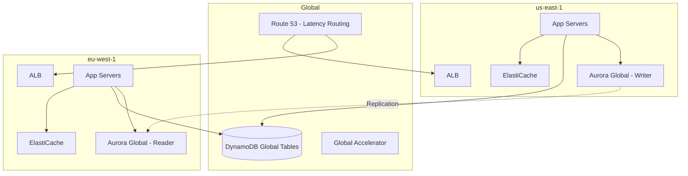

# How to Set Up Multi-Region Active-Active Architecture on AWS

Author: [nawazdhandala](https://github.com/nawazdhandala)

Tags: AWS, Multi-Region, Active-Active, High Availability, Disaster Recovery

Description: A detailed walkthrough of building a multi-region active-active architecture on AWS that serves traffic from multiple regions simultaneously.

---

Active-active multi-region is the gold standard of cloud architecture. Both (or all) regions are handling production traffic at the same time. If one goes down, the others keep serving without any failover delay. Users get routed to the closest region, so latency is lower. Sounds great, right? It is - but it's also one of the hardest things to get right in distributed systems.

The main challenge isn't the infrastructure. AWS gives you the tools. The hard part is data. Specifically, how do you keep data consistent across regions when writes can happen in any of them simultaneously? Let's work through a practical setup.

## Architecture Overview



## Step 1: Global DNS with Route 53

Route 53 is the entry point. Use latency-based routing to direct users to the nearest region.

```bash
# Create a health check for each region's ALB
aws route53 create-health-check \
  --caller-reference "us-east-1-health-$(date +%s)" \
  --health-check-config '{
    "Type": "HTTPS",
    "FullyQualifiedDomainName": "us-east-1-alb.example.com",
    "Port": 443,
    "ResourcePath": "/health",
    "RequestInterval": 10,
    "FailureThreshold": 2
  }'

# Create latency-based routing records
aws route53 change-resource-record-sets \
  --hosted-zone-id "Z123" \
  --change-batch '{
    "Changes": [
      {
        "Action": "CREATE",
        "ResourceRecordSet": {
          "Name": "api.example.com",
          "Type": "A",
          "SetIdentifier": "us-east-1",
          "Region": "us-east-1",
          "HealthCheckId": "health-check-us-east-1",
          "AliasTarget": {
            "HostedZoneId": "Z35SXDOTRQ7X7K",
            "DNSName": "us-east-1-alb.elb.amazonaws.com",
            "EvaluateTargetHealth": true
          }
        }
      },
      {
        "Action": "CREATE",
        "ResourceRecordSet": {
          "Name": "api.example.com",
          "Type": "A",
          "SetIdentifier": "eu-west-1",
          "Region": "eu-west-1",
          "HealthCheckId": "health-check-eu-west-1",
          "AliasTarget": {
            "HostedZoneId": "Z32O12XQLNTSW2",
            "DNSName": "eu-west-1-alb.elb.amazonaws.com",
            "EvaluateTargetHealth": true
          }
        }
      }
    ]
  }'
```

When one region's health check fails, Route 53 stops routing traffic there. The DNS TTL determines how fast this happens - set it low (60 seconds) for faster failover.

## Step 2: The Data Layer - The Hard Part

For active-active, you need data stores that handle multi-region writes. You have several options, each with trade-offs.

### Option A: DynamoDB Global Tables

DynamoDB Global Tables give you multi-region, multi-active replication with eventual consistency. Writes in any region replicate to all other regions, typically within a second.

```bash
# Create a DynamoDB table with global tables enabled
aws dynamodb create-table \
  --table-name "users" \
  --attribute-definitions \
    AttributeName=user_id,AttributeType=S \
  --key-schema \
    AttributeName=user_id,KeyType=HASH \
  --billing-mode PAY_PER_REQUEST \
  --stream-specification StreamEnabled=true,StreamViewType=NEW_AND_OLD_IMAGES

# Add a replica in eu-west-1
aws dynamodb update-table \
  --table-name "users" \
  --replica-updates '[{"Create": {"RegionName": "eu-west-1"}}]'
```

The catch: if two regions write to the same item at nearly the same time, last-writer-wins. For most applications, this is fine. For financial transactions, it's not.

### Option B: Aurora Global Database

Aurora Global Database gives you one write region and up to five read replicas in other regions. Replication lag is typically under a second.

```bash
# Create the Aurora global cluster
aws rds create-global-cluster \
  --global-cluster-identifier "my-global-db" \
  --engine "aurora-postgresql" \
  --engine-version "15.4"

# Create the primary cluster in us-east-1
aws rds create-db-cluster \
  --db-cluster-identifier "primary-cluster" \
  --engine "aurora-postgresql" \
  --engine-version "15.4" \
  --master-username "admin" \
  --master-user-password "your-password" \
  --global-cluster-identifier "my-global-db" \
  --region "us-east-1"

# Add a secondary cluster in eu-west-1
aws rds create-db-cluster \
  --db-cluster-identifier "secondary-cluster" \
  --engine "aurora-postgresql" \
  --engine-version "15.4" \
  --global-cluster-identifier "my-global-db" \
  --region "eu-west-1"
```

For true active-active with Aurora, you can use write forwarding. Reads happen locally, and writes from secondary regions get forwarded to the primary.

```python
import psycopg2

# Application code that handles multi-region database access
class MultiRegionDB:
    def __init__(self, local_reader_endpoint, writer_endpoint):
        self.reader = psycopg2.connect(host=local_reader_endpoint, dbname='app')
        self.writer = psycopg2.connect(host=writer_endpoint, dbname='app')

    def read(self, query, params=None):
        # Reads go to the local replica - fast
        cursor = self.reader.cursor()
        cursor.execute(query, params)
        return cursor.fetchall()

    def write(self, query, params=None):
        # Writes go to the primary region
        # With write forwarding enabled, this is handled automatically
        cursor = self.writer.cursor()
        cursor.execute(query, params)
        self.writer.commit()
```

## Step 3: Application Layer

Deploy identical application stacks in each region. Use infrastructure as code to keep them in sync.

```yaml
# CloudFormation template (deploy in each region)
AWSTemplateFormatVersion: '2010-09-09'
Description: Active-active application stack

Parameters:
  Region:
    Type: String
    AllowedValues: [us-east-1, eu-west-1]

Resources:
  AppAutoScalingGroup:
    Type: AWS::AutoScaling::AutoScalingGroup
    Properties:
      MinSize: 2
      MaxSize: 10
      DesiredCapacity: 3
      VPCZoneIdentifier:
        - !Ref PrivateSubnet1
        - !Ref PrivateSubnet2
      LaunchTemplate:
        LaunchTemplateId: !Ref AppLaunchTemplate
        Version: !GetAtt AppLaunchTemplate.LatestVersionNumber
      TargetGroupARNs:
        - !Ref AppTargetGroup

  AppLaunchTemplate:
    Type: AWS::EC2::LaunchTemplate
    Properties:
      LaunchTemplateData:
        ImageId: !FindInMap [RegionMap, !Ref "AWS::Region", AMI]
        InstanceType: c5.xlarge
        UserData:
          Fn::Base64: !Sub |
            #!/bin/bash
            # Pull latest application code
            aws s3 cp s3://deploy-bucket/app-latest.tar.gz /opt/app/
            cd /opt/app && tar xzf app-latest.tar.gz
            # Set region-specific config
            export AWS_REGION=${AWS::Region}
            export APP_ROLE=active
            # Start the application
            systemctl start myapp
```

## Step 4: Session Management

Users might get routed to different regions on subsequent requests. Sessions need to be accessible from any region.

```python
import boto3
import json
import uuid

# Use DynamoDB Global Tables for session storage
dynamodb = boto3.resource('dynamodb')
sessions_table = dynamodb.Table('sessions')  # Global table

def create_session(user_id):
    session_id = str(uuid.uuid4())
    sessions_table.put_item(Item={
        'session_id': session_id,
        'user_id': user_id,
        'created_at': int(time.time()),
        'ttl': int(time.time()) + 86400  # 24-hour expiry
    })
    return session_id

def get_session(session_id):
    response = sessions_table.get_item(
        Key={'session_id': session_id},
        ConsistentRead=False  # eventually consistent is fine for sessions
    )
    return response.get('Item')
```

## Step 5: Conflict Resolution Strategy

With writes happening in multiple regions, you need a conflict resolution strategy. Here are common approaches:

1. **Last writer wins** - Simplest. DynamoDB Global Tables do this by default.
2. **Region affinity** - Route each user to a "home" region for writes. Reads can go anywhere.
3. **CRDT-based** - Use conflict-free replicated data types for data that must merge cleanly.

Here's the region affinity pattern.

```python
import hashlib

def get_home_region(user_id):
    # Deterministically assign users to a home region based on their ID
    regions = ['us-east-1', 'eu-west-1']
    hash_val = int(hashlib.md5(user_id.encode()).hexdigest(), 16)
    return regions[hash_val % len(regions)]

def handle_write(user_id, data):
    home_region = get_home_region(user_id)
    current_region = os.environ['AWS_REGION']

    if current_region == home_region:
        # Write locally
        write_to_db(data)
    else:
        # Forward to home region via SQS or direct API call
        forward_write(home_region, user_id, data)
```

## Step 6: Monitoring and Observability

Active-active architectures need robust monitoring. You should track:

- Replication lag between regions
- Per-region error rates and latency
- Health check status
- Data consistency drift

```bash
# Monitor DynamoDB replication lag
aws cloudwatch get-metric-statistics \
  --namespace "AWS/DynamoDB" \
  --metric-name "ReplicationLatency" \
  --dimensions "Name=TableName,Value=users" "Name=ReceivingRegion,Value=eu-west-1" \
  --start-time "2026-02-12T00:00:00Z" \
  --end-time "2026-02-12T23:59:59Z" \
  --period 300 \
  --statistics "Average" "Maximum"
```

For comprehensive cross-region monitoring, [OneUptime](https://oneuptime.com/blog/post/aws-cloudwatch-logs-setup/view) can aggregate metrics from all your regions into a single dashboard.

## Common Pitfalls

- **Forgetting about data locality laws** - GDPR might prevent EU user data from being replicated to US regions.
- **Ignoring replication lag in application logic** - A user writes in region A, gets routed to region B on the next request, and their write isn't there yet. Build read-after-write consistency into your app logic.
- **Not testing regional failures** - Regularly kill one region in your staging environment to verify failover works.
- **Underestimating cross-region data transfer costs** - Replication isn't free. Calculate the cost based on your write volume.

## Wrapping Up

Multi-region active-active is the most resilient architecture you can build on AWS, but it comes with real complexity. Start by getting your data strategy right - that's where most teams struggle. DynamoDB Global Tables are the easiest path for key-value data. Aurora Global Database works for relational workloads. Once the data layer is solid, the compute and networking pieces fall into place relatively easily. Don't attempt this unless you truly need it - an [active-passive setup](https://oneuptime.com/blog/post/2026-02-12-multi-region-active-passive-pilot-light-aws/view) covers most disaster recovery requirements with much less complexity.
