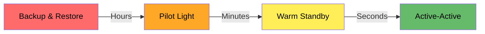
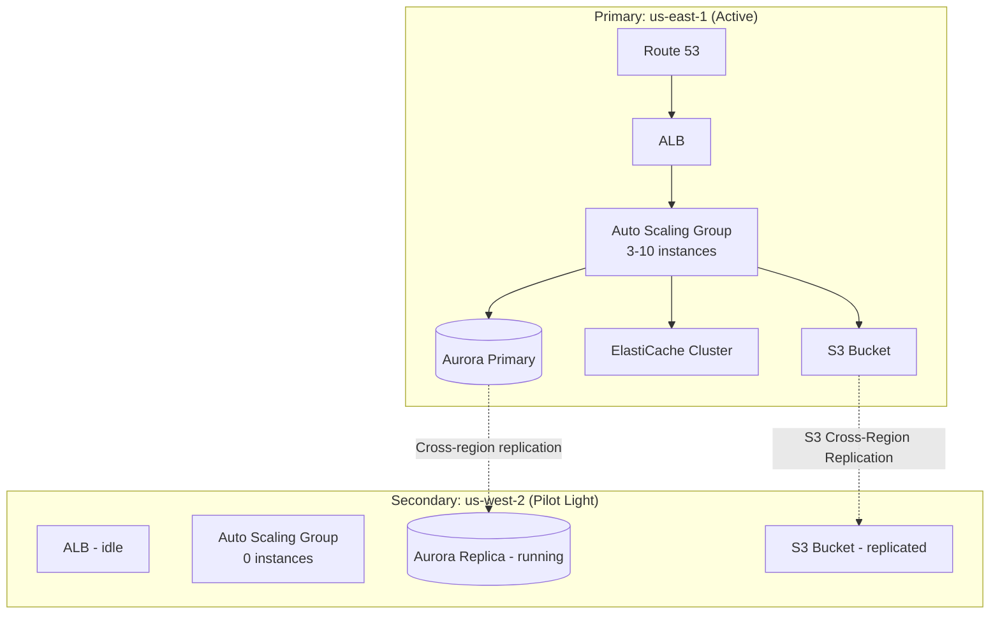

# How to Set Up Multi-Region Active-Passive (Pilot Light) on AWS

Author: [nawazdhandala](https://github.com/nawazdhandala)

Tags: AWS, Disaster Recovery, Pilot Light, Multi-Region, High Availability

Description: Learn how to implement a pilot light disaster recovery strategy on AWS where a minimal standby environment is ready to scale up during regional failures.

---

Not every application needs active-active multi-region architecture. For most businesses, what you really need is the confidence that if an entire AWS region goes down, you can get back up and running quickly without losing data. That's where the pilot light strategy comes in.

The concept is simple: keep a minimal, always-running copy of your critical infrastructure in a secondary region. The data is being continuously replicated, but the compute resources are either stopped or scaled to near-zero. When disaster strikes, you "light the pilot" - scale up the compute, flip DNS, and start serving traffic from the backup region.

It's a middle ground between doing nothing (and hoping for the best) and running a full active-active setup (which costs double). You get a recovery time of minutes to tens of minutes, at a fraction of the active-active cost.

## Pilot Light vs. Other DR Strategies

AWS defines four DR strategies, ordered by recovery speed and cost:



- **Backup & Restore** - Just backups. Recovery takes hours.
- **Pilot Light** - Data replicated, minimal compute. Recovery in minutes.
- **Warm Standby** - Scaled-down but running copy. Recovery in seconds to minutes.
- **Active-Active** - Both regions fully running. Near-instant failover.

Pilot light hits a sweet spot for many organizations. Your data is always current (continuous replication), and your recovery time is measured in minutes rather than hours.

## Architecture

Here's what the pilot light setup looks like.



The key elements in the secondary region are:

- Aurora read replica (always running, receiving replicated data)
- S3 buckets with cross-region replication enabled
- AMIs and launch templates ready to go
- Auto Scaling Group configured but scaled to zero
- ALB configured but with no healthy targets

## Step 1: Set Up Data Replication

Data replication is the foundation. If your data isn't current in the DR region, nothing else matters.

### Aurora Cross-Region Replica

```bash
# Create an Aurora global database
aws rds create-global-cluster \
  --global-cluster-identifier "app-global-db" \
  --source-db-cluster-identifier "arn:aws:rds:us-east-1:123456789:cluster:primary-cluster" \
  --engine "aurora-postgresql"

# Add a secondary cluster in us-west-2
aws rds create-db-cluster \
  --db-cluster-identifier "dr-cluster" \
  --engine "aurora-postgresql" \
  --engine-version "15.4" \
  --global-cluster-identifier "app-global-db" \
  --region "us-west-2"

# Add an instance to the secondary cluster
aws rds create-db-instance \
  --db-instance-identifier "dr-instance-1" \
  --db-cluster-identifier "dr-cluster" \
  --db-instance-class "db.r5.large" \
  --engine "aurora-postgresql" \
  --region "us-west-2"
```

Aurora global database replication lag is typically under a second. That means you'll lose at most a second of data during failover.

### S3 Cross-Region Replication

```bash
# Enable versioning on both buckets (required for replication)
aws s3api put-bucket-versioning \
  --bucket "app-assets-us-east-1" \
  --versioning-configuration Status=Enabled

aws s3api put-bucket-versioning \
  --bucket "app-assets-us-west-2" \
  --versioning-configuration Status=Enabled \
  --region us-west-2

# Set up replication rule
aws s3api put-bucket-replication \
  --bucket "app-assets-us-east-1" \
  --replication-configuration '{
    "Role": "arn:aws:iam::123456789:role/S3ReplicationRole",
    "Rules": [
      {
        "Status": "Enabled",
        "Priority": 1,
        "Filter": {},
        "Destination": {
          "Bucket": "arn:aws:s3:::app-assets-us-west-2",
          "StorageClass": "STANDARD"
        },
        "DeleteMarkerReplication": {"Status": "Enabled"}
      }
    ]
  }'
```

### DynamoDB Global Tables (if applicable)

```bash
# Add a replica to your DynamoDB table
aws dynamodb update-table \
  --table-name "app-sessions" \
  --replica-updates '[{"Create": {"RegionName": "us-west-2"}}]'
```

## Step 2: Prepare the Compute Layer (But Don't Run It)

Create everything needed to run the application in the DR region, but keep it dormant.

```bash
# Copy AMIs to the DR region
aws ec2 copy-image \
  --source-image-id "ami-primary123" \
  --source-region "us-east-1" \
  --region "us-west-2" \
  --name "app-server-dr-copy"

# Create a launch template in the DR region
aws ec2 create-launch-template \
  --launch-template-name "app-server-dr" \
  --launch-template-data '{
    "ImageId": "ami-dr-copy123",
    "InstanceType": "c5.xlarge",
    "KeyName": "dr-key",
    "SecurityGroupIds": ["sg-dr-abc123"],
    "UserData": "base64-encoded-startup-script"
  }' \
  --region "us-west-2"

# Create an Auto Scaling Group with 0 desired capacity
aws autoscaling create-auto-scaling-group \
  --auto-scaling-group-name "app-dr-asg" \
  --launch-template "LaunchTemplateName=app-server-dr,Version=\$Latest" \
  --min-size 0 \
  --max-size 10 \
  --desired-capacity 0 \
  --vpc-zone-identifier "subnet-dr-1,subnet-dr-2" \
  --target-group-arns "arn:aws:elasticloadbalancing:us-west-2:123456789:targetgroup/dr-targets/abc" \
  --region "us-west-2"
```

## Step 3: Build the Failover Automation

When disaster strikes, you don't want to be running CLI commands manually. Automate the failover process.

This Lambda function handles the entire failover sequence.

```python
import boto3
import time

def failover_handler(event, context):
    """
    Automated failover to DR region.
    Triggered by CloudWatch alarm or manual invocation.
    """
    dr_region = 'us-west-2'

    # Step 1: Promote Aurora secondary to standalone
    rds = boto3.client('rds', region_name=dr_region)
    print("Promoting Aurora DR cluster to primary...")
    rds.failover_global_cluster(
        GlobalClusterIdentifier='app-global-db',
        TargetDbClusterIdentifier='arn:aws:rds:us-west-2:123456789:cluster:dr-cluster'
    )

    # Step 2: Scale up the compute
    asg = boto3.client('autoscaling', region_name=dr_region)
    print("Scaling up DR Auto Scaling Group...")
    asg.update_auto_scaling_group(
        AutoScalingGroupName='app-dr-asg',
        MinSize=2,
        DesiredCapacity=3,
        MaxSize=10
    )

    # Step 3: Wait for instances to be healthy
    elbv2 = boto3.client('elbv2', region_name=dr_region)
    print("Waiting for targets to become healthy...")
    waiter = elbv2.get_waiter('target_in_service')
    waiter.wait(
        TargetGroupArn='arn:aws:elasticloadbalancing:us-west-2:123456789:targetgroup/dr-targets/abc',
        WaiterConfig={'Delay': 15, 'MaxAttempts': 40}
    )

    # Step 4: Update Route 53 to point to DR region
    route53 = boto3.client('route53')
    print("Updating DNS to DR region...")
    route53.change_resource_record_sets(
        HostedZoneId='Z123',
        ChangeBatch={
            'Changes': [{
                'Action': 'UPSERT',
                'ResourceRecordSet': {
                    'Name': 'api.example.com',
                    'Type': 'A',
                    'AliasTarget': {
                        'HostedZoneId': 'Z1H1FL5HABSF5',
                        'DNSName': 'dr-alb.us-west-2.elb.amazonaws.com',
                        'EvaluateTargetHealth': True
                    }
                }
            }]
        }
    )

    print("Failover complete!")
    return {'status': 'failover_complete', 'region': dr_region}
```

## Step 4: Set Up Automated Detection

Use Route 53 health checks and CloudWatch alarms to detect when the primary region is unhealthy.

```bash
# Create a Route 53 health check for the primary region
aws route53 create-health-check \
  --caller-reference "primary-health-$(date +%s)" \
  --health-check-config '{
    "Type": "HTTPS",
    "FullyQualifiedDomainName": "primary-alb.us-east-1.elb.amazonaws.com",
    "Port": 443,
    "ResourcePath": "/health",
    "RequestInterval": 10,
    "FailureThreshold": 3,
    "EnableSNI": true
  }'

# Create a CloudWatch alarm that triggers failover
aws cloudwatch put-metric-alarm \
  --alarm-name "primary-region-down" \
  --metric-name "HealthCheckStatus" \
  --namespace "AWS/Route53" \
  --statistic "Minimum" \
  --period 60 \
  --evaluation-periods 3 \
  --threshold 1 \
  --comparison-operator "LessThanThreshold" \
  --alarm-actions "arn:aws:sns:us-west-2:123456789:failover-trigger" \
  --dimensions "Name=HealthCheckId,Value=your-health-check-id"
```

Whether you trigger failover automatically or require manual approval is a business decision. Automatic failover is faster but risks false positives. Many teams use a hybrid approach: automated detection with human approval for the actual cutover.

## Step 5: Regular Testing

A DR plan you've never tested isn't a DR plan. Schedule regular failover tests.

```bash
# Simulate a failover test (scale up DR without cutting over DNS)
aws autoscaling update-auto-scaling-group \
  --auto-scaling-group-name "app-dr-asg" \
  --desired-capacity 2 \
  --region "us-west-2"

# Run smoke tests against the DR ALB directly
curl -v https://dr-alb.us-west-2.elb.amazonaws.com/health

# Scale back down after testing
aws autoscaling update-auto-scaling-group \
  --auto-scaling-group-name "app-dr-asg" \
  --desired-capacity 0 \
  --region "us-west-2"
```

## Cost Breakdown

The beauty of pilot light is the cost savings compared to active-active:

| Component | Primary Region | DR Region (Pilot Light) |
|-----------|---------------|------------------------|
| EC2 Instances | 3x c5.xlarge | 0 (scaled to zero) |
| Aurora | db.r5.large writer + reader | db.r5.large reader only |
| ElastiCache | 3-node cluster | None (created on failover) |
| S3 | Standard pricing | Replication storage only |
| ALB | Active, serving traffic | Idle (minimal cost) |

The DR region costs roughly 20-30% of what the primary costs, mostly for the Aurora replica and S3 replication storage.

## Monitoring Your DR Readiness

Track these metrics to make sure your pilot light stays ready.

```bash
# Check Aurora replication lag
aws cloudwatch get-metric-statistics \
  --namespace "AWS/RDS" \
  --metric-name "AuroraGlobalDBReplicationLag" \
  --dimensions "Name=DBClusterIdentifier,Value=dr-cluster" \
  --start-time "2026-02-12T00:00:00Z" \
  --end-time "2026-02-12T23:59:59Z" \
  --period 300 \
  --statistics "Maximum" \
  --region "us-west-2"
```

For end-to-end monitoring of your DR readiness across all components, [OneUptime](https://oneuptime.com/blog/post/2026-02-06-aws-cloudwatch-logs-exporter-opentelemetry-collector/view) can track replication health, AMI freshness, and failover test results in one place.

## Wrapping Up

Pilot light gives you DR protection without the cost of running a full second environment. The trick is keeping it genuinely ready - AMIs updated, replication flowing, automation tested. The worst time to discover your DR plan has bit-rotted is during an actual outage. Schedule quarterly failover tests, automate everything you can, and keep your runbooks current. When that rare regional outage happens, you'll be glad you invested the effort.
