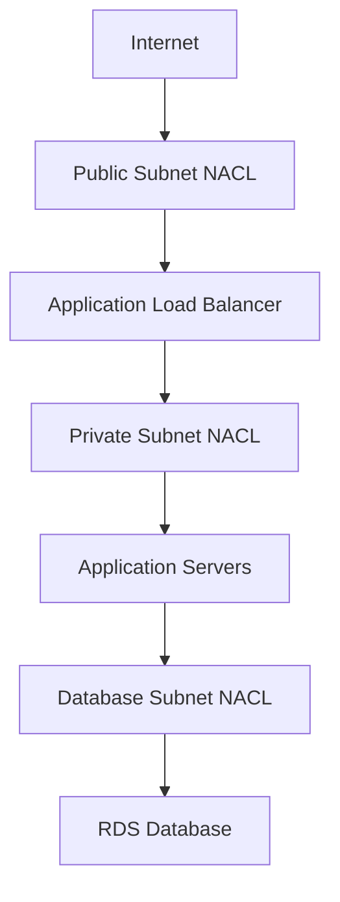

# How to Set Up Network ACLs for Subnet-Level Security

Author: [nawazdhandala](https://github.com/nawazdhandala)

Tags: AWS, VPC, Network ACLs, Security, Networking

Description: A practical guide to configuring Network ACLs in AWS for subnet-level traffic control, including rule ordering, stateless behavior, and common architecture patterns.

---

Network ACLs (NACLs) are the often-overlooked second layer of VPC security. While security groups get all the attention, NACLs provide an additional firewall at the subnet level. They're stateless, they process rules in order, and they can explicitly deny traffic - something security groups can't do. Understanding when and how to use them gives you a defense-in-depth strategy that's much harder to break.

## NACLs vs Security Groups

Before we dig into configuration, let's be clear about the differences:

| Feature | Security Groups | Network ACLs |
|---------|----------------|--------------|
| Level | Instance/ENI | Subnet |
| State | Stateful | Stateless |
| Rules | Allow only | Allow and Deny |
| Evaluation | All rules evaluated | Rules processed in order |
| Default | Deny all inbound, allow all outbound | Allow all inbound and outbound |
| Association | Multiple per instance | One per subnet |

The stateless nature of NACLs is the most important distinction. If you allow inbound traffic on port 80, you also need to explicitly allow the outbound response traffic on ephemeral ports. Forget this, and your web server will accept requests but the responses will be dropped.

## The Default NACL

Every VPC comes with a default NACL that allows all inbound and outbound traffic. When you create a subnet, it's automatically associated with this default NACL unless you specify otherwise.

You can view the default NACL:

```bash
# List NACLs in a VPC
aws ec2 describe-network-acls \
  --filters "Name=vpc-id,Values=vpc-abc123" \
  --query "NetworkAcls[?IsDefault==\`true\`]"
```

The default NACL has a rule numbered 100 that allows all traffic, plus the implicit deny-all rule (numbered *). In most cases, you'll want to create custom NACLs with more restrictive rules.

## Creating a Custom NACL

Let's create a NACL for a public subnet that allows web traffic and SSH:

```bash
# Create a new NACL
NACL_ID=$(aws ec2 create-network-acl \
  --vpc-id vpc-abc123 \
  --query "NetworkAcl.NetworkAclId" \
  --output text \
  --tag-specifications 'ResourceType=network-acl,Tags=[{Key=Name,Value=public-subnet-nacl}]')

echo "Created NACL: $NACL_ID"
```

When you create a custom NACL, it starts with no allow rules - just the implicit deny-all. You need to add rules explicitly.

## Adding Inbound Rules

Rules are processed in order by rule number. The first matching rule wins. AWS recommends numbering rules in increments of 100 to leave room for inserting rules later.

These commands add inbound rules for a typical public-facing web server:

```bash
# Rule 100: Allow HTTP from anywhere
aws ec2 create-network-acl-entry \
  --network-acl-id $NACL_ID \
  --rule-number 100 \
  --protocol tcp \
  --port-range From=80,To=80 \
  --cidr-block 0.0.0.0/0 \
  --rule-action allow \
  --ingress

# Rule 110: Allow HTTPS from anywhere
aws ec2 create-network-acl-entry \
  --network-acl-id $NACL_ID \
  --rule-number 110 \
  --protocol tcp \
  --port-range From=443,To=443 \
  --cidr-block 0.0.0.0/0 \
  --rule-action allow \
  --ingress

# Rule 120: Allow SSH from corporate network only
aws ec2 create-network-acl-entry \
  --network-acl-id $NACL_ID \
  --rule-number 120 \
  --protocol tcp \
  --port-range From=22,To=22 \
  --cidr-block 203.0.113.0/24 \
  --rule-action allow \
  --ingress

# Rule 130: Allow return traffic on ephemeral ports
# This is CRITICAL for stateless NACLs
aws ec2 create-network-acl-entry \
  --network-acl-id $NACL_ID \
  --rule-number 130 \
  --protocol tcp \
  --port-range From=1024,To=65535 \
  --cidr-block 0.0.0.0/0 \
  --rule-action allow \
  --ingress
```

That last rule is the one people forget. Because NACLs are stateless, return traffic from outbound connections arrives on ephemeral ports (1024-65535) and needs an explicit inbound allow rule.

## Adding Outbound Rules

Outbound rules follow the same pattern:

```bash
# Rule 100: Allow HTTP outbound
aws ec2 create-network-acl-entry \
  --network-acl-id $NACL_ID \
  --rule-number 100 \
  --protocol tcp \
  --port-range From=80,To=80 \
  --cidr-block 0.0.0.0/0 \
  --rule-action allow \
  --egress

# Rule 110: Allow HTTPS outbound
aws ec2 create-network-acl-entry \
  --network-acl-id $NACL_ID \
  --rule-number 110 \
  --protocol tcp \
  --port-range From=443,To=443 \
  --cidr-block 0.0.0.0/0 \
  --rule-action allow \
  --egress

# Rule 120: Allow response traffic on ephemeral ports
# This handles responses to inbound HTTP/HTTPS/SSH connections
aws ec2 create-network-acl-entry \
  --network-acl-id $NACL_ID \
  --rule-number 120 \
  --protocol tcp \
  --port-range From=1024,To=65535 \
  --cidr-block 0.0.0.0/0 \
  --rule-action allow \
  --egress
```

## Associating NACLs with Subnets

A subnet can only be associated with one NACL at a time. When you change the association, the old NACL is replaced immediately.

```bash
# Associate the NACL with a subnet
aws ec2 replace-network-acl-association \
  --association-id aclassoc-abc123 \
  --network-acl-id $NACL_ID
```

To find the current association ID:

```bash
# Find the current NACL association for a subnet
aws ec2 describe-network-acls \
  --filters "Name=association.subnet-id,Values=subnet-abc123" \
  --query "NetworkAcls[0].Associations[?SubnetId=='subnet-abc123'].NetworkAclAssociationId" \
  --output text
```

## Common Architecture: Three-Tier NACL Setup

A typical three-tier architecture has public, private, and database subnets. Here's how to configure NACLs for each tier:



### Private Subnet NACL

The private subnet should only accept traffic from the public subnet and allow outbound to the database subnet and internet (through NAT):

```bash
# Inbound: Allow traffic from public subnet on application port
aws ec2 create-network-acl-entry \
  --network-acl-id $PRIVATE_NACL_ID \
  --rule-number 100 \
  --protocol tcp \
  --port-range From=8080,To=8080 \
  --cidr-block 10.0.1.0/24 \
  --rule-action allow \
  --ingress

# Inbound: Allow ephemeral return traffic from database subnet
aws ec2 create-network-acl-entry \
  --network-acl-id $PRIVATE_NACL_ID \
  --rule-number 110 \
  --protocol tcp \
  --port-range From=1024,To=65535 \
  --cidr-block 10.0.3.0/24 \
  --rule-action allow \
  --ingress

# Inbound: Allow ephemeral return traffic from internet (via NAT)
aws ec2 create-network-acl-entry \
  --network-acl-id $PRIVATE_NACL_ID \
  --rule-number 120 \
  --protocol tcp \
  --port-range From=1024,To=65535 \
  --cidr-block 0.0.0.0/0 \
  --rule-action allow \
  --ingress

# Outbound: Allow traffic to database subnet on MySQL port
aws ec2 create-network-acl-entry \
  --network-acl-id $PRIVATE_NACL_ID \
  --rule-number 100 \
  --protocol tcp \
  --port-range From=3306,To=3306 \
  --cidr-block 10.0.3.0/24 \
  --rule-action allow \
  --egress

# Outbound: Allow HTTPS to internet (for package updates via NAT)
aws ec2 create-network-acl-entry \
  --network-acl-id $PRIVATE_NACL_ID \
  --rule-number 110 \
  --protocol tcp \
  --port-range From=443,To=443 \
  --cidr-block 0.0.0.0/0 \
  --rule-action allow \
  --egress

# Outbound: Allow ephemeral responses back to public subnet
aws ec2 create-network-acl-entry \
  --network-acl-id $PRIVATE_NACL_ID \
  --rule-number 120 \
  --protocol tcp \
  --port-range From=1024,To=65535 \
  --cidr-block 10.0.1.0/24 \
  --rule-action allow \
  --egress
```

### Database Subnet NACL

The database subnet is the most restrictive:

```bash
# Inbound: Only allow MySQL from private subnet
aws ec2 create-network-acl-entry \
  --network-acl-id $DB_NACL_ID \
  --rule-number 100 \
  --protocol tcp \
  --port-range From=3306,To=3306 \
  --cidr-block 10.0.2.0/24 \
  --rule-action allow \
  --ingress

# Outbound: Ephemeral responses back to private subnet
aws ec2 create-network-acl-entry \
  --network-acl-id $DB_NACL_ID \
  --rule-number 100 \
  --protocol tcp \
  --port-range From=1024,To=65535 \
  --cidr-block 10.0.2.0/24 \
  --rule-action allow \
  --egress
```

## Using Deny Rules

The real power of NACLs over security groups is the ability to explicitly deny. This is useful for blocking known bad IPs or ranges.

```bash
# Block a known malicious IP (low rule number = high priority)
aws ec2 create-network-acl-entry \
  --network-acl-id $NACL_ID \
  --rule-number 50 \
  --protocol -1 \
  --cidr-block 198.51.100.55/32 \
  --rule-action deny \
  --ingress
```

Because rules are processed in order, a deny rule with a lower number than your allow rules will block the traffic before any allow rule can match it.

## Troubleshooting Tips

NACLs can be tricky to debug. Here are common gotchas:

1. **Forgot ephemeral ports** - This is the number one issue. Always add rules for ephemeral port ranges (1024-65535) in both directions.

2. **Rule ordering** - A deny rule with a lower number than an allow rule will block the traffic. Double-check your rule numbers.

3. **IPv6** - If your VPC uses IPv6, you need separate rules with IPv6 CIDR blocks. NACLs don't have a single rule that covers both.

4. **Subnet association confusion** - Remember, only one NACL per subnet. Check which NACL is actually associated with the subnet you're troubleshooting.

When things aren't working, VPC Flow Logs are your best friend. Check out our guide on [enabling VPC Flow Logs](https://oneuptime.com/blog/post/2026-02-12-enable-configure-vpc-flow-logs/view) to see exactly what traffic is being accepted or rejected.

## Wrapping Up

Network ACLs provide a valuable second layer of defense at the subnet level. They won't replace security groups, but they complement them well. Use NACLs for broad subnet-level controls and IP blocking, and security groups for fine-grained instance-level access. Together, they give you the defense-in-depth strategy that good security requires.
