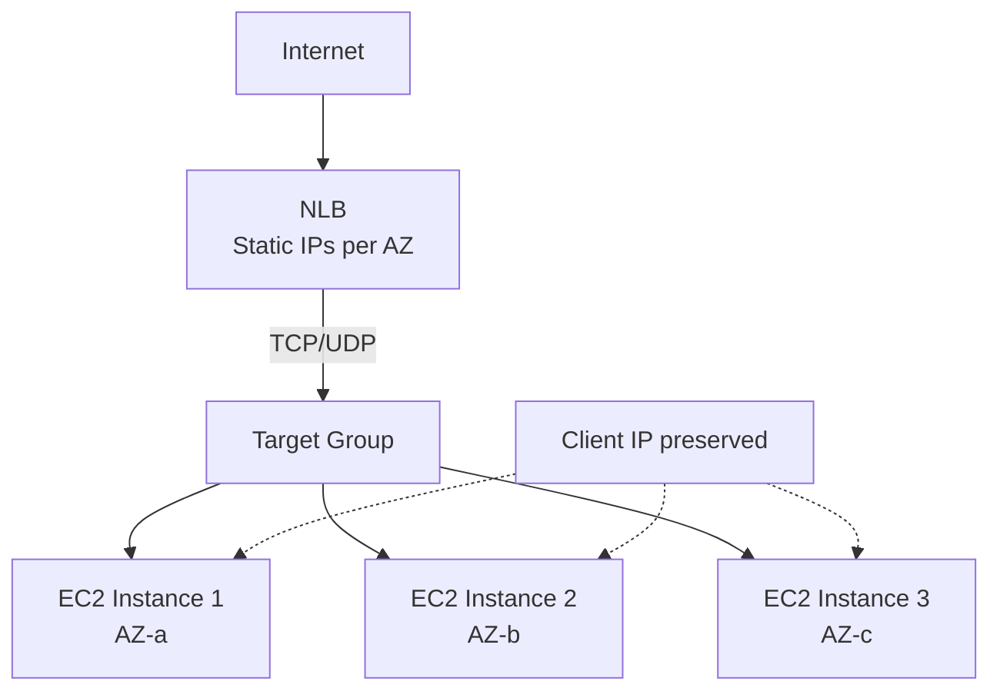

# How to Set Up a Network Load Balancer (NLB) for EC2

Author: [nawazdhandala](https://github.com/nawazdhandala)

Tags: AWS, EC2, NLB, Load Balancing, Networking, Performance

Description: A complete guide to setting up an AWS Network Load Balancer for EC2 instances for ultra-low latency and high-throughput TCP/UDP workloads.

---

When your workload needs raw TCP/UDP performance, millions of requests per second, or ultra-low latency, an Application Load Balancer won't cut it. That's where the Network Load Balancer (NLB) comes in. Operating at Layer 4 (transport layer), the NLB can handle extreme traffic levels with latencies measured in microseconds, not milliseconds.

Let's set up an NLB and understand when it's the right choice over an ALB.

## When to Use an NLB vs ALB

Choose an NLB when you need:

- **Ultra-low latency** - Single-digit microsecond latencies
- **TCP/UDP/TLS traffic** - Non-HTTP protocols
- **Millions of RPS** - Extreme throughput requirements
- **Static IPs** - Fixed IP addresses for allowlisting
- **Preserve client IP** - Pass through the real client IP to targets
- **Long-lived connections** - WebSocket, gRPC, or TCP connections that last minutes/hours

Choose an ALB when you need:

- HTTP-level routing (paths, hostnames, headers)
- Built-in WAF integration
- HTTP/2 and gRPC protocol support at Layer 7
- Authentication integration (Cognito, OIDC)

## NLB Architecture



Unlike the ALB, the NLB gets static IP addresses (one per AZ). These don't change, making it easy to allowlist them in firewalls or DNS configurations.

## Creating the NLB

This creates an internet-facing NLB across multiple AZs:

```bash
# Create the NLB
NLB_ARN=$(aws elbv2 create-load-balancer \
  --name my-tcp-nlb \
  --type network \
  --scheme internet-facing \
  --subnets subnet-public-1a subnet-public-1b subnet-public-1c \
  --tags Key=Name,Value=my-tcp-nlb \
  --query 'LoadBalancers[0].LoadBalancerArn' --output text)

echo "NLB ARN: $NLB_ARN"
```

If you need specific static IPs (for example, for client allowlisting), allocate Elastic IPs first:

```bash
# Allocate Elastic IPs for each AZ
EIP_1=$(aws ec2 allocate-address --domain vpc --query 'AllocationId' --output text)
EIP_2=$(aws ec2 allocate-address --domain vpc --query 'AllocationId' --output text)

# Create NLB with specific Elastic IPs
aws elbv2 create-load-balancer \
  --name my-static-nlb \
  --type network \
  --subnet-mappings \
    SubnetId=subnet-1a,AllocationId=$EIP_1 \
    SubnetId=subnet-1b,AllocationId=$EIP_2
```

## Creating a TCP Target Group

NLB target groups support TCP, UDP, TLS, and TCP_UDP protocols.

This creates a TCP target group with health checks:

```bash
# Create TCP target group
TG_ARN=$(aws elbv2 create-target-group \
  --name tcp-targets \
  --protocol TCP \
  --port 8080 \
  --vpc-id vpc-0123456789abcdef0 \
  --target-type instance \
  --health-check-protocol TCP \
  --health-check-port traffic-port \
  --health-check-interval-seconds 10 \
  --healthy-threshold-count 3 \
  --unhealthy-threshold-count 3 \
  --query 'TargetGroups[0].TargetGroupArn' --output text)
```

NLB health checks are simpler than ALB health checks. For TCP, they just check if the port is accepting connections. You can also use HTTP health checks if your application exposes one:

```bash
# Create target group with HTTP health check
aws elbv2 create-target-group \
  --name tcp-targets-http-hc \
  --protocol TCP \
  --port 8080 \
  --vpc-id vpc-0123456789abcdef0 \
  --health-check-protocol HTTP \
  --health-check-path /health \
  --health-check-port 8080
```

## Creating Listeners

NLB listeners define what traffic the NLB accepts and where to route it.

Set up a TCP listener:

```bash
# TCP listener
aws elbv2 create-listener \
  --load-balancer-arn $NLB_ARN \
  --protocol TCP \
  --port 80 \
  --default-actions '[{
    "Type": "forward",
    "TargetGroupArn": "'$TG_ARN'"
  }]'
```

For TLS termination at the NLB (offloading SSL from your instances):

```bash
# TLS listener with certificate
aws elbv2 create-listener \
  --load-balancer-arn $NLB_ARN \
  --protocol TLS \
  --port 443 \
  --certificates CertificateArn=arn:aws:acm:us-east-1:123456789012:certificate/abc123 \
  --ssl-policy ELBSecurityPolicy-TLS13-1-2-2021-06 \
  --default-actions '[{
    "Type": "forward",
    "TargetGroupArn": "'$TG_ARN'"
  }]'
```

For UDP workloads (like DNS or game servers):

```bash
# UDP listener
aws elbv2 create-listener \
  --load-balancer-arn $NLB_ARN \
  --protocol UDP \
  --port 53 \
  --default-actions '[{
    "Type": "forward",
    "TargetGroupArn": "'$UDP_TG_ARN'"
  }]'
```

## Registering Targets

Add your EC2 instances:

```bash
# Register targets
aws elbv2 register-targets \
  --target-group-arn $TG_ARN \
  --targets Id=i-instance1 Id=i-instance2 Id=i-instance3

# Check health
aws elbv2 describe-target-health \
  --target-group-arn $TG_ARN
```

## Client IP Preservation

One of the NLB's advantages is that it can preserve the original client IP address. With TCP targets, client IP preservation is enabled by default.

Your backend servers see the real client IP - no need to parse X-Forwarded-For headers like with an ALB.

If you need to disable it (for certain proxy configurations):

```bash
# Disable client IP preservation
aws elbv2 modify-target-group-attributes \
  --target-group-arn $TG_ARN \
  --attributes Key=preserve_client_ip.enabled,Value=false
```

## Terraform Configuration

Here's a complete NLB setup in Terraform:

```hcl
resource "aws_lb" "tcp" {
  name               = "tcp-nlb"
  internal           = false
  load_balancer_type = "network"

  dynamic "subnet_mapping" {
    for_each = var.public_subnets
    content {
      subnet_id     = subnet_mapping.value.id
      allocation_id = subnet_mapping.value.eip_allocation_id
    }
  }

  enable_cross_zone_load_balancing = true
  enable_deletion_protection       = true

  tags = {
    Name = "tcp-nlb"
  }
}

resource "aws_lb_target_group" "tcp" {
  name        = "tcp-targets"
  port        = 8080
  protocol    = "TCP"
  vpc_id      = var.vpc_id
  target_type = "instance"

  health_check {
    protocol            = "TCP"
    port                = "traffic-port"
    interval            = 10
    healthy_threshold   = 3
    unhealthy_threshold = 3
  }

  # Connection draining
  deregistration_delay = 300

  stickiness {
    enabled = true
    type    = "source_ip"
  }
}

resource "aws_lb_listener" "tcp" {
  load_balancer_arn = aws_lb.tcp.arn
  port              = 80
  protocol          = "TCP"

  default_action {
    type             = "forward"
    target_group_arn = aws_lb_target_group.tcp.arn
  }
}

resource "aws_lb_listener" "tls" {
  load_balancer_arn = aws_lb.tcp.arn
  port              = 443
  protocol          = "TLS"
  certificate_arn   = var.certificate_arn
  ssl_policy        = "ELBSecurityPolicy-TLS13-1-2-2021-06"

  default_action {
    type             = "forward"
    target_group_arn = aws_lb_target_group.tcp.arn
  }
}
```

## Cross-Zone Load Balancing

By default, NLB distributes traffic only within the same AZ. Enable cross-zone load balancing to distribute evenly across all registered targets regardless of AZ:

```bash
# Enable cross-zone load balancing
aws elbv2 modify-load-balancer-attributes \
  --load-balancer-arn $NLB_ARN \
  --attributes Key=load_balancing.cross_zone.enabled,Value=true
```

Note that cross-zone load balancing incurs data transfer charges for traffic crossing AZ boundaries. For more details on configuring cross-zone load balancing, see our guide on [cross-zone load balancing setup](https://oneuptime.com/blog/post/cross-zone-load-balancing/view).

## NLB with Auto Scaling

Like ALBs, NLBs integrate with Auto Scaling groups:

```bash
# Create ASG with NLB target group
aws autoscaling create-auto-scaling-group \
  --auto-scaling-group-name tcp-asg \
  --launch-template LaunchTemplateId=lt-0123456789abcdef0,Version='$Latest' \
  --min-size 2 \
  --max-size 20 \
  --vpc-zone-identifier "subnet-1a,subnet-1b" \
  --target-group-arns $TG_ARN \
  --health-check-type ELB \
  --health-check-grace-period 120
```

## Security Group Considerations

NLBs have an important difference from ALBs: for TCP targets with client IP preservation enabled, the target instances see the client's IP directly. This means your instance security group needs to allow traffic from client IPs, not the NLB's IP.

```bash
# Instance security group for NLB targets
# Must allow traffic from clients directly
aws ec2 authorize-security-group-ingress \
  --group-id $INSTANCE_SG \
  --protocol tcp --port 8080 \
  --cidr 0.0.0.0/0 \
  --description "NLB traffic (client IP preserved)"
```

If you disable client IP preservation, traffic comes from the NLB's private IPs, and you can restrict the security group to the NLB's subnet CIDRs.

## Monitoring

Key NLB CloudWatch metrics:

- **ActiveFlowCount** - Current TCP connections
- **NewFlowCount** - New connections per period
- **ProcessedBytes** - Data throughput
- **HealthyHostCount / UnHealthyHostCount** - Target health
- **TCP_Target_Reset_Count** - Connection resets (indicates backend issues)

For real-time monitoring of your NLB health and performance, including target health tracking and connection metrics, consider using [OneUptime's monitoring](https://oneuptime.com/blog/post/configure-health-checks-ec2-load-balancer/view).

## Summary

The Network Load Balancer is the right choice when you need Layer 4 load balancing with extreme performance, static IPs, or client IP preservation. It handles millions of connections per second with microsecond latencies and supports TCP, UDP, and TLS protocols. Use it for non-HTTP workloads, high-throughput applications, and cases where you need fixed IP addresses. For HTTP workloads that need content-based routing, an [Application Load Balancer](https://oneuptime.com/blog/post/application-load-balancer-alb-ec2/view) is the better fit.
