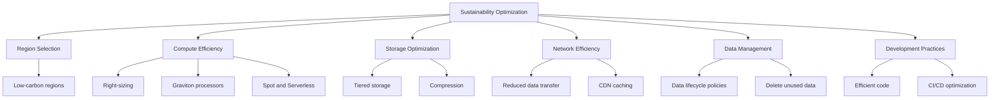
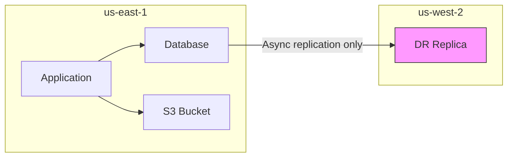

# How to Optimize AWS Workloads for Sustainability

Author: [nawazdhandala](https://github.com/nawazdhandala)

Tags: AWS, Sustainability, Green Computing, Cloud Optimization, Cost Optimization, Well-Architected

Description: Practical strategies for optimizing your AWS workloads to reduce energy consumption, carbon emissions, and costs while maintaining performance.

---

The Sustainability Pillar is the newest addition to the AWS Well-Architected Framework, and for good reason. Cloud computing consumes enormous amounts of energy globally. But the cloud also gives you tools to minimize that consumption in ways that are impossible with on-premises infrastructure.

Optimizing for sustainability is not charity work. Nearly every sustainability optimization also reduces your AWS bill. Use fewer resources, pay less, emit less carbon. It is one of those rare situations where doing the right thing and saving money are the same thing.

This guide covers practical, actionable strategies for reducing the environmental impact of your AWS workloads.

## The Sustainability Optimization Framework

Think about sustainability optimization across six dimensions:



Let us dig into each one.

## 1. Compute Efficiency

Compute typically accounts for the largest portion of both your AWS bill and your carbon footprint. Optimizing here gives you the biggest return.

### Right-Size Everything

Most organizations run instances that are 40-60% oversized. AWS Compute Optimizer analyzes your CloudWatch metrics and recommends better fits:

```bash
# Get recommendations for oversized EC2 instances
aws compute-optimizer get-ec2-instance-recommendations \
  --filters "Name=Finding,Values=OVER_PROVISIONED" \
  --output table \
  --query 'instanceRecommendations[*].{
    Instance:instanceArn,
    Current:currentInstanceType,
    Recommended:recommendationOptions[0].instanceType,
    Savings:recommendationOptions[0].projectedUtilizationMetrics[0].value
  }'
```

A t3.xlarge running at 15% CPU utilization can often be replaced with a t3.medium or t3.small, cutting energy consumption in half or more.

### Switch to Graviton Processors

AWS Graviton chips are ARM-based processors designed by AWS specifically for cloud workloads. They deliver up to 40% better price-performance than comparable x86 instances and use significantly less energy per unit of compute.

For most workloads, the migration is straightforward:

```bash
# Compare performance between x86 and Graviton for your workload
# Launch a Graviton instance alongside your existing x86 instance
aws ec2 run-instances \
  --instance-type m7g.xlarge \
  --image-id ami-0graviton-amazon-linux \
  --count 1 \
  --tag-specifications 'ResourceType=instance,Tags=[{Key=Purpose,Value=graviton-benchmark}]'
```

We have a dedicated guide on [using Graviton instances to reduce energy consumption](https://oneuptime.com/blog/post/use-graviton-instances-to-reduce-energy-consumption/view) if you want to go deeper.

### Embrace Serverless

Lambda functions consume zero energy when idle. Compare that to an EC2 instance running 24/7 at 5% utilization - 95% of the energy it consumes is wasted.

Where it makes sense, migrate to:

- **AWS Lambda** for event-driven compute
- **AWS Fargate** for containerized workloads (no idle EC2 hosts)
- **Amazon Aurora Serverless** for variable-load databases

```python
# Example: Replace an always-on EC2 cron job with Lambda
# This Lambda processes files uploaded to S3
import boto3
import json

def lambda_handler(event, context):
    s3 = boto3.client('s3')

    for record in event['Records']:
        bucket = record['s3']['bucket']['name']
        key = record['s3']['object']['key']

        # Process the file
        response = s3.get_object(Bucket=bucket, Key=key)
        data = json.loads(response['Body'].read())

        # Do your processing here
        process_data(data)

    return {'statusCode': 200, 'body': 'Processed successfully'}
```

### Use Spot Instances for Fault-Tolerant Workloads

Spot instances use spare EC2 capacity. By using capacity that would otherwise sit idle, you are effectively recycling compute resources:

```bash
# Launch a Spot fleet for batch processing
aws ec2 request-spot-fleet \
  --spot-fleet-request-config '{
    "IamFleetRole": "arn:aws:iam::123456789012:role/spot-fleet-role",
    "TargetCapacity": 10,
    "SpotPrice": "0.05",
    "LaunchSpecifications": [
      {
        "InstanceType": "m6g.large",
        "ImageId": "ami-0abcdef1234567890",
        "SubnetId": "subnet-0123456789abcdef0"
      }
    ]
  }'
```

### Schedule Non-Production Environments

Dev, test, and staging environments do not need to run at 2 AM on a Sunday. Use AWS Instance Scheduler to stop them during off-hours:

```yaml
# CloudFormation template excerpt for Instance Scheduler
Resources:
  SchedulerStack:
    Type: AWS::CloudFormation::Stack
    Properties:
      TemplateURL: https://s3.amazonaws.com/solutions-reference/aws-instance-scheduler-on-aws/latest/instance-scheduler-on-aws.template
      Parameters:
        SchedulingActive: 'Yes'
        DefaultTimezone: 'US/Eastern'
        Regions: 'us-east-1'
        # Run Mon-Fri, 8am-6pm EST
        SchedulerFrequency: '5'
```

Tag your instances with the schedule name, and the scheduler handles the rest. This alone can reduce your dev environment energy consumption by 70%.

## 2. Storage Optimization

Data at rest still consumes energy. Disks spin, SSDs draw power, and storage systems need cooling.

### Implement Lifecycle Policies

Move data to cheaper, less energy-intensive storage tiers as it ages:

```bash
# S3 lifecycle policy that progressively moves data to cheaper tiers
aws s3api put-bucket-lifecycle-configuration \
  --bucket my-application-data \
  --lifecycle-configuration '{
    "Rules": [
      {
        "ID": "OptimizeStorageTiers",
        "Status": "Enabled",
        "Filter": {},
        "Transitions": [
          {"Days": 30, "StorageClass": "STANDARD_IA"},
          {"Days": 90, "StorageClass": "GLACIER_IR"},
          {"Days": 180, "StorageClass": "GLACIER"},
          {"Days": 365, "StorageClass": "DEEP_ARCHIVE"}
        ],
        "NoncurrentVersionExpiration": {"NoncurrentDays": 30}
      }
    ]
  }'
```

### Compress Everything

Compressed data takes up less storage space and less network bandwidth to transfer:

```python
# Compress data before storing in S3
import boto3
import gzip
import json

s3 = boto3.client('s3')

def store_compressed(bucket, key, data):
    """Store data compressed in S3 with appropriate content encoding"""
    compressed = gzip.compress(json.dumps(data).encode('utf-8'))
    s3.put_object(
        Bucket=bucket,
        Key=key,
        Body=compressed,
        ContentEncoding='gzip',
        ContentType='application/json'
    )
    print(f"Original: {len(json.dumps(data))} bytes")
    print(f"Compressed: {len(compressed)} bytes")
    print(f"Reduction: {(1 - len(compressed)/len(json.dumps(data)))*100:.1f}%")
```

### Delete What You Do Not Need

This sounds obvious, but most organizations have massive amounts of orphaned data: old snapshots, unused EBS volumes, stale S3 objects, abandoned backups.

```bash
# Find unattached EBS volumes (wasting storage and energy)
aws ec2 describe-volumes \
  --filters "Name=status,Values=available" \
  --query 'Volumes[*].{ID:VolumeId,Size:Size,Created:CreateTime}' \
  --output table
```

## 3. Network Efficiency

Data transfer consumes energy at every hop - in your application, through the AWS network, across regions, and out to the internet.

### Use CloudFront for Static Content

Caching content at edge locations reduces the number of times your origin servers need to serve the same content:

```bash
# Create a CloudFront distribution for static assets
aws cloudfront create-distribution \
  --distribution-config '{
    "CallerReference": "sustainability-dist-001",
    "DefaultCacheBehavior": {
      "TargetOriginId": "myS3Origin",
      "ViewerProtocolPolicy": "redirect-to-https",
      "CachePolicyId": "658327ea-f89d-4fab-a63d-7e88639e58f6",
      "Compress": true
    },
    "Origins": {
      "Items": [
        {
          "Id": "myS3Origin",
          "DomainName": "my-static-assets.s3.amazonaws.com",
          "S3OriginConfig": {"OriginAccessIdentity": ""}
        }
      ],
      "Quantity": 1
    },
    "Enabled": true
  }'
```

The `Compress: true` setting tells CloudFront to gzip responses, reducing data transfer by 60-80% for text-based content.

### Minimize Cross-Region Data Transfer

Every byte transferred between regions uses network infrastructure that consumes energy. Keep data processing close to where the data lives:



Only replicate what you need for disaster recovery. Do not routinely process data in a different region from where it is stored.

## 4. Development Practices

How you build and deploy software affects energy consumption too.

### Optimize Your CI/CD Pipeline

Build pipelines that run hundreds of times per day add up:

- Use caching for dependencies (npm, pip, Maven) to avoid re-downloading
- Run tests in parallel to reduce total build time
- Use Graviton-based build instances (CodeBuild supports them)
- Skip unnecessary builds with smart change detection

```yaml
# CodeBuild project using Graviton for lower energy consumption
Resources:
  SustainableBuild:
    Type: AWS::CodeBuild::Project
    Properties:
      Environment:
        ComputeType: BUILD_GENERAL1_MEDIUM
        Image: aws/codebuild/amazonlinux2-aarch64-standard:3.0
        Type: ARM_CONTAINER
      Cache:
        Type: S3
        Location: my-build-cache-bucket/cache
```

### Write Efficient Code

This is often overlooked, but inefficient code directly translates to higher CPU utilization and more energy consumption. Profile your applications and optimize hot paths:

- Use connection pooling for database connections
- Implement proper caching strategies (Redis, ElastiCache)
- Avoid N+1 query patterns
- Process data in batches instead of one record at a time

## Measuring Progress

You cannot improve what you do not measure. Use the [AWS Customer Carbon Footprint Tool](https://oneuptime.com/blog/post/use-aws-customer-carbon-footprint-tool/view) to track your emissions over time. Combine it with cost tracking to create a sustainability dashboard:

```python
# Custom CloudWatch metric for emissions-per-revenue
import boto3

cloudwatch = boto3.client('cloudwatch')

# Calculate your efficiency metric
monthly_emissions_mtco2e = 5.2  # from Carbon Footprint Tool
monthly_revenue = 500000  # from your business data

emissions_per_million_revenue = monthly_emissions_mtco2e / (monthly_revenue / 1000000)

# Publish as custom metric
cloudwatch.put_metric_data(
    Namespace='Sustainability',
    MetricData=[
        {
            'MetricName': 'EmissionsPerMillionRevenue',
            'Value': emissions_per_million_revenue,
            'Unit': 'None'
        }
    ]
)
```

For comprehensive monitoring that combines sustainability metrics with application performance and infrastructure health, [OneUptime](https://oneuptime.com) offers unified dashboards that bring all your operational data together.

## Quick Wins Checklist

If you want to start improving today, here are changes you can make right now:

1. Turn off dev/staging environments outside business hours
2. Delete unused EBS volumes and old snapshots
3. Enable S3 lifecycle policies on all buckets
4. Switch at least one workload to Graviton instances
5. Enable CloudFront compression
6. Run Compute Optimizer and act on the top 10 recommendations
7. Check your carbon footprint in the billing console

Each of these takes under an hour and most will also save you money.

## Wrapping Up

Sustainability optimization on AWS is not about making sacrifices. It is about running your infrastructure more efficiently. Right-size your instances, choose the right processor architecture, eliminate waste, and be intentional about where and how you run workloads.

The AWS Well-Architected Sustainability Pillar gives you a framework. The Carbon Footprint Tool gives you measurement. And the strategies in this guide give you specific actions. Start with the quick wins, measure the impact, and build sustainability into your regular operational reviews.

Your future self - and the planet - will thank you.
