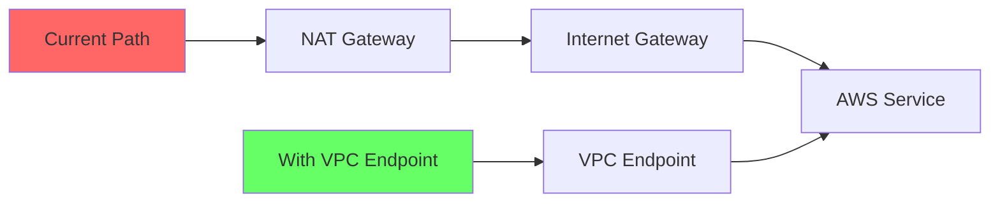

# How to Optimize Data Transfer Costs with VPC Endpoints

Author: [nawazdhandala](https://github.com/nawazdhandala)

Tags: AWS, VPC, Endpoints, Cost Optimization, Networking, Data Transfer

Description: Learn how to reduce AWS data transfer costs by using VPC endpoints to keep traffic within the AWS network instead of routing through the internet.

---

Data transfer is often the most surprising line item on an AWS bill. You provision EC2 instances, size your databases, and estimate compute costs carefully, but then the data transfer charges show up and blow your budget. A significant portion of these charges come from traffic between your VPC and AWS services that routes through the internet or NAT gateways. VPC endpoints eliminate this by creating private connections from your VPC directly to AWS services, keeping traffic on the AWS backbone and reducing costs.

This guide covers the types of VPC endpoints, how to set them up for common services, and how to calculate the cost savings.

## Why Data Transfer Costs Add Up

Let us trace what happens when an EC2 instance in a private subnet calls S3:

1. The request goes to the NAT gateway
2. The NAT gateway forwards it to the internet gateway
3. The traffic exits the VPC to the public internet
4. It reaches the S3 public endpoint
5. The response takes the reverse path

Every step in this path has a cost:
- NAT gateway processing: $0.045 per GB
- NAT gateway hourly charge: $0.045 per hour
- Data transfer out: $0.09 per GB (first 10 TB)

For a workload that transfers 1 TB per month to S3, that is roughly $45 in NAT gateway data processing alone, plus the hourly charges. With a VPC endpoint, that same traffic costs $0 for gateway endpoints (S3, DynamoDB) or $0.01 per GB for interface endpoints.

## Types of VPC Endpoints

There are two types of VPC endpoints:

### Gateway Endpoints
- Available for **S3** and **DynamoDB** only
- Free to use (no hourly or data processing charges)
- Route table-based (traffic is routed via prefix lists)
- Cannot be accessed from on-premises or peered VPCs

### Interface Endpoints (PrivateLink)
- Available for 100+ AWS services
- Cost: ~$0.01 per GB processed + hourly charge per AZ (~$0.01/hour)
- DNS-based (private DNS resolves service endpoints to private IPs)
- Accessible from on-premises via VPN/Direct Connect and peered VPCs

## Step 1: Create a Gateway Endpoint for S3

S3 is typically the highest-volume data transfer target. Start here for maximum impact.

```bash
# Get your VPC ID and route table IDs
VPC_ID=$(aws ec2 describe-vpcs \
  --filters "Name=isDefault,Values=false" \
  --query 'Vpcs[0].VpcId' \
  --output text)

# Get private subnet route tables
ROUTE_TABLES=$(aws ec2 describe-route-tables \
  --filters "Name=vpc-id,Values=$VPC_ID" \
  --query 'RouteTables[?Associations[?SubnetId!=`null`]].RouteTableId' \
  --output text)

# Create the S3 gateway endpoint
aws ec2 create-vpc-endpoint \
  --vpc-id $VPC_ID \
  --service-name com.amazonaws.us-east-1.s3 \
  --route-table-ids $ROUTE_TABLES \
  --tag-specifications 'ResourceType=vpc-endpoint,Tags=[{Key=Name,Value=s3-gateway-endpoint}]'
```

Once created, any traffic to S3 from subnets associated with those route tables will automatically use the gateway endpoint instead of the NAT gateway.

## Step 2: Create a Gateway Endpoint for DynamoDB

If you use DynamoDB, add a gateway endpoint for it too:

```bash
# Create the DynamoDB gateway endpoint
aws ec2 create-vpc-endpoint \
  --vpc-id $VPC_ID \
  --service-name com.amazonaws.us-east-1.dynamodb \
  --route-table-ids $ROUTE_TABLES \
  --tag-specifications 'ResourceType=vpc-endpoint,Tags=[{Key=Name,Value=dynamodb-gateway-endpoint}]'
```

## Step 3: Create Interface Endpoints for High-Traffic Services

For services beyond S3 and DynamoDB, you need interface endpoints. Prioritize services that your workloads call frequently.

Common high-traffic services:

```bash
# Create interface endpoint for ECR (container image pulls)
aws ec2 create-vpc-endpoint \
  --vpc-id $VPC_ID \
  --vpc-endpoint-type Interface \
  --service-name com.amazonaws.us-east-1.ecr.api \
  --subnet-ids subnet-abc123 subnet-def456 \
  --security-group-ids sg-12345678 \
  --private-dns-enabled \
  --tag-specifications 'ResourceType=vpc-endpoint,Tags=[{Key=Name,Value=ecr-api-endpoint}]'

# ECR also needs a docker endpoint for image layers
aws ec2 create-vpc-endpoint \
  --vpc-id $VPC_ID \
  --vpc-endpoint-type Interface \
  --service-name com.amazonaws.us-east-1.ecr.dkr \
  --subnet-ids subnet-abc123 subnet-def456 \
  --security-group-ids sg-12345678 \
  --private-dns-enabled \
  --tag-specifications 'ResourceType=vpc-endpoint,Tags=[{Key=Name,Value=ecr-dkr-endpoint}]'

# CloudWatch Logs endpoint (for Lambda and container logging)
aws ec2 create-vpc-endpoint \
  --vpc-id $VPC_ID \
  --vpc-endpoint-type Interface \
  --service-name com.amazonaws.us-east-1.logs \
  --subnet-ids subnet-abc123 subnet-def456 \
  --security-group-ids sg-12345678 \
  --private-dns-enabled \
  --tag-specifications 'ResourceType=vpc-endpoint,Tags=[{Key=Name,Value=logs-endpoint}]'

# SQS endpoint
aws ec2 create-vpc-endpoint \
  --vpc-id $VPC_ID \
  --vpc-endpoint-type Interface \
  --service-name com.amazonaws.us-east-1.sqs \
  --subnet-ids subnet-abc123 subnet-def456 \
  --security-group-ids sg-12345678 \
  --private-dns-enabled \
  --tag-specifications 'ResourceType=vpc-endpoint,Tags=[{Key=Name,Value=sqs-endpoint}]'
```

## Step 4: Configure Security Groups for Interface Endpoints

Interface endpoints need security groups that allow inbound HTTPS traffic:

```bash
# Create a security group for VPC endpoints
SG_ID=$(aws ec2 create-security-group \
  --group-name vpc-endpoint-sg \
  --description "Security group for VPC endpoints" \
  --vpc-id $VPC_ID \
  --query 'GroupId' \
  --output text)

# Allow HTTPS from the VPC CIDR
aws ec2 authorize-security-group-ingress \
  --group-id $SG_ID \
  --protocol tcp \
  --port 443 \
  --cidr 10.0.0.0/16
```

## Step 5: Restrict Access with Endpoint Policies

VPC endpoints support resource policies that control which principals and resources can be accessed through the endpoint:

```bash
# Apply a policy to the S3 gateway endpoint
# Only allow access to specific buckets
aws ec2 modify-vpc-endpoint \
  --vpc-endpoint-id vpce-0123456789abcdef0 \
  --policy-document '{
    "Version": "2012-10-17",
    "Statement": [
      {
        "Effect": "Allow",
        "Principal": "*",
        "Action": [
          "s3:GetObject",
          "s3:PutObject",
          "s3:ListBucket"
        ],
        "Resource": [
          "arn:aws:s3:::my-application-bucket",
          "arn:aws:s3:::my-application-bucket/*",
          "arn:aws:s3:::my-logs-bucket",
          "arn:aws:s3:::my-logs-bucket/*"
        ]
      }
    ]
  }'
```

## Cost Savings Analysis

Here is how to calculate your potential savings:



| Component | Without Endpoint | With Gateway Endpoint | With Interface Endpoint |
|-----------|-----------------|----------------------|------------------------|
| NAT Gateway hourly | $0.045/hr | $0 | $0 |
| NAT Gateway data | $0.045/GB | $0 | $0 |
| Endpoint hourly | $0 | $0 | ~$0.01/hr per AZ |
| Endpoint data | $0 | $0 | ~$0.01/GB |
| **1 TB/month total** | **~$78** | **$0** | **~$17** |

For S3 and DynamoDB, the savings are 100% because gateway endpoints are free. For other services, you save the NAT gateway data processing charge but pay a smaller per-GB fee on the interface endpoint.

## CloudFormation Template

Deploy all your endpoints as infrastructure as code:

```yaml
# CloudFormation template for VPC endpoints
AWSTemplateFormatVersion: '2010-09-09'
Description: VPC endpoints for cost optimization

Parameters:
  VpcId:
    Type: AWS::EC2::VPC::Id
  PrivateSubnetIds:
    Type: List<AWS::EC2::Subnet::Id>
  VpcCidr:
    Type: String
    Default: 10.0.0.0/16
  PrivateRouteTableIds:
    Type: CommaDelimitedList

Resources:
  # Free gateway endpoints
  S3Endpoint:
    Type: AWS::EC2::VPCEndpoint
    Properties:
      VpcId: !Ref VpcId
      ServiceName: !Sub com.amazonaws.${AWS::Region}.s3
      VpcEndpointType: Gateway
      RouteTableIds: !Ref PrivateRouteTableIds

  DynamoDBEndpoint:
    Type: AWS::EC2::VPCEndpoint
    Properties:
      VpcId: !Ref VpcId
      ServiceName: !Sub com.amazonaws.${AWS::Region}.dynamodb
      VpcEndpointType: Gateway
      RouteTableIds: !Ref PrivateRouteTableIds

  # Security group for interface endpoints
  EndpointSecurityGroup:
    Type: AWS::EC2::SecurityGroup
    Properties:
      GroupDescription: Security group for VPC interface endpoints
      VpcId: !Ref VpcId
      SecurityGroupIngress:
        - IpProtocol: tcp
          FromPort: 443
          ToPort: 443
          CidrIp: !Ref VpcCidr

  # Interface endpoints for high-traffic services
  ECRApiEndpoint:
    Type: AWS::EC2::VPCEndpoint
    Properties:
      VpcId: !Ref VpcId
      ServiceName: !Sub com.amazonaws.${AWS::Region}.ecr.api
      VpcEndpointType: Interface
      SubnetIds: !Ref PrivateSubnetIds
      SecurityGroupIds:
        - !Ref EndpointSecurityGroup
      PrivateDnsEnabled: true

  ECRDkrEndpoint:
    Type: AWS::EC2::VPCEndpoint
    Properties:
      VpcId: !Ref VpcId
      ServiceName: !Sub com.amazonaws.${AWS::Region}.ecr.dkr
      VpcEndpointType: Interface
      SubnetIds: !Ref PrivateSubnetIds
      SecurityGroupIds:
        - !Ref EndpointSecurityGroup
      PrivateDnsEnabled: true

  CloudWatchLogsEndpoint:
    Type: AWS::EC2::VPCEndpoint
    Properties:
      VpcId: !Ref VpcId
      ServiceName: !Sub com.amazonaws.${AWS::Region}.logs
      VpcEndpointType: Interface
      SubnetIds: !Ref PrivateSubnetIds
      SecurityGroupIds:
        - !Ref EndpointSecurityGroup
      PrivateDnsEnabled: true
```

## Best Practices

1. **Always create S3 and DynamoDB gateway endpoints.** They are free. There is no reason not to have them in every VPC.

2. **Analyze NAT gateway traffic before creating interface endpoints.** Use VPC Flow Logs and Cost Explorer to identify which services generate the most NAT gateway traffic. Focus interface endpoints on those services.

3. **Use private DNS.** Enable private DNS on interface endpoints so existing code works without modification. The AWS SDK automatically resolves to the private endpoint.

4. **Deploy in multiple AZs.** Interface endpoints should be in at least two AZs for availability. The hourly cost per AZ is minimal compared to downtime.

5. **Apply endpoint policies.** Restrict what can be accessed through the endpoint as a defense-in-depth measure.

## Wrapping Up

VPC endpoints are one of the easiest ways to reduce your AWS bill. Gateway endpoints for S3 and DynamoDB cost nothing and eliminate NAT gateway charges for those services entirely. Interface endpoints for other high-traffic services trade the expensive NAT gateway data processing fee for a much smaller per-GB charge. Start with the gateway endpoints, analyze your NAT gateway traffic patterns, and add interface endpoints for the services that generate the most data transfer. The savings add up quickly, especially at scale.
