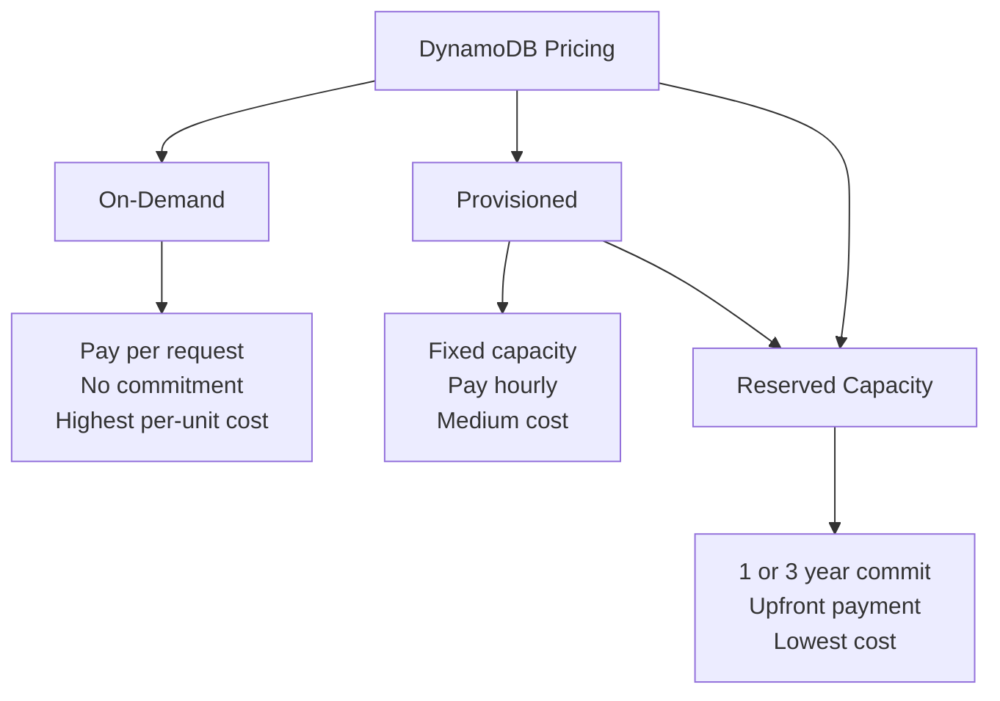

# How to Optimize DynamoDB Costs with Reserved Capacity

Author: [nawazdhandala](https://github.com/nawazdhandala)

Tags: AWS, DynamoDB, Cost Optimization, Reserved Capacity

Description: Learn how to reduce DynamoDB costs by up to 77% using reserved capacity, when to use it versus on-demand, and strategies for right-sizing your reservations.

---

DynamoDB can get expensive fast, especially with provisioned capacity tables running 24/7. Reserved capacity lets you commit to a baseline level of read and write capacity for 1 or 3 years in exchange for a significant discount - up to 77% off on-demand pricing. But getting it wrong means either paying for capacity you don't use or not reserving enough to capture the full savings.

Let's break down how to make the right call.

## Understanding the Pricing Models

DynamoDB offers three pricing models, and understanding how they relate is crucial before buying reserved capacity.



Reserved capacity only applies to provisioned mode tables. You can't use reserved capacity with on-demand tables. The reservation covers a specific number of read or write capacity units, and anything above that is charged at the standard provisioned rate.

## How Reserved Capacity Works

When you purchase reserved capacity, you're committing to a minimum number of capacity units in a specific region. Here's the pricing breakdown (approximate, check current pricing).

For write capacity units (WCU):
- **On-demand**: ~$1.25 per million write request units
- **Provisioned**: ~$0.00065 per WCU per hour (~$0.47/month per WCU)
- **1-year reserved**: ~$0.000128 per WCU per hour (~$0.09/month per WCU) + upfront
- **3-year reserved**: ~$0.000051 per WCU per hour (~$0.037/month per WCU) + upfront

That's a massive difference. A table running 1000 WCUs:
- Provisioned: ~$470/month
- 1-year reserved: ~$150/month (including amortized upfront)
- 3-year reserved: ~$107/month (including amortized upfront)

## Analyzing Your Usage Patterns

Before buying, you need to understand your actual capacity usage. Pull CloudWatch metrics to see your consumption patterns.

```python
import boto3
from datetime import datetime, timedelta

cloudwatch = boto3.client('cloudwatch')

def get_capacity_stats(table_name, metric_name, days=30):
    """Get min, max, and average capacity consumption over a period."""
    end_time = datetime.utcnow()
    start_time = end_time - timedelta(days=days)

    # Get the consumed capacity over the period
    response = cloudwatch.get_metric_statistics(
        Namespace='AWS/DynamoDB',
        MetricName=metric_name,
        Dimensions=[
            {'Name': 'TableName', 'Value': table_name}
        ],
        StartTime=start_time,
        EndTime=end_time,
        Period=3600,  # 1-hour intervals
        Statistics=['Average', 'Maximum', 'Minimum']
    )

    if not response['Datapoints']:
        print(f'No data for {table_name} - {metric_name}')
        return

    # Sort by timestamp for analysis
    datapoints = sorted(response['Datapoints'], key=lambda x: x['Timestamp'])

    averages = [dp['Average'] for dp in datapoints]
    maximums = [dp['Maximum'] for dp in datapoints]
    minimums = [dp['Minimum'] for dp in datapoints]

    print(f'\n{table_name} - {metric_name} (last {days} days):')
    print(f'  Average: {sum(averages)/len(averages):.1f}')
    print(f'  Min hourly avg: {min(averages):.1f}')
    print(f'  Max hourly avg: {max(averages):.1f}')
    print(f'  Peak: {max(maximums):.1f}')

    # The baseline for reservation is the minimum sustained usage
    baseline = min(averages)
    print(f'  Recommended reservation baseline: {baseline:.0f} capacity units')

    return baseline

# Analyze your tables
tables = ['Users', 'Orders', 'Products']
for table in tables:
    get_capacity_stats(table, 'ConsumedReadCapacityUnits')
    get_capacity_stats(table, 'ConsumedWriteCapacityUnits')
```

## The Right-Sizing Strategy

Don't reserve for your peak capacity - reserve for your baseline. The idea is to cover the always-on minimum with reserved capacity and handle peaks with standard provisioned capacity (or auto-scaling).

```python
def calculate_reservation_savings(baseline_units, unit_type='write'):
    """Calculate potential savings from reserved capacity."""

    # Approximate pricing (check current AWS pricing)
    if unit_type == 'write':
        provisioned_hourly = 0.00065
        reserved_1yr_hourly = 0.000128
        reserved_1yr_upfront = 150  # per 100 units
        reserved_3yr_hourly = 0.000051
        reserved_3yr_upfront = 300  # per 100 units
    else:
        provisioned_hourly = 0.00013
        reserved_1yr_hourly = 0.0000256
        reserved_1yr_upfront = 30  # per 100 units
        reserved_3yr_hourly = 0.0000102
        reserved_3yr_upfront = 60  # per 100 units

    hours_per_year = 8760

    # Current cost
    current_annual = baseline_units * provisioned_hourly * hours_per_year

    # 1-year reserved cost
    reserved_1yr_annual = (
        baseline_units * reserved_1yr_hourly * hours_per_year +
        (baseline_units / 100) * reserved_1yr_upfront
    )

    # 3-year reserved cost (annualized)
    reserved_3yr_annual = (
        baseline_units * reserved_3yr_hourly * hours_per_year +
        (baseline_units / 100) * reserved_3yr_upfront / 3
    )

    print(f'\nSavings analysis for {baseline_units} {unit_type} capacity units:')
    print(f'  Current annual cost: ${current_annual:,.2f}')
    print(f'  1-year reserved annual cost: ${reserved_1yr_annual:,.2f} '
          f'(saves ${current_annual - reserved_1yr_annual:,.2f}, '
          f'{((current_annual - reserved_1yr_annual) / current_annual * 100):.0f}%)')
    print(f'  3-year reserved annual cost: ${reserved_3yr_annual:,.2f} '
          f'(saves ${current_annual - reserved_3yr_annual:,.2f}, '
          f'{((current_annual - reserved_3yr_annual) / current_annual * 100):.0f}%)')

# Example: 500 WCU baseline
calculate_reservation_savings(500, 'write')
calculate_reservation_savings(2000, 'read')
```

## Purchasing Reserved Capacity

Reserved capacity is purchased through the AWS console or CLI. Note that it's bought in blocks of 100 capacity units.

```bash
# Purchase 500 reserved write capacity units for 1 year
# (This is done through the console - the CLI command below
# is for reference; actual purchase requires console confirmation)

# View available reserved capacity offerings
aws dynamodb describe-reserved-capacity-offerings \
  --region us-east-1
```

Currently, reserved capacity purchases must be made through the AWS Management Console. Navigate to DynamoDB, then "Reserved Capacity" in the left sidebar.

## Combining with Auto-Scaling

The best strategy combines reserved capacity for the baseline with auto-scaling for the variable portion.

```bash
# Set up auto-scaling that targets 70% utilization
# The reserved capacity covers the minimum, auto-scaling handles the rest
aws application-autoscaling register-scalable-target \
  --service-namespace dynamodb \
  --resource-id "table/Users" \
  --scalable-dimension "dynamodb:table:WriteCapacityUnits" \
  --min-capacity 500 \
  --max-capacity 5000

# Create the scaling policy
aws application-autoscaling put-scaling-policy \
  --service-namespace dynamodb \
  --resource-id "table/Users" \
  --scalable-dimension "dynamodb:table:WriteCapacityUnits" \
  --policy-name "Users-WriteScaling" \
  --policy-type "TargetTrackingScaling" \
  --target-tracking-scaling-policy-configuration '{
    "TargetValue": 70.0,
    "PredefinedMetricSpecification": {
      "PredefinedMetricType": "DynamoDBWriteCapacityUtilization"
    },
    "ScaleInCooldown": 60,
    "ScaleOutCooldown": 60
  }'
```

In this setup, you'd purchase 500 reserved WCUs and let auto-scaling handle anything above that. Your minimum capacity is always covered at the reserved rate, and you only pay standard provisioned rates for the additional capacity during peak times.

## When NOT to Use Reserved Capacity

Reserved capacity isn't always the right choice:

- **Unpredictable workloads**: If your usage swings wildly and you can't identify a stable baseline, on-demand might be cheaper despite the higher per-unit cost
- **New tables**: Wait 30-60 days to understand usage patterns before committing
- **Tables you might delete**: If there's any chance the table goes away within the commitment period, you're stuck paying
- **On-demand tables**: Reserved capacity only works with provisioned mode

## Monthly Cost Review Script

Here's a script to review your DynamoDB costs and identify optimization opportunities.

```python
import boto3

ce = boto3.client('ce')
dynamodb = boto3.client('dynamodb')

def get_dynamodb_monthly_cost():
    """Get the current month's DynamoDB costs broken down by usage type."""
    import datetime

    today = datetime.date.today()
    first_of_month = today.replace(day=1)

    response = ce.get_cost_and_usage(
        TimePeriod={
            'Start': first_of_month.isoformat(),
            'End': today.isoformat()
        },
        Granularity='MONTHLY',
        Metrics=['UnblendedCost'],
        Filter={
            'Dimensions': {
                'Key': 'SERVICE',
                'Values': ['Amazon DynamoDB']
            }
        },
        GroupBy=[
            {'Type': 'DIMENSION', 'Key': 'USAGE_TYPE'}
        ]
    )

    print('DynamoDB costs this month:')
    for result in response['ResultsByTime']:
        for group in result['Groups']:
            usage_type = group['Keys'][0]
            cost = float(group['Metrics']['UnblendedCost']['Amount'])
            if cost > 0.01:
                print(f'  {usage_type}: ${cost:.2f}')

get_dynamodb_monthly_cost()
```

The bottom line: if you've got DynamoDB tables with predictable, steady-state workloads, reserved capacity is one of the easiest ways to cut your AWS bill. Analyze at least 30 days of usage data, reserve for the baseline, and let auto-scaling handle the peaks. The savings compound quickly across multiple tables.

For monitoring your capacity consumption, check out [monitoring DynamoDB with CloudWatch alarms](https://oneuptime.com/blog/post/2026-02-12-monitor-dynamodb-with-cloudwatch-alarms/view) to make sure you're using what you're paying for.
