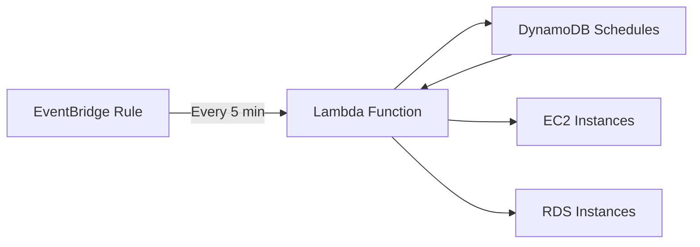

# How to Optimize EC2 Costs with Instance Scheduler

Author: [nawazdhandala](https://github.com/nawazdhandala)

Tags: AWS, EC2, Cost Optimization, Lambda

Description: Learn how to use AWS Instance Scheduler to automatically start and stop EC2 instances on a schedule, reducing your AWS bill significantly.

---

Here's a number that should make you pay attention: if your development and staging EC2 instances run 24/7 but your team only works 10 hours a day on weekdays, you're wasting about 70% of that spending. For a team with 20 dev instances at $0.20/hour each, that's roughly $2,000 per month going straight down the drain.

AWS Instance Scheduler solves this by automatically stopping instances when they're not needed and starting them back up on a schedule. Let's set it up.

## How Instance Scheduler Works

Instance Scheduler is an AWS solution that uses a Lambda function triggered by EventBridge on a regular interval (typically every 5 minutes). It checks a DynamoDB table for schedules, looks for EC2 instances (and RDS instances) tagged with those schedules, and starts or stops them accordingly.



## Deployment Options

You can deploy Instance Scheduler in two ways:

1. **CloudFormation template** - AWS provides a ready-to-use template
2. **CDK/Terraform** - Build your own using the same Lambda logic

We'll use the CloudFormation approach since it's the fastest path to a working setup.

## Step 1: Deploy the CloudFormation Stack

Launch the Instance Scheduler stack using the AWS-provided template:

```bash
# Deploy the Instance Scheduler stack
aws cloudformation create-stack \
    --stack-name instance-scheduler \
    --template-url https://s3.amazonaws.com/solutions-reference/instance-scheduler-on-aws/latest/instance-scheduler-on-aws.template \
    --parameters \
        ParameterKey=SchedulingActive,ParameterValue=Yes \
        ParameterKey=ScheduledServices,ParameterValue=EC2 \
        ParameterKey=DefaultTimezone,ParameterValue=US/Eastern \
        ParameterKey=Regions,ParameterValue=us-east-1 \
        ParameterKey=SchedulerFrequency,ParameterValue=5 \
        ParameterKey=MemorySize,ParameterValue=128 \
    --capabilities CAPABILITY_IAM

# Wait for stack creation to complete
aws cloudformation wait stack-create-complete --stack-name instance-scheduler
echo "Stack deployed successfully!"
```

This creates the Lambda function, DynamoDB table, EventBridge rule, IAM roles, and everything else you need. The stack takes about 5 minutes to deploy.

## Step 2: Install the Scheduler CLI

AWS provides a CLI tool specifically for managing Instance Scheduler. Install it with pip:

```bash
# Install the Instance Scheduler CLI
pip install instance-scheduler-cli

# Verify installation
scheduler-cli --version
```

## Step 3: Create Periods

Periods define the time windows when instances should be running. You can combine multiple periods into a schedule.

Create a business hours period:

```bash
# Create a period for weekday business hours (8 AM to 6 PM)
scheduler-cli create-period \
    --stack instance-scheduler \
    --name business-hours \
    --begintime 08:00 \
    --endtime 18:00 \
    --weekdays mon-fri

# Create a period for extended hours (for teams that work late)
scheduler-cli create-period \
    --stack instance-scheduler \
    --name extended-hours \
    --begintime 07:00 \
    --endtime 22:00 \
    --weekdays mon-fri

# Create a weekend maintenance window
scheduler-cli create-period \
    --stack instance-scheduler \
    --name weekend-maintenance \
    --begintime 06:00 \
    --endtime 12:00 \
    --weekdays sat
```

## Step 4: Create Schedules

Schedules combine one or more periods and define when instances should be running.

Create schedules from your periods:

```bash
# Create a development schedule (weekday business hours only)
scheduler-cli create-schedule \
    --stack instance-scheduler \
    --name dev-schedule \
    --periods business-hours \
    --timezone US/Eastern

# Create a staging schedule (extended hours + weekend maintenance)
scheduler-cli create-schedule \
    --stack instance-scheduler \
    --name staging-schedule \
    --periods "extended-hours,weekend-maintenance" \
    --timezone US/Eastern

# Create a schedule that's always running (24/7) - useful as a default
scheduler-cli create-schedule \
    --stack instance-scheduler \
    --name always-on \
    --periods "running" \
    --timezone US/Eastern
```

List your schedules to verify:

```bash
# List all schedules
scheduler-cli describe-schedules --stack instance-scheduler
```

## Step 5: Tag Your Instances

Now tag your EC2 instances with the schedule they should follow. The default tag key is `Schedule`.

Tag instances with their schedule:

```bash
# Tag a development instance
aws ec2 create-tags \
    --resources i-0abc123def456001 \
    --tags Key=Schedule,Value=dev-schedule

# Tag multiple staging instances at once
aws ec2 create-tags \
    --resources i-0abc123def456002 i-0abc123def456003 i-0abc123def456004 \
    --tags Key=Schedule,Value=staging-schedule

# Tag instances using a filter (tag all instances with Environment=dev)
DEV_INSTANCES=$(aws ec2 describe-instances \
    --filters "Name=tag:Environment,Values=dev" "Name=instance-state-name,Values=running,stopped" \
    --query "Reservations[].Instances[].InstanceId" --output text)

if [ -n "$DEV_INSTANCES" ]; then
    aws ec2 create-tags \
        --resources $DEV_INSTANCES \
        --tags Key=Schedule,Value=dev-schedule
    echo "Tagged instances: $DEV_INSTANCES"
fi
```

## Step 6: Verify It's Working

Give it a few minutes for the scheduler to run, then check the logs.

Check scheduler execution logs:

```bash
# Check the Lambda function logs
LOG_GROUP="/aws/lambda/instance-scheduler-InstanceSchedulerMain"

aws logs get-log-events \
    --log-group-name "$LOG_GROUP" \
    --log-stream-name $(aws logs describe-log-streams \
        --log-group-name "$LOG_GROUP" \
        --order-by LastEventTime \
        --descending \
        --query "logStreams[0].logStreamName" --output text) \
    --limit 50 \
    --query "events[*].message" --output text
```

You can also check the DynamoDB table to see the scheduler's state:

```bash
# Check what the scheduler is tracking
aws dynamodb scan \
    --table-name instance-scheduler-StateTable \
    --query "Items[*].{Instance:service.S,State:current_state.S,Schedule:schedule_name.S}" \
    --output table
```

## Advanced: Custom Schedule for Sprints

Here's a real-world example. Say your team does two-week sprints and needs extra capacity during the last three days of each sprint for testing.

Create a sprint-end schedule:

```bash
# Create a sprint-end period (runs on specific dates)
# You'd update these dates each sprint
scheduler-cli create-period \
    --stack instance-scheduler \
    --name sprint-end \
    --begintime 06:00 \
    --endtime 23:00 \
    --months 2 \
    --monthdays "12-14"

# Create a schedule combining normal hours + sprint-end
scheduler-cli create-schedule \
    --stack instance-scheduler \
    --name sprint-schedule \
    --periods "business-hours,sprint-end" \
    --timezone US/Eastern
```

## Handling Exceptions

Sometimes you need to override the schedule - maybe a deployment is happening after hours, or you need instances running for a demo.

Temporarily override a schedule:

```bash
# Start an instance outside its schedule (manual override)
aws ec2 start-instances --instance-ids i-0abc123def456001

# To prevent the scheduler from stopping it, temporarily remove the tag
aws ec2 delete-tags \
    --resources i-0abc123def456001 \
    --tags Key=Schedule

# When done, add the tag back
aws ec2 create-tags \
    --resources i-0abc123def456001 \
    --tags Key=Schedule,Value=dev-schedule
```

A cleaner approach is to use SSM Parameter Store for maintenance windows:

```bash
# Set a maintenance flag that your schedule checks
aws ssm put-parameter \
    --name "/instance-scheduler/maintenance-mode" \
    --type String \
    --value "true" \
    --overwrite
```

## Cost Savings Calculation

Let's do the math on potential savings.

Estimate your savings from scheduling:

```bash
#!/bin/bash
# calculate-savings.sh - Estimate savings from Instance Scheduler

# Configuration
INSTANCE_COUNT=20
HOURLY_COST=0.20
HOURS_PER_MONTH_ALWAYS_ON=730  # 24 * 30.4

# Business hours only: 10 hours/day * 22 weekdays = 220 hours
HOURS_PER_MONTH_SCHEDULED=220

COST_ALWAYS_ON=$(echo "$INSTANCE_COUNT * $HOURLY_COST * $HOURS_PER_MONTH_ALWAYS_ON" | bc)
COST_SCHEDULED=$(echo "$INSTANCE_COUNT * $HOURLY_COST * $HOURS_PER_MONTH_SCHEDULED" | bc)
SAVINGS=$(echo "$COST_ALWAYS_ON - $COST_SCHEDULED" | bc)
PERCENT=$(echo "scale=1; ($SAVINGS / $COST_ALWAYS_ON) * 100" | bc)

echo "Monthly cost (always on):  \$$COST_ALWAYS_ON"
echo "Monthly cost (scheduled):  \$$COST_SCHEDULED"
echo "Monthly savings:           \$$SAVINGS"
echo "Savings percentage:        ${PERCENT}%"
```

For our example (20 instances at $0.20/hour), this works out to:
- Always on: $2,920/month
- Scheduled: $880/month
- Savings: $2,040/month (about 70%)

That's nearly $25,000 per year saved by adding a few tags and a CloudFormation stack.

## Monitoring the Scheduler

Make sure the scheduler itself is working correctly with some basic monitoring.

Set up alerts for scheduler failures:

```bash
# Create an alarm if the Lambda function errors
aws cloudwatch put-metric-alarm \
    --alarm-name "instance-scheduler-errors" \
    --namespace AWS/Lambda \
    --metric-name Errors \
    --dimensions Name=FunctionName,Value=instance-scheduler-InstanceSchedulerMain \
    --statistic Sum \
    --period 300 \
    --threshold 1 \
    --comparison-operator GreaterThanOrEqualToThreshold \
    --evaluation-periods 1 \
    --alarm-actions arn:aws:sns:us-east-1:123456789012:ops-alerts
```

The Instance Scheduler is one of those rare AWS solutions that pays for itself immediately. The Lambda and DynamoDB costs are negligible - we're talking a few cents per month - while the EC2 savings can be thousands. If you've got non-production instances running around the clock, this should be near the top of your cost optimization list.

For more ways to keep your AWS costs under control, check out how [monitoring your infrastructure](https://oneuptime.com/blog/post/2026-02-12-benchmark-ec2-instance-performance/view) can help identify over-provisioned resources.
