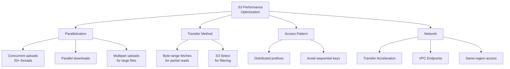

# How to Optimize S3 Performance for High-Throughput Workloads

Author: [nawazdhandala](https://github.com/nawazdhandala)

Tags: AWS, S3, Performance, Optimization, High Throughput

Description: Practical techniques for maximizing S3 throughput and request rates for data-intensive workloads, including parallelization, transfer acceleration, and multipart uploads.

---

S3 can handle enormous throughput - up to 5,500 GET requests per second and 3,500 PUT requests per second per prefix. But hitting those numbers requires knowing how S3 distributes load and designing your access patterns accordingly. If you're processing terabytes of data, running large-scale analytics, or serving high-traffic content, these optimizations can make a massive difference.

## Understanding S3's Performance Model

S3 automatically scales to handle high request rates. The key concept is that S3 partitions your bucket's keyspace and distributes requests across partitions based on key prefixes. Since 2018, S3 no longer requires gradual traffic scaling - you get full performance immediately.

The per-prefix limits are:
- **3,500 PUT/COPY/POST/DELETE requests per second**
- **5,500 GET/HEAD requests per second**

These limits are per prefix. If you distribute your objects across multiple prefixes, you multiply these limits. For a detailed guide on prefix-based optimization, see our post on [S3 prefixes and partitioning](https://oneuptime.com/blog/post/2026-02-12-s3-prefixes-partitioning-better-performance/view).

## Technique 1: Parallel Uploads and Downloads

The single biggest performance improvement is parallelizing your transfers. Instead of uploading files one at a time, use concurrent threads.

```python
import boto3
from concurrent.futures import ThreadPoolExecutor, as_completed
import os
import time

s3 = boto3.client('s3')
BUCKET = 'my-data-bucket'

def upload_file(local_path, s3_key):
    """Upload a single file to S3."""
    s3.upload_file(local_path, BUCKET, s3_key)
    return s3_key

def parallel_upload(directory, s3_prefix, max_workers=20):
    """
    Upload all files in a directory to S3 using parallel threads.
    """
    files = []
    for root, dirs, filenames in os.walk(directory):
        for filename in filenames:
            local_path = os.path.join(root, filename)
            relative_path = os.path.relpath(local_path, directory)
            s3_key = f"{s3_prefix}/{relative_path}"
            files.append((local_path, s3_key))

    start_time = time.time()
    uploaded = 0
    failed = 0

    with ThreadPoolExecutor(max_workers=max_workers) as executor:
        futures = {
            executor.submit(upload_file, local, key): key
            for local, key in files
        }

        for future in as_completed(futures):
            try:
                key = future.result()
                uploaded += 1
            except Exception as e:
                failed += 1
                print(f"Failed: {futures[future]} - {e}")

    elapsed = time.time() - start_time
    print(f"Uploaded {uploaded} files in {elapsed:.1f}s")
    print(f"Throughput: {uploaded / elapsed:.1f} files/second")
    if failed:
        print(f"Failed: {failed}")

# Upload 10,000 files with 20 parallel threads
parallel_upload('/data/exports/', 'exports/2026-02-12', max_workers=20)
```

For downloads, the same pattern applies.

```python
def parallel_download(s3_prefix, local_dir, max_workers=20):
    """Download all objects under a prefix in parallel."""
    os.makedirs(local_dir, exist_ok=True)

    # List all objects
    paginator = s3.get_paginator('list_objects_v2')
    objects = []
    for page in paginator.paginate(Bucket=BUCKET, Prefix=s3_prefix):
        for obj in page.get('Contents', []):
            objects.append(obj['Key'])

    def download_one(key):
        local_path = os.path.join(local_dir, os.path.basename(key))
        s3.download_file(BUCKET, key, local_path)
        return key

    start = time.time()
    with ThreadPoolExecutor(max_workers=max_workers) as executor:
        list(executor.map(download_one, objects))

    elapsed = time.time() - start
    print(f"Downloaded {len(objects)} files in {elapsed:.1f}s")
```

## Technique 2: Multipart Uploads for Large Files

For files larger than 100MB, multipart uploads are essential. They split the file into parts that upload in parallel, and if one part fails, only that part needs to be retried.

```python
import boto3
from boto3.s3.transfer import TransferConfig

s3 = boto3.client('s3')

# Configure multipart upload parameters
config = TransferConfig(
    multipart_threshold=100 * 1024 * 1024,   # Use multipart for files > 100MB
    multipart_chunksize=100 * 1024 * 1024,    # Each part is 100MB
    max_concurrency=10,                        # 10 parallel upload threads
    use_threads=True
)

# Upload a large file with multipart
s3.upload_file(
    'huge-dataset.parquet',
    'my-data-bucket',
    'datasets/huge-dataset.parquet',
    Config=config
)
```

For even more control, use the low-level multipart API.

```python
import boto3
import os
from concurrent.futures import ThreadPoolExecutor

s3 = boto3.client('s3')

def multipart_upload(file_path, bucket, key, part_size=100*1024*1024):
    """
    Upload a large file using multipart upload with parallel parts.
    """
    file_size = os.path.getsize(file_path)

    # Initiate multipart upload
    mpu = s3.create_multipart_upload(Bucket=bucket, Key=key)
    upload_id = mpu['UploadId']

    # Calculate parts
    parts = []
    part_number = 1
    offset = 0

    while offset < file_size:
        end = min(offset + part_size, file_size)
        parts.append({
            'part_number': part_number,
            'offset': offset,
            'size': end - offset
        })
        part_number += 1
        offset = end

    # Upload parts in parallel
    completed_parts = []

    def upload_part(part_info):
        with open(file_path, 'rb') as f:
            f.seek(part_info['offset'])
            data = f.read(part_info['size'])

        response = s3.upload_part(
            Bucket=bucket,
            Key=key,
            UploadId=upload_id,
            PartNumber=part_info['part_number'],
            Body=data
        )

        return {
            'PartNumber': part_info['part_number'],
            'ETag': response['ETag']
        }

    with ThreadPoolExecutor(max_workers=10) as executor:
        completed_parts = list(executor.map(upload_part, parts))

    # Sort by part number
    completed_parts.sort(key=lambda x: x['PartNumber'])

    # Complete the upload
    s3.complete_multipart_upload(
        Bucket=bucket,
        Key=key,
        UploadId=upload_id,
        MultipartUpload={'Parts': completed_parts}
    )

    print(f"Upload complete: {key} ({file_size / 1024 / 1024:.0f} MB)")

multipart_upload('huge-file.tar.gz', 'my-bucket', 'backups/huge-file.tar.gz')
```

## Technique 3: S3 Transfer Acceleration

Transfer Acceleration uses CloudFront edge locations to speed up long-distance transfers. Data routes through the nearest edge location and then travels the AWS backbone network to S3.

Enable it on your bucket.

```bash
# Enable Transfer Acceleration
aws s3api put-bucket-accelerate-configuration \
  --bucket my-global-bucket \
  --accelerate-configuration Status=Enabled
```

Then use the accelerated endpoint.

```python
import boto3

# Create client with Transfer Acceleration endpoint
s3_accelerated = boto3.client(
    's3',
    endpoint_url='https://my-global-bucket.s3-accelerate.amazonaws.com'
)

# Upload through accelerated endpoint
s3_accelerated.upload_file(
    'large-file.zip',
    'my-global-bucket',
    'uploads/large-file.zip'
)
```

Transfer Acceleration adds roughly $0.04-$0.08 per GB on top of normal transfer costs. It's worth it when uploading from far-away regions, but run a speed comparison test first.

```bash
# Run the speed comparison tool
aws s3api put-bucket-accelerate-configuration \
  --bucket my-global-bucket \
  --accelerate-configuration Status=Enabled

# Test with the S3 speed comparison tool
# https://s3-accelerate-speedtest.s3-accelerate.amazonaws.com/en/accelerate-speed-comparsion.html
```

## Technique 4: Byte-Range Fetches

Instead of downloading an entire large file, fetch just the bytes you need. This is especially useful for reading specific records from large files.

```python
import boto3

s3 = boto3.client('s3')

# Download only the first 1MB of a large file
response = s3.get_object(
    Bucket='my-data-bucket',
    Key='datasets/huge-file.parquet',
    Range='bytes=0-1048575'  # First 1MB
)

header_data = response['Body'].read()
print(f"Downloaded {len(header_data)} bytes (header/metadata)")

# Download a specific range in the middle
response = s3.get_object(
    Bucket='my-data-bucket',
    Key='datasets/huge-file.parquet',
    Range='bytes=1048576-2097151'  # Second 1MB
)
```

Combine byte-range fetches with parallelization for maximum throughput.

```python
from concurrent.futures import ThreadPoolExecutor
import io

def parallel_range_download(bucket, key, total_size, chunk_size=10*1024*1024):
    """Download a large file using parallel byte-range fetches."""
    chunks = []
    offset = 0
    while offset < total_size:
        end = min(offset + chunk_size - 1, total_size - 1)
        chunks.append((offset, end))
        offset = end + 1

    results = {}

    def fetch_range(range_tuple):
        start, end = range_tuple
        response = s3.get_object(
            Bucket=bucket,
            Key=key,
            Range=f'bytes={start}-{end}'
        )
        return start, response['Body'].read()

    with ThreadPoolExecutor(max_workers=10) as executor:
        for start, data in executor.map(fetch_range, chunks):
            results[start] = data

    # Reassemble in order
    output = io.BytesIO()
    for start in sorted(results.keys()):
        output.write(results[start])

    return output.getvalue()
```

## Technique 5: Optimize Request Patterns

Avoid request patterns that create hotspots.

```python
# BAD: Sequential key naming creates hotspots
for i in range(1000000):
    s3.put_object(
        Bucket='my-bucket',
        Key=f'data/{i:010d}.json',  # Sequential: 0000000001, 0000000002...
        Body=data
    )

# GOOD: Use hashed prefixes to distribute across partitions
import hashlib

for i in range(1000000):
    hash_prefix = hashlib.md5(str(i).encode()).hexdigest()[:4]
    s3.put_object(
        Bucket='my-bucket',
        Key=f'data/{hash_prefix}/{i}.json',  # Distributed: a1b2/1.json, c3d4/2.json
        Body=data
    )
```

## Performance Tuning Summary



## Monitoring Performance

Keep track of your S3 performance with CloudWatch metrics.

```python
import boto3
from datetime import datetime, timedelta

cloudwatch = boto3.client('cloudwatch')

# Check request latency
response = cloudwatch.get_metric_statistics(
    Namespace='AWS/S3',
    MetricName='FirstByteLatency',
    Dimensions=[
        {'Name': 'BucketName', 'Value': 'my-data-bucket'},
        {'Name': 'FilterId', 'Value': 'EntireBucket'}
    ],
    StartTime=datetime.utcnow() - timedelta(hours=1),
    EndTime=datetime.utcnow(),
    Period=300,
    Statistics=['Average', 'p99']
)

for point in sorted(response['Datapoints'], key=lambda x: x['Timestamp']):
    print(f"Time: {point['Timestamp']}, Avg: {point['Average']:.0f}ms")
```

## Wrapping Up

S3 performance optimization boils down to three principles: parallelize everything, distribute your key space, and choose the right transfer mechanism. Multipart uploads for large files, concurrent threads for many files, byte-range fetches for partial reads, and Transfer Acceleration for cross-region uploads. These techniques can take your throughput from megabytes per second to gigabytes per second without any infrastructure changes.
