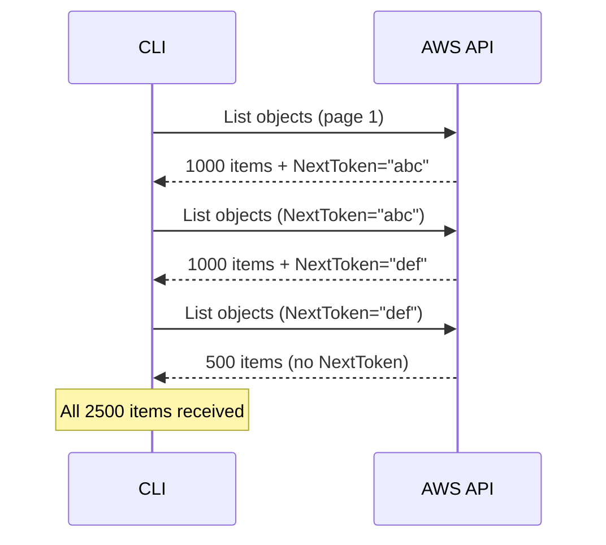

# How to Paginate AWS CLI Output for Large Result Sets

Author: [nawazdhandala](https://github.com/nawazdhandala)

Tags: AWS, CLI, Pagination, Scripting

Description: Learn how to handle paginated AWS CLI output to retrieve complete result sets when API responses are split across multiple pages.

---

You run `aws s3api list-objects-v2 --bucket my-bucket` expecting to see all your files, but you only get 1000. Where are the rest? They're on the next page. Most AWS APIs return paginated results, capping responses at a maximum number of items per call. If you don't handle pagination, you're working with incomplete data.

The AWS CLI has built-in pagination handling for most commands, but understanding how it works - and when you need to manage it yourself - is important for reliable automation.

## How AWS API Pagination Works

When an API has more results than fit in one response, it includes a pagination token (called `NextToken`, `Marker`, `NextContinuationToken`, or similar depending on the API). You pass this token in your next request to get the next page of results.



## Automatic Pagination (The Easy Way)

The AWS CLI automatically paginates most commands by default. When you run a command, it follows pagination tokens behind the scenes and returns the complete result set.

```bash
# This automatically pages through ALL objects
aws s3api list-objects-v2 --bucket my-bucket \
  --query "Contents[].Key"

# This gets ALL instances, even if there are thousands
aws ec2 describe-instances \
  --query "Reservations[].Instances[].InstanceId"

# This gets ALL CloudWatch log groups
aws logs describe-log-groups \
  --query "logGroups[].logGroupName"
```

You don't need to do anything special - the CLI handles it. But there are situations where you want more control.

## Controlling Page Size

The `--page-size` parameter controls how many items the CLI requests per API call. It doesn't limit the total results - it just changes the batch size.

```bash
# Fetch all objects, but in smaller batches (useful for avoiding timeouts)
aws s3api list-objects-v2 \
  --bucket my-bucket \
  --page-size 100 \
  --query "Contents[].Key"

# Smaller page sizes help with:
# - Avoiding API throttling
# - Reducing memory usage for very large result sets
# - Working around timeout issues
```

## Limiting Total Results

The `--max-items` parameter caps the total number of items returned. This is useful when you only need a subset.

```bash
# Get just the first 10 S3 objects
aws s3api list-objects-v2 \
  --bucket my-bucket \
  --max-items 10 \
  --query "Contents[].{Key:Key, Size:Size}"

# Get the first 50 EC2 instances
aws ec2 describe-instances \
  --max-items 50 \
  --query "Reservations[].Instances[].InstanceId"
```

When `--max-items` truncates results, the CLI output includes a `NextToken` that you can use to get the next batch.

```bash
# Get first page of 20 items
RESULT=$(aws s3api list-objects-v2 \
  --bucket my-bucket \
  --max-items 20 \
  --output json)

# Check if there's a next page
NEXT_TOKEN=$(echo "$RESULT" | python3 -c "import sys, json; d=json.load(sys.stdin); print(d.get('NextToken', ''))")

# Get the next page using the token
if [ -n "$NEXT_TOKEN" ]; then
    aws s3api list-objects-v2 \
      --bucket my-bucket \
      --max-items 20 \
      --starting-token "$NEXT_TOKEN"
fi
```

## Disabling Automatic Pagination

Sometimes you want to manage pagination yourself. Use `--no-paginate` to get just one page.

```bash
# Get exactly one page of results
aws ec2 describe-instances \
  --no-paginate \
  --query "Reservations[].Instances[].InstanceId"
```

With `--no-paginate`, you get whatever the API returns in a single call, including any NextToken in the response.

## Manual Pagination in Scripts

For complex scripts that need to process results page by page (to avoid loading everything into memory), handle pagination manually.

```bash
#!/bin/bash
# manual-pagination.sh
# Process S3 objects page by page

BUCKET="my-large-bucket"
PROFILE="${1:-default}"
NEXT_TOKEN=""
PAGE=0
TOTAL=0

while true; do
    PAGE=$((PAGE + 1))

    # Build the command with or without continuation token
    if [ -z "$NEXT_TOKEN" ]; then
        RESULT=$(aws s3api list-objects-v2 \
          --profile "$PROFILE" \
          --bucket "$BUCKET" \
          --max-items 1000 \
          --output json)
    else
        RESULT=$(aws s3api list-objects-v2 \
          --profile "$PROFILE" \
          --bucket "$BUCKET" \
          --max-items 1000 \
          --starting-token "$NEXT_TOKEN" \
          --output json)
    fi

    # Count items on this page
    COUNT=$(echo "$RESULT" | python3 -c "import sys, json; d=json.load(sys.stdin); print(len(d.get('Contents', [])))")
    TOTAL=$((TOTAL + COUNT))
    echo "Page ${PAGE}: ${COUNT} objects (total: ${TOTAL})"

    # Process items on this page
    echo "$RESULT" | python3 -c "
import sys, json
data = json.load(sys.stdin)
for obj in data.get('Contents', []):
    # Do your processing here
    key = obj['Key']
    size = obj['Size']
    # Example: find large files
    if size > 100 * 1024 * 1024:  # 100MB
        print(f'  Large file: {key} ({size / 1024 / 1024:.1f} MB)')
"

    # Check for more pages
    NEXT_TOKEN=$(echo "$RESULT" | python3 -c "import sys, json; d=json.load(sys.stdin); print(d.get('NextToken', ''))")

    if [ -z "$NEXT_TOKEN" ]; then
        echo ""
        echo "Done. Total objects: ${TOTAL}"
        break
    fi
done
```

## Pagination with Python (Boto3)

If you're writing Python scripts, boto3 paginators are the cleaner approach. But if you're sticking with the CLI, here's a Python wrapper that handles pagination cleanly.

```python
#!/usr/bin/env python3
"""
Generic AWS CLI pagination wrapper.
Handles pagination for any AWS CLI command.
"""

import subprocess
import json
import sys

def paginated_cli(command, max_pages=None):
    """
    Execute an AWS CLI command with manual pagination.
    Yields results from each page.
    """
    next_token = None
    page_count = 0

    while True:
        # Build the command
        cmd = command.copy()
        if next_token:
            cmd.extend(['--starting-token', next_token])

        # Execute
        result = subprocess.run(
            cmd,
            capture_output=True,
            text=True
        )

        if result.returncode != 0:
            print(f"Error: {result.stderr}", file=sys.stderr)
            break

        data = json.loads(result.stdout)
        page_count += 1

        yield data

        # Check for next page
        next_token = data.get('NextToken')
        if not next_token:
            break

        if max_pages and page_count >= max_pages:
            print(f"Stopped after {max_pages} pages", file=sys.stderr)
            break

# Example: list all EC2 instances across pages
total_instances = 0
for page in paginated_cli([
    'aws', 'ec2', 'describe-instances',
    '--max-items', '50',
    '--output', 'json'
]):
    reservations = page.get('Reservations', [])
    for res in reservations:
        for instance in res.get('Instances', []):
            total_instances += 1
            print(f"{instance['InstanceId']}: {instance['State']['Name']}")

print(f"\nTotal: {total_instances} instances")
```

## Pagination Gotchas

### 1. JMESPath Queries and Pagination

When using `--query` with automatic pagination, the query runs on the aggregated result of all pages. This is usually what you want, but it means the entire result set is held in memory.

```bash
# This works - query is applied AFTER all pages are collected
aws ec2 describe-instances \
  --query "length(Reservations[].Instances[])"

# For very large result sets, this might use a lot of memory
# Consider using --max-items with manual pagination instead
```

### 2. Different Token Names

Different APIs use different token field names. The CLI's automatic pagination handles this, but if you're scripting manually, be aware.

```bash
# S3 uses ContinuationToken / NextContinuationToken
# EC2 uses NextToken
# IAM uses Marker
# CloudWatch Logs uses nextToken

# The CLI normalizes these to NextToken when using --max-items
```

### 3. Eventual Consistency

Some APIs (notably S3 list operations in older behavior) can show inconsistent results across pages. An object might appear on two pages or disappear between pages if it's being modified. The current S3 behavior provides strong read-after-write consistency, but other services might not.

### 4. Rate Limiting

Rapid pagination can trigger API throttling. Add delays between pages if you're hitting rate limits.

```bash
#!/bin/bash
# Pagination with rate limiting
NEXT_TOKEN=""

while true; do
    # ... fetch page ...

    if [ -z "$NEXT_TOKEN" ]; then
        break
    fi

    # Wait a bit between pages to avoid throttling
    sleep 0.5
done
```

## Practical Example: Export All CloudWatch Metrics

Here's a real-world example that paginates through CloudWatch metrics and exports them.

```bash
#!/bin/bash
# Export all CloudWatch metric names for a namespace

NAMESPACE="${1:?Usage: $0 <namespace> [profile]}"
PROFILE="${2:-default}"
OUTPUT_FILE="metrics_${NAMESPACE//\//_}.txt"

echo "Fetching metrics for namespace: ${NAMESPACE}"

aws cloudwatch list-metrics \
  --profile "$PROFILE" \
  --namespace "$NAMESPACE" \
  --query "Metrics[].{Name:MetricName, Dimensions:Dimensions[].Name}" \
  --output text > "$OUTPUT_FILE"

METRIC_COUNT=$(wc -l < "$OUTPUT_FILE" | tr -d ' ')
echo "Found ${METRIC_COUNT} metrics. Saved to ${OUTPUT_FILE}"
```

The CLI handles pagination automatically here, collecting all metrics across however many pages the API returns.

## Monitoring API Usage

When you're making many paginated API calls, keep an eye on your API usage to avoid throttling. For monitoring your AWS API usage patterns and costs, check out [OneUptime](https://oneuptime.com/blog/post/2026-02-06-aws-cloudwatch-logs-exporter-opentelemetry-collector/view).

## Wrapping Up

Pagination isn't glamorous, but getting it wrong means working with incomplete data - and that leads to bugs, missed resources, and inaccurate reports. The good news is that the CLI handles it automatically for most use cases. You only need manual pagination when you're processing huge datasets page by page to manage memory, or when you need fine-grained control over the paging behavior. Know the `--max-items`, `--page-size`, and `--starting-token` flags, and you'll handle any result set the AWS APIs throw at you.
