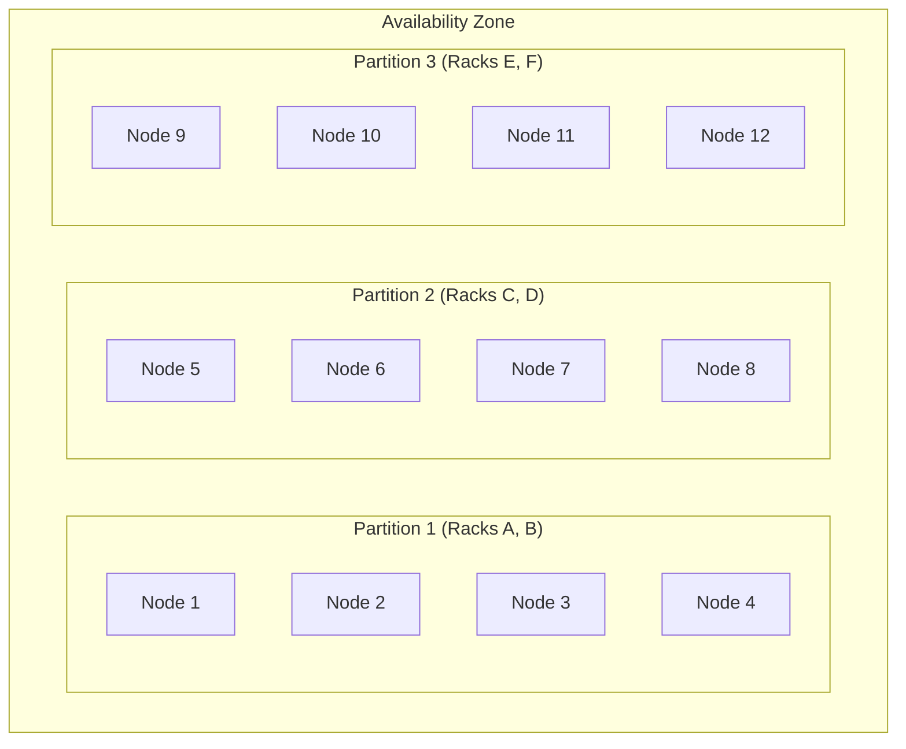

# How to Use Partition Placement Groups for Large Distributed Systems

Author: [nawazdhandala](https://github.com/nawazdhandala)

Tags: AWS, EC2, Placement Groups, Distributed Systems, HDFS, Cassandra

Description: Learn how to use EC2 partition placement groups for large-scale distributed systems like HDFS, Cassandra, and Kafka to minimize correlated failures.

---

Spread placement groups are great for small critical clusters, but they cap out at 7 instances per AZ. If you're running a 100-node Cassandra cluster or a large HDFS deployment, you need something that scales bigger while still providing hardware isolation. That's where partition placement groups come in.

Partition placement groups divide your instances into logical partitions, where each partition sits on a separate set of racks. Instances within the same partition share hardware, but instances in different partitions are guaranteed to be on different racks.

## The Partition Model

Think of it like this: a partition is a group of racks. You can have up to 7 partitions per AZ. Each partition can hold as many instances as you want. The key guarantee is that no two partitions share the same underlying hardware.



If Partition 1's racks experience a failure, all 4 nodes in it go down, but Partitions 2 and 3 are completely unaffected. This maps perfectly to how distributed systems think about fault domains.

## Why This Matters for Distributed Systems

Distributed systems like HDFS, Cassandra, and Kafka already have built-in replication. The problem isn't losing a single node - the system handles that. The problem is losing multiple replicas of the same data simultaneously due to a correlated hardware failure.

By mapping replicas to different partitions, you ensure that a single rack failure can only affect one replica of any given piece of data. The system stays available.

Consider HDFS with a replication factor of 3:
- Replica 1 in Partition 1
- Replica 2 in Partition 2
- Replica 3 in Partition 3

Even if an entire partition fails, 2 out of 3 replicas survive. Your data is safe, and reads continue without interruption.

## Creating a Partition Placement Group

Here's how to create one with the maximum 7 partitions:

```bash
# Create a partition placement group
aws ec2 create-placement-group \
  --group-name distributed-cluster \
  --strategy partition \
  --partition-count 7 \
  --tag-specifications 'ResourceType=placement-group,Tags=[{Key=Name,Value=distributed-cluster},{Key=Service,Value=cassandra}]'
```

The partition count should match or exceed your replication factor. For a replication factor of 3, you need at least 3 partitions. Using more partitions gives you finer-grained fault isolation.

## Launching Instances into Specific Partitions

You can either let AWS auto-assign instances to partitions, or you can explicitly choose which partition each instance goes into.

This command launches an instance into a specific partition number:

```bash
# Launch instance into partition 1
aws ec2 run-instances \
  --image-id ami-0abcdef1234567890 \
  --instance-type i3.2xlarge \
  --count 1 \
  --placement "GroupName=distributed-cluster,PartitionNumber=1" \
  --subnet-id subnet-0123456789abcdef0 \
  --key-name my-keypair \
  --security-group-ids sg-0123456789abcdef0 \
  --tag-specifications 'ResourceType=instance,Tags=[{Key=Name,Value=cassandra-node-1},{Key=Partition,Value=1}]'

# Launch instance into partition 2
aws ec2 run-instances \
  --image-id ami-0abcdef1234567890 \
  --instance-type i3.2xlarge \
  --count 1 \
  --placement "GroupName=distributed-cluster,PartitionNumber=2" \
  --subnet-id subnet-0123456789abcdef0 \
  --key-name my-keypair \
  --security-group-ids sg-0123456789abcdef0 \
  --tag-specifications 'ResourceType=instance,Tags=[{Key=Name,Value=cassandra-node-2},{Key=Partition,Value=2}]'
```

For auto-assignment, omit the `PartitionNumber` and AWS distributes instances across partitions:

```bash
# Let AWS choose the partition
aws ec2 run-instances \
  --image-id ami-0abcdef1234567890 \
  --instance-type i3.2xlarge \
  --count 21 \
  --placement "GroupName=distributed-cluster" \
  --subnet-id subnet-0123456789abcdef0 \
  --key-name my-keypair \
  --security-group-ids sg-0123456789abcdef0
```

## Querying Partition Information

Your application needs to know which partition each instance is in so it can make smart placement decisions. The partition number is available via the instance metadata service.

This script retrieves the partition number from within an EC2 instance:

```bash
# Get partition number from instance metadata
TOKEN=$(curl -s -X PUT "http://169.254.169.254/latest/api/token" \
  -H "X-aws-ec2-metadata-token-ttl-seconds: 60")

PARTITION=$(curl -s -H "X-aws-ec2-metadata-token: $TOKEN" \
  http://169.254.169.254/latest/meta-data/placement/partition-number)

echo "This instance is in partition: $PARTITION"
```

You can also query partition info from outside the instance:

```bash
# Get partition information for all instances in the group
aws ec2 describe-instances \
  --filters "Name=placement-group-name,Values=distributed-cluster" \
  --query 'Reservations[].Instances[].{
    ID:InstanceId,
    Name:Tags[?Key==`Name`].Value|[0],
    AZ:Placement.AvailabilityZone,
    Partition:Placement.PartitionNumber,
    State:State.Name
  }' \
  --output table
```

## Rack-Aware Configuration for Cassandra

Cassandra has a built-in concept of racks (called racks, conveniently). Map each Cassandra rack to a partition for optimal fault tolerance.

Here's a `cassandra-rackdc.properties` configuration that maps to partition-based racks:

```properties
# cassandra-rackdc.properties
# Dynamically set based on partition number
dc=us-east-1
rack=partition-1
```

And a startup script that auto-configures the rack based on the instance's partition:

```bash
#!/bin/bash
# auto-configure-rack.sh - Run at Cassandra startup

TOKEN=$(curl -s -X PUT "http://169.254.169.254/latest/api/token" \
  -H "X-aws-ec2-metadata-token-ttl-seconds: 60")

PARTITION=$(curl -s -H "X-aws-ec2-metadata-token: $TOKEN" \
  http://169.254.169.254/latest/meta-data/placement/partition-number)

REGION=$(curl -s -H "X-aws-ec2-metadata-token: $TOKEN" \
  http://169.254.169.254/latest/meta-data/placement/region)

# Update Cassandra rack configuration
cat > /etc/cassandra/cassandra-rackdc.properties << EOF
dc=$REGION
rack=partition-$PARTITION
EOF

echo "Configured Cassandra: dc=$REGION, rack=partition-$PARTITION"
```

This way, Cassandra's replication strategy naturally distributes replicas across partitions (racks), ensuring hardware-level fault isolation.

## Terraform Configuration for a Large Cluster

Here's a complete Terraform setup for a distributed cluster using partition placement groups:

```hcl
resource "aws_placement_group" "distributed" {
  name            = "distributed-cluster"
  strategy        = "partition"
  partition_count = 7
}

locals {
  # Distribute 21 nodes across 7 partitions (3 per partition)
  nodes = [for i in range(21) : {
    index     = i
    partition = (i % 7) + 1
    name      = "node-${i + 1}"
  }]
}

resource "aws_instance" "cluster_node" {
  for_each = { for node in local.nodes : node.name => node }

  ami                    = var.cluster_ami_id
  instance_type          = "i3.2xlarge"
  key_name               = var.key_name
  subnet_id              = var.subnet_ids[each.value.index % length(var.subnet_ids)]
  vpc_security_group_ids = [aws_security_group.cluster.id]

  placement_group        = aws_placement_group.distributed.id
  placement_partition_number = each.value.partition

  root_block_device {
    volume_type = "gp3"
    volume_size = 50
  }

  tags = {
    Name      = each.value.name
    Partition = each.value.partition
    Role      = "data-node"
  }
}
```

This evenly distributes 21 nodes across 7 partitions, with 3 nodes in each partition.

## HDFS Rack Awareness

HDFS uses rack awareness for replica placement. Configure the rack script to use partition information:

```python
#!/usr/bin/env python3
# topology.py - HDFS rack awareness script

import subprocess
import sys
import json

def get_partition_for_ip(ip):
    """Look up the partition number for an instance by its private IP."""
    result = subprocess.run(
        ['aws', 'ec2', 'describe-instances',
         '--filters', f'Name=private-ip-address,Values={ip}',
         '--query', 'Reservations[0].Instances[0].Placement.PartitionNumber',
         '--output', 'text'],
        capture_output=True, text=True
    )
    partition = result.stdout.strip()
    return f"/partition-{partition}" if partition != "None" else "/default-rack"

if __name__ == "__main__":
    for host in sys.argv[1:]:
        print(get_partition_for_ip(host))
```

Configure HDFS to use this script in `core-site.xml`:

```xml
<property>
  <name>net.topology.script.file.name</name>
  <value>/opt/hadoop/etc/hadoop/topology.py</value>
</property>
```

## Kafka Broker Rack Configuration

Kafka also supports rack-aware replica assignment. Set the `broker.rack` config based on the partition:

```properties
# server.properties
# Set dynamically at startup based on partition number
broker.rack=partition-3
```

This ensures Kafka distributes partition replicas across different hardware partitions.

## Monitoring Partition Health

Set up monitoring that's aware of your partition structure. If an entire partition goes down, you want to know immediately which nodes are affected.

```bash
# Script to check partition health
for partition in $(seq 1 7); do
  COUNT=$(aws ec2 describe-instances \
    --filters \
      "Name=placement-group-name,Values=distributed-cluster" \
      "Name=instance-state-name,Values=running" \
    --query "Reservations[].Instances[?Placement.PartitionNumber==\`$partition\`].InstanceId" \
    --output text | wc -w)

  echo "Partition $partition: $COUNT instances running"
done
```

For automated partition-aware monitoring and alerting, you can integrate with [OneUptime's monitoring](https://oneuptime.com/blog/post/2026-02-12-configure-health-checks-ec2-load-balancer/view) to track the health of each partition and trigger alerts when partition availability drops.

## Summary

Partition placement groups bridge the gap between spread groups (max 7 per AZ) and no placement group at all. They're designed for large distributed systems that already have replication built in - HDFS, Cassandra, Kafka, MongoDB sharded clusters, and similar architectures. By mapping your application's rack awareness to partition numbers, you get hardware-level fault isolation that aligns with your data replication strategy. The result is a distributed system that can survive rack-level failures without data loss or availability impact.
