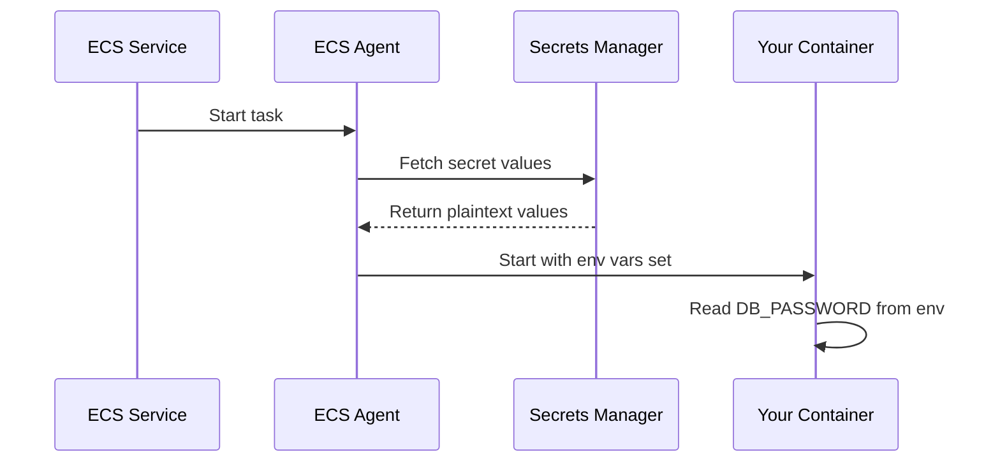

# How to Pass Secrets to ECS Tasks from Secrets Manager

Author: [nawazdhandala](https://github.com/nawazdhandala)

Tags: AWS, ECS, Secrets Manager, Security, Containers

Description: Learn how to securely inject secrets from AWS Secrets Manager into your ECS containers as environment variables or through file-based access patterns.

---

Hardcoding secrets in your container images or task definitions is a recipe for disaster. Database passwords, API keys, certificates - none of these belong in your codebase or Docker images. AWS gives you a clean way to inject secrets from Secrets Manager directly into your ECS containers at runtime. The container sees them as environment variables, but they never touch your image or task definition in plaintext.

Let's walk through how to set this up, including some patterns for different use cases.

## The Basic Flow

When ECS starts a task, the ECS agent (running on the host or as part of the Fargate platform) fetches the secret values from Secrets Manager and injects them into the container's environment. Your application reads them like any other environment variable. The secrets never appear in the task definition - only the ARN reference is stored there.



## Storing Secrets

First, create your secrets in Secrets Manager. You can store them as plain strings or as JSON objects with multiple key-value pairs.

```bash
# Store a simple string secret
aws secretsmanager create-secret \
  --name production/database/password \
  --secret-string "my-super-secret-password"

# Store a JSON secret with multiple values
aws secretsmanager create-secret \
  --name production/database/credentials \
  --secret-string '{"username":"admin","password":"s3cret","host":"db.example.com","port":"5432"}'
```

The JSON approach is handy when you have related values. You can reference individual keys from the JSON in your task definition.

## Task Definition Configuration

In your task definition, use the `secrets` property (not `environment`) to reference Secrets Manager values. Each secret gets mapped to an environment variable name.

```json
{
  "family": "web-app",
  "networkMode": "awsvpc",
  "requiresCompatibilities": ["FARGATE"],
  "cpu": "256",
  "memory": "512",
  "executionRoleArn": "arn:aws:iam::123456789:role/ecsTaskExecutionRole",
  "containerDefinitions": [
    {
      "name": "app",
      "image": "123456789.dkr.ecr.us-east-1.amazonaws.com/web-app:latest",
      "essential": true,
      "secrets": [
        {
          "name": "DB_PASSWORD",
          "valueFrom": "arn:aws:secretsmanager:us-east-1:123456789:secret:production/database/password-AbCdEf"
        },
        {
          "name": "DB_USERNAME",
          "valueFrom": "arn:aws:secretsmanager:us-east-1:123456789:secret:production/database/credentials-AbCdEf:username::"
        },
        {
          "name": "DB_HOST",
          "valueFrom": "arn:aws:secretsmanager:us-east-1:123456789:secret:production/database/credentials-AbCdEf:host::"
        }
      ],
      "environment": [
        {
          "name": "DB_PORT",
          "value": "5432"
        }
      ]
    }
  ]
}
```

Notice the format for JSON secrets: `ARN:json_key::`. The two trailing colons are for the version stage and version ID - leave them empty to get the latest version.

## Referencing JSON Keys

The full format for referencing a specific key within a JSON secret is:

```
arn:aws:secretsmanager:region:account:secret:secret-name:json-key:version-stage:version-id
```

Some common patterns:

```json
{
  "secrets": [
    {
      "name": "DB_PASSWORD",
      "valueFrom": "arn:aws:secretsmanager:us-east-1:123456789:secret:db-creds-AbCdEf:password::"
    },
    {
      "name": "DB_PASSWORD_PREVIOUS",
      "valueFrom": "arn:aws:secretsmanager:us-east-1:123456789:secret:db-creds-AbCdEf:password:AWSPREVIOUS:"
    },
    {
      "name": "FULL_SECRET_JSON",
      "valueFrom": "arn:aws:secretsmanager:us-east-1:123456789:secret:db-creds-AbCdEf"
    }
  ]
}
```

When you omit the JSON key (last example), the entire JSON string is injected as the env var value. Your application can then parse it.

## Execution Role Permissions

The ECS task execution role needs permission to read from Secrets Manager. This is the execution role, not the task role - a distinction that trips people up regularly.

```hcl
# Terraform - Execution role policy for Secrets Manager access
resource "aws_iam_role_policy" "secrets_access" {
  name = "secrets-manager-access"
  role = aws_iam_role.ecs_execution_role.id

  policy = jsonencode({
    Version = "2012-10-17"
    Statement = [
      {
        Effect = "Allow"
        Action = [
          "secretsmanager:GetSecretValue"
        ]
        Resource = [
          "arn:aws:secretsmanager:us-east-1:123456789:secret:production/*"
        ]
      }
    ]
  })
}

# If your secrets are encrypted with a custom KMS key
resource "aws_iam_role_policy" "kms_decrypt" {
  name = "kms-decrypt"
  role = aws_iam_role.ecs_execution_role.id

  policy = jsonencode({
    Version = "2012-10-17"
    Statement = [
      {
        Effect = "Allow"
        Action = [
          "kms:Decrypt"
        ]
        Resource = [
          aws_kms_key.secrets.arn
        ]
      }
    ]
  })
}
```

## Terraform Full Example

Here's a complete Terraform configuration for a service that uses Secrets Manager.

```hcl
# Create the secret
resource "aws_secretsmanager_secret" "db_credentials" {
  name = "production/database/credentials"
}

resource "aws_secretsmanager_secret_version" "db_credentials" {
  secret_id = aws_secretsmanager_secret.db_credentials.id
  secret_string = jsonencode({
    username = "admin"
    password = "change-me-in-console"  # Update via console/CLI, not Terraform
    host     = aws_rds_cluster.main.endpoint
    port     = "5432"
  })
}

# Task definition referencing the secret
resource "aws_ecs_task_definition" "app" {
  family                   = "web-app"
  network_mode             = "awsvpc"
  requires_compatibilities = ["FARGATE"]
  cpu                      = 256
  memory                   = 512
  execution_role_arn       = aws_iam_role.ecs_execution_role.arn
  task_role_arn            = aws_iam_role.ecs_task_role.arn

  container_definitions = jsonencode([
    {
      name      = "app"
      image     = "${aws_ecr_repository.app.repository_url}:latest"
      essential = true

      portMappings = [
        {
          containerPort = 8080
          protocol      = "tcp"
        }
      ]

      # Secrets from Secrets Manager
      secrets = [
        {
          name      = "DB_USERNAME"
          valueFrom = "${aws_secretsmanager_secret.db_credentials.arn}:username::"
        },
        {
          name      = "DB_PASSWORD"
          valueFrom = "${aws_secretsmanager_secret.db_credentials.arn}:password::"
        },
        {
          name      = "DB_HOST"
          valueFrom = "${aws_secretsmanager_secret.db_credentials.arn}:host::"
        }
      ]

      # Non-sensitive config as regular env vars
      environment = [
        {
          name  = "DB_PORT"
          value = "5432"
        },
        {
          name  = "DB_NAME"
          value = "myapp"
        }
      ]

      logConfiguration = {
        logDriver = "awslogs"
        options = {
          "awslogs-group"         = "/ecs/web-app"
          "awslogs-region"        = "us-east-1"
          "awslogs-stream-prefix" = "ecs"
        }
      }
    }
  ])
}
```

## Secret Rotation

Secrets Manager supports automatic rotation, but there's a catch with ECS: running tasks don't automatically pick up rotated secrets. The environment variables are set when the task starts and don't change during the task's lifetime.

To pick up rotated secrets, you need to trigger a new deployment.

```bash
# Force new deployment after secret rotation
aws ecs update-service \
  --cluster my-cluster \
  --service my-service \
  --force-new-deployment
```

You can automate this with a Lambda function triggered by the rotation event.

```python
# Lambda function to trigger ECS redeployment after secret rotation
import boto3

def handler(event, context):
    ecs = boto3.client('ecs')

    # Services that use this secret
    services = [
        {"cluster": "production", "service": "web-app"},
        {"cluster": "production", "service": "api-service"},
    ]

    for svc in services:
        ecs.update_service(
            cluster=svc["cluster"],
            service=svc["service"],
            forceNewDeployment=True
        )
        print(f"Triggered redeployment: {svc['cluster']}/{svc['service']}")
```

## SSM Parameter Store Alternative

You can also use SSM Parameter Store for less sensitive configuration. The syntax is similar but uses `ssm` instead of `secretsmanager`.

```json
{
  "secrets": [
    {
      "name": "API_ENDPOINT",
      "valueFrom": "arn:aws:ssm:us-east-1:123456789:parameter/production/api-endpoint"
    }
  ]
}
```

For a detailed comparison and when to use each, check out our guide on [managing ECS environment variables](https://oneuptime.com/blog/post/pass-environment-variables-ecs-tasks/view).

## Common Mistakes

**Using the task role instead of the execution role**: Secrets injection happens before the container starts, so it needs the execution role. The task role is for what the application does at runtime.

**Forgetting the random suffix**: Secrets Manager ARNs include a random 6-character suffix. Make sure you include it, or use the secret name instead of the full ARN when appropriate.

**Not restricting secret access**: Don't give your execution role `secretsmanager:GetSecretValue` on `*`. Scope it to specific secret ARNs or paths using resource patterns like `arn:aws:secretsmanager:*:*:secret:production/*`.

**Storing secrets in Terraform state**: If you create secrets with Terraform, the values end up in your state file. Consider creating the secret resource in Terraform but setting the value through the console or CLI.

Keeping secrets out of your code and container images is non-negotiable for production workloads. The Secrets Manager integration with ECS makes this straightforward - set up the execution role, reference the secrets in your task definition, and your application just reads environment variables like normal.
