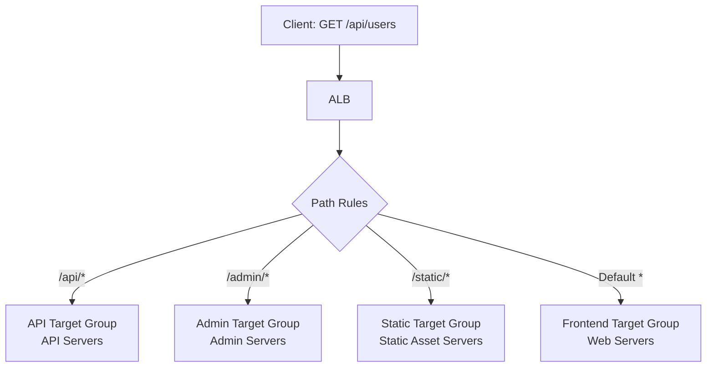

# How to Use Path-Based Routing with Application Load Balancer

Author: [nawazdhandala](https://github.com/nawazdhandala)

Tags: AWS, EC2, ALB, Path-Based Routing, Load Balancing, Microservices

Description: Learn how to configure path-based routing rules on an AWS Application Load Balancer to route requests to different target groups based on URL paths.

---

Path-based routing lets you send requests to different backend services based on the URL path. Requests to `/api/*` go to your API servers, `/images/*` goes to your image service, and everything else goes to your frontend. All through a single ALB with a single domain name.

This is one of the ALB's killer features. It lets you run a microservices architecture behind a single endpoint without needing a separate reverse proxy like Nginx.

## How Path-Based Routing Works

The ALB evaluates listener rules in priority order. Each rule has conditions (like URL path patterns) and actions (like forwarding to a specific target group).



## Setting Up Target Groups

First, create separate target groups for each backend service:

```bash
# API target group
API_TG=$(aws elbv2 create-target-group \
  --name api-targets \
  --protocol HTTP \
  --port 3000 \
  --vpc-id vpc-0123456789abcdef0 \
  --health-check-path /api/health \
  --health-check-interval-seconds 15 \
  --query 'TargetGroups[0].TargetGroupArn' --output text)

# Frontend target group
WEB_TG=$(aws elbv2 create-target-group \
  --name web-targets \
  --protocol HTTP \
  --port 80 \
  --vpc-id vpc-0123456789abcdef0 \
  --health-check-path /health \
  --health-check-interval-seconds 15 \
  --query 'TargetGroups[0].TargetGroupArn' --output text)

# Admin target group
ADMIN_TG=$(aws elbv2 create-target-group \
  --name admin-targets \
  --protocol HTTP \
  --port 8080 \
  --vpc-id vpc-0123456789abcdef0 \
  --health-check-path /admin/health \
  --health-check-interval-seconds 15 \
  --query 'TargetGroups[0].TargetGroupArn' --output text)

# Static assets target group
STATIC_TG=$(aws elbv2 create-target-group \
  --name static-targets \
  --protocol HTTP \
  --port 80 \
  --vpc-id vpc-0123456789abcdef0 \
  --health-check-path /static/health \
  --health-check-interval-seconds 30 \
  --query 'TargetGroups[0].TargetGroupArn' --output text)
```

Register the appropriate instances in each target group:

```bash
# Register API servers
aws elbv2 register-targets --target-group-arn $API_TG \
  --targets Id=i-api1 Id=i-api2 Id=i-api3

# Register web servers
aws elbv2 register-targets --target-group-arn $WEB_TG \
  --targets Id=i-web1 Id=i-web2

# Register admin servers
aws elbv2 register-targets --target-group-arn $ADMIN_TG \
  --targets Id=i-admin1
```

## Creating the Listener with Default Action

Create the HTTPS listener with a default action that catches anything not matched by specific rules:

```bash
# Get the listener ARN
LISTENER_ARN=$(aws elbv2 create-listener \
  --load-balancer-arn $ALB_ARN \
  --protocol HTTPS \
  --port 443 \
  --certificates CertificateArn=$CERT_ARN \
  --ssl-policy ELBSecurityPolicy-TLS13-1-2-2021-06 \
  --default-actions '[{"Type":"forward","TargetGroupArn":"'$WEB_TG'"}]' \
  --query 'Listeners[0].ListenerArn' --output text)
```

The default action is a catch-all. If no other rule matches, traffic goes to the web frontend target group.

## Adding Path-Based Rules

Now add rules for specific paths. Rules are evaluated in priority order (lower number = higher priority):

```bash
# Rule 1: /api/* goes to API servers
aws elbv2 create-rule \
  --listener-arn $LISTENER_ARN \
  --priority 10 \
  --conditions '[{
    "Field": "path-pattern",
    "PathPatternConfig": {
      "Values": ["/api/*"]
    }
  }]' \
  --actions '[{
    "Type": "forward",
    "TargetGroupArn": "'$API_TG'"
  }]'

# Rule 2: /admin/* goes to admin servers
aws elbv2 create-rule \
  --listener-arn $LISTENER_ARN \
  --priority 20 \
  --conditions '[{
    "Field": "path-pattern",
    "PathPatternConfig": {
      "Values": ["/admin/*"]
    }
  }]' \
  --actions '[{
    "Type": "forward",
    "TargetGroupArn": "'$ADMIN_TG'"
  }]'

# Rule 3: /static/* and /assets/* go to static servers
aws elbv2 create-rule \
  --listener-arn $LISTENER_ARN \
  --priority 30 \
  --conditions '[{
    "Field": "path-pattern",
    "PathPatternConfig": {
      "Values": ["/static/*", "/assets/*"]
    }
  }]' \
  --actions '[{
    "Type": "forward",
    "TargetGroupArn": "'$STATIC_TG'"
  }]'
```

## Path Pattern Syntax

The ALB supports these pattern characters:

- `*` matches any number of characters (including none)
- `?` matches exactly one character

Examples:

| Pattern | Matches | Doesn't Match |
|---------|---------|---------------|
| `/api/*` | `/api/users`, `/api/v2/items` | `/api` (no trailing slash or content) |
| `/api/v?/*` | `/api/v1/users`, `/api/v2/items` | `/api/v10/users` |
| `/images/*.jpg` | `/images/photo.jpg` | `/images/photo.png` |
| `*.html` | `/page.html`, `/about/team.html` | `/page.htm` |

## Terraform Configuration

Here's the complete Terraform setup:

```hcl
# ALB
resource "aws_lb" "main" {
  name               = "main-alb"
  internal           = false
  load_balancer_type = "application"
  security_groups    = [aws_security_group.alb.id]
  subnets            = var.public_subnet_ids
}

# Target Groups
resource "aws_lb_target_group" "api" {
  name     = "api-targets"
  port     = 3000
  protocol = "HTTP"
  vpc_id   = var.vpc_id

  health_check {
    path     = "/api/health"
    interval = 15
    matcher  = "200"
  }
}

resource "aws_lb_target_group" "web" {
  name     = "web-targets"
  port     = 80
  protocol = "HTTP"
  vpc_id   = var.vpc_id

  health_check {
    path     = "/health"
    interval = 15
    matcher  = "200"
  }
}

resource "aws_lb_target_group" "admin" {
  name     = "admin-targets"
  port     = 8080
  protocol = "HTTP"
  vpc_id   = var.vpc_id

  health_check {
    path     = "/admin/health"
    interval = 15
    matcher  = "200"
  }
}

# HTTPS Listener with default action
resource "aws_lb_listener" "https" {
  load_balancer_arn = aws_lb.main.arn
  port              = 443
  protocol          = "HTTPS"
  ssl_policy        = "ELBSecurityPolicy-TLS13-1-2-2021-06"
  certificate_arn   = var.certificate_arn

  default_action {
    type             = "forward"
    target_group_arn = aws_lb_target_group.web.arn
  }
}

# Path-based routing rules
resource "aws_lb_listener_rule" "api" {
  listener_arn = aws_lb_listener.https.arn
  priority     = 10

  condition {
    path_pattern {
      values = ["/api/*"]
    }
  }

  action {
    type             = "forward"
    target_group_arn = aws_lb_target_group.api.arn
  }
}

resource "aws_lb_listener_rule" "admin" {
  listener_arn = aws_lb_listener.https.arn
  priority     = 20

  condition {
    path_pattern {
      values = ["/admin/*"]
    }
  }

  action {
    type             = "forward"
    target_group_arn = aws_lb_target_group.admin.arn
  }
}
```

## Advanced: Weighted Target Groups

You can split traffic between multiple target groups for the same path, which is useful for canary deployments:

```bash
# Send 90% to current version, 10% to new version
aws elbv2 create-rule \
  --listener-arn $LISTENER_ARN \
  --priority 5 \
  --conditions '[{
    "Field": "path-pattern",
    "PathPatternConfig": {"Values": ["/api/*"]}
  }]' \
  --actions '[{
    "Type": "forward",
    "ForwardConfig": {
      "TargetGroups": [
        {"TargetGroupArn": "'$API_TG_V1'", "Weight": 90},
        {"TargetGroupArn": "'$API_TG_V2'", "Weight": 10}
      ]
    }
  }]'
```

This is powerful for blue-green and canary deployment patterns. Gradually shift weight from v1 to v2 as you gain confidence.

## Combining Path and Other Conditions

You can combine path patterns with other conditions like HTTP headers, query strings, or source IP:

```bash
# Route /api/* only when X-Version header is "v2"
aws elbv2 create-rule \
  --listener-arn $LISTENER_ARN \
  --priority 5 \
  --conditions '[
    {
      "Field": "path-pattern",
      "PathPatternConfig": {"Values": ["/api/*"]}
    },
    {
      "Field": "http-header",
      "HttpHeaderConfig": {
        "HttpHeaderName": "X-Version",
        "Values": ["v2"]
      }
    }
  ]' \
  --actions '[{
    "Type": "forward",
    "TargetGroupArn": "'$API_TG_V2'"
  }]'
```

## Fixed Response Actions

You can return fixed responses for certain paths without hitting any backend:

```bash
# Return 403 for /internal/* paths
aws elbv2 create-rule \
  --listener-arn $LISTENER_ARN \
  --priority 1 \
  --conditions '[{
    "Field": "path-pattern",
    "PathPatternConfig": {"Values": ["/internal/*", "/.env", "/.git/*"]}
  }]' \
  --actions '[{
    "Type": "fixed-response",
    "FixedResponseConfig": {
      "StatusCode": "403",
      "ContentType": "text/plain",
      "MessageBody": "Forbidden"
    }
  }]'
```

This is useful for blocking access to sensitive paths without them ever reaching your application.

## Managing Rules

List and manage existing rules:

```bash
# List all rules for a listener
aws elbv2 describe-rules \
  --listener-arn $LISTENER_ARN \
  --query 'Rules[].{
    Priority:Priority,
    Conditions:Conditions[].Values|[0],
    Action:Actions[0].Type,
    Target:Actions[0].TargetGroupArn
  }' --output table

# Modify a rule's priority
aws elbv2 set-rule-priorities \
  --rule-priorities RuleArn=arn:aws:...,Priority=5

# Delete a rule
aws elbv2 delete-rule --rule-arn arn:aws:...
```

## Summary

Path-based routing turns a single ALB into a powerful request router for microservices architectures. Route different URL paths to different backend services, each with their own scaling, health checks, and deployment lifecycle. Combine path routing with weighted target groups for canary deployments, and use fixed responses to block sensitive paths. For even more granular routing, look into [host-based routing](https://oneuptime.com/blog/post/2026-02-12-host-based-routing-application-load-balancer/view) to route based on domain names in addition to paths.
