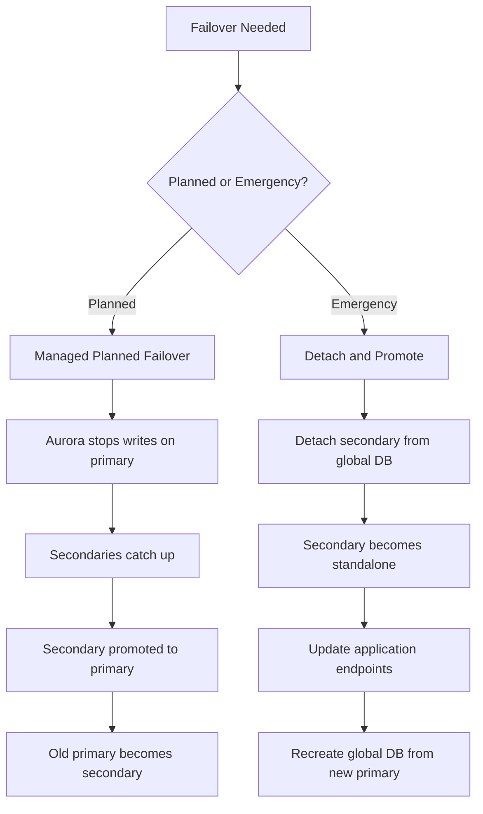

# How to Perform Aurora Global Database Failover

Author: [nawazdhandala](https://github.com/nawazdhandala)

Tags: AWS, Aurora, Failover, Disaster Recovery, Global Database

Description: A practical guide to performing Aurora Global Database failover, covering both planned switchovers and unplanned disaster recovery scenarios with step-by-step instructions.

---

You've set up an Aurora Global Database. Your data is replicating across regions with sub-second lag. Everything looks great on the dashboard. But here's the question that matters most: have you actually tested what happens when things go wrong?

Failover is the single most important operation in a global database setup, and there are two very different kinds. Planned failover (also called switchover) is what you do during maintenance or migration. Unplanned failover is what you do when a region goes down and you need to recover fast. Let's walk through both.

## Understanding the Two Failover Types

Aurora Global Databases support two failover mechanisms:

**Managed planned failover** - This is the graceful path. Aurora stops writes on the primary, waits for all secondary clusters to catch up, promotes a secondary to primary, and demotes the old primary to secondary. Zero data loss. Takes about a minute.

**Unmanaged failover (detach and promote)** - This is the emergency path. You detach a secondary cluster from the global database, making it a standalone cluster that accepts writes. There may be some data loss depending on replication lag at the moment of failure.



## Performing a Managed Planned Failover

This is the approach you should use whenever you have the luxury of planning ahead - region migrations, maintenance windows, or DR testing.

### Via the Console

1. Open the RDS console and navigate to your global database
2. Click **Actions** then **Switch over or fail over global database**
3. Select **Planned managed failover**
4. Choose the secondary cluster you want to promote
5. Confirm and wait for the process to complete

### Via the CLI

The CLI command is straightforward. You specify the global cluster and the ARN of the secondary cluster you want to make the new primary:

```bash
# Perform a managed planned failover to the secondary cluster
aws rds failover-global-cluster \
  --global-cluster-identifier my-global-db \
  --target-db-cluster-identifier arn:aws:rds:eu-west-1:123456789012:cluster:my-secondary-cluster
```

Monitor the status of the failover:

```bash
# Check the global database status during failover
aws rds describe-global-clusters \
  --global-cluster-identifier my-global-db \
  --query 'GlobalClusters[0].{Status:Status,Members:GlobalClusterMembers[*].{Cluster:DBClusterArn,Writer:IsWriter,State:GlobalWriteForwardingStatus}}'
```

The whole operation typically takes 1-2 minutes. During this time, your application won't be able to write to either cluster. Plan accordingly.

## Performing an Emergency Failover (Detach and Promote)

When your primary region is actually down, the managed failover won't work because it needs the primary to be reachable. Instead, you detach the secondary cluster.

### Step 1: Detach the Secondary Cluster

This removes the secondary cluster from the global database and makes it a standalone regional cluster:

```bash
# Detach the secondary cluster from the global database
aws rds remove-from-global-cluster \
  --global-cluster-identifier my-global-db \
  --db-cluster-identifier arn:aws:rds:eu-west-1:123456789012:cluster:my-secondary-cluster \
  --region eu-west-1
```

### Step 2: Verify the Cluster is Now Writable

After detaching, the cluster becomes a regular Aurora cluster that accepts both reads and writes:

```bash
# Check the cluster status - it should show as 'available' and writable
aws rds describe-db-clusters \
  --db-cluster-identifier my-secondary-cluster \
  --region eu-west-1 \
  --query 'DBClusters[0].{Status:Status,Endpoint:Endpoint,ReaderEndpoint:ReaderEndpoint}'
```

### Step 3: Update Your Application

Your application needs to point to the new cluster's endpoints. If you're using Route 53 CNAME records (which you should be), update them now:

```bash
# Update Route 53 to point to the new primary cluster
aws route53 change-resource-record-sets \
  --hosted-zone-id Z1234567890ABC \
  --change-batch '{
    "Changes": [{
      "Action": "UPSERT",
      "ResourceRecordSet": {
        "Name": "db-writer.myapp.internal",
        "Type": "CNAME",
        "TTL": 60,
        "ResourceRecords": [{
          "Value": "my-secondary-cluster.cluster-xyz789.eu-west-1.rds.amazonaws.com"
        }]
      }
    }]
  }'
```

### Step 4: Clean Up and Rebuild

Once the original primary region recovers, you'll want to rebuild the global database. Delete the old global database resource and create a new one from the now-primary cluster in the secondary region:

```bash
# Delete the old global database (after primary region recovers)
aws rds delete-global-cluster \
  --global-cluster-identifier my-global-db

# Create a new global database from the current primary
aws rds create-global-cluster \
  --global-cluster-identifier my-global-db-v2 \
  --source-db-cluster-identifier arn:aws:rds:eu-west-1:123456789012:cluster:my-secondary-cluster \
  --region eu-west-1
```

## Writing a Failover Runbook Script

Having a manual process documented is good. Having a script ready to go is better. Here's a Python script that handles the emergency failover sequence:

```python
import boto3
import time
import sys

def emergency_failover(global_cluster_id, secondary_cluster_arn, secondary_region):
    """
    Perform an emergency failover by detaching a secondary cluster.
    """
    rds = boto3.client('rds', region_name=secondary_region)

    print(f"Starting emergency failover to {secondary_region}...")

    # Step 1: Detach the secondary cluster
    print("Detaching secondary cluster from global database...")
    try:
        rds.remove_from_global_cluster(
            GlobalClusterIdentifier=global_cluster_id,
            DbClusterIdentifier=secondary_cluster_arn
        )
    except Exception as e:
        print(f"Error detaching cluster: {e}")
        sys.exit(1)

    # Step 2: Wait for the cluster to become available
    print("Waiting for cluster to become available...")
    waiter = rds.get_waiter('db_cluster_available')
    cluster_id = secondary_cluster_arn.split(':')[-1]

    waiter.wait(
        DBClusterIdentifier=cluster_id,
        WaiterConfig={'Delay': 10, 'MaxAttempts': 60}
    )

    # Step 3: Verify the cluster is writable
    response = rds.describe_db_clusters(DBClusterIdentifier=cluster_id)
    cluster = response['DBClusters'][0]

    print(f"Cluster status: {cluster['Status']}")
    print(f"New writer endpoint: {cluster['Endpoint']}")
    print(f"New reader endpoint: {cluster['ReaderEndpoint']}")
    print("Failover complete. Update your application endpoints now.")

    return cluster['Endpoint']

if __name__ == "__main__":
    emergency_failover(
        global_cluster_id="my-global-db",
        secondary_cluster_arn="arn:aws:rds:eu-west-1:123456789012:cluster:my-secondary-cluster",
        secondary_region="eu-west-1"
    )
```

## Testing Failover Regularly

You should be testing failover at least quarterly. Here's a testing checklist:

1. **Verify replication lag** - Check that `AuroraGlobalDBReplicationLag` is under 1 second before starting
2. **Run the planned failover** - Use managed failover for routine tests
3. **Validate application behavior** - Make sure reads and writes work against the new primary
4. **Measure total downtime** - Track how long writes are unavailable
5. **Fail back** - Switch back to the original region
6. **Document results** - Record any issues or delays

The first time you test, you'll almost certainly find issues with application connection handling, DNS caching, or security group configurations. That's the whole point of testing.

## Reducing Failover Impact

A few strategies to minimize the blast radius of a failover:

**Use short DNS TTLs.** Set TTLs on your database CNAME records to 60 seconds or less. Long TTLs mean applications keep connecting to the old endpoint after failover.

**Implement connection retry logic.** Your application should retry failed connections automatically:

```python
import time
import pymysql

def get_connection_with_retry(endpoint, max_retries=5):
    """Connect to the database with exponential backoff retry."""
    for attempt in range(max_retries):
        try:
            return pymysql.connect(
                host=endpoint,
                user="app_user",
                password="secret",
                database="myapp",
                connect_timeout=5
            )
        except pymysql.OperationalError as e:
            if attempt == max_retries - 1:
                raise
            wait = 2 ** attempt  # Exponential backoff
            print(f"Connection failed, retrying in {wait}s...")
            time.sleep(wait)
```

**Use RDS Proxy** where possible. RDS Proxy maintains a connection pool and can help smooth out the reconnection process during failover. Check out the guide on [setting up Aurora with RDS Proxy](https://oneuptime.com/blog/post/2026-02-12-set-up-aurora-with-rds-proxy/view) for details.

## Wrapping Up

Failover is something you hope you'll never need in production but absolutely must be prepared for. The managed planned failover is clean and data-safe - use it for testing and planned maintenance. Keep the emergency detach-and-promote process scripted and ready for when a region actually goes down.

The worst time to figure out your failover process is during an actual outage. Test early, test often, and make sure everyone on the team knows where the runbook lives. For more on building resilient Aurora setups, check out the guide on [Aurora Global Databases for multi-region](https://oneuptime.com/blog/post/2026-02-12-set-up-aurora-global-databases-for-multi-region/view) deployments.
