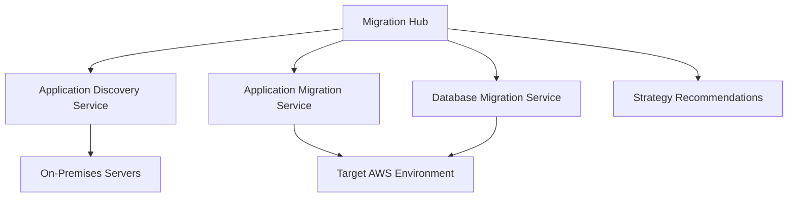
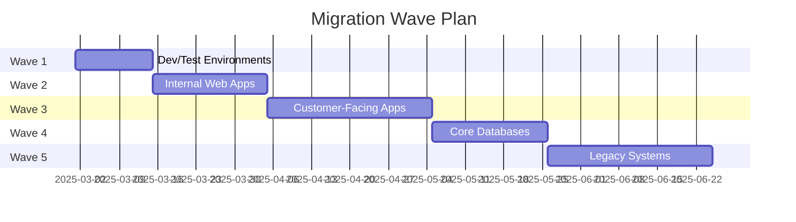

# How to Plan an AWS Migration with the AWS Migration Hub

Author: [nawazdhandala](https://github.com/nawazdhandala)

Tags: AWS, Migration Hub, Cloud Migration, Discovery, Application Migration

Description: Learn how to use AWS Migration Hub to plan, track, and execute your cloud migration with centralized visibility across all migration tools.

---

Migrating to AWS is not something you do on a whim. It requires careful planning, a clear understanding of your existing environment, and a way to track progress across what can be dozens or hundreds of workloads. AWS Migration Hub is the central dashboard that ties together all the AWS migration tools, giving you a single place to plan, track, and manage your migration.

This guide covers how to use Migration Hub to plan and execute a well-organized cloud migration.

## What Migration Hub Actually Does

Migration Hub itself does not move anything. Think of it as the project management layer on top of the actual migration tools. It integrates with:

- **AWS Application Discovery Service** - inventories your on-premises environment
- **AWS Application Migration Service (MGN)** - handles server replication
- **AWS Database Migration Service (DMS)** - handles database migration
- **AWS Server Migration Service (SMS)** - legacy server migration tool



Migration Hub aggregates status from all these tools into a unified view. You can see which applications have been discovered, which are in progress, and which are complete.

## Setting Up Migration Hub

Start by enabling Migration Hub in your chosen home region. This is important because Migration Hub data stays in one region.

```python
# Enable Migration Hub and set home region
import boto3

migration_hub = boto3.client('migrationhub-config')

# Set the home region (this cannot be changed later)
migration_hub.create_home_region_control(
    HomeRegion='us-east-1',
    Target={
        'Type': 'ACCOUNT'
    }
)
```

Once the home region is set, all migration tracking data will be stored there regardless of which region your workloads end up in.

## Phase 1: Discovery

Before you can plan a migration, you need to know what you have. AWS Application Discovery Service provides two methods:

### Agentless Discovery

The agentless approach uses the Discovery Connector, a VMware vCenter appliance that collects VM inventory and performance data.

```python
# Start agentless discovery
import boto3

discovery = boto3.client('discovery')

# After deploying the Discovery Connector to vCenter,
# start data collection
response = discovery.start_data_collection_by_agent_ids(
    agentIds=['connector-id-from-vcenter']
)
```

### Agent-Based Discovery

For deeper insights including network connections, processes, and system performance, install the Discovery Agent on each server.

```bash
# Install Discovery Agent on a Linux server
curl -o aws-discovery-agent.tar.gz \
  https://s3-us-west-2.amazonaws.com/aws-discovery-agent.us-west-2/linux/latest/aws-discovery-agent.tar.gz

tar -xzf aws-discovery-agent.tar.gz
sudo bash install -r us-east-1 \
  -k YOUR_ACCESS_KEY \
  -s YOUR_SECRET_KEY
```

The agent collects detailed performance data, TCP connection data, and process information. This is especially useful for understanding application dependencies.

## Phase 2: Grouping Applications

Once discovery data starts flowing in, group your servers into applications in Migration Hub. This is critical for tracking migration progress at the application level rather than the server level.

```python
# Create application groups in Migration Hub
import boto3

migration_hub = boto3.client('mgh')

# Create an application group
migration_hub.create_progress_update_stream(
    ProgressUpdateStreamName='webapp-migration'
)

# Associate discovered servers with the application
migration_hub.associate_discovered_resource(
    ProgressUpdateStream='webapp-migration',
    MigrationTaskName='migrate-web-app',
    DiscoveredResource={
        'ConfigurationId': 'd-server-abc123',
        'Description': 'Web server - frontend'
    }
)

migration_hub.associate_discovered_resource(
    ProgressUpdateStream='webapp-migration',
    MigrationTaskName='migrate-web-app',
    DiscoveredResource={
        'ConfigurationId': 'd-server-def456',
        'Description': 'Application server - backend'
    }
)

migration_hub.associate_discovered_resource(
    ProgressUpdateStream='webapp-migration',
    MigrationTaskName='migrate-web-app',
    DiscoveredResource={
        'ConfigurationId': 'd-server-ghi789',
        'Description': 'Database server - MySQL'
    }
)
```

## Phase 3: Strategy Recommendations

Migration Hub Strategy Recommendations analyzes your discovered applications and suggests the best migration strategy for each: rehost (lift and shift), replatform, refactor, retire, or retain.

```python
# Get strategy recommendations
import boto3

strategy = boto3.client('migrationhubstrategy')

# Start assessment
response = strategy.start_assessment()

# Get recommendations for a specific server
recommendations = strategy.get_server_details(
    serverId='d-server-abc123'
)

for rec in recommendations.get('serverDetail', {}).get('applicationComponentStrategySummary', []):
    print(f"Strategy: {rec['strategy']}")
    print(f"Recommendation: {rec['recommendation']}")
```

For a deeper look at strategy recommendations, check out our guide on [assessing applications with AWS Migration Hub Strategy Recommendations](https://oneuptime.com/blog/post/2026-02-12-assess-your-applications-with-aws-migration-hub-strategy-recommendations/view).

## Phase 4: Migration Execution

With your plan in place, start executing migrations. Migration Hub tracks progress as you use the individual migration tools.

### For Server Migrations (MGN)

When you start replicating servers with Application Migration Service, the status automatically appears in Migration Hub.

```python
# Notify Migration Hub of migration progress
import boto3

migration_hub = boto3.client('mgh')

# Update migration task status
migration_hub.notify_migration_task_state(
    ProgressUpdateStream='webapp-migration',
    MigrationTaskName='migrate-web-app',
    Task={
        'Status': 'IN_PROGRESS',
        'StatusDetail': 'Server replication at 75%',
        'ProgressPercent': 75
    },
    UpdateDateTime=datetime.now(),
    NextUpdateSeconds=300
)
```

### For Database Migrations (DMS)

Database Migration Service integrations also report status back to Migration Hub automatically when properly configured.

## Phase 5: Tracking and Reporting

Migration Hub's dashboard shows overall migration progress across all applications. You can filter by status, migration tool, or application group.

```python
# Query migration status across all tasks
import boto3

migration_hub = boto3.client('mgh')

# List all migration tasks
response = migration_hub.list_migration_tasks(
    MaxResults=100
)

for task in response['MigrationTaskSummaryList']:
    print(f"Application: {task['ProgressUpdateStream']}")
    print(f"Task: {task['MigrationTaskName']}")
    print(f"Status: {task['Status']}")
    print(f"Progress: {task.get('ProgressPercent', 'N/A')}%")
    print("---")
```

## Building a Migration Wave Plan

Large migrations are typically organized into waves. Each wave contains a group of applications that can be migrated together.



Best practices for wave planning:
- Start with low-risk, non-production workloads to build confidence
- Group tightly coupled applications in the same wave
- Keep each wave small enough to manage (5-10 applications)
- Allow buffer time between waves for learning and adjustment

## Integrating with Your Monitoring Stack

As workloads move to AWS, your monitoring needs to cover both environments during the transition period. Set up CloudWatch for AWS-side monitoring from day one, and keep your existing monitoring running until each workload is fully migrated and validated.

For unified monitoring across on-premises and AWS environments during migration, [OneUptime](https://oneuptime.com/blog/post/2026-02-12-migrate-from-on-premises-to-aws-step-by-step/view) can provide a single pane of glass that works across both environments.

## Common Pitfalls

1. **Skipping discovery**: Migrating without understanding dependencies leads to broken applications
2. **Not setting a home region**: Pick it carefully because it cannot be changed
3. **Migrating in one big bang**: Wave-based migration reduces risk significantly
4. **Ignoring network dependencies**: Server A might work on AWS but fail because it cannot reach Server B still on premises
5. **Not testing rollback procedures**: Always have a way back before cutting over

## Wrapping Up

AWS Migration Hub brings order to what can be a chaotic process. By centralizing discovery data, strategy recommendations, and migration progress tracking, it gives you the visibility you need to confidently move workloads to AWS. Start with thorough discovery, group servers into meaningful application units, plan your waves carefully, and let Migration Hub keep you informed every step of the way.
