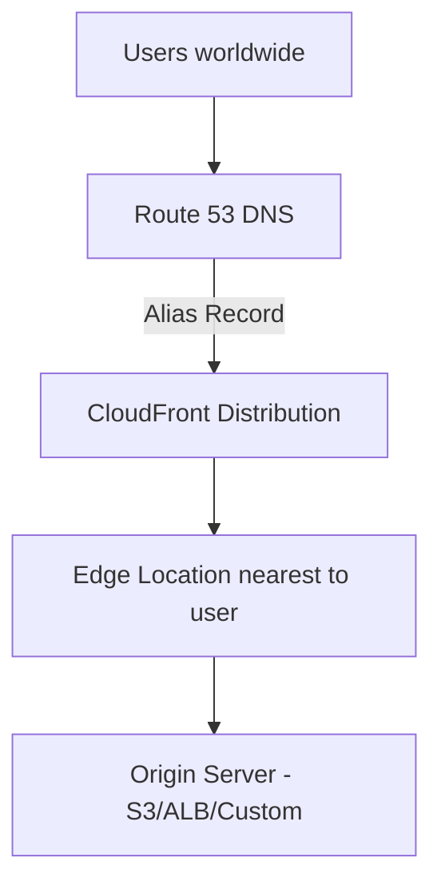

# How to Point a Domain to CloudFront with Route 53

Author: [nawazdhandala](https://github.com/nawazdhandala)

Tags: AWS, Route 53, CloudFront, DNS, CDN

Description: Complete guide to configuring Route 53 alias records to point your custom domain to a CloudFront distribution with SSL/TLS support.

---

CloudFront is AWS's content delivery network, and it works best when you've got a clean custom domain pointing to it rather than the default `d1234abcdef.cloudfront.net` URL. This guide covers how to wire up Route 53 to your CloudFront distribution, including SSL certificate setup and both apex and subdomain configurations.

## What You Need Before Starting

Make sure you have these ready:

- A registered domain with Route 53 (or nameservers pointed to Route 53)
- A Route 53 hosted zone for your domain
- A CloudFront distribution already created (or we'll create one)
- AWS CLI configured with appropriate permissions

## The Architecture

Here's what the final setup looks like:



Route 53 alias records are special - they resolve directly to the CloudFront IP addresses at DNS query time, which means there's no extra DNS hop like you'd get with a CNAME.

## Step 1: Request an SSL Certificate

CloudFront requires an SSL certificate in the **us-east-1** region. This is non-negotiable, even if your other resources are in a different region.

```bash
# Request a certificate in us-east-1 - required for CloudFront
aws acm request-certificate \
  --domain-name example.com \
  --subject-alternative-names "*.example.com" \
  --validation-method DNS \
  --region us-east-1
```

Grab the certificate ARN from the output. Then get the DNS validation records:

```bash
# Get the CNAME records needed for DNS validation
aws acm describe-certificate \
  --certificate-arn arn:aws:acm:us-east-1:123456789:certificate/abc-123 \
  --region us-east-1 \
  --query 'Certificate.DomainValidationOptions[].ResourceRecord'
```

Add those CNAME records to your Route 53 hosted zone:

```bash
# Add the ACM validation CNAME record to Route 53
aws route53 change-resource-record-sets \
  --hosted-zone-id Z1234567890 \
  --change-batch '{
    "Changes": [{
      "Action": "CREATE",
      "ResourceRecordSet": {
        "Name": "_abc123.example.com",
        "Type": "CNAME",
        "TTL": 300,
        "ResourceRecords": [{"Value": "_def456.acm-validations.aws"}]
      }
    }]
  }'
```

Validation usually takes a few minutes. You can check the status:

```bash
# Wait for certificate validation to complete
aws acm wait certificate-validated \
  --certificate-arn arn:aws:acm:us-east-1:123456789:certificate/abc-123 \
  --region us-east-1
```

## Step 2: Add Your Domain as an Alternate Domain in CloudFront

Your CloudFront distribution needs to know about your custom domain. Update the distribution to include your domain as a CNAME (alternate domain name) and attach the SSL certificate.

```bash
# Get the current distribution config
aws cloudfront get-distribution-config \
  --id E1234567890 > dist-config.json
```

Edit the config to add your aliases and certificate. The relevant sections look like this:

```json
{
  "Aliases": {
    "Quantity": 2,
    "Items": ["example.com", "www.example.com"]
  },
  "ViewerCertificate": {
    "ACMCertificateArn": "arn:aws:acm:us-east-1:123456789:certificate/abc-123",
    "SSLSupportMethod": "sni-only",
    "MinimumProtocolVersion": "TLSv1.2_2021"
  }
}
```

Then update the distribution:

```bash
# Update the CloudFront distribution with custom domain and SSL cert
aws cloudfront update-distribution \
  --id E1234567890 \
  --distribution-config file://updated-config.json \
  --if-match E2QWRUHEXAMPLE
```

The `--if-match` value is the ETag from the get-distribution-config response. This prevents concurrent modification issues.

## Step 3: Create Route 53 Alias Records

Now create the alias records that point your domain to CloudFront. You need both an A record (for IPv4) and optionally an AAAA record (for IPv6, since CloudFront supports it).

```json
{
  "Changes": [
    {
      "Action": "CREATE",
      "ResourceRecordSet": {
        "Name": "example.com",
        "Type": "A",
        "AliasTarget": {
          "HostedZoneId": "Z2FDTNDATAQYW2",
          "DNSName": "d1234abcdef.cloudfront.net",
          "EvaluateTargetHealth": false
        }
      }
    },
    {
      "Action": "CREATE",
      "ResourceRecordSet": {
        "Name": "example.com",
        "Type": "AAAA",
        "AliasTarget": {
          "HostedZoneId": "Z2FDTNDATAQYW2",
          "DNSName": "d1234abcdef.cloudfront.net",
          "EvaluateTargetHealth": false
        }
      }
    },
    {
      "Action": "CREATE",
      "ResourceRecordSet": {
        "Name": "www.example.com",
        "Type": "A",
        "AliasTarget": {
          "HostedZoneId": "Z2FDTNDATAQYW2",
          "DNSName": "d1234abcdef.cloudfront.net",
          "EvaluateTargetHealth": false
        }
      }
    },
    {
      "Action": "CREATE",
      "ResourceRecordSet": {
        "Name": "www.example.com",
        "Type": "AAAA",
        "AliasTarget": {
          "HostedZoneId": "Z2FDTNDATAQYW2",
          "DNSName": "d1234abcdef.cloudfront.net",
          "EvaluateTargetHealth": false
        }
      }
    }
  ]
}
```

The `HostedZoneId` value `Z2FDTNDATAQYW2` is always the same for all CloudFront distributions. It's a fixed value that AWS uses internally.

```bash
# Apply the alias records pointing to CloudFront
aws route53 change-resource-record-sets \
  --hosted-zone-id YOUR_HOSTED_ZONE_ID \
  --change-batch file://cloudfront-dns.json
```

## Step 4: Verify Everything Works

Wait a few minutes for DNS propagation, then test:

```bash
# Verify DNS resolution points to CloudFront
dig example.com A +short

# Check that HTTPS works with your domain
curl -I https://example.com

# Verify the SSL certificate is correct
openssl s_client -connect example.com:443 -servername example.com 2>/dev/null | \
  openssl x509 -noout -subject -dates
```

You should see the CloudFront IP addresses in the dig output, an HTTP 200 (or redirect) from curl, and your ACM certificate details from the openssl command.

## Handling WWW to Apex Redirect (or Vice Versa)

Most people want either `www.example.com` redirecting to `example.com` or the other way around. CloudFront doesn't handle this natively, but you can use a CloudFront Function:

```javascript
// CloudFront function to redirect www to apex domain
function handler(event) {
  var request = event.request;
  var host = request.headers.host.value;

  // Redirect www to apex
  if (host.startsWith('www.')) {
    var newUrl = 'https://' + host.substring(4) + request.uri;
    return {
      statusCode: 301,
      statusDescription: 'Moved Permanently',
      headers: {
        'location': { value: newUrl }
      }
    };
  }

  return request;
}
```

For more on CloudFront Functions, check out our guide on [CloudFront Functions for URL rewrites](https://oneuptime.com/blog/post/2026-02-12-cloudfront-functions-url-rewrites/view).

## Troubleshooting Common Issues

**CNAMEAlreadyExists error**: This means another CloudFront distribution already claims your domain. You need to remove it from that distribution first. If you don't control it, contact AWS support.

**SSL certificate not showing up**: Make sure the certificate is in us-east-1 and that it's fully validated. Pending certificates won't appear in the CloudFront console.

**502 Bad Gateway**: This is usually an origin issue, not a DNS issue. Check that your origin server is responding correctly and that the origin protocol policy matches what your origin supports.

**DNS not resolving**: Verify your hosted zone's nameservers match what's configured at your registrar. Use `dig example.com NS` to check.

## Monitoring the Setup

After deployment, monitor both the CloudFront distribution and the DNS resolution. CloudFront provides metrics in CloudWatch, but for end-to-end monitoring that simulates real user requests from multiple locations, a dedicated monitoring service gives you better visibility. You can set up health checks and alerts to catch issues before your users notice them.

## Summary

Pointing a domain to CloudFront via Route 53 involves three main pieces: an ACM certificate in us-east-1, the domain configured as an alternate domain name in CloudFront, and Route 53 alias records pointing to the distribution. Using alias records instead of CNAMEs gives you both apex domain support and zero additional DNS query costs. The whole setup is production-ready once you verify SSL and DNS resolution are working correctly.
