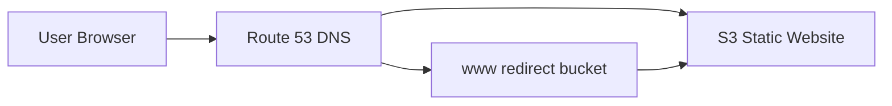
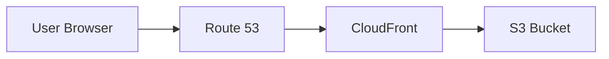

# How to Point a Domain to an S3 Static Website with Route 53

Author: [nawazdhandala](https://github.com/nawazdhandala)

Tags: AWS, Route 53, S3, Static Website, DNS

Description: Learn how to configure Route 53 to point your custom domain to an S3 static website, including bucket setup, DNS records, and HTTPS with CloudFront.

---

Hosting a static website on S3 is one of the cheapest and most reliable ways to serve HTML, CSS, and JavaScript. But nobody wants to share a URL like `my-bucket.s3-website-us-east-1.amazonaws.com`. Let's fix that by pointing your own domain to your S3-hosted site using Route 53.

## The Full Picture

Before diving into the steps, here's what we're building:



You'll need two S3 buckets if you want both `example.com` and `www.example.com` to work. One hosts the content, the other just redirects.

## Step 1: Create the S3 Bucket for Your Website

The bucket name must match your domain name exactly. This is a hard requirement for the S3 website hosting feature.

```bash
# Create the primary bucket matching your domain name
aws s3 mb s3://example.com --region us-east-1
```

Enable static website hosting on the bucket:

```bash
# Enable static website hosting with index and error pages
aws s3 website s3://example.com \
  --index-document index.html \
  --error-document error.html
```

Set the bucket policy to allow public reads:

```json
{
  "Version": "2012-10-17",
  "Statement": [
    {
      "Sid": "PublicReadGetObject",
      "Effect": "Allow",
      "Principal": "*",
      "Action": "s3:GetObject",
      "Resource": "arn:aws:s3:::example.com/*"
    }
  ]
}
```

Apply the policy:

```bash
# Apply the public read bucket policy
aws s3api put-bucket-policy \
  --bucket example.com \
  --policy file://bucket-policy.json
```

Upload your site files:

```bash
# Sync your local website files to the S3 bucket
aws s3 sync ./website/ s3://example.com/ \
  --delete \
  --cache-control "max-age=86400"
```

## Step 2: Create the WWW Redirect Bucket

Create a second bucket for the www subdomain that redirects to the primary:

```bash
# Create the www redirect bucket
aws s3 mb s3://www.example.com --region us-east-1

# Configure it to redirect all requests to the main domain
aws s3 website s3://www.example.com \
  --redirect-all-requests-to example.com
```

This bucket stays empty - it just handles the redirect.

## Step 3: Create the Route 53 Hosted Zone

If you don't already have a hosted zone for your domain, create one:

```bash
# Create a hosted zone for your domain
aws route53 create-hosted-zone \
  --name example.com \
  --caller-reference "s3-website-$(date +%s)"
```

## Step 4: Create DNS Records

Now create alias records that point your domain to the S3 website endpoints. The key here is using alias records instead of CNAME records. Alias records are free in Route 53 (no per-query charge) and work at the zone apex (bare domain).

Create a JSON file for the DNS changes:

```json
{
  "Changes": [
    {
      "Action": "CREATE",
      "ResourceRecordSet": {
        "Name": "example.com",
        "Type": "A",
        "AliasTarget": {
          "HostedZoneId": "Z3AQBSTGFYJSTF",
          "DNSName": "s3-website-us-east-1.amazonaws.com",
          "EvaluateTargetHealth": false
        }
      }
    },
    {
      "Action": "CREATE",
      "ResourceRecordSet": {
        "Name": "www.example.com",
        "Type": "A",
        "AliasTarget": {
          "HostedZoneId": "Z3AQBSTGFYJSTF",
          "DNSName": "s3-website-us-east-1.amazonaws.com",
          "EvaluateTargetHealth": false
        }
      }
    }
  ]
}
```

A quick note about that `HostedZoneId` value - it's not your hosted zone ID. It's the S3 website endpoint's hosted zone ID, which varies by region. For us-east-1, it's `Z3AQBSTGFYJSTF`. Check the [AWS docs](https://docs.aws.amazon.com/general/latest/gr/s3.html) for other regions.

Apply the changes:

```bash
# Create the alias records pointing to S3 website endpoints
aws route53 change-resource-record-sets \
  --hosted-zone-id YOUR_HOSTED_ZONE_ID \
  --change-batch file://dns-records.json
```

## Step 5: Test Your Setup

Give DNS a few minutes to propagate, then test:

```bash
# Test that DNS resolves correctly
dig example.com A +short

# Test the website responds
curl -I http://example.com

# Test the www redirect
curl -I http://www.example.com
```

You should see your site loading at `http://example.com` and `http://www.example.com` redirecting to it.

## Adding HTTPS with CloudFront

S3 website hosting only supports HTTP. If you need HTTPS (and you should), you'll need CloudFront in front of S3. This changes the architecture a bit:



First, request an SSL certificate in ACM. It must be in us-east-1 for CloudFront:

```bash
# Request an SSL certificate - must be in us-east-1 for CloudFront
aws acm request-certificate \
  --domain-name example.com \
  --subject-alternative-names "*.example.com" \
  --validation-method DNS \
  --region us-east-1
```

Validate the certificate by adding the CNAME record that ACM provides to your Route 53 hosted zone. Then create a CloudFront distribution:

```json
{
  "CallerReference": "s3-website-cf",
  "Aliases": {
    "Quantity": 2,
    "Items": ["example.com", "www.example.com"]
  },
  "DefaultRootObject": "index.html",
  "Origins": {
    "Quantity": 1,
    "Items": [
      {
        "Id": "S3-example.com",
        "DomainName": "example.com.s3-website-us-east-1.amazonaws.com",
        "CustomOriginConfig": {
          "HTTPPort": 80,
          "HTTPSPort": 443,
          "OriginProtocolPolicy": "http-only"
        }
      }
    ]
  },
  "DefaultCacheBehavior": {
    "TargetOriginId": "S3-example.com",
    "ViewerProtocolPolicy": "redirect-to-https",
    "AllowedMethods": ["GET", "HEAD"],
    "CachedMethods": ["GET", "HEAD"],
    "ForwardedValues": {
      "QueryString": false,
      "Cookies": {"Forward": "none"}
    },
    "MinTTL": 0,
    "DefaultTTL": 86400,
    "MaxTTL": 31536000
  },
  "ViewerCertificate": {
    "ACMCertificateArn": "arn:aws:acm:us-east-1:123456789:certificate/abc-123",
    "SSLSupportMethod": "sni-only",
    "MinimumProtocolVersion": "TLSv1.2_2021"
  },
  "Enabled": true,
  "Comment": "S3 Static Website Distribution"
}
```

```bash
# Create the CloudFront distribution
aws cloudfront create-distribution \
  --distribution-config file://cloudfront-config.json
```

Then update your Route 53 records to point to CloudFront instead of S3 directly. For more details on CloudFront setup, check out our guide on [creating CloudFront distributions](https://oneuptime.com/blog/post/2026-02-12-cloudfront-distributions-web-applications/view).

## Common Pitfalls

**Bucket name mismatch**: The bucket name must exactly match the domain name. `example.com` won't work with a bucket named `my-example-site`.

**Wrong S3 hosted zone ID**: Each AWS region has a different hosted zone ID for S3 website endpoints. Using the wrong one causes DNS resolution to fail.

**Forgetting the www bucket**: If users type `www.example.com`, they'll get a DNS error unless you create the redirect bucket and corresponding DNS record.

**Mixed content warnings**: If you add CloudFront with HTTPS but your HTML references HTTP resources, browsers will block those resources. Update all internal links to use relative paths or HTTPS.

## Monitoring Your Static Site

Once your site is live, you'll want to know if it goes down. Route 53 health checks can monitor the HTTP endpoint, but for comprehensive monitoring including SSL expiry alerts, response time tracking, and status page updates, a dedicated monitoring tool makes life easier. You can learn more about monitoring approaches in our post on [Route 53 health checks and monitoring](https://oneuptime.com/blog/post/2026-02-12-route-53-health-checks/view).

## Summary

Pointing a domain to an S3 static website involves creating properly named buckets, enabling website hosting, and setting up alias records in Route 53. For production sites, adding CloudFront gives you HTTPS support, better caching, and global edge delivery. The whole setup takes about 15 minutes once you've done it a couple times.
