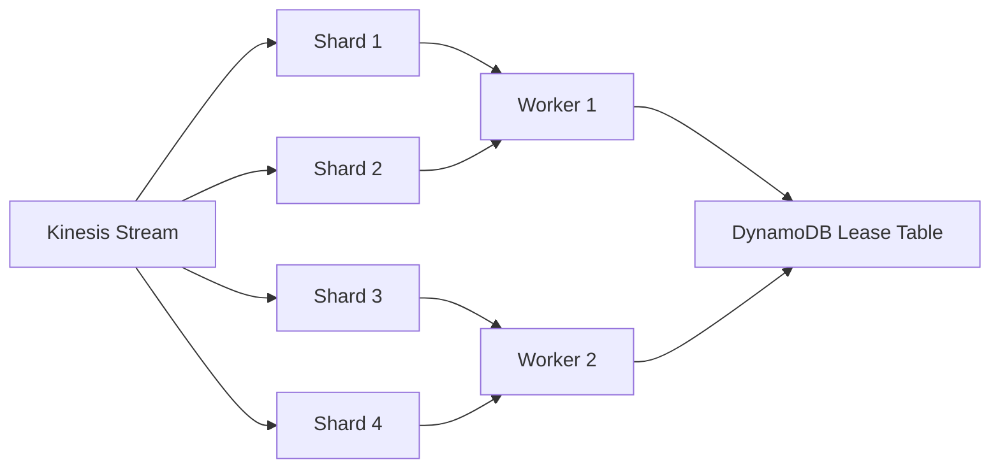

# How to Process Kinesis Streams with KCL (Kinesis Client Library)

Author: [nawazdhandala](https://github.com/nawazdhandala)

Tags: AWS, Kinesis, KCL, Streaming, Java

Description: A hands-on guide to building Kinesis stream consumers using the Kinesis Client Library (KCL) with checkpointing, resharding support, and fault tolerance.

---

The Kinesis Client Library (KCL) is the standard way to build long-running Kinesis consumers. Unlike Lambda, which handles polling and scaling for you, KCL gives you full control over how records are processed, checkpointed, and distributed across workers.

Why would you choose KCL over Lambda? A few reasons: you need sub-second processing latency, your processing requires long-running computations, you want to maintain in-memory state, or your workload doesn't fit Lambda's 15-minute timeout. Let's build a KCL consumer from scratch.

## How KCL Works

KCL coordinates multiple workers to process records from a Kinesis stream. Here's the model:

- Each shard gets assigned to exactly one worker (record processor)
- KCL uses a DynamoDB table to track shard leases and checkpoints
- When workers start or stop, KCL automatically rebalances shard assignments
- Checkpointing records your progress so you can resume after failures



## Setting Up KCL in Java

First, add the KCL dependency to your project.

This Maven dependency adds KCL 2.x to your project.

```xml
<dependency>
    <groupId>software.amazon.kinesis</groupId>
    <artifactId>amazon-kinesis-client</artifactId>
    <version>2.5.8</version>
</dependency>
```

## Implementing the Record Processor

The record processor is where your business logic lives. You implement the `ShardRecordProcessor` interface.

This record processor processes events and checkpoints after every 100 records or 60 seconds.

```java
import software.amazon.kinesis.lifecycle.events.*;
import software.amazon.kinesis.processor.ShardRecordProcessor;
import software.amazon.kinesis.retrieval.KinesisClientRecord;

import java.nio.charset.StandardCharsets;
import java.time.Instant;

public class EventRecordProcessor implements ShardRecordProcessor {

    private String shardId;
    private long recordsProcessed = 0;
    private Instant lastCheckpointTime = Instant.now();

    @Override
    public void initialize(InitializationInput initializationInput) {
        this.shardId = initializationInput.shardId();
        System.out.println("Initialized processor for shard: " + shardId);
    }

    @Override
    public void processRecords(ProcessRecordsInput processRecordsInput) {
        for (KinesisClientRecord record : processRecordsInput.records()) {
            try {
                // Decode the record data
                String data = StandardCharsets.UTF_8.decode(record.data()).toString();
                processEvent(data, record.sequenceNumber());
                recordsProcessed++;
            } catch (Exception e) {
                System.err.println("Error processing record: " + e.getMessage());
                // Decide: skip the record or throw to stop processing
            }
        }

        // Checkpoint periodically
        if (shouldCheckpoint()) {
            try {
                processRecordsInput.checkpointer().checkpoint();
                lastCheckpointTime = Instant.now();
                System.out.println("Checkpointed shard " + shardId +
                    " after " + recordsProcessed + " records");
            } catch (Exception e) {
                System.err.println("Checkpoint failed: " + e.getMessage());
            }
        }
    }

    private boolean shouldCheckpoint() {
        // Checkpoint every 100 records or every 60 seconds
        return recordsProcessed % 100 == 0 ||
            Instant.now().isAfter(lastCheckpointTime.plusSeconds(60));
    }

    private void processEvent(String data, String sequenceNumber) {
        // Your business logic here
        System.out.println("Processing: " + data);
    }

    @Override
    public void leaseLost(LeaseLostInput leaseLostInput) {
        // Another worker took over this shard
        System.out.println("Lost lease for shard: " + shardId);
    }

    @Override
    public void shardEnded(ShardEndedInput shardEndedInput) {
        // Shard was split or merged - checkpoint to complete processing
        try {
            shardEndedInput.checkpointer().checkpoint();
            System.out.println("Shard ended: " + shardId);
        } catch (Exception e) {
            System.err.println("Checkpoint on shard end failed: " + e.getMessage());
        }
    }

    @Override
    public void shutdownRequested(ShutdownRequestedInput shutdownRequestedInput) {
        // Graceful shutdown - checkpoint before exiting
        try {
            shutdownRequestedInput.checkpointer().checkpoint();
            System.out.println("Shutdown requested for shard: " + shardId);
        } catch (Exception e) {
            System.err.println("Checkpoint on shutdown failed: " + e.getMessage());
        }
    }
}
```

## Creating the Record Processor Factory

KCL needs a factory to create processor instances for each shard.

```java
import software.amazon.kinesis.processor.ShardRecordProcessor;
import software.amazon.kinesis.processor.ShardRecordProcessorFactory;

public class EventRecordProcessorFactory implements ShardRecordProcessorFactory {
    @Override
    public ShardRecordProcessor shardRecordProcessor() {
        return new EventRecordProcessor();
    }
}
```

## Configuring and Starting the KCL Application

Now wire everything together and start the KCL scheduler.

This configures and starts the KCL application with enhanced fan-out enabled.

```java
import software.amazon.awssdk.regions.Region;
import software.amazon.awssdk.services.cloudwatch.CloudWatchAsyncClient;
import software.amazon.awssdk.services.dynamodb.DynamoDbAsyncClient;
import software.amazon.awssdk.services.kinesis.KinesisAsyncClient;
import software.amazon.kinesis.common.ConfigsBuilder;
import software.amazon.kinesis.coordinator.Scheduler;
import software.amazon.kinesis.retrieval.fanout.FanOutConfig;
import software.amazon.kinesis.retrieval.polling.PollingConfig;

public class KinesisConsumerApp {

    public static void main(String[] args) {
        String streamName = "user-events";
        String applicationName = "event-processor";
        Region region = Region.US_EAST_1;

        // Create AWS clients
        KinesisAsyncClient kinesisClient = KinesisAsyncClient.builder()
            .region(region)
            .build();

        DynamoDbAsyncClient dynamoClient = DynamoDbAsyncClient.builder()
            .region(region)
            .build();

        CloudWatchAsyncClient cloudWatchClient = CloudWatchAsyncClient.builder()
            .region(region)
            .build();

        // Build configuration
        ConfigsBuilder configsBuilder = new ConfigsBuilder(
            streamName,
            applicationName,
            kinesisClient,
            dynamoClient,
            cloudWatchClient,
            "worker-" + java.util.UUID.randomUUID(),
            new EventRecordProcessorFactory()
        );

        // Create the scheduler
        Scheduler scheduler = new Scheduler(
            configsBuilder.checkpointConfig(),
            configsBuilder.coordinatorConfig(),
            configsBuilder.leaseManagementConfig(),
            configsBuilder.lifecycleConfig(),
            configsBuilder.metricsConfig(),
            configsBuilder.processorConfig(),
            configsBuilder.retrievalConfig()
                .retrievalSpecificConfig(
                    new FanOutConfig(kinesisClient)
                        .streamName(streamName)
                        .applicationName(applicationName)
                )
        );

        // Start processing
        Thread schedulerThread = new Thread(scheduler);
        schedulerThread.setDaemon(true);
        schedulerThread.start();

        // Add shutdown hook
        Runtime.getRuntime().addShutdownHook(new Thread(() -> {
            scheduler.shutdown();
            System.out.println("Scheduler shut down");
        }));

        // Keep the main thread alive
        try {
            schedulerThread.join();
        } catch (InterruptedException e) {
            System.out.println("Main thread interrupted");
        }
    }
}
```

## Using Polling Instead of Enhanced Fan-Out

If you don't need enhanced fan-out (or want to save cost), use polling mode instead. Replace the retrieval config.

```java
configsBuilder.retrievalConfig()
    .retrievalSpecificConfig(
        new PollingConfig(streamName, kinesisClient)
            .maxRecords(100)
            .idleTimeBetweenReadsInMillis(1000)
    )
```

Polling shares the 2 MB/sec read throughput per shard across all consumers. Enhanced fan-out gives each consumer its own 2 MB/sec. Choose based on your number of consumers and latency requirements.

## KCL in Python

KCL 2.x has a Python wrapper that uses the Java library under the hood. But for simpler Python consumers, you can build your own using boto3.

This Python consumer implements basic KCL-like behavior with checkpointing to DynamoDB.

```python
import boto3
import json
import time
from datetime import datetime

kinesis = boto3.client('kinesis', region_name='us-east-1')
dynamodb = boto3.resource('dynamodb', region_name='us-east-1')
checkpoint_table = dynamodb.Table('kinesis-checkpoints')

def get_checkpoint(shard_id):
    """Get the last checkpoint for a shard."""
    try:
        response = checkpoint_table.get_item(Key={'shardId': shard_id})
        return response.get('Item', {}).get('sequenceNumber')
    except Exception:
        return None

def save_checkpoint(shard_id, sequence_number):
    """Save a checkpoint for a shard."""
    checkpoint_table.put_item(Item={
        'shardId': shard_id,
        'sequenceNumber': sequence_number,
        'updatedAt': datetime.utcnow().isoformat()
    })

def process_shard(stream_name, shard_id):
    """Process records from a single shard."""
    checkpoint = get_checkpoint(shard_id)

    if checkpoint:
        iterator_response = kinesis.get_shard_iterator(
            StreamName=stream_name,
            ShardId=shard_id,
            ShardIteratorType='AFTER_SEQUENCE_NUMBER',
            StartingSequenceNumber=checkpoint
        )
    else:
        iterator_response = kinesis.get_shard_iterator(
            StreamName=stream_name,
            ShardId=shard_id,
            ShardIteratorType='TRIM_HORIZON'
        )

    shard_iterator = iterator_response['ShardIterator']
    records_since_checkpoint = 0

    while shard_iterator:
        response = kinesis.get_records(
            ShardIterator=shard_iterator,
            Limit=100
        )

        for record in response['Records']:
            data = json.loads(record['Data'])
            process_event(data)
            records_since_checkpoint += 1

            # Checkpoint every 50 records
            if records_since_checkpoint >= 50:
                save_checkpoint(shard_id, record['SequenceNumber'])
                records_since_checkpoint = 0

        shard_iterator = response.get('NextShardIterator')

        if not response['Records']:
            time.sleep(1)  # Avoid excessive polling

def process_event(data):
    print(f"Processing event: {data}")

# Main loop
stream_name = 'user-events'
shards = kinesis.list_shards(StreamName=stream_name)
for shard in shards['Shards']:
    process_shard(stream_name, shard['ShardId'])
```

## Monitoring KCL Applications

KCL publishes metrics to CloudWatch automatically. The important ones:

- **RecordProcessor.processRecords.Time** - Processing duration
- **RecordProcessor.processRecords.Count** - Records processed per invocation
- **MillisBehindLatest** - Consumer lag (equivalent to iterator age)
- **LeasesHeld** - Number of shards this worker owns

The DynamoDB lease table also gives you visibility into shard assignments. Check it to see which worker owns which shard.

```bash
aws dynamodb scan \
  --table-name event-processor \
  --projection-expression "leaseKey, leaseOwner, checkpoint"
```

For monitoring your Kinesis pipeline end-to-end, you can integrate these metrics into OneUptime to get a unified view alongside your other infrastructure. If you're also using Lambda consumers, check out our guide on [processing Kinesis streams with Lambda](https://oneuptime.com/blog/post/2026-02-12-process-kinesis-streams-with-lambda/view).

## Common KCL Issues

1. **DynamoDB throughput exceeded** - The lease table needs enough capacity. Use on-demand billing or provision adequate read/write capacity.
2. **Uneven shard distribution** - If one worker holds more shards than others, check that all workers can reach DynamoDB and have similar network latency.
3. **Checkpointing too infrequently** - If your processor crashes, it has to reprocess everything since the last checkpoint. Balance between checkpoint frequency and DynamoDB costs.
4. **Not handling shard end** - When shards split or merge, you must checkpoint in `shardEnded()` or you'll lose progress.

KCL gives you the most control over how you consume Kinesis streams. The trade-off is more operational complexity compared to Lambda. Use KCL when you need low latency, stateful processing, or workloads that don't fit the serverless model.
