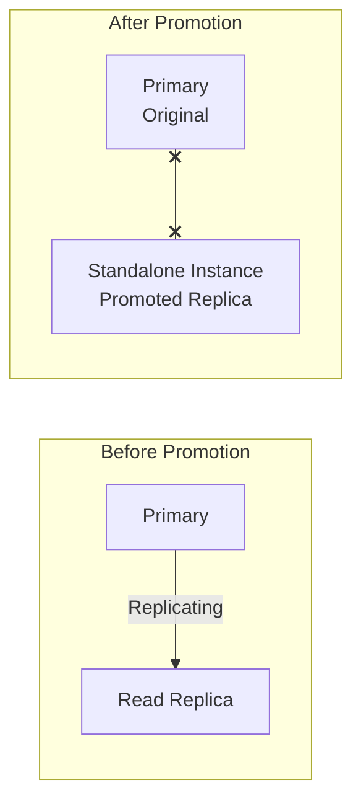

# How to Promote an RDS Read Replica to a Standalone Instance

Author: [nawazdhandala](https://github.com/nawazdhandala)

Tags: AWS, RDS, Read Replicas, Database

Description: Learn how to promote an RDS read replica to a standalone database instance, including when to use this feature and what happens during promotion.

---

Promoting a read replica to a standalone instance is one of those features you might not use often, but when you need it, it's invaluable. Whether you're setting up a disaster recovery procedure, migrating databases, or splitting a monolith, understanding replica promotion saves you time and prevents data loss.

## When Would You Promote a Replica?

There are several common scenarios:

**Disaster recovery**: Your primary instance is in a region that's experiencing issues. You promote a cross-region replica to become the new primary in a healthy region.

**Database migration**: You're moving to a new AWS account or want to create an independent copy of your database for a different team.

**Application splitting**: A microservice is being carved out and needs its own database. Promote a replica, then clean up the tables it doesn't need.

**Upgrading the engine version**: Create a replica, promote it, upgrade the standalone instance, test, then switch your application over.

**Testing with production data**: Promote a replica to get a writable copy of production data for load testing.

## What Happens During Promotion

When you promote a replica, RDS performs these steps:

1. **Stops replication** from the primary
2. **Reboots the replica** to clear read-only mode
3. **Makes it writable** - it becomes an independent instance
4. **Creates a new endpoint** (actually keeps the same endpoint)

After promotion, the instance is completely independent. It no longer receives updates from the original primary. Any writes to the old primary won't appear on the promoted instance, and vice versa.



Important: The endpoint URL of the replica stays the same after promotion. Any applications pointing to the replica endpoint will now be connecting to a standalone, writable instance.

## Promoting a Replica - CLI

The command is simple. RDS handles the rest.

This command promotes a read replica to a standalone instance.

```bash
aws rds promote-read-replica \
  --db-instance-identifier my-db-replica-1
```

You can also configure backup settings during promotion, since replicas don't have independent backups.

This command promotes the replica and enables daily automated backups.

```bash
aws rds promote-read-replica \
  --db-instance-identifier my-db-replica-1 \
  --backup-retention-period 7 \
  --preferred-backup-window "03:00-04:00"
```

## Promotion Timeline

The promotion process typically takes a few minutes. Here's what to expect:

1. You issue the promote command
2. Instance status changes to "modifying"
3. RDS stops replication
4. Instance reboots (brief downtime, usually under a minute)
5. Instance status changes to "available"
6. The instance is now standalone and writable

During the reboot, existing connections to the replica are dropped. Your application will need to reconnect.

## Monitoring the Promotion

Watch the instance status and events during promotion.

This script monitors the promotion progress.

```bash
# Watch the instance status
watch -n 5 "aws rds describe-db-instances \
  --db-instance-identifier my-db-replica-1 \
  --query 'DBInstances[0].{Status:DBInstanceStatus,ReadReplica:ReadReplicaSourceDBInstanceIdentifier}' \
  --output table"
```

When `ReadReplicaSourceDBInstanceIdentifier` is empty and status is "available," the promotion is complete.

You can also check events.

```bash
aws rds describe-events \
  --source-identifier my-db-replica-1 \
  --source-type db-instance \
  --duration 60
```

## Post-Promotion Checklist

After promoting a replica, there are several things to configure:

### 1. Enable Backups

Replicas don't have their own automated backups. After promotion, set up backups.

```bash
aws rds modify-db-instance \
  --db-instance-identifier my-db-replica-1 \
  --backup-retention-period 7 \
  --preferred-backup-window "03:00-04:00" \
  --apply-immediately
```

### 2. Enable Multi-AZ

If this instance will serve production traffic, enable Multi-AZ for high availability.

```bash
aws rds modify-db-instance \
  --db-instance-identifier my-db-replica-1 \
  --multi-az \
  --apply-immediately
```

### 3. Enable Deletion Protection

Prevent accidental deletion.

```bash
aws rds modify-db-instance \
  --db-instance-identifier my-db-replica-1 \
  --deletion-protection \
  --apply-immediately
```

### 4. Review Security Groups

The promoted instance keeps the same security groups as the replica. If the replica had different access requirements than a primary database, update the security groups.

### 5. Update Monitoring

Set up CloudWatch alarms for the promoted instance. Replicas have different monitoring needs than primary databases - now that it's standalone, add write-related alarms.

## Automating Promotion for Disaster Recovery

Here's a script that automates the promotion process for a DR scenario.

This Python script handles the full promotion workflow including waiting for completion and post-promotion configuration.

```python
import boto3
import time

rds = boto3.client('rds')

def promote_for_dr(replica_identifier):
    print(f"Promoting {replica_identifier} to standalone instance...")

    # Start promotion
    rds.promote_read_replica(
        DBInstanceIdentifier=replica_identifier,
        BackupRetentionPeriod=7,
        PreferredBackupWindow='03:00-04:00'
    )

    # Wait for promotion to complete
    print("Waiting for promotion to complete...")
    waiter = rds.get_waiter('db_instance_available')
    waiter.wait(
        DBInstanceIdentifier=replica_identifier,
        WaiterConfig={'Delay': 15, 'MaxAttempts': 60}
    )

    # Verify it's no longer a replica
    response = rds.describe_db_instances(
        DBInstanceIdentifier=replica_identifier
    )
    instance = response['DBInstances'][0]

    if instance.get('ReadReplicaSourceDBInstanceIdentifier'):
        raise Exception("Instance is still a replica!")

    print(f"Promotion complete. Endpoint: {instance['Endpoint']['Address']}")

    # Enable Multi-AZ for the new primary
    print("Enabling Multi-AZ...")
    rds.modify_db_instance(
        DBInstanceIdentifier=replica_identifier,
        MultiAZ=True,
        DeletionProtection=True,
        ApplyImmediately=True
    )

    print("Done! Instance is now a standalone primary with Multi-AZ.")
    return instance['Endpoint']['Address']

# Run the promotion
endpoint = promote_for_dr('my-db-replica-1')
print(f"Update your application to use: {endpoint}")
```

## Promoting Cross-Region Replicas

Cross-region replica promotion works the same way, but it's particularly useful for regional failover. If your primary region goes down, promote the cross-region replica.

```bash
# From the replica's region
aws rds promote-read-replica \
  --db-instance-identifier my-dr-replica \
  --region us-west-2
```

After promotion, you'll need to update your application's database configuration to point to the new endpoint in the new region. This is where DNS-based solutions or configuration management become important.

For details on cross-region replicas, check out [creating cross-region RDS read replicas](https://oneuptime.com/blog/post/2026-02-12-create-cross-region-rds-read-replicas/view).

## MySQL-Specific Considerations

For MySQL replicas, promotion includes some additional steps:

- Binary logging might not be enabled on the replica. After promotion, enable it if you plan to create replicas from this instance.
- The `read_only` parameter is automatically set to `false` after promotion.
- GTID-based replication settings are maintained.

This enables binary logging on the promoted MySQL instance.

```bash
# Create a parameter group with binary logging enabled
aws rds create-db-parameter-group \
  --db-parameter-group-name promoted-mysql-params \
  --db-parameter-group-family mysql8.0 \
  --description "Parameters for promoted replica"

aws rds modify-db-parameter-group \
  --db-parameter-group-name promoted-mysql-params \
  --parameters "ParameterName=binlog_format,ParameterValue=ROW,ApplyMethod=pending-reboot"

# Apply to the promoted instance
aws rds modify-db-instance \
  --db-instance-identifier my-db-replica-1 \
  --db-parameter-group-name promoted-mysql-params \
  --apply-immediately
```

## PostgreSQL-Specific Considerations

For PostgreSQL replicas:
- The WAL receiver process stops after promotion
- The instance performs crash recovery for any in-flight WAL records
- `hot_standby` mode is disabled and the instance runs in normal mode
- Replication slots (if any) from the old primary are not carried over

## Rollback Options

Promotion is irreversible. Once a replica is promoted, you can't turn it back into a replica of the original primary. If you need to go back:

1. Create a new read replica from the original primary
2. Wait for it to sync
3. Switch your application back to the original primary

This is why you should always plan promotions carefully and have a rollback plan.

## Wrapping Up

Promoting an RDS read replica is a straightforward operation with a powerful impact. It takes a read-only copy and turns it into an independent, writable database in minutes. The key things to remember: promotion is irreversible, backups need to be configured after promotion, and the promoted instance keeps its existing endpoint. Whether you're using it for disaster recovery, database migration, or testing, replica promotion is a fundamental tool in your RDS toolkit.
