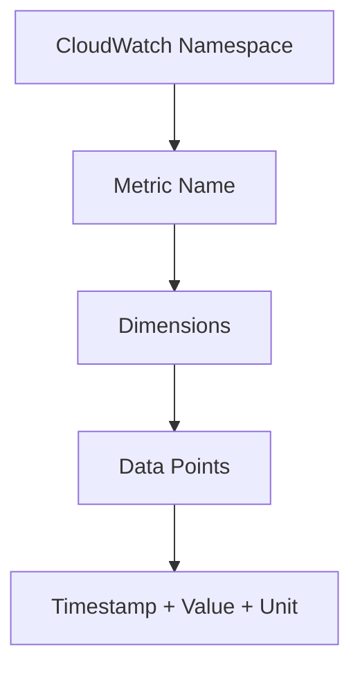

# How to Publish Custom CloudWatch Metrics

Author: [nawazdhandala](https://github.com/nawazdhandala)

Tags: AWS, CloudWatch, Monitoring, Metrics, Observability

Description: Learn how to publish custom CloudWatch metrics from your applications using the AWS SDK, CLI, and embedded metric format to track business and operational KPIs.

---

AWS CloudWatch comes with a solid set of built-in metrics for most services - CPU utilization, network throughput, request counts, and so on. But what happens when you need to track something specific to your application? Maybe it's the number of orders processed per minute, queue depth in a custom job system, or cache hit ratios. That's where custom metrics come in.

Custom CloudWatch metrics let you push any numerical data point into CloudWatch and then alarm on it, graph it, or use it in dashboards just like any built-in metric. In this post, we'll walk through every way you can publish custom metrics and discuss the trade-offs of each approach.

## Understanding CloudWatch Metric Concepts

Before diving into code, let's clarify some terminology. Every CloudWatch metric has a **namespace** (a container like `MyApp/Production`), a **metric name** (like `OrdersProcessed`), and optionally one or more **dimensions** (key-value pairs that let you slice the data, like `Environment=prod` or `Region=us-east-1`).

Each data point you publish has a **timestamp**, a **value**, and a **unit** (like `Count`, `Seconds`, `Bytes`, etc.). CloudWatch stores data at different resolutions - standard resolution metrics are stored at 1-minute periods, while high-resolution metrics go down to 1-second periods.

Here's how the hierarchy looks:



## Publishing Metrics with the AWS CLI

The quickest way to test custom metrics is through the CLI. This is great for scripting and cron jobs.

Here's a simple example that publishes a single data point:

```bash
# Publish a single custom metric data point
aws cloudwatch put-metric-data \
  --namespace "MyApp/Production" \
  --metric-name "OrdersProcessed" \
  --value 42 \
  --unit Count \
  --dimensions Environment=prod,Service=order-api
```

You can also publish multiple data points in a single call, which is more efficient:

```bash
# Publish multiple metrics in one API call using a JSON file
aws cloudwatch put-metric-data \
  --namespace "MyApp/Production" \
  --metric-data file://metrics.json
```

The `metrics.json` file would look like this:

```json
[
  {
    "MetricName": "OrdersProcessed",
    "Value": 42,
    "Unit": "Count",
    "Dimensions": [
      { "Name": "Environment", "Value": "prod" },
      { "Name": "Service", "Value": "order-api" }
    ]
  },
  {
    "MetricName": "OrderValue",
    "Value": 156.78,
    "Unit": "None",
    "Dimensions": [
      { "Name": "Environment", "Value": "prod" },
      { "Name": "Currency", "Value": "USD" }
    ]
  }
]
```

## Publishing Metrics with Python (Boto3)

For application-level metric publishing, you'll likely use an AWS SDK. Here's how it works with Python's boto3:

```python
import boto3
from datetime import datetime

# Create a CloudWatch client
cloudwatch = boto3.client('cloudwatch', region_name='us-east-1')

# Publish a single metric
cloudwatch.put_metric_data(
    Namespace='MyApp/Production',
    MetricData=[
        {
            'MetricName': 'OrdersProcessed',
            'Timestamp': datetime.utcnow(),
            'Value': 42,
            'Unit': 'Count',
            'Dimensions': [
                {'Name': 'Environment', 'Value': 'prod'},
                {'Name': 'Service', 'Value': 'order-api'}
            ]
        }
    ]
)
```

When you're dealing with high-throughput applications, you don't want to make an API call for every single data point. Instead, batch them up:

```python
import boto3
from datetime import datetime
from collections import defaultdict
import threading
import time

class MetricBuffer:
    """Buffers custom metrics and flushes them in batches."""

    def __init__(self, namespace, flush_interval=60):
        self.namespace = namespace
        self.buffer = []
        self.lock = threading.Lock()
        self.cloudwatch = boto3.client('cloudwatch')
        self.flush_interval = flush_interval
        # Start background flush thread
        self._start_flush_thread()

    def put(self, metric_name, value, unit='Count', dimensions=None):
        """Add a metric data point to the buffer."""
        data_point = {
            'MetricName': metric_name,
            'Timestamp': datetime.utcnow(),
            'Value': value,
            'Unit': unit,
        }
        if dimensions:
            data_point['Dimensions'] = [
                {'Name': k, 'Value': v} for k, v in dimensions.items()
            ]
        with self.lock:
            self.buffer.append(data_point)

    def flush(self):
        """Send all buffered metrics to CloudWatch."""
        with self.lock:
            if not self.buffer:
                return
            to_send = self.buffer[:]
            self.buffer.clear()

        # CloudWatch accepts up to 1000 metric data points per call
        for i in range(0, len(to_send), 1000):
            batch = to_send[i:i+1000]
            self.cloudwatch.put_metric_data(
                Namespace=self.namespace,
                MetricData=batch
            )

    def _start_flush_thread(self):
        def run():
            while True:
                time.sleep(self.flush_interval)
                self.flush()
        t = threading.Thread(target=run, daemon=True)
        t.start()
```

Usage is straightforward:

```python
# Initialize the buffer once at application startup
metrics = MetricBuffer('MyApp/Production', flush_interval=30)

# Then throughout your application code
metrics.put('OrdersProcessed', 1, dimensions={'Service': 'checkout'})
metrics.put('PaymentLatency', 0.234, unit='Seconds', dimensions={'Provider': 'stripe'})
```

## Publishing Metrics with Node.js

If you're running a Node.js application, here's the equivalent approach:

```javascript
const { CloudWatchClient, PutMetricDataCommand } = require('@aws-sdk/client-cloudwatch');

const client = new CloudWatchClient({ region: 'us-east-1' });

// Publish a custom metric
async function publishMetric(metricName, value, dimensions = {}) {
  const dimensionList = Object.entries(dimensions).map(([Name, Value]) => ({
    Name,
    Value,
  }));

  const command = new PutMetricDataCommand({
    Namespace: 'MyApp/Production',
    MetricData: [
      {
        MetricName: metricName,
        Value: value,
        Unit: 'Count',
        Timestamp: new Date(),
        Dimensions: dimensionList,
      },
    ],
  });

  await client.send(command);
}

// Example usage
publishMetric('ActiveConnections', 150, { Service: 'websocket-server' });
```

## Using Statistic Sets for Aggregated Data

When you're aggregating metrics locally before publishing (which you should do for high-throughput scenarios), use statistic sets instead of individual values. This lets you tell CloudWatch about the distribution of values without sending every single data point.

```python
# Instead of sending 1000 individual latency measurements,
# send a single statistic set summarizing them
cloudwatch.put_metric_data(
    Namespace='MyApp/Production',
    MetricData=[
        {
            'MetricName': 'RequestLatency',
            'StatisticValues': {
                'SampleCount': 1000,
                'Sum': 234.5,
                'Minimum': 0.001,
                'Maximum': 2.345
            },
            'Unit': 'Seconds',
            'Dimensions': [
                {'Name': 'Endpoint', 'Value': '/api/orders'}
            ]
        }
    ]
)
```

This approach cuts your API call costs dramatically while preserving the statistical properties of your data.

## High-Resolution Metrics

Standard metrics have a 1-minute resolution. If you need sub-minute granularity, you can publish high-resolution metrics by setting `StorageResolution` to 1:

```python
# Publish a high-resolution metric (1-second granularity)
cloudwatch.put_metric_data(
    Namespace='MyApp/Production',
    MetricData=[
        {
            'MetricName': 'ActiveConnections',
            'Value': 150,
            'Unit': 'Count',
            'StorageResolution': 1,  # 1-second resolution
            'Dimensions': [
                {'Name': 'Service', 'Value': 'websocket-server'}
            ]
        }
    ]
)
```

Keep in mind that high-resolution metrics cost more. They're retained at 1-second resolution for 3 hours, then rolled up to 1-minute for 15 days, then to 5-minute for 63 days, and finally to 1-hour for 15 months.

## Cost Considerations

Custom metrics aren't free. As of early 2026, each custom metric costs about $0.30 per month for the first 10,000 metrics, with volume discounts after that. The cost is per unique combination of namespace, metric name, and dimensions. So a metric named `Latency` with 100 different endpoint dimensions counts as 100 custom metrics.

A few tips to keep costs manageable:

- Don't create a new dimension value for every unique request ID or user ID. Use categories instead.
- Aggregate data locally before publishing when possible.
- Use the `put_metric_data` batch API to reduce the number of API calls (you're charged per API call too, though it's cheap).
- Consider using the CloudWatch Embedded Metric Format in Lambda functions, which we cover in [this post](https://oneuptime.com/blog/post/cloudwatch-embedded-metric-format-lambda/view).

## Setting Up Alarms on Custom Metrics

The whole point of publishing custom metrics is usually to alarm on them. Here's a quick example:

```bash
# Create an alarm that triggers when OrdersProcessed drops below 10 for 5 minutes
aws cloudwatch put-metric-alarm \
  --alarm-name "LowOrderVolume" \
  --namespace "MyApp/Production" \
  --metric-name "OrdersProcessed" \
  --dimensions Name=Environment,Value=prod \
  --statistic Sum \
  --period 300 \
  --threshold 10 \
  --comparison-operator LessThanThreshold \
  --evaluation-periods 1 \
  --alarm-actions arn:aws:sns:us-east-1:123456789012:ops-alerts
```

## Common Pitfalls

There are a few things that trip people up with custom metrics. First, if you publish a metric with no data points for 15 days, the metric disappears from the console (though the data is still queryable via API). Second, dimension names are case-sensitive - `environment` and `Environment` create two different metric streams. Third, don't forget to set the correct `Unit` - it affects how CloudWatch aggregates your data.

Also, be aware of the `PutMetricData` API limits. You can include up to 1,000 data points per call and make up to 150 transactions per second per account per region. If you're hitting these limits, you need to buffer and batch more aggressively.

## Wrapping Up

Custom CloudWatch metrics are a fundamental building block for monitoring AWS applications. Whether you're tracking business KPIs, application performance, or infrastructure health, the ability to push your own metrics into CloudWatch means you can use one unified platform for alerting and dashboarding. Start simple with the CLI, move to SDK-based publishing as your needs grow, and keep an eye on costs by being thoughtful about your dimension cardinality.

For a deeper dive into monitoring strategies, check out our post on [creating CloudWatch dashboards](https://oneuptime.com/blog/post/create-cloudwatch-dashboards-application-monitoring/view) and [setting up metric filters from log data](https://oneuptime.com/blog/post/create-cloudwatch-metric-filters-log-data/view).
