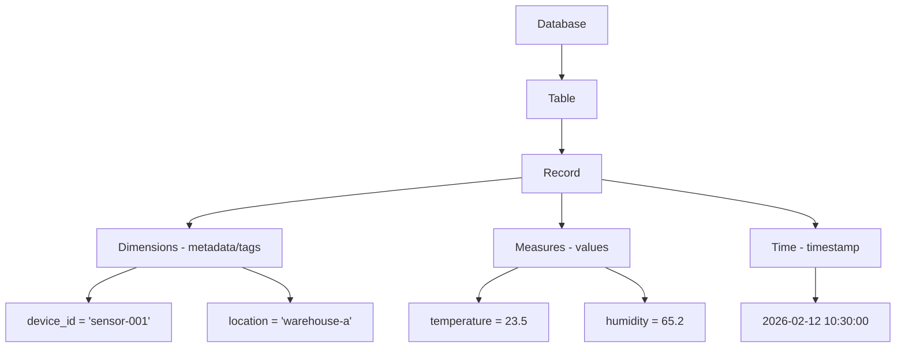

# How to Query Timestream with SQL

Author: [nawazdhandala](https://github.com/nawazdhandala)

Tags: AWS, Timestream, SQL, Time Series, Analytics, Database

Description: Master Amazon Timestream SQL queries with practical examples covering time series functions, aggregations, interpolation, and cross-measure analysis.

---

Amazon Timestream uses a SQL dialect that looks familiar but includes specialized time series functions that you will not find in PostgreSQL or MySQL. If you are coming from a traditional relational database background, most of your SQL knowledge transfers directly. The new parts are the time series-specific functions like `ago()`, `BIN()`, `INTERPOLATE_LINEAR()`, and `CREATE_TIME_SERIES()` that make working with time-stamped data much easier than it would be with standard SQL.

This guide walks through practical query patterns you will actually use when working with Timestream data.

## Timestream Data Model Basics

Before diving into queries, let's understand how Timestream organizes data.



- **Dimensions**: String-typed metadata that identifies the time series (like tags in InfluxDB)
- **Measures**: The actual numeric or string values being recorded
- **Time**: The timestamp for each record

## Basic Queries

### Retrieve Recent Data

```sql
-- Get the last 10 minutes of data for a specific device
SELECT time, device_id, temperature, humidity
FROM iot_data.sensor_readings
WHERE device_id = 'sensor-001'
  AND time > ago(10m)
ORDER BY time DESC
```

The `ago()` function is one of the most-used Timestream functions. It accepts units like `s` (seconds), `m` (minutes), `h` (hours), `d` (days).

### Get the Latest Value Per Device

```sql
-- Get the most recent reading from every device
SELECT device_id, location,
       MAX_BY(temperature, time) AS latest_temp,
       MAX_BY(humidity, time) AS latest_humidity,
       MAX(time) AS last_seen
FROM iot_data.sensor_readings
WHERE time > ago(1h)
GROUP BY device_id, location
ORDER BY last_seen DESC
```

`MAX_BY(value, time)` returns the value associated with the maximum time - effectively the most recent value. This is a much cleaner pattern than subqueries with row numbers.

## Time Bucketing with BIN()

The `BIN()` function groups timestamps into fixed intervals - essential for aggregating time series data.

```sql
-- Average temperature per 5-minute interval for the last 6 hours
SELECT BIN(time, 5m) AS interval,
       device_id,
       AVG(temperature) AS avg_temp,
       MIN(temperature) AS min_temp,
       MAX(temperature) AS max_temp,
       COUNT(*) AS sample_count
FROM iot_data.sensor_readings
WHERE device_id = 'sensor-001'
  AND time > ago(6h)
GROUP BY BIN(time, 5m), device_id
ORDER BY interval DESC
```

You can use any interval: `1s`, `30s`, `1m`, `5m`, `15m`, `1h`, `1d`, etc.

### Downsampling for Dashboards

When building dashboards, you do not need every data point. Downsample to reduce the amount of data transferred.

```sql
-- Downsample to 1-minute intervals for a dashboard chart
SELECT BIN(time, 1m) AS interval,
       device_id,
       ROUND(AVG(temperature), 2) AS avg_temp,
       ROUND(AVG(humidity), 2) AS avg_humidity
FROM iot_data.sensor_readings
WHERE time > ago(24h)
  AND location = 'warehouse-a'
GROUP BY BIN(time, 1m), device_id
ORDER BY interval
```

## Time Series Functions

### CREATE_TIME_SERIES

This function converts rows into a time series array, which you can then process with other time series functions.

```sql
-- Create a time series and calculate statistics
WITH sensor_ts AS (
    SELECT device_id,
           CREATE_TIME_SERIES(time, temperature) AS temp_series
    FROM iot_data.sensor_readings
    WHERE time > ago(24h)
    GROUP BY device_id
)
SELECT device_id,
       MIN(temp_series) AS min_temp,
       MAX(temp_series) AS max_temp,
       AVG(temp_series) AS avg_temp
FROM sensor_ts
```

### INTERPOLATE_LINEAR

Fill in gaps in your time series data with linear interpolation.

```sql
-- Interpolate missing values to get a continuous 1-minute time series
WITH binned AS (
    SELECT device_id,
           BIN(time, 1m) AS interval,
           AVG(temperature) AS avg_temp
    FROM iot_data.sensor_readings
    WHERE device_id = 'sensor-001'
      AND time BETWEEN ago(6h) AND now()
    GROUP BY device_id, BIN(time, 1m)
)
SELECT device_id,
       INTERPOLATE_LINEAR(
           CREATE_TIME_SERIES(interval, avg_temp),
           SEQUENCE(ago(6h), now(), 1m)
       ) AS interpolated_temp
FROM binned
GROUP BY device_id
```

This is useful when sensors report at irregular intervals and you need evenly-spaced data points for analysis or visualization.

## Advanced Analytical Queries

### Moving Average

```sql
-- Calculate a 10-minute moving average of temperature
SELECT time, device_id, temperature,
       AVG(temperature) OVER (
           PARTITION BY device_id
           ORDER BY time
           RANGE BETWEEN INTERVAL '10' MINUTE PRECEDING AND CURRENT ROW
       ) AS moving_avg_10m
FROM iot_data.sensor_readings
WHERE device_id = 'sensor-001'
  AND time > ago(2h)
ORDER BY time
```

### Rate of Change

```sql
-- Calculate the rate of temperature change per minute
WITH ordered_readings AS (
    SELECT device_id, time, temperature,
           LAG(temperature) OVER (PARTITION BY device_id ORDER BY time) AS prev_temp,
           LAG(time) OVER (PARTITION BY device_id ORDER BY time) AS prev_time
    FROM iot_data.sensor_readings
    WHERE device_id = 'sensor-001'
      AND time > ago(1h)
)
SELECT device_id, time, temperature,
       CASE
           WHEN prev_time IS NOT NULL
           THEN (temperature - prev_temp) /
                (EXTRACT(EPOCH FROM time - prev_time) / 60.0)
           ELSE NULL
       END AS degrees_per_minute
FROM ordered_readings
ORDER BY time
```

### Percentile Analysis

```sql
-- Get temperature percentiles per device over the last 24 hours
SELECT device_id,
       APPROX_PERCENTILE(temperature, 0.5) AS median_temp,
       APPROX_PERCENTILE(temperature, 0.95) AS p95_temp,
       APPROX_PERCENTILE(temperature, 0.99) AS p99_temp,
       AVG(temperature) AS avg_temp,
       STDDEV(temperature) AS stddev_temp
FROM iot_data.sensor_readings
WHERE time > ago(24h)
GROUP BY device_id
ORDER BY avg_temp DESC
```

### Cross-Measure Correlation

```sql
-- Find the correlation between temperature and humidity
SELECT device_id,
       BIN(time, 1h) AS hour,
       AVG(temperature) AS avg_temp,
       AVG(humidity) AS avg_humidity,
       -- Manual correlation calculation
       (COUNT(*) * SUM(temperature * humidity) - SUM(temperature) * SUM(humidity)) /
       (SQRT(COUNT(*) * SUM(temperature * temperature) - SUM(temperature) * SUM(temperature)) *
        SQRT(COUNT(*) * SUM(humidity * humidity) - SUM(humidity) * SUM(humidity))) AS correlation
FROM iot_data.sensor_readings
WHERE time > ago(7d)
  AND device_id = 'sensor-001'
GROUP BY device_id, BIN(time, 1h)
ORDER BY hour
```

## Filtering and Subqueries

### Find Devices That Stopped Reporting

```sql
-- Find devices that have not sent data in the last 15 minutes
WITH active_devices AS (
    SELECT DISTINCT device_id
    FROM iot_data.sensor_readings
    WHERE time > ago(15m)
),
all_devices AS (
    SELECT DISTINCT device_id
    FROM iot_data.sensor_readings
    WHERE time > ago(24h)
)
SELECT a.device_id AS offline_device
FROM all_devices a
LEFT JOIN active_devices b ON a.device_id = b.device_id
WHERE b.device_id IS NULL
```

### Multi-Table Joins

```sql
-- Join sensor readings with a device metadata table
SELECT r.device_id, r.time, r.temperature,
       m.firmware_version, m.install_date
FROM iot_data.sensor_readings r
JOIN iot_data.device_metadata m ON r.device_id = m.device_id
WHERE r.time > ago(1h)
  AND r.temperature > 40
ORDER BY r.temperature DESC
```

## Performance Tips

1. **Always include a time filter.** Queries without a WHERE clause on `time` scan the entire table, which is expensive.

2. **Use dimensions in WHERE clauses.** Filtering by dimensions helps Timestream prune data early.

3. **Limit the time range.** Query only the time range you need. Avoid `ago(365d)` when `ago(7d)` will do.

4. **Use BIN() for aggregations.** Instead of returning millions of raw data points, aggregate them into intervals.

5. **Multi-measure records save money.** If a device sends temperature, humidity, and pressure at the same timestamp, use multi-measure records instead of separate records for each metric.

```sql
-- Efficient: query multi-measure records (one record per timestamp)
SELECT time, temperature, humidity, pressure
FROM iot_data.sensor_readings
WHERE device_id = 'sensor-001'
  AND time > ago(1h)

-- Less efficient: query single-measure records (three records per timestamp)
SELECT time, measure_name, measure_value::double
FROM iot_data.sensor_readings_single
WHERE device_id = 'sensor-001'
  AND time > ago(1h)
```

## Running Queries from the CLI

```bash
# Run a Timestream query from the AWS CLI
aws timestream-query query \
  --query-string "SELECT device_id, MAX(time) AS last_seen FROM iot_data.sensor_readings WHERE time > ago(1h) GROUP BY device_id ORDER BY last_seen DESC LIMIT 10"
```

## Summary

Timestream's SQL dialect gives you familiar relational query syntax enhanced with purpose-built time series functions. The key functions to master are `ago()` for relative time filtering, `BIN()` for time bucketing, `MAX_BY()` for latest-value queries, and `CREATE_TIME_SERIES()` for working with time series as arrays. Combined with standard SQL window functions and aggregations, you can build sophisticated time series analytics without leaving SQL.

For more on Timestream, see our guides on [setting up Timestream for IoT data](https://oneuptime.com/blog/post/set-up-timestream-for-iot-data/view) and [Timestream scheduled queries](https://oneuptime.com/blog/post/set-up-timestream-scheduled-queries/view).
