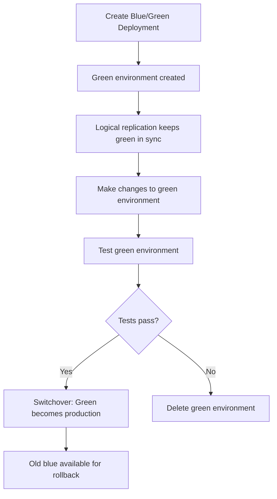

# How to Use RDS Blue/Green Deployments for Zero-Downtime Upgrades

Author: [nawazdhandala](https://github.com/nawazdhandala)

Tags: AWS, RDS, Blue-Green, Deployments, Database

Description: Use Amazon RDS Blue/Green Deployments to perform database engine upgrades, parameter changes, and schema modifications with minimal downtime.

---

Major database upgrades traditionally mean scheduling a maintenance window, warning users about downtime, and hoping everything goes smoothly. With RDS Blue/Green Deployments, you can test your changes on a live copy of the database and then switch over in seconds. If something goes wrong, you still have the original environment running.

Blue/Green Deployments create a staging environment (green) that stays in sync with your production environment (blue) through logical replication. You can make changes to the green environment - upgrade the engine version, change parameters, modify the schema - and then switchover when you're ready.

## How Blue/Green Deployments Work

The process follows this flow:



During the switchover:
1. RDS stops writes to the blue environment
2. Replication catches up completely
3. RDS renames the blue and green instances (swapping endpoints)
4. Your application automatically connects to the new green environment via the same endpoint
5. Typical switchover downtime is under 1 minute

## Supported Configurations

Blue/Green Deployments work with:
- RDS MySQL 5.7 and 8.0
- RDS MariaDB 10.2 and higher
- RDS PostgreSQL (added in 2024)
- Aurora MySQL
- Aurora PostgreSQL

The source instance must have:
- Automated backups enabled
- Binary logging enabled (for MySQL/MariaDB) or logical replication configured (for PostgreSQL)

## Creating a Blue/Green Deployment

### For an Engine Upgrade

Let's upgrade a MySQL 8.0.32 instance to 8.0.36:

```bash
# Create the Blue/Green deployment
aws rds create-blue-green-deployment \
  --blue-green-deployment-name my-db-upgrade \
  --source arn:aws:rds:us-east-1:123456789012:db:my-production-db \
  --target-engine-version 8.0.36 \
  --target-db-parameter-group-name my-app-mysql8036
```

For a major version upgrade (MySQL 5.7 to 8.0):

```bash
# Major version upgrade via Blue/Green
aws rds create-blue-green-deployment \
  --blue-green-deployment-name my-db-major-upgrade \
  --source arn:aws:rds:us-east-1:123456789012:db:my-production-db \
  --target-engine-version 8.0.36 \
  --target-db-parameter-group-name my-app-mysql80
```

### For a Parameter Group Change

You can also use Blue/Green to test parameter changes before applying them to production:

```bash
# Create Blue/Green deployment with a different parameter group
aws rds create-blue-green-deployment \
  --blue-green-deployment-name my-db-param-change \
  --source arn:aws:rds:us-east-1:123456789012:db:my-production-db \
  --target-db-parameter-group-name my-optimized-params
```

### For an Instance Class Change

Combine an upgrade with a resize:

```bash
# Create Blue/Green deployment with a new instance class
aws rds create-blue-green-deployment \
  --blue-green-deployment-name my-db-resize-upgrade \
  --source arn:aws:rds:us-east-1:123456789012:db:my-production-db \
  --target-engine-version 8.0.36 \
  --target-db-instance-class db.r6g.xlarge
```

## Monitoring the Green Environment

After creating the deployment, AWS provisions the green environment and sets up replication. This can take anywhere from minutes to hours depending on your database size.

Check the status:

```bash
# Check Blue/Green deployment status
aws rds describe-blue-green-deployments \
  --blue-green-deployment-identifier my-db-upgrade \
  --query 'BlueGreenDeployments[0].{Status:Status,Source:Source,Target:Target,SwitchoverDetails:SwitchoverDetails}'
```

Monitor replication lag on the green environment:

```bash
# Check replication lag on the green instance
aws cloudwatch get-metric-statistics \
  --namespace AWS/RDS \
  --metric-name ReplicaLag \
  --dimensions Name=DBInstanceIdentifier,Value=my-production-db-green-abc123 \
  --start-time $(date -u -v-1H +%Y-%m-%dT%H:%M:%S) \
  --end-time $(date -u +%Y-%m-%dT%H:%M:%S) \
  --period 60 \
  --statistics Average
```

## Testing the Green Environment

Before switching over, test the green environment thoroughly. You can connect to the green instance directly using its temporary endpoint:

```bash
# Find the green instance endpoint
aws rds describe-db-instances \
  --db-instance-identifier my-production-db-green-abc123 \
  --query 'DBInstances[0].Endpoint.Address'
```

Run your test suite against it:

```python
import psycopg2

# Connect to the green environment for testing
green_conn = psycopg2.connect(
    host='my-production-db-green-abc123.xyz.us-east-1.rds.amazonaws.com',
    dbname='myapp',
    user='admin',
    password='password'
)

# Run key queries and verify results
cursor = green_conn.cursor()

# Test critical queries
cursor.execute("SELECT COUNT(*) FROM orders WHERE status = 'active'")
print(f"Active orders: {cursor.fetchone()[0]}")

# Test query performance
cursor.execute("EXPLAIN ANALYZE SELECT * FROM orders WHERE customer_id = 12345")
plan = cursor.fetchall()
for line in plan:
    print(line[0])

green_conn.close()
```

Things to verify on the green environment:
- All queries return expected results
- Query performance is comparable or better
- Stored procedures and triggers work correctly
- Application connections succeed
- Extension compatibility (if you upgraded the engine version)

## Performing the Switchover

When you're satisfied that the green environment is ready:

```bash
# Initiate the switchover
aws rds switchover-blue-green-deployment \
  --blue-green-deployment-identifier my-db-upgrade \
  --switchover-timeout 300
```

The `--switchover-timeout` is in seconds. If the switchover can't complete within this time (e.g., replication can't catch up), it's aborted.

During the switchover:
1. Writes to the blue (source) instance are blocked
2. Replication catches up to zero lag
3. The database endpoints are swapped
4. Your application reconnects automatically (same endpoint, now pointing to the upgraded database)

The actual downtime is typically under 1 minute. Most of that is DNS propagation and connection re-establishment.

## After the Switchover

Verify everything is working:

```bash
# Confirm the production instance is running the new version
aws rds describe-db-instances \
  --db-instance-identifier my-production-db \
  --query 'DBInstances[0].{Version:EngineVersion,Status:DBInstanceStatus,Class:DBInstanceClass}'
```

Monitor closely for the next few hours:

```bash
# Watch for any error events
aws rds describe-events \
  --source-identifier my-production-db \
  --source-type db-instance \
  --duration 120
```

Check [Performance Insights](https://oneuptime.com/blog/post/2026-02-12-monitor-rds-with-performance-insights/view) to make sure query performance is normal.

## Rolling Back

If you discover issues after the switchover, the old blue environment is still available. You can't automatically switch back, but you can:

1. Point your application to the old blue instance endpoint temporarily
2. Or create another Blue/Green deployment to switch back

The old blue environment remains for as long as you keep it. Delete it once you're confident the upgrade is stable:

```bash
# Delete the Blue/Green deployment (keeps the instances, just removes the deployment metadata)
aws rds delete-blue-green-deployment \
  --blue-green-deployment-identifier my-db-upgrade \
  --delete-target false

# Once you're sure everything is fine, delete the old blue instance
aws rds delete-db-instance \
  --db-instance-identifier my-production-db-old-blue-abc123 \
  --skip-final-snapshot
```

## Blue/Green with Read Replicas

If your source has read replicas, the Blue/Green deployment creates corresponding replicas in the green environment. During switchover, all replicas are switched along with the primary:

```bash
# Blue/Green handles replicas automatically
# Just create the deployment as normal
aws rds create-blue-green-deployment \
  --blue-green-deployment-name my-db-with-replicas-upgrade \
  --source arn:aws:rds:us-east-1:123456789012:db:my-production-db \
  --target-engine-version 16.2
```

## Limitations and Considerations

- **Storage**: The green environment uses additional storage (it's a full copy). Make sure your account limits can accommodate this.
- **Cost**: You're running two sets of instances during the deployment. Plan for the extra cost during the testing period.
- **Replication lag**: High write volumes can cause the green environment to fall behind. Monitor lag before attempting a switchover.
- **Schema changes**: You can make schema changes on the green environment, but be careful - changes to tables that affect replication (like adding NOT NULL columns without defaults) can break replication.
- **Maximum duration**: AWS doesn't enforce a maximum, but long-running deployments consume resources. Plan to switchover or delete within a reasonable timeframe.

Blue/Green Deployments turn database upgrades from a nerve-wracking maintenance event into a controlled, tested process. The extra cost of running two environments for a few hours is nothing compared to the confidence of knowing your upgrade works before it touches production.

For more on upgrade planning, see our guide on [upgrading RDS engine versions](https://oneuptime.com/blog/post/2026-02-12-upgrade-rds-engine-versions/view).
