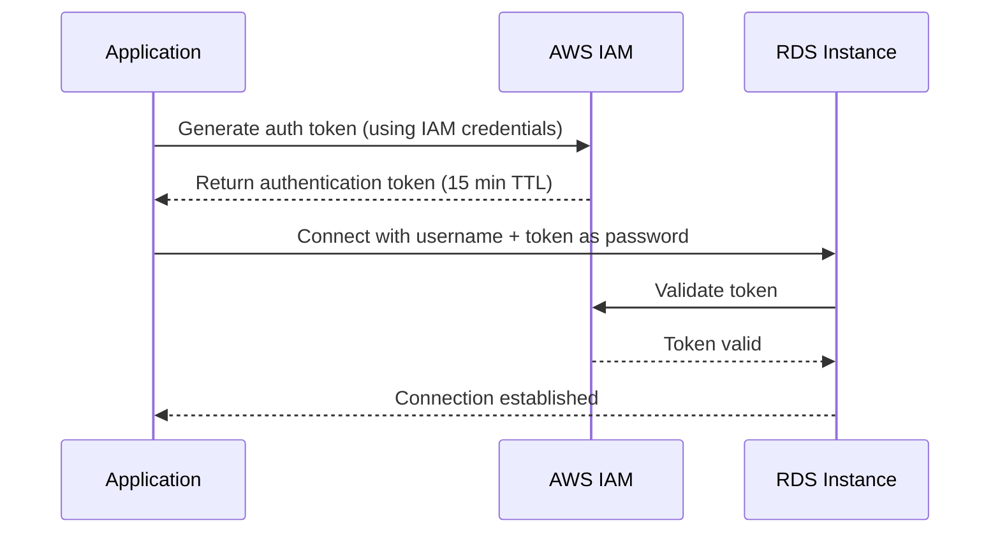

# How to Use RDS IAM Database Authentication

Author: [nawazdhandala](https://github.com/nawazdhandala)

Tags: AWS, RDS, IAM, Security, Database

Description: Configure IAM database authentication for Amazon RDS to eliminate password management and leverage AWS IAM policies for database access control.

---

Database passwords are a pain. You have to generate them, store them securely, rotate them periodically, and distribute them to every service that needs access. Somewhere along the way, someone hardcodes one in a config file, it gets committed to Git, and now you've got a security incident.

IAM database authentication lets you skip all of that. Instead of a password, your application generates a short-lived authentication token using its AWS IAM credentials. No passwords to manage, no secrets to rotate, and access is controlled through the same IAM policies you're already using for everything else in AWS.

## How IAM Authentication Works

When a client connects to RDS with IAM authentication:

1. The client calls the RDS API to generate an authentication token
2. The token is valid for 15 minutes and acts as a temporary password
3. The client connects to the database using the token as the password
4. RDS validates the token against IAM before allowing the connection
5. The connection remains open even after the token expires (only new connections need new tokens)



## Prerequisites

IAM authentication works with:
- MySQL 5.6+ and MariaDB 10.6+ on RDS
- PostgreSQL 10+ on RDS
- Aurora MySQL and Aurora PostgreSQL

The instance must also not exceed the connection limit for IAM auth, which is 256 connections per second. For most applications this is fine, but very high-connection-rate workloads should use connection pooling.

## Step 1: Enable IAM Authentication on the RDS Instance

For an existing instance:

```bash
# Enable IAM authentication on an existing RDS instance
aws rds modify-db-instance \
  --db-instance-identifier my-database \
  --enable-iam-database-authentication \
  --apply-immediately
```

For a new instance, add the flag during creation:

```bash
# Create an RDS instance with IAM authentication enabled
aws rds create-db-instance \
  --db-instance-identifier my-database \
  --db-instance-class db.r6g.large \
  --engine postgres \
  --engine-version 16.2 \
  --master-username admin \
  --master-user-password "$DB_PASSWORD" \
  --allocated-storage 100 \
  --enable-iam-database-authentication
```

## Step 2: Create a Database User for IAM Authentication

Connect to your database and create a user that authenticates via IAM.

For PostgreSQL:

```sql
-- Create a user that uses IAM authentication (PostgreSQL)
CREATE USER app_service WITH LOGIN;
GRANT rds_iam TO app_service;

-- Grant appropriate permissions
GRANT CONNECT ON DATABASE myapp TO app_service;
GRANT USAGE ON SCHEMA public TO app_service;
GRANT SELECT, INSERT, UPDATE, DELETE ON ALL TABLES IN SCHEMA public TO app_service;
ALTER DEFAULT PRIVILEGES IN SCHEMA public GRANT SELECT, INSERT, UPDATE, DELETE ON TABLES TO app_service;
```

For MySQL:

```sql
-- Create a user that uses IAM authentication (MySQL)
CREATE USER 'app_service'@'%' IDENTIFIED WITH AWSAuthenticationPlugin AS 'RDS';

-- Grant permissions
GRANT SELECT, INSERT, UPDATE, DELETE ON myapp.* TO 'app_service'@'%';
FLUSH PRIVILEGES;
```

## Step 3: Create an IAM Policy

Create a policy that allows generating authentication tokens for your database:

```json
{
  "Version": "2012-10-17",
  "Statement": [
    {
      "Effect": "Allow",
      "Action": [
        "rds-db:connect"
      ],
      "Resource": [
        "arn:aws:rds-db:us-east-1:123456789012:dbuser:dbi-resource-id/app_service"
      ]
    }
  ]
}
```

The resource ARN format is `arn:aws:rds-db:REGION:ACCOUNT:dbuser:DBI-RESOURCE-ID/DB-USERNAME`.

Find your DBI resource ID:

```bash
# Get the DBI resource ID for your RDS instance
aws rds describe-db-instances \
  --db-instance-identifier my-database \
  --query 'DBInstances[0].DbiResourceId' \
  --output text
```

Create and attach the policy:

```bash
# Create the IAM policy
aws iam create-policy \
  --policy-name rds-iam-connect-mydb \
  --policy-document file:///tmp/rds-iam-policy.json

# Attach to an IAM role (e.g., an EC2 instance role or ECS task role)
aws iam attach-role-policy \
  --role-name my-application-role \
  --policy-arn arn:aws:iam::123456789012:policy/rds-iam-connect-mydb
```

## Step 4: Generate an Authentication Token

Generate a token using the AWS CLI:

```bash
# Generate an authentication token
aws rds generate-db-auth-token \
  --hostname my-database.abc123.us-east-1.rds.amazonaws.com \
  --port 5432 \
  --username app_service \
  --region us-east-1
```

This outputs a long string that you use as the password when connecting. The token is valid for 15 minutes.

## Step 5: Connect Using the Token

### Python (PostgreSQL)

```python
import boto3
import psycopg2
import os

def get_db_connection():
    """Create a database connection using IAM authentication."""
    region = 'us-east-1'
    host = 'my-database.abc123.us-east-1.rds.amazonaws.com'
    port = 5432
    username = 'app_service'
    database = 'myapp'

    # Generate the authentication token
    rds_client = boto3.client('rds', region_name=region)
    token = rds_client.generate_db_auth_token(
        DBHostname=host,
        Port=port,
        DBUsername=username,
        Region=region
    )

    # Connect using the token as the password
    conn = psycopg2.connect(
        host=host,
        port=port,
        database=database,
        user=username,
        password=token,
        sslmode='require',
        sslrootcert='/path/to/global-bundle.pem'
    )

    return conn

# Usage
conn = get_db_connection()
cursor = conn.cursor()
cursor.execute("SELECT current_user, current_database()")
print(cursor.fetchone())
```

### Node.js (MySQL)

```javascript
const AWS = require('aws-sdk');
const mysql = require('mysql2/promise');
const fs = require('fs');

async function getConnection() {
  const signer = new AWS.RDS.Signer({
    region: 'us-east-1',
    hostname: 'my-database.abc123.us-east-1.rds.amazonaws.com',
    port: 3306,
    username: 'app_service'
  });

  // Generate the authentication token
  const token = await new Promise((resolve, reject) => {
    signer.getAuthToken({}, (err, token) => {
      if (err) reject(err);
      else resolve(token);
    });
  });

  // Connect using the token
  const connection = await mysql.createConnection({
    host: 'my-database.abc123.us-east-1.rds.amazonaws.com',
    port: 3306,
    user: 'app_service',
    password: token,
    database: 'myapp',
    ssl: {
      ca: fs.readFileSync('/path/to/global-bundle.pem')
    }
  });

  return connection;
}
```

### Java (PostgreSQL with JDBC)

```java
import software.amazon.awssdk.services.rds.RdsUtilities;
import software.amazon.awssdk.services.rds.model.GenerateAuthenticationTokenRequest;
import software.amazon.awssdk.regions.Region;

import java.sql.Connection;
import java.sql.DriverManager;
import java.util.Properties;

public class RdsIamConnect {
    public static Connection getConnection() throws Exception {
        String host = "my-database.abc123.us-east-1.rds.amazonaws.com";
        int port = 5432;
        String username = "app_service";
        String database = "myapp";

        // Generate the authentication token
        RdsUtilities rdsUtilities = RdsUtilities.builder()
            .region(Region.US_EAST_1)
            .build();

        String token = rdsUtilities.generateAuthenticationToken(
            GenerateAuthenticationTokenRequest.builder()
                .hostname(host)
                .port(port)
                .username(username)
                .build()
        );

        // Connect using the token
        Properties props = new Properties();
        props.setProperty("user", username);
        props.setProperty("password", token);
        props.setProperty("ssl", "true");
        props.setProperty("sslrootcert", "/path/to/global-bundle.pem");

        String url = String.format("jdbc:postgresql://%s:%d/%s", host, port, database);
        return DriverManager.getConnection(url, props);
    }
}
```

## Connection Pooling with IAM Auth

Since tokens expire after 15 minutes, you need to handle token refresh in your connection pool. Most connection pools can be configured with a custom authentication provider:

```python
import boto3
from sqlalchemy import create_engine, event

def get_token():
    """Generate a fresh IAM authentication token."""
    client = boto3.client('rds', region_name='us-east-1')
    return client.generate_db_auth_token(
        DBHostname='my-database.abc123.us-east-1.rds.amazonaws.com',
        Port=5432,
        DBUsername='app_service'
    )

# Create engine with token refresh on new connections
engine = create_engine(
    'postgresql://app_service@my-database.abc123.us-east-1.rds.amazonaws.com:5432/myapp',
    connect_args={'sslmode': 'require', 'sslrootcert': '/path/to/global-bundle.pem'}
)

@event.listens_for(engine, "do_connect")
def provide_token(dialect, conn_rec, cargs, cparams):
    """Inject a fresh IAM token for each new connection."""
    cparams['password'] = get_token()
```

## Limitations to Know About

- **Connection rate limit**: IAM auth is limited to 256 new connections per second. Use connection pooling if this is a concern.
- **Token size**: The token is about 2KB, which might be too large for some connection libraries with small password field limits.
- **SSL required**: IAM authentication requires SSL/TLS connections. Make sure your application uses SSL. See our guide on [enabling RDS encryption in transit](https://oneuptime.com/blog/post/enable-rds-encryption-in-transit-ssl-tls/view).
- **Not for superuser**: The master user account can't use IAM authentication. It always uses password authentication.

## When to Use IAM Authentication

IAM authentication is great for:
- Applications running on EC2, ECS, EKS, or Lambda that already have IAM roles
- Environments where you want centralized access control through IAM
- Teams that want to eliminate database password management

It's less suitable for:
- Very high connection rate applications (>200 connections/second) without connection pooling
- Tools or scripts that don't support custom authentication workflows
- The initial database setup (master user always uses a password)

IAM database authentication is a security win with relatively low implementation effort. If you're already using IAM roles for your application services, extending that to database access is a natural next step.
