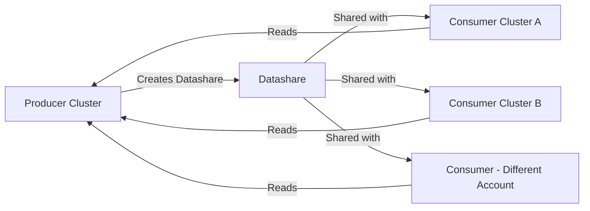

# How to Use Redshift Data Sharing for Cross-Account Queries

Author: [nawazdhandala](https://github.com/nawazdhandala)

Tags: AWS, Redshift, Data Sharing, Data Warehouse

Description: Learn how to use Redshift data sharing to query data across clusters and AWS accounts without moving or copying data.

---

Traditionally, sharing data between Redshift clusters meant ETL pipelines, S3 exports, or data replication. All of which add latency, storage costs, and operational overhead. Redshift data sharing lets one cluster (the producer) share live data with other clusters (consumers) without copying anything. The consumer queries the producer's data directly. No data movement, no duplication, always up to date.

## How Data Sharing Works

The producer cluster creates a "datashare" that contains references to specific schemas, tables, or views. Consumer clusters mount that datashare as a read-only database. When a consumer runs a query against the shared data, Redshift reads it from the producer's managed storage. The data stays in one place.



Important details:
- Data sharing only works with RA3 node types or Redshift Serverless
- Consumers get read-only access
- Producer data is always live - no refresh lag
- Cross-region sharing is supported (with some latency)

## Setting Up Data Sharing (Same Account)

Let's start with sharing between two clusters in the same AWS account.

### On the Producer Cluster

Create a datashare and add objects to it:

```sql
-- Create a datashare
CREATE DATASHARE sales_share;

-- Add a schema to the share
ALTER DATASHARE sales_share ADD SCHEMA sales;

-- Add specific tables
ALTER DATASHARE sales_share ADD TABLE sales.orders;
ALTER DATASHARE sales_share ADD TABLE sales.customers;
ALTER DATASHARE sales_share ADD TABLE sales.products;

-- Or add all tables in a schema
ALTER DATASHARE sales_share ADD ALL TABLES IN SCHEMA sales;

-- Grant usage to a consumer cluster (same account)
GRANT USAGE ON DATASHARE sales_share
TO NAMESPACE '12345678-abcd-1234-efgh-123456789012';
-- The namespace is the consumer cluster's namespace UUID
```

Find the consumer's namespace:

```bash
# Get the namespace of the consumer cluster
aws redshift describe-clusters \
  --cluster-identifier consumer-cluster \
  --query 'Clusters[0].ClusterNamespaceArn'

# For Redshift Serverless
aws redshift-serverless get-namespace \
  --namespace-name consumer-namespace \
  --query 'namespace.namespaceId'
```

### On the Consumer Cluster

Mount the datashare as a local database:

```sql
-- Create a database from the datashare
CREATE DATABASE shared_sales
FROM DATASHARE sales_share
OF NAMESPACE '87654321-dcba-4321-hgfe-987654321098';
-- This namespace is the PRODUCER's namespace UUID

-- Now query it like a local database
SELECT *
FROM shared_sales.sales.orders
WHERE order_date = CURRENT_DATE
LIMIT 10;

-- Join shared data with local data
SELECT
    so.order_id,
    so.total_amount,
    local_analytics.customer_segment
FROM shared_sales.sales.orders so
JOIN analytics.customer_segments local_analytics
    ON so.customer_id = local_analytics.customer_id
WHERE so.order_date >= DATEADD(day, -7, CURRENT_DATE);
```

## Cross-Account Data Sharing

Sharing across AWS accounts requires an extra authorization step.

### On the Producer Account

```sql
-- Create the datashare
CREATE DATASHARE cross_account_share;
ALTER DATASHARE cross_account_share ADD SCHEMA analytics;
ALTER DATASHARE cross_account_share ADD ALL TABLES IN SCHEMA analytics;

-- Grant to a specific AWS account
GRANT USAGE ON DATASHARE cross_account_share
TO ACCOUNT '987654321098';  -- Consumer's AWS account ID
```

### Authorize in the Producer Account (AWS CLI)

The account owner needs to authorize the sharing through the API:

```bash
# Authorize the datashare for the consumer account
aws redshift authorize-data-share \
  --data-share-arn "arn:aws:redshift:us-east-1:123456789012:datashare:producer-namespace/cross_account_share" \
  --consumer-identifier "987654321098"
```

### Associate in the Consumer Account

The consumer account associates the datashare with their cluster:

```bash
# Associate the datashare with the consumer cluster
aws redshift associate-data-share-consumer \
  --data-share-arn "arn:aws:redshift:us-east-1:123456789012:datashare:producer-namespace/cross_account_share" \
  --consumer-arn "arn:aws:redshift:us-east-1:987654321098:namespace:consumer-namespace-id"

# For Redshift Serverless consumer
aws redshift associate-data-share-consumer \
  --data-share-arn "arn:aws:redshift:us-east-1:123456789012:datashare:producer-namespace/cross_account_share" \
  --consumer-arn "arn:aws:redshift-serverless:us-east-1:987654321098:namespace/consumer-namespace-id"
```

### On the Consumer Cluster

```sql
-- Create a database from the cross-account datashare
CREATE DATABASE partner_data
FROM DATASHARE cross_account_share
OF ACCOUNT '123456789012'
NAMESPACE '12345678-abcd-1234-efgh-123456789012';

-- Query the shared data
SELECT COUNT(*) FROM partner_data.analytics.daily_metrics;
```

## Sharing with Redshift Serverless

Redshift Serverless can be both a producer and consumer. The process is nearly identical.

Serverless as producer:

```sql
-- On Redshift Serverless producer
CREATE DATASHARE serverless_share;
ALTER DATASHARE serverless_share ADD SCHEMA public;
ALTER DATASHARE serverless_share ADD ALL TABLES IN SCHEMA public;

-- Grant to a provisioned cluster in the same account
GRANT USAGE ON DATASHARE serverless_share
TO NAMESPACE 'provisioned-cluster-namespace-id';

-- Grant to another serverless workgroup
GRANT USAGE ON DATASHARE serverless_share
TO NAMESPACE 'other-serverless-namespace-id';
```

## Managing Datashares

Useful commands for managing your datashares:

```sql
-- List all datashares on the producer
SHOW DATASHARES;

-- See what's in a datashare
DESC DATASHARE sales_share;

-- List databases created from datashares (consumer)
SELECT *
FROM svv_redshift_databases
WHERE database_type = 'shared';

-- Check datashare consumers
SELECT *
FROM svv_datashare_consumers
WHERE share_name = 'sales_share';

-- Remove an object from a datashare
ALTER DATASHARE sales_share REMOVE TABLE sales.sensitive_data;

-- Revoke access from a consumer
REVOKE USAGE ON DATASHARE sales_share
FROM NAMESPACE 'consumer-namespace-id';

-- Drop a datashare
DROP DATASHARE sales_share;
```

## User Access Control on Shared Data

The consumer controls who can query the shared database. Use standard GRANT statements:

```sql
-- On the consumer cluster
-- Grant access to the shared database
GRANT USAGE ON DATABASE shared_sales TO GROUP analysts;

-- Grant schema access
GRANT USAGE ON SCHEMA shared_sales.sales TO GROUP analysts;

-- Grant table access
GRANT SELECT ON ALL TABLES IN SCHEMA shared_sales.sales TO GROUP analysts;

-- Create a user with limited access
CREATE USER report_viewer PASSWORD 'SecurePass123!';
GRANT USAGE ON DATABASE shared_sales TO report_viewer;
GRANT USAGE ON SCHEMA shared_sales.sales TO report_viewer;
GRANT SELECT ON TABLE shared_sales.sales.orders TO report_viewer;
-- This user can only see the orders table, not customers or products
```

## Sharing Views

You can share views, which lets you control exactly what data consumers can see:

```sql
-- On the producer: create a view that filters sensitive data
CREATE VIEW sales.orders_public AS
SELECT
    order_id,
    order_date,
    product_id,
    quantity,
    total_amount,
    status
    -- Notice: customer_id and customer details are excluded
FROM sales.orders;

-- Add the view to the datashare instead of the raw table
ALTER DATASHARE public_share ADD SCHEMA sales;
ALTER DATASHARE public_share ADD TABLE sales.orders_public;
```

## Performance Considerations

Data sharing reads from the producer's managed storage, so queries run at storage read speeds. A few tips:

```sql
-- Check query performance on shared data
SELECT
    query,
    TRIM(querytxt) AS sql,
    DATEDIFF(millisecond, starttime, endtime) AS duration_ms,
    bytes_scanned
FROM stl_query
WHERE database_name = 'shared_sales'
  AND starttime > DATEADD(hour, -1, GETDATE())
ORDER BY duration_ms DESC
LIMIT 10;
```

Performance tips:
- Shared data queries may be slightly slower than local data due to cross-cluster reads
- The consumer's compute handles the query processing
- Large consumers benefit from more RPUs (serverless) or larger node counts (provisioned)
- Use materialized views on the consumer to cache frequently accessed shared data

## Automating Cross-Account Setup with CloudFormation

```yaml
# Producer account template
Resources:
  ProducerCluster:
    Type: AWS::Redshift::Cluster
    Properties:
      ClusterIdentifier: producer-cluster
      NodeType: ra3.xlplus
      ClusterType: multi-node
      NumberOfNodes: 2
      # ... other properties

  # Custom resource to create and authorize datashare
  DataShareSetup:
    Type: Custom::DataShareSetup
    Properties:
      ServiceToken: !GetAtt DataShareFunction.Arn
      ClusterIdentifier: !Ref ProducerCluster
      DataShareName: cross_account_share
      ConsumerAccountIds:
        - "987654321098"
        - "111222333444"
      Schemas:
        - analytics
        - reporting
```

For monitoring the health and performance of your data sharing setup, see our guide on [data pipeline monitoring](https://oneuptime.com/blog/post/2026-02-06-aws-cloudwatch-logs-exporter-opentelemetry-collector/view).

## Wrapping Up

Data sharing eliminates the need for data copying between Redshift clusters. The producer shares live data, consumers query it directly, and everyone sees the same current data. It works within accounts, across accounts, and between provisioned clusters and serverless. The main requirement is RA3 nodes or serverless - older node types don't support it. For multi-team organizations where different groups need access to centralized data, data sharing is the cleanest approach.
