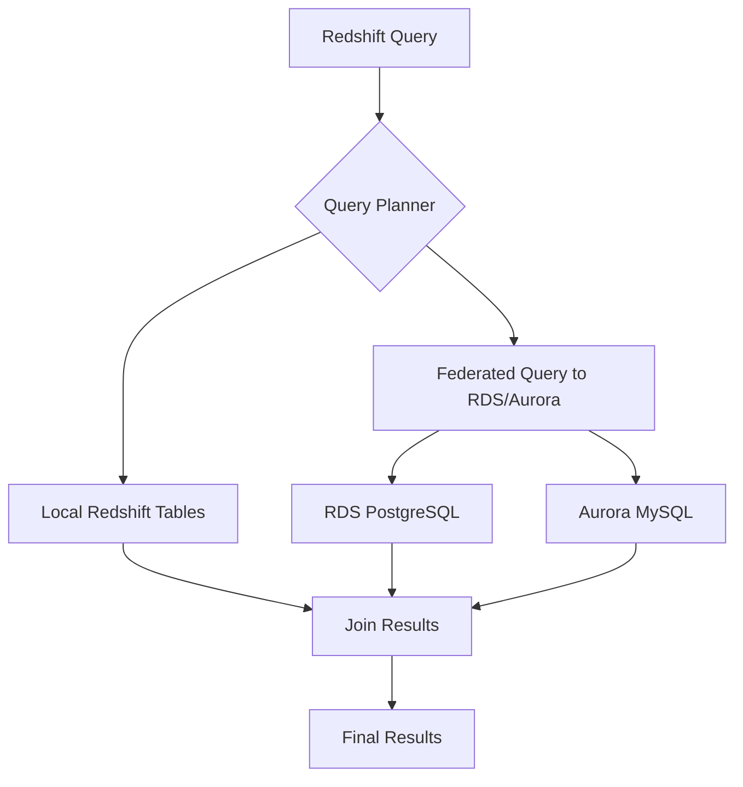

# How to Use Redshift Federated Query for RDS and Aurora

Author: [nawazdhandala](https://github.com/nawazdhandala)

Tags: AWS, Redshift, RDS, Aurora, Data Warehouse

Description: Learn how to query RDS and Aurora databases directly from Redshift using federated queries without moving data through ETL pipelines.

---

Your transactional data lives in RDS or Aurora. Your analytics data lives in Redshift. When you need to join them, the traditional approach is building an ETL pipeline to copy data from RDS into Redshift. Federated queries skip that entirely. You write a single SQL query in Redshift that reads live data from your RDS or Aurora databases, joins it with your warehouse data, and returns the results. No data movement, no ETL maintenance.

## How Federated Queries Work

When Redshift encounters a federated query, it pushes the appropriate parts of the query down to the remote database. The remote database executes its portion and returns the results to Redshift, which handles the final joins and aggregations.



Supported external databases:
- Amazon RDS for PostgreSQL
- Amazon Aurora PostgreSQL
- Amazon RDS for MySQL
- Amazon Aurora MySQL

## Step 1: Set Up Network Connectivity

Redshift needs network access to your RDS/Aurora instance. Both need to be in the same VPC, or you need VPC peering.

Ensure security group rules allow the connection:

```bash
# Get the Redshift cluster's VPC security group
aws redshift describe-clusters \
  --cluster-identifier analytics-cluster \
  --query 'Clusters[0].VpcSecurityGroups[*].VpcSecurityGroupId'

# Add an inbound rule to the RDS security group allowing Redshift
aws ec2 authorize-security-group-ingress \
  --group-id sg-rds-group \
  --protocol tcp \
  --port 5432 \
  --source-group sg-redshift-group

# For Aurora MySQL, use port 3306
aws ec2 authorize-security-group-ingress \
  --group-id sg-aurora-group \
  --protocol tcp \
  --port 3306 \
  --source-group sg-redshift-group
```

Also enable enhanced VPC routing on your Redshift cluster if it's not already enabled:

```bash
aws redshift modify-cluster \
  --cluster-identifier analytics-cluster \
  --enhanced-vpc-routing
```

## Step 2: Store Database Credentials in Secrets Manager

Redshift uses Secrets Manager to authenticate against external databases.

Create a secret with the RDS credentials:

```bash
# Create a secret for PostgreSQL/Aurora PostgreSQL
aws secretsmanager create-secret \
  --name "redshift/federated/rds-postgres" \
  --secret-string '{
    "username": "readonly_user",
    "password": "SecurePassword123!"
  }'

# Create a secret for MySQL/Aurora MySQL
aws secretsmanager create-secret \
  --name "redshift/federated/aurora-mysql" \
  --secret-string '{
    "username": "readonly_user",
    "password": "SecurePassword123!"
  }'
```

Make sure the Redshift IAM role has permission to read these secrets:

```json
{
  "Version": "2012-10-17",
  "Statement": [
    {
      "Effect": "Allow",
      "Action": [
        "secretsmanager:GetSecretValue"
      ],
      "Resource": [
        "arn:aws:secretsmanager:us-east-1:123456789012:secret:redshift/federated/*"
      ]
    }
  ]
}
```

## Step 3: Create the External Schema

In Redshift, create an external schema that points to your RDS/Aurora database.

Connect to a PostgreSQL database:

```sql
-- Create external schema for RDS PostgreSQL
CREATE EXTERNAL SCHEMA rds_orders
FROM POSTGRES
DATABASE 'orders_db'
SCHEMA 'public'
URI 'my-rds-instance.abc123.us-east-1.rds.amazonaws.com'
PORT 5432
IAM_ROLE 'arn:aws:iam::123456789012:role/RedshiftFederatedRole'
SECRET_ARN 'arn:aws:secretsmanager:us-east-1:123456789012:secret:redshift/federated/rds-postgres-AbCdEf';
```

Connect to a MySQL database:

```sql
-- Create external schema for Aurora MySQL
CREATE EXTERNAL SCHEMA aurora_inventory
FROM MYSQL
DATABASE 'inventory_db'
URI 'my-aurora-cluster.cluster-abc123.us-east-1.rds.amazonaws.com'
PORT 3306
IAM_ROLE 'arn:aws:iam::123456789012:role/RedshiftFederatedRole'
SECRET_ARN 'arn:aws:secretsmanager:us-east-1:123456789012:secret:redshift/federated/aurora-mysql-GhIjKl';
```

## Step 4: Query External Data

Once the external schema is set up, query it like any other Redshift table.

Query the RDS data directly:

```sql
-- Simple query against RDS PostgreSQL
SELECT
    order_id,
    customer_id,
    order_date,
    total_amount,
    status
FROM rds_orders.orders
WHERE order_date = CURRENT_DATE
  AND status = 'pending';

-- Query Aurora MySQL data
SELECT
    product_id,
    product_name,
    stock_quantity,
    warehouse_location
FROM aurora_inventory.products
WHERE stock_quantity < 10;
```

## Joining Federated and Local Data

The real power is joining external data with your Redshift warehouse data in a single query.

Combine live transactional data with historical analytics:

```sql
-- Join live RDS orders with Redshift customer analytics
SELECT
    r.order_id,
    r.order_date,
    r.total_amount,
    r.status,
    c.name AS customer_name,
    c.segment,
    a.lifetime_value,
    a.total_orders AS historical_orders
FROM rds_orders.orders r
JOIN sales.customers c ON r.customer_id = c.customer_id
JOIN analytics.customer_metrics a ON r.customer_id = a.customer_id
WHERE r.order_date >= DATEADD(day, -1, CURRENT_DATE)
  AND r.status = 'completed'
ORDER BY r.total_amount DESC;
```

Another example - check inventory levels for your top-selling products:

```sql
-- Find products selling fast with low inventory
SELECT
    p.product_id,
    p.name,
    ds.total_units_sold_30d,
    ds.total_revenue_30d,
    inv.stock_quantity,
    inv.warehouse_location,
    CASE
        WHEN inv.stock_quantity < ds.total_units_sold_30d / 30 * 7
        THEN 'REORDER'
        ELSE 'OK'
    END AS inventory_status
FROM analytics.product_daily_sales ds
JOIN aurora_inventory.products inv ON ds.product_id = inv.product_id
JOIN sales.products p ON ds.product_id = p.product_id
WHERE ds.total_units_sold_30d > 100
ORDER BY inventory_status, ds.total_revenue_30d DESC;
```

## Creating Local Materialized Views from Federated Data

For frequently accessed external data, create a materialized view to cache the results in Redshift:

```sql
-- Cache active orders from RDS in a materialized view
CREATE MATERIALIZED VIEW analytics.active_orders AS
SELECT
    order_id,
    customer_id,
    order_date,
    total_amount,
    status,
    shipping_method,
    estimated_delivery
FROM rds_orders.orders
WHERE status IN ('pending', 'processing', 'shipped')
  AND order_date >= DATEADD(day, -30, CURRENT_DATE);

-- Refresh periodically
REFRESH MATERIALIZED VIEW analytics.active_orders;
```

This gives you the best of both worlds - live access when needed, cached performance for repeated queries.

## Using Federated Queries in ETL

Federated queries are also useful for incremental ETL. Instead of building external pipelines, pull new data directly from RDS:

```sql
-- Incremental load using federated query
CREATE TEMP TABLE staging_new_orders AS
SELECT *
FROM rds_orders.orders
WHERE updated_at > (
    SELECT COALESCE(MAX(updated_at), '1970-01-01')
    FROM sales.orders
);

-- Merge into the target table
DELETE FROM sales.orders
USING staging_new_orders
WHERE sales.orders.order_id = staging_new_orders.order_id;

INSERT INTO sales.orders
SELECT * FROM staging_new_orders;

DROP TABLE staging_new_orders;
ANALYZE sales.orders;
```

This pulls only the changed records from RDS, making it much more efficient than full loads.

## Performance Optimization

Federated queries have overhead because they read from a remote database. Here's how to keep them fast:

```sql
-- Push filters down to the remote database
-- Good: Redshift pushes the WHERE clause to RDS
SELECT * FROM rds_orders.orders
WHERE order_date = '2026-02-12' AND status = 'pending';

-- Less efficient: Redshift may pull all data then filter locally
SELECT * FROM rds_orders.orders o
WHERE o.order_id IN (
    SELECT order_id FROM local_table
);
```

General performance tips:
- Filter as much as possible in the federated query - Redshift pushes simple predicates to the remote database
- Avoid pulling large result sets from the remote database
- Use materialized views for data you query repeatedly
- Index the remote tables on columns you filter frequently
- Use EXPLAIN to see the query plan and identify what gets pushed down

## Checking Federated Query Execution

Monitor how your federated queries perform:

```sql
-- See federated query details
SELECT
    query,
    TRIM(querytxt) AS sql,
    starttime,
    endtime,
    DATEDIFF(millisecond, starttime, endtime) AS duration_ms
FROM stl_query
WHERE querytxt LIKE '%rds_orders%'
  AND starttime > DATEADD(hour, -24, GETDATE())
ORDER BY starttime DESC
LIMIT 20;

-- Check external schema details
SELECT
    schemaname,
    databasename,
    esoptions
FROM svv_external_schemas
WHERE schemaname IN ('rds_orders', 'aurora_inventory');
```

## CloudFormation Setup

```yaml
Resources:
  FederatedQueryRole:
    Type: AWS::IAM::Role
    Properties:
      RoleName: RedshiftFederatedRole
      AssumeRolePolicyDocument:
        Version: "2012-10-17"
        Statement:
          - Effect: Allow
            Principal:
              Service: redshift.amazonaws.com
            Action: sts:AssumeRole
      Policies:
        - PolicyName: FederatedQueryAccess
          PolicyDocument:
            Version: "2012-10-17"
            Statement:
              - Effect: Allow
                Action:
                  - secretsmanager:GetSecretValue
                Resource:
                  - !Sub "arn:aws:secretsmanager:${AWS::Region}:${AWS::AccountId}:secret:redshift/federated/*"

  RDSCredentials:
    Type: AWS::SecretsManager::Secret
    Properties:
      Name: redshift/federated/rds-postgres
      SecretString: !Sub |
        {
          "username": "readonly_user",
          "password": "${RDSPassword}"
        }
```

## Limitations

A few things to keep in mind:
- Federated queries are read-only - you can't INSERT, UPDATE, or DELETE in the remote database
- Maximum of 10 external schemas per Redshift cluster by default (can be increased)
- Large result sets from the remote database will be slow - filter aggressively
- Not all PostgreSQL and MySQL data types map perfectly to Redshift types
- Connection limits on your RDS instance apply - many concurrent federated queries can exhaust RDS connections

For monitoring federated query performance and RDS connection usage, check out our post on [database monitoring](https://oneuptime.com/blog/post/aws-cloudwatch-dashboards/view).

## Wrapping Up

Federated queries bridge the gap between your operational databases and your data warehouse. For ad-hoc analysis that needs live transactional data, they're faster and simpler than building ETL pipelines. For regular analytics, combine them with materialized views to cache frequently accessed data. The main thing to watch is performance - always push filters to the remote database and avoid pulling large datasets across the network.
