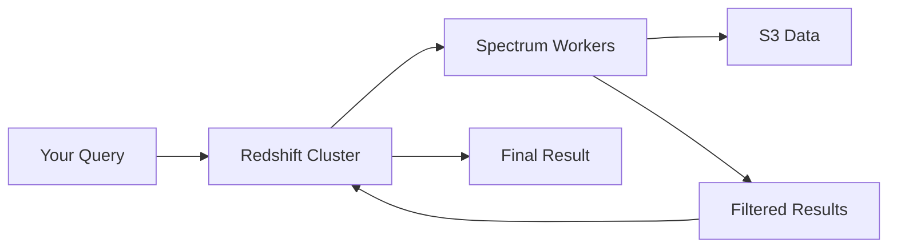

# How to Configure Redshift Spectrum for Querying S3 Data

Author: [nawazdhandala](https://github.com/nawazdhandala)

Tags: AWS, Redshift, Spectrum, S3, Data Lake

Description: Learn how to set up Redshift Spectrum to query data directly in S3 without loading it into Redshift, covering external schemas, table definitions, partitioning, and performance tuning.

---

Not all your data needs to live inside Redshift. Historical data, raw logs, and infrequently queried datasets can sit in S3 and still be queryable with standard SQL. That's what Redshift Spectrum does - it lets you run queries against data in S3 as if it were a regular Redshift table.

The beauty of this approach is that you keep hot data in Redshift for fast queries and cold data in S3 for cheap storage. You can even join across both in a single query.

## How Spectrum Works

When you run a query that touches an external table, Redshift spins up independent Spectrum workers that read your S3 data, apply filters and aggregations, and send the reduced results back to your Redshift cluster. The heavy lifting happens outside your cluster, so Spectrum queries don't compete with your regular Redshift workload for compute resources.



## Prerequisites

You need three things:

1. A Redshift cluster or Redshift Serverless workgroup
2. An IAM role that can access both S3 and the AWS Glue Data Catalog
3. Data in S3 in a supported format (Parquet, ORC, CSV, JSON, Avro, etc.)

Create the IAM role with the necessary permissions.

```bash
# Create an IAM role for Spectrum with S3 and Glue access
aws iam create-role \
  --role-name RedshiftSpectrumRole \
  --assume-role-policy-document '{
    "Version": "2012-10-17",
    "Statement": [{
      "Effect": "Allow",
      "Principal": {"Service": "redshift.amazonaws.com"},
      "Action": "sts:AssumeRole"
    }]
  }'

# Attach policies for S3 and Glue
aws iam attach-role-policy \
  --role-name RedshiftSpectrumRole \
  --policy-arn arn:aws:iam::aws:policy/AmazonS3ReadOnlyAccess

aws iam attach-role-policy \
  --role-name RedshiftSpectrumRole \
  --policy-arn arn:aws:iam::aws:policy/AWSGlueConsoleFullAccess

# Associate with your Redshift cluster
aws redshift modify-cluster-iam-roles \
  --cluster-identifier analytics-warehouse \
  --add-iam-roles arn:aws:iam::123456789:role/RedshiftSpectrumRole
```

## Creating an External Schema

External schemas connect Redshift to the Glue Data Catalog (or a Hive metastore). This is where Spectrum finds the metadata for your S3 tables.

```sql
-- Create an external schema backed by the Glue Data Catalog
CREATE EXTERNAL SCHEMA data_lake
FROM DATA CATALOG
DATABASE 'analytics_lake'
IAM_ROLE 'arn:aws:iam::123456789:role/RedshiftSpectrumRole'
CREATE EXTERNAL DATABASE IF NOT EXISTS;
```

This creates a Glue database called `analytics_lake` if it doesn't exist, and maps it to the `data_lake` schema in Redshift.

## Defining External Tables

External tables describe the structure and location of your S3 data.

### CSV Data

```sql
-- External table for CSV files in S3
CREATE EXTERNAL TABLE data_lake.web_logs (
    request_time TIMESTAMP,
    client_ip VARCHAR(45),
    method VARCHAR(10),
    uri VARCHAR(2048),
    status_code INT,
    response_bytes BIGINT,
    user_agent VARCHAR(1024),
    response_time_ms INT
)
ROW FORMAT DELIMITED
FIELDS TERMINATED BY ','
LINES TERMINATED BY '\n'
STORED AS TEXTFILE
LOCATION 's3://my-data-lake/web-logs/raw/';
```

### Parquet Data (Recommended)

Parquet is the best format for Spectrum. It's columnar, so Spectrum only reads the columns your query needs, and it includes built-in statistics that help skip irrelevant data blocks.

```sql
-- External table for Parquet files
CREATE EXTERNAL TABLE data_lake.events (
    event_id VARCHAR(36),
    event_type VARCHAR(50),
    user_id BIGINT,
    session_id VARCHAR(64),
    event_timestamp TIMESTAMP,
    properties VARCHAR(65535)
)
STORED AS PARQUET
LOCATION 's3://my-data-lake/events/parquet/';
```

### Partitioned Tables

Partitioning is critical for Spectrum performance. When you partition by date, region, or any other column, Spectrum only scans the partitions your query touches.

```sql
-- Partitioned external table - data organized by year/month/day in S3
CREATE EXTERNAL TABLE data_lake.clickstream (
    click_id VARCHAR(36),
    user_id BIGINT,
    page_url VARCHAR(2048),
    click_timestamp TIMESTAMP,
    device_type VARCHAR(20),
    browser VARCHAR(50)
)
PARTITIONED BY (year INT, month INT, day INT)
STORED AS PARQUET
LOCATION 's3://my-data-lake/clickstream/';
```

Your S3 data needs to be organized in directories matching the partition columns.

```
s3://my-data-lake/clickstream/year=2026/month=01/day=15/data.parquet
s3://my-data-lake/clickstream/year=2026/month=01/day=16/data.parquet
s3://my-data-lake/clickstream/year=2026/month=02/day=01/data.parquet
```

Register partitions so Spectrum knows about them.

```sql
-- Add partitions manually
ALTER TABLE data_lake.clickstream
ADD PARTITION (year=2026, month=1, day=15)
LOCATION 's3://my-data-lake/clickstream/year=2026/month=01/day=15/';

ALTER TABLE data_lake.clickstream
ADD PARTITION (year=2026, month=1, day=16)
LOCATION 's3://my-data-lake/clickstream/year=2026/month=01/day=16/';

-- Or use MSCK to auto-discover partitions (works if S3 paths follow Hive naming)
MSCK REPAIR TABLE data_lake.clickstream;
```

## Querying External Tables

Once defined, external tables work just like regular Redshift tables.

```sql
-- Query external data with standard SQL
SELECT device_type,
       COUNT(*) AS click_count,
       COUNT(DISTINCT user_id) AS unique_users
FROM data_lake.clickstream
WHERE year = 2026 AND month = 2
GROUP BY device_type
ORDER BY click_count DESC;
```

```sql
-- Join external data with local Redshift tables
SELECT c.name, c.email,
       COUNT(cl.click_id) AS total_clicks,
       MAX(cl.click_timestamp) AS last_click
FROM public.customers c
JOIN data_lake.clickstream cl ON c.customer_id = cl.user_id
WHERE cl.year = 2026 AND cl.month = 2
GROUP BY c.name, c.email
HAVING COUNT(cl.click_id) > 100
ORDER BY total_clicks DESC;
```

The partition filter (`WHERE year = 2026 AND month = 2`) is essential. Without it, Spectrum would scan every partition, which costs more and takes longer.

## Creating a View Across Local and External Data

Views let you create a unified interface over both local and external data.

```sql
-- View that combines recent data from Redshift with historical data from S3
CREATE VIEW unified_orders AS
  -- Recent orders from Redshift (fast)
  SELECT order_id, customer_id, order_date, total_amount, 'redshift' AS source
  FROM public.orders
  WHERE order_date >= DATEADD(month, -3, CURRENT_DATE)

  UNION ALL

  -- Historical orders from S3 via Spectrum
  SELECT order_id, customer_id, order_date, total_amount, 'spectrum' AS source
  FROM data_lake.orders_archive
  WHERE year < EXTRACT(year FROM DATEADD(month, -3, CURRENT_DATE))
     OR (year = EXTRACT(year FROM DATEADD(month, -3, CURRENT_DATE))
         AND month < EXTRACT(month FROM DATEADD(month, -3, CURRENT_DATE)));
```

## Performance Optimization

Here are the most impactful things you can do for Spectrum query performance.

**Use Parquet or ORC.** Columnar formats let Spectrum skip columns it doesn't need and use predicate pushdown to skip row groups that don't match your filters.

**Partition aggressively.** The more specific your partition filters, the less data Spectrum reads.

**Right-size your files.** Aim for files between 128 MB and 512 MB each. Too many small files create overhead. Too few large files limit parallelism.

```bash
# Use AWS Glue or Spark to compact small files into optimal sizes
# This PySpark snippet merges small Parquet files into ~256MB files
from pyspark.sql import SparkSession

spark = SparkSession.builder.getOrCreate()
df = spark.read.parquet("s3://my-data-lake/raw-events/")
df.repartition(50).write.mode("overwrite").parquet("s3://my-data-lake/optimized-events/")
```

**Select only needed columns.** Spectrum charges based on bytes scanned. `SELECT *` on a Parquet table still reads every column.

```sql
-- Good - reads only two columns from Parquet
SELECT user_id, COUNT(*) FROM data_lake.clickstream
WHERE year = 2026 AND month = 2
GROUP BY user_id;

-- Expensive - reads every column even though you don't need them all
SELECT * FROM data_lake.clickstream
WHERE year = 2026 AND month = 2;
```

## Cost Considerations

Spectrum charges $5 per TB of data scanned. With Parquet and partitioning, you can dramatically reduce what gets scanned.

For example, if your clickstream table is 10 TB total but you only query one month (300 GB) and only need 3 columns out of 15, the actual scan might be around 60 GB, costing about $0.30 per query.

## Wrapping Up

Redshift Spectrum bridges the gap between your data warehouse and your data lake. Keep recent, heavily-queried data in Redshift for speed, push historical and raw data to S3 for cost savings, and query across both seamlessly. The key to good performance and reasonable costs is using Parquet, partitioning your data thoughtfully, and only selecting the columns you need.
