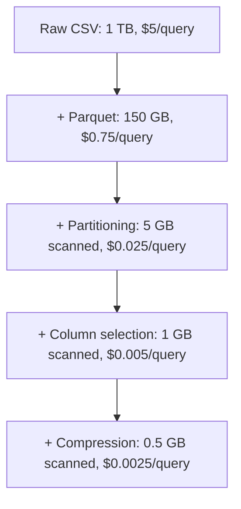

# How to Reduce Athena Query Costs

Author: [nawazdhandala](https://github.com/nawazdhandala)

Tags: AWS, Amazon Athena, Cost Optimization, Performance, S3

Description: Practical strategies to reduce your Amazon Athena query costs by up to 95%, covering data formats, partitioning, compression, query optimization, and workgroup controls.

---

Athena charges $5 per TB of data scanned. That sounds cheap until you realize your team is running dozens of queries a day against a multi-terabyte dataset, and nobody is thinking about how much data each query actually reads. A single unoptimized `SELECT *` against a 2 TB CSV table costs $10. Do that 50 times and you've burned through $500 in a day on one table.

The good news is that Athena cost optimization is straightforward. A few changes to how your data is stored and how your queries are written can reduce costs by 90-95%. Let's look at every lever you have.

## Understanding What You Pay For

Athena pricing is simple: **$5 per TB of data scanned** by your queries. There's a minimum charge of 10 MB per query. You don't pay for failed queries, DDL statements (CREATE TABLE, ALTER TABLE), or cancelled queries.

The cost equation is:

```
Query cost = (Data scanned in bytes / 1,099,511,627,776) * $5
```

So the only way to reduce costs is to reduce the amount of data your queries scan.

## Strategy 1: Use Columnar Formats

This is the single biggest cost reducer. Converting from CSV or JSON to Parquet or ORC cuts data scanned dramatically because Athena only reads the columns your query references.

| Format | 100 GB Dataset | Query: 3 of 20 columns | Cost per query |
|--------|---------------|----------------------|----------------|
| CSV | 100 GB scanned | 100 GB | $0.50 |
| JSON | 120 GB scanned | 120 GB | $0.60 |
| Parquet | 15 GB total, ~2.5 GB scanned | 2.5 GB | $0.0125 |
| ORC | 12 GB total, ~2.0 GB scanned | 2.0 GB | $0.01 |

That's a 40-50x cost reduction just from changing the file format. Convert your data to Parquet with a simple CTAS query:

```sql
-- Convert CSV data to Parquet format to reduce future query costs
CREATE TABLE analytics.events_parquet
WITH (
    format = 'PARQUET',
    parquet_compression = 'SNAPPY',
    external_location = 's3://my-bucket/events-parquet/'
) AS
SELECT * FROM analytics.events_csv;
```

For the full deep dive, see our guide on [optimizing Athena with column formats](https://oneuptime.com/blog/post/optimize-athena-queries-with-column-formats-parquet-orc/view).

## Strategy 2: Partition Your Data

Partitioning lets Athena skip entire chunks of data that don't match your query filters. If your data is partitioned by date and you query for one day, Athena reads only that day's partition instead of the whole dataset.

```sql
-- Query with partition filter - scans only one day's data
SELECT event_type, COUNT(*)
FROM analytics.events_partitioned
WHERE year = '2025' AND month = '02' AND day = '12'
GROUP BY event_type;
```

Without the partition filter, this query scans everything. With it, it scans roughly 1/365th of the data (if you have a year of daily partitions).

Use partition projection to avoid the overhead of maintaining partition metadata:

```sql
-- Table with partition projection - no manual partition management needed
CREATE EXTERNAL TABLE analytics.events (
    event_id STRING,
    event_type STRING,
    user_id STRING
)
PARTITIONED BY (dt STRING)
STORED AS PARQUET
LOCATION 's3://my-bucket/events/'
TBLPROPERTIES (
    'projection.enabled' = 'true',
    'projection.dt.type' = 'date',
    'projection.dt.range' = '2020-01-01,NOW',
    'projection.dt.format' = 'yyyy-MM-dd',
    'projection.dt.interval' = '1',
    'projection.dt.interval.unit' = 'DAYS',
    'storage.location.template' = 's3://my-bucket/events/dt=${dt}/'
);
```

See our full guide on [partitioning for Athena](https://oneuptime.com/blog/post/optimize-athena-query-performance-with-partitioning/view).

## Strategy 3: Compress Your Data

Compression reduces file sizes, which means less data scanned:

| Compression | Typical Ratio | Speed |
|-------------|--------------|-------|
| None | 1x | Fastest read |
| Snappy | 2-4x | Very fast |
| GZIP | 5-8x | Moderate |
| ZSTD | 4-7x | Fast |

Snappy is the default for Parquet and the best balance of compression ratio and query speed. For cold data that's rarely queried, GZIP or ZSTD gives better compression.

```sql
-- Create a table with ZSTD compression for better compression ratio
CREATE TABLE analytics.archive_data
WITH (
    format = 'PARQUET',
    parquet_compression = 'ZSTD',
    external_location = 's3://my-bucket/archive/'
) AS
SELECT * FROM analytics.raw_data
WHERE event_date < DATE '2024-01-01';
```

## Strategy 4: Select Only Needed Columns

This sounds obvious, but it's the most commonly violated rule. Every column in your SELECT clause adds to the data scanned.

```sql
-- Bad: Scans ALL columns even though you only need three
SELECT * FROM analytics.events
WHERE dt = '2025-02-12'
LIMIT 100;

-- Good: Scans only three columns
SELECT event_id, event_type, user_id
FROM analytics.events
WHERE dt = '2025-02-12'
LIMIT 100;
```

On a 20-column Parquet table, selecting 3 columns scans roughly 15% of the data. That's an 85% cost reduction for free.

## Strategy 5: Use LIMIT for Exploration

When you're exploring data, always use LIMIT:

```sql
-- Cheap exploration - stops scanning once it has enough rows
SELECT event_type, user_id, event_data
FROM analytics.events
WHERE dt = '2025-02-12'
LIMIT 20;
```

With Parquet and ORC, Athena can sometimes stop scanning early when a LIMIT is specified, though this isn't guaranteed.

## Strategy 6: Optimize File Sizes

Too many small files create overhead. Too few large files reduce parallelism. Aim for 128 MB to 1 GB per file.

If you have thousands of tiny files, consolidate them:

```sql
-- Consolidate small files into larger ones
CREATE TABLE analytics.events_consolidated
WITH (
    format = 'PARQUET',
    parquet_compression = 'SNAPPY',
    external_location = 's3://my-bucket/events-consolidated/'
) AS
SELECT * FROM analytics.events_small_files;
```

## Strategy 7: Use Workgroup Cost Controls

Prevent runaway queries with workgroup-level scan limits:

```bash
# Create a workgroup with a 10 GB per-query scan limit
aws athena create-work-group \
  --name "production-queries" \
  --configuration '{
    "ResultConfiguration": {
      "OutputLocation": "s3://my-results/production/"
    },
    "BytesScannedCutoffPerQuery": 10737418240,
    "EnforceWorkGroupConfiguration": true
  }'
```

Any query that tries to scan more than 10 GB in this workgroup gets automatically cancelled. This prevents a mistyped query from scanning your entire dataset.

## Strategy 8: Use Approximate Functions

Approximate aggregation functions are faster and scan less data:

```sql
-- Approximate distinct count - faster than exact, accurate within ~2.3%
SELECT
    dt,
    APPROX_DISTINCT(user_id) as approx_unique_users,
    APPROX_PERCENTILE(response_time, 0.95) as p95_latency
FROM analytics.events
WHERE dt >= '2025-02-01'
GROUP BY dt;
```

## Strategy 9: Reuse Query Results

Athena stores query results in S3. If you need the same data multiple times, query the results instead of re-scanning the source:

```python
# Check if a recent query already has the results you need
import boto3

athena = boto3.client('athena')

# List recent query executions
executions = athena.list_query_executions(WorkGroup='production-queries')

for exec_id in executions['QueryExecutionIds'][:10]:
    details = athena.get_query_execution(QueryExecutionId=exec_id)
    query = details['QueryExecution']['Query']
    status = details['QueryExecution']['Status']['State']
    output = details['QueryExecution']['ResultConfiguration']['OutputLocation']

    if status == 'SUCCEEDED':
        print(f"Query: {query[:80]}...")
        print(f"Results: {output}")
        print()
```

You can also create materialized views with CTAS for frequently needed aggregations.

## Strategy 10: Monitor and Track Costs

You can't optimize what you don't measure. Track data scanned per query:

```python
# Track query costs across your team
import boto3
from datetime import datetime, timedelta

athena = boto3.client('athena')

executions = athena.list_query_executions(WorkGroup='production-queries')

total_bytes = 0
total_queries = 0

for exec_id in executions['QueryExecutionIds']:
    details = athena.get_query_execution(QueryExecutionId=exec_id)
    exec_info = details['QueryExecution']

    if exec_info['Status']['State'] == 'SUCCEEDED':
        scanned = exec_info['Statistics']['DataScannedInBytes']
        total_bytes += scanned
        total_queries += 1

cost = (total_bytes / (1024 ** 4)) * 5
print(f"Recent queries: {total_queries}")
print(f"Total data scanned: {total_bytes / (1024 ** 3):.2f} GB")
print(f"Estimated cost: ${cost:.2f}")
```

## Putting It All Together

Here's the impact when you combine these strategies:



From $5 per query to $0.0025 per query. That's a 2000x cost reduction. In practice, you'll typically see 50-200x reductions, which is still enormous.

## Priority Order

If you're just getting started with optimization, tackle these in order of impact:

1. **Convert to Parquet** - biggest single improvement
2. **Add partitioning** - especially for time-series data
3. **Stop using SELECT*** - select only the columns you need
4. **Set workgroup scan limits** - prevent accidents
5. **Compress your files** - incremental but free improvement
6. **Consolidate small files** - if applicable

Each step builds on the previous one. You don't need to do all of them at once, but the first three will cover 90% of the potential savings.

## Wrapping Up

Athena cost optimization isn't about clever tricks - it's about basic data engineering hygiene. Store data in columnar formats, partition by your most common filter columns, and write queries that only touch what they need. These practices don't just save money; they make your queries faster too. A query that scans 1% of the data runs faster than one that scans 100%.
