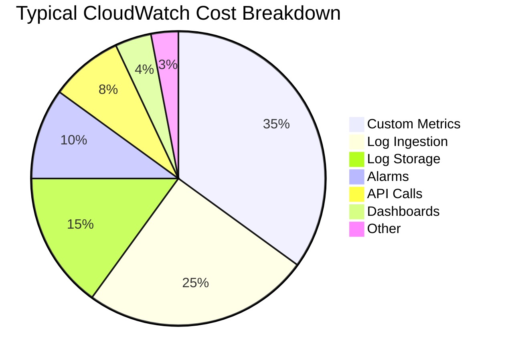

# How to Reduce CloudWatch Costs

Author: [nawazdhandala](https://github.com/nawazdhandala)

Tags: AWS, CloudWatch, Cost Optimization, Monitoring, FinOps

Description: Practical strategies to reduce your CloudWatch bill without sacrificing monitoring visibility, covering metrics, logs, alarms, dashboards, and data retention.

---

CloudWatch costs have a way of sneaking up on you. You start with a few dashboards and alarms, then add custom metrics, enable detailed monitoring, turn on Container Insights, and suddenly you're spending more on monitoring than on some of the services being monitored. I've seen teams with CloudWatch bills in the tens of thousands per month who didn't realize it until finance flagged it.

The good news is CloudWatch costs are very controllable once you know where the money goes. Let's break down the cost drivers and tackle each one.

## Understanding the CloudWatch Bill

CloudWatch billing has several components. Here's where the money typically goes:



The exact breakdown varies, but custom metrics and log ingestion are almost always the biggest chunks. Let's optimize each.

## Reducing Custom Metrics Costs

Custom metrics cost $0.30 per metric per month (first 10,000), and each unique combination of metric name + dimensions counts as a separate metric.

### Problem: Dimension Explosion

The most common cost trap is high-cardinality dimensions. If you publish a metric with a `userId` dimension and you have 100,000 users, that's 100,000 custom metrics - $30,000/month for a single metric name.

**Fix: Remove high-cardinality dimensions.**

```python
# BAD - creates a metric per user
cloudwatch.put_metric_data(
    Namespace='MyApp',
    MetricData=[{
        'MetricName': 'RequestCount',
        'Dimensions': [
            {'Name': 'UserId', 'Value': user_id},  # Too many unique values!
            {'Name': 'Endpoint', 'Value': endpoint}
        ],
        'Value': 1
    }]
)

# GOOD - aggregate by meaningful dimensions only
cloudwatch.put_metric_data(
    Namespace='MyApp',
    MetricData=[{
        'MetricName': 'RequestCount',
        'Dimensions': [
            {'Name': 'Endpoint', 'Value': endpoint},
            {'Name': 'StatusCode', 'Value': status_code}
        ],
        'Value': 1
    }]
)
```

### Problem: Too Many Metrics

Every AWS service publishes default metrics, and additional features like Container Insights and custom metrics add more.

**Fix: Audit your metrics.**

```bash
# Count how many custom metrics you have
aws cloudwatch list-metrics --namespace "CWAgent" \
  --query "length(Metrics)"

# List all namespaces and their metric counts
for ns in $(aws cloudwatch list-metrics --query "Metrics[].Namespace" --output text | tr '\t' '\n' | sort -u); do
  count=$(aws cloudwatch list-metrics --namespace "$ns" --query "length(Metrics)")
  echo "$ns: $count metrics"
done
```

### Problem: Detailed Monitoring on EC2

Detailed monitoring (1-minute metrics) costs $3.50 per instance per month compared to free 5-minute metrics.

**Fix:** Only enable detailed monitoring on instances where 1-minute granularity matters. For most workloads, 5-minute metrics are sufficient:

```bash
# Disable detailed monitoring
aws ec2 unmonitor-instances --instance-ids i-0123456789abcdef0
```

### Problem: Embedded Metric Format Overuse

If your application uses CloudWatch Embedded Metric Format (EMF) in Lambda or ECS, be careful. Each unique dimension set creates a new metric.

**Fix:** Keep dimensions low-cardinality and batch metrics:

```javascript
// Be intentional about which dimensions you publish
const { createMetricsLogger } = require('aws-embedded-metrics');

async function handler(event) {
  const metrics = createMetricsLogger();

  // Use only meaningful, low-cardinality dimensions
  metrics.setDimensions({ Service: 'OrderAPI', Environment: 'production' });
  // DON'T add per-request dimensions like requestId or userId

  metrics.putMetric('ProcessingTime', processingMs, 'Milliseconds');
  metrics.putMetric('OrderValue', orderTotal, 'None');

  await metrics.flush();
}
```

## Reducing Log Costs

CloudWatch Logs charges for ingestion ($0.50/GB) and storage ($0.03/GB/month).

### Set Retention Policies

By default, log groups retain data forever. That storage cost adds up quietly:

```bash
# Find log groups with no retention policy (infinite retention)
aws logs describe-log-groups \
  --query "logGroups[?!retentionInDays].{Name:logGroupName,StoredBytes:storedBytes}" \
  --output table

# Set retention to 30 days for a log group
aws logs put-retention-policy \
  --log-group-name "/app/production" \
  --retention-in-days 30
```

Set retention on all log groups at once:

```bash
# Set 30-day retention on all log groups that currently have no retention
aws logs describe-log-groups \
  --query "logGroups[?!retentionInDays].logGroupName" \
  --output text | tr '\t' '\n' | while read group; do
    echo "Setting 30-day retention on: $group"
    aws logs put-retention-policy \
      --log-group-name "$group" \
      --retention-in-days 30
done
```

### Reduce Log Verbosity

The cheapest log line is the one you don't send:

```python
# Use appropriate log levels - don't log DEBUG in production
import logging

logger = logging.getLogger()

if os.environ.get('ENVIRONMENT') == 'production':
    logger.setLevel(logging.WARNING)  # Only warnings and errors
else:
    logger.setLevel(logging.DEBUG)  # Full logging in dev
```

### Filter Noisy Logs Before Ingestion

If a specific service generates massive amounts of unneeded logs, consider dropping them at the source. For Lambda, avoid logging the full event payload:

```python
# BAD - logs the entire event (could be huge)
def handler(event, context):
    logger.info(f"Received event: {json.dumps(event)}")

# GOOD - log only what you need
def handler(event, context):
    logger.info(f"Processing {len(event.get('Records', []))} records")
```

### Export Logs to S3 for Long-Term Storage

If you need logs for compliance but don't query them often, export to S3 where storage is much cheaper:

```bash
# Create an export task to S3
aws logs create-export-task \
  --log-group-name "/app/production" \
  --from $(date -d '30 days ago' +%s)000 \
  --to $(date +%s)000 \
  --destination my-log-archive-bucket \
  --destination-prefix "logs/production"
```

Or set up automatic export with a subscription filter to Kinesis Data Firehose and then to S3.

### Use Log Classes

CloudWatch Logs offers an Infrequent Access log class at half the ingestion cost:

```bash
# Create a log group with Infrequent Access class
aws logs create-log-group \
  --log-group-name "/app/batch-jobs" \
  --log-group-class INFREQUENT_ACCESS
```

Infrequent Access costs $0.25/GB for ingestion (vs $0.50/GB for standard) but doesn't support some features like live tail and metric filters. Use it for logs you rarely query.

## Reducing Alarm Costs

Standard alarms cost $0.10/month each. High-resolution alarms (10-second period) cost $0.30/month.

### Audit Unused Alarms

```bash
# Find alarms in INSUFFICIENT_DATA state (possibly monitoring deleted resources)
aws cloudwatch describe-alarms \
  --state-value INSUFFICIENT_DATA \
  --query "MetricAlarms[].AlarmName"
```

Delete alarms that monitor resources that no longer exist:

```bash
# Delete unused alarms
aws cloudwatch delete-alarms \
  --alarm-names "alarm-for-deleted-instance"
```

### Use Standard Instead of High-Resolution Alarms

Unless you truly need 10-second evaluation, use standard alarms with 60-second or 300-second periods. They cost a third of high-resolution alarms.

### Use Composite Alarms

Instead of having 10 alarms that each trigger a notification, create a composite alarm that fires only when a meaningful combination triggers:

```bash
# One composite alarm instead of multiple individual notifications
aws cloudwatch put-composite-alarm \
  --alarm-name "service-degraded" \
  --alarm-rule 'ALARM("high-cpu") AND ALARM("high-errors")'
```

## Reducing Dashboard Costs

Each dashboard costs $3/month. That adds up if you have lots of them.

**Fix:** Consolidate dashboards. Use one dashboard per service with multiple widget rows instead of separate dashboards for each metric category.

**Use automatic dashboards.** CloudWatch provides free automatic dashboards for many AWS services. Check if these meet your needs before building custom ones.

## Reducing API Call Costs

`GetMetricData` costs $0.01 per 1,000 metrics requested. Dashboards that auto-refresh every minute with many widgets can generate significant API costs.

**Fix:** Set dashboard auto-refresh to 5 minutes instead of 1 minute. This reduces API calls by 5x.

**Fix:** Use `GetMetricData` instead of `GetMetricStatistics` for batch queries. It's more efficient for pulling multiple metrics at once.

## Monitoring Your CloudWatch Costs

Set up a billing alarm specifically for CloudWatch:

```bash
# Create a billing alarm for CloudWatch spending
aws cloudwatch put-metric-alarm \
  --region us-east-1 \
  --alarm-name "CloudWatch-Spending-Alert" \
  --metric-name EstimatedCharges \
  --namespace AWS/Billing \
  --statistic Maximum \
  --period 21600 \
  --threshold 100 \
  --comparison-operator GreaterThanThreshold \
  --evaluation-periods 1 \
  --alarm-actions arn:aws:sns:us-east-1:123456789012:billing-alerts \
  --dimensions Name=ServiceName,Value=AmazonCloudWatch Name=Currency,Value=USD
```

Use Cost Explorer to see the breakdown:

```bash
# Check CloudWatch costs for the current month
aws ce get-cost-and-usage \
  --time-period Start=2026-02-01,End=2026-02-12 \
  --granularity MONTHLY \
  --metrics BlendedCost \
  --filter '{
    "Dimensions": {
      "Key": "SERVICE",
      "Values": ["AmazonCloudWatch"]
    }
  }'
```

## Cost Optimization Checklist

Here's a quick checklist you can work through:

| Action | Potential Savings |
|--------|-------------------|
| Set log retention to 30 days | 30-60% on log storage |
| Remove high-cardinality dimensions | 50-90% on custom metrics |
| Disable unnecessary detailed monitoring | $3.50/instance/month |
| Delete INSUFFICIENT_DATA alarms | $0.10-0.30/alarm/month |
| Reduce dashboard refresh interval | 40-80% on API costs |
| Use Infrequent Access log class | 50% on log ingestion |
| Consolidate dashboards | $3/dashboard/month |
| Export old logs to S3 | 90% on long-term storage |

## Wrapping Up

CloudWatch cost optimization isn't about cutting monitoring - it's about being intentional. The biggest wins come from fixing dimension cardinality issues in custom metrics and setting retention policies on log groups. These two changes alone typically reduce CloudWatch bills by 30-50%.

Make CloudWatch cost review a monthly habit. Look at your bill, identify the top cost drivers, and apply the relevant optimizations. Your monitoring should be comprehensive, but it doesn't need to be expensive. For setting up billing alarms to catch cost spikes early, check our guide on [CloudWatch billing threshold alarms](https://oneuptime.com/blog/post/2026-02-12-cloudwatch-alarms-billing-thresholds/view).
