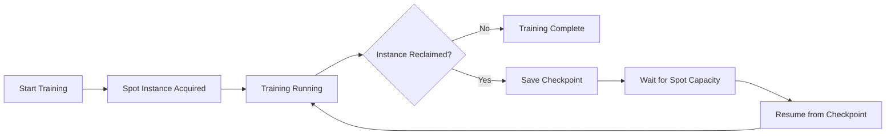

# How to Reduce SageMaker Training Costs with Spot Instances

Author: [nawazdhandala](https://github.com/nawazdhandala)

Tags: AWS, SageMaker, Cost Optimization, Spot Instances, Machine Learning

Description: Save up to 90% on Amazon SageMaker training costs by using managed spot training with automatic checkpointing and interruption handling.

---

Training ML models on SageMaker can get expensive, especially when you're running large-scale experiments or training deep learning models on GPU instances. A single ml.p3.8xlarge instance costs over $14 per hour. Run a 24-hour training job and you're looking at $340 for one run. Multiply that by the number of experiments you run, and the bills pile up fast.

Managed Spot Training is one of the most effective ways to cut those costs. You can save up to 90% by using spare AWS capacity. The catch? Your training job might get interrupted. But SageMaker handles most of the complexity for you.

## How Spot Training Works

Spot instances use unused EC2 capacity at steep discounts. The tradeoff is that AWS can reclaim the capacity with a 2-minute warning when demand increases. SageMaker's managed spot training handles this gracefully:

1. SageMaker requests spot instances for your training job
2. Training runs at full speed on the discounted instances
3. If instances are reclaimed, SageMaker pauses the job
4. When spot capacity becomes available again, SageMaker resumes training from a checkpoint
5. You only pay for the actual compute time, not the waiting time



## Enabling Spot Training

Turning on spot training requires just three additional parameters on your estimator.

```python
import sagemaker
from sagemaker import image_uris
from sagemaker.inputs import TrainingInput

session = sagemaker.Session()
role = sagemaker.get_execution_role()
bucket = session.default_bucket()
region = session.boto_region_name

xgb_image = image_uris.retrieve('xgboost', region, '1.7-1')

# Create estimator with spot training enabled
xgb_estimator = sagemaker.estimator.Estimator(
    image_uri=xgb_image,
    role=role,
    instance_count=1,
    instance_type='ml.m5.xlarge',
    output_path=f's3://{bucket}/spot-training-output',
    sagemaker_session=session,

    # These three parameters enable spot training
    use_spot_instances=True,          # Use spot instances
    max_run=3600,                     # Max training time in seconds (1 hour)
    max_wait=7200,                    # Max total time including spot delays (2 hours)

    # Checkpoint configuration for resuming interrupted training
    checkpoint_s3_uri=f's3://{bucket}/spot-checkpoints/',
    checkpoint_local_path='/opt/ml/checkpoints'
)

xgb_estimator.set_hyperparameters(
    objective='binary:logistic',
    num_round=200,
    max_depth=6,
    eta=0.1,
    eval_metric='auc'
)

# Launch the training job - works exactly like regular training
xgb_estimator.fit({
    'train': TrainingInput(f's3://{bucket}/data/train', content_type='text/csv'),
    'validation': TrainingInput(f's3://{bucket}/data/validation', content_type='text/csv')
})
```

The key parameters:

- `use_spot_instances=True` - Tells SageMaker to use spot instances
- `max_run` - Maximum training time (excludes time spent waiting for capacity)
- `max_wait` - Maximum total time including waits. Must be greater than `max_run`
- `checkpoint_s3_uri` - Where to save checkpoints for resuming after interruption

## Adding Checkpointing to Your Training Script

For built-in algorithms like XGBoost, SageMaker handles checkpointing automatically. But for custom training scripts, you need to save and load checkpoints yourself.

Here's a PyTorch training script with proper checkpointing.

```python
# train.py - Custom training script with spot-compatible checkpointing

import os
import torch
import torch.nn as nn
import torch.optim as optim
import argparse
import json

def save_checkpoint(model, optimizer, epoch, loss, checkpoint_dir):
    """Save a training checkpoint for spot instance recovery."""
    os.makedirs(checkpoint_dir, exist_ok=True)
    checkpoint_path = os.path.join(checkpoint_dir, 'checkpoint.pth')

    torch.save({
        'epoch': epoch,
        'model_state_dict': model.state_dict(),
        'optimizer_state_dict': optimizer.state_dict(),
        'loss': loss
    }, checkpoint_path)

    print(f"Checkpoint saved at epoch {epoch}")

def load_checkpoint(model, optimizer, checkpoint_dir):
    """Load a checkpoint if one exists (for resuming after spot interruption)."""
    checkpoint_path = os.path.join(checkpoint_dir, 'checkpoint.pth')

    if os.path.exists(checkpoint_path):
        checkpoint = torch.load(checkpoint_path)
        model.load_state_dict(checkpoint['model_state_dict'])
        optimizer.load_state_dict(checkpoint['optimizer_state_dict'])
        start_epoch = checkpoint['epoch'] + 1
        print(f"Resumed from checkpoint at epoch {start_epoch}")
        return start_epoch
    else:
        print("No checkpoint found, starting fresh")
        return 0

def train(args):
    # Create model
    model = nn.Sequential(
        nn.Linear(args.input_dim, 256),
        nn.ReLU(),
        nn.Dropout(0.3),
        nn.Linear(256, 128),
        nn.ReLU(),
        nn.Linear(128, 1),
        nn.Sigmoid()
    )

    optimizer = optim.Adam(model.parameters(), lr=args.learning_rate)
    criterion = nn.BCELoss()

    # SageMaker sets this path - it maps to the checkpoint_s3_uri
    checkpoint_dir = '/opt/ml/checkpoints'

    # Try to resume from a checkpoint
    start_epoch = load_checkpoint(model, optimizer, checkpoint_dir)

    # Load training data
    train_data = load_data(os.environ.get('SM_CHANNEL_TRAIN'))

    for epoch in range(start_epoch, args.epochs):
        model.train()
        running_loss = 0.0

        for batch_idx, (data, target) in enumerate(train_data):
            optimizer.zero_grad()
            output = model(data)
            loss = criterion(output.squeeze(), target.float())
            loss.backward()
            optimizer.step()
            running_loss += loss.item()

        avg_loss = running_loss / len(train_data)
        print(f"Epoch {epoch+1}/{args.epochs}, Loss: {avg_loss:.4f}")

        # Save checkpoint every 5 epochs
        # This is crucial for spot instance recovery
        if (epoch + 1) % 5 == 0:
            save_checkpoint(model, optimizer, epoch, avg_loss, checkpoint_dir)

    # Save final model
    model_dir = os.environ.get('SM_MODEL_DIR', '/opt/ml/model')
    torch.save(model.state_dict(), os.path.join(model_dir, 'model.pth'))
    print("Training complete!")

if __name__ == '__main__':
    parser = argparse.ArgumentParser()
    parser.add_argument('--epochs', type=int, default=50)
    parser.add_argument('--learning-rate', type=float, default=0.001)
    parser.add_argument('--input-dim', type=int, default=20)
    args = parser.parse_args()

    train(args)
```

Now use this with spot training.

```python
from sagemaker.pytorch import PyTorch

# PyTorch estimator with spot training
pytorch_estimator = PyTorch(
    entry_point='train.py',
    source_dir='./scripts',
    role=role,
    instance_count=1,
    instance_type='ml.p3.2xlarge',    # GPU instance
    framework_version='2.0',
    py_version='py310',

    # Spot training configuration
    use_spot_instances=True,
    max_run=14400,                     # 4 hours max training
    max_wait=28800,                    # 8 hours max total (including waits)
    checkpoint_s3_uri=f's3://{bucket}/pytorch-checkpoints/',
    checkpoint_local_path='/opt/ml/checkpoints',

    hyperparameters={
        'epochs': 100,
        'learning-rate': 0.001,
        'input-dim': 20
    }
)

pytorch_estimator.fit({
    'train': f's3://{bucket}/data/train',
    'validation': f's3://{bucket}/data/validation'
})
```

## Checking Spot Savings

After a training job completes, you can see exactly how much you saved.

```python
import boto3

client = boto3.client('sagemaker')

# Get training job details
job_name = pytorch_estimator.latest_training_job.name
response = client.describe_training_job(TrainingJobName=job_name)

# Check spot savings
billable_time = response.get('BillableTimeInSeconds', 0)
training_time = response.get('TrainingTimeInSeconds', 0)

if training_time > 0:
    savings_pct = (1 - billable_time / training_time) * 100
    print(f"Training time: {training_time / 3600:.2f} hours")
    print(f"Billable time: {billable_time / 3600:.2f} hours")
    print(f"Spot savings: {savings_pct:.1f}%")

    # Calculate dollar savings
    # ml.p3.2xlarge on-demand: ~$3.825/hour
    # ml.p3.2xlarge spot: ~$1.15/hour (varies)
    on_demand_cost = (training_time / 3600) * 3.825
    spot_cost = (billable_time / 3600) * 1.15
    print(f"Estimated on-demand cost: ${on_demand_cost:.2f}")
    print(f"Estimated spot cost: ${spot_cost:.2f}")
    print(f"Estimated savings: ${on_demand_cost - spot_cost:.2f}")
```

## Spot Training with Distributed Jobs

Spot training works with distributed training too, though there are some nuances. If one instance in a multi-instance job gets interrupted, the entire job pauses.

```python
# Distributed spot training
distributed_estimator = PyTorch(
    entry_point='distributed_train.py',
    source_dir='./scripts',
    role=role,
    instance_count=4,                  # 4 GPU instances
    instance_type='ml.p3.2xlarge',
    framework_version='2.0',
    py_version='py310',
    distribution={
        'torch_distributed': {'enabled': True}
    },

    # Spot config for distributed training
    use_spot_instances=True,
    max_run=28800,                     # 8 hours
    max_wait=43200,                    # 12 hours total
    checkpoint_s3_uri=f's3://{bucket}/distributed-checkpoints/',
    checkpoint_local_path='/opt/ml/checkpoints'
)
```

With distributed training, save checkpoints more frequently since an interruption to any instance affects the whole job.

## Best Practices for Spot Training

Here are some lessons learned from running lots of spot training jobs:

**Checkpoint frequently** - For long training jobs, save checkpoints every few epochs. The overhead of saving is small compared to losing hours of training progress.

```python
# Good: checkpoint every 5 epochs and at the end
if (epoch + 1) % 5 == 0 or epoch == args.epochs - 1:
    save_checkpoint(model, optimizer, epoch, loss, checkpoint_dir)
```

**Set max_wait generously** - If max_wait is too tight, your job might time out while waiting for spot capacity. Set it to at least 2x your max_run.

**Use the right instance types** - Some instance types have better spot availability than others. ml.m5 and ml.c5 instances are usually more available than GPU instances. If you're flexible on instance type, try a few.

**Monitor spot interruptions** - Track how often your jobs get interrupted and how much you're saving.

```python
# Query all recent spot training jobs to understand your savings
import boto3

client = boto3.client('sagemaker')

response = client.list_training_jobs(
    SortBy='CreationTime',
    SortOrder='Descending',
    MaxResults=50
)

total_savings = 0
for job in response['TrainingJobSummaries']:
    details = client.describe_training_job(TrainingJobName=job['TrainingJobName'])
    if details.get('EnableManagedSpotTraining'):
        billable = details.get('BillableTimeInSeconds', 0)
        total = details.get('TrainingTimeInSeconds', 0)
        if total > 0:
            savings = (1 - billable / total) * 100
            print(f"{job['TrainingJobName']}: {savings:.0f}% savings")
```

**Combine with other cost strategies** - Spot training pairs well with [SageMaker Automatic Model Tuning](https://oneuptime.com/blog/post/2026-02-12-sagemaker-automatic-model-tuning-hyperparameter-optimization/view). Use spot instances for all the individual training jobs in your hyperparameter search to multiply the savings.

## When NOT to Use Spot Training

Spot training isn't always the right choice:

- **Time-critical jobs** - If you absolutely need results by a deadline, spot delays could be a problem
- **Very short jobs** - If training takes less than 10 minutes, the overhead of checkpointing isn't worth it
- **Jobs that can't checkpoint** - Some training algorithms don't support saving and resuming state

## Wrapping Up

Managed Spot Training is one of the easiest wins for reducing SageMaker costs. The implementation effort is minimal - add three parameters and checkpointing logic - but the savings can be substantial. For teams running lots of experiments, this can mean the difference between running 10 experiments and running 100 for the same budget. Combine spot training with right-sizing instances and monitoring costs through [OneUptime](https://oneuptime.com/blog/post/aws-cloudwatch-alerting/view) for a comprehensive cost optimization strategy.
