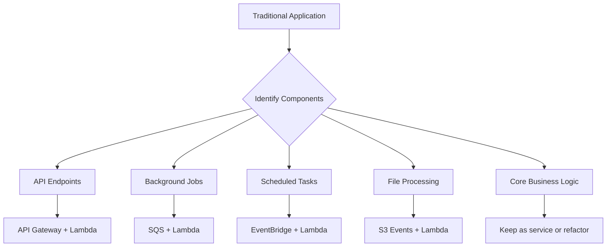
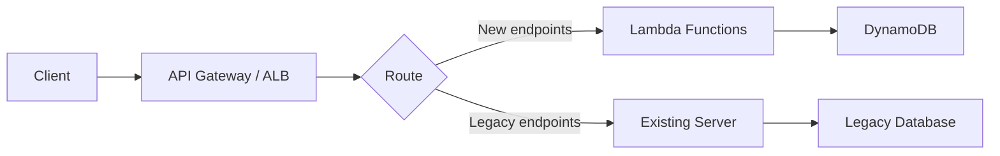

# How to Refactor Applications to Serverless on AWS

Author: [nawazdhandala](https://github.com/nawazdhandala)

Tags: AWS, Serverless, Lambda, API Gateway, DynamoDB, Step Functions, Refactoring

Description: Learn how to refactor traditional server-based applications to serverless architectures on AWS using Lambda, API Gateway, DynamoDB, and Step Functions.

---

Refactoring to serverless is not about rewriting everything from scratch. It is about progressively moving pieces of your application to serverless services where it makes sense, reducing operational overhead and often reducing costs at the same time. The key is knowing which parts of your application benefit from serverless and which parts are better left alone.

This guide covers practical strategies for refactoring traditional applications to serverless on AWS.

## When Serverless Makes Sense

Serverless works well for:
- Request/response APIs with variable traffic
- Event-driven processing (file uploads, queue processing, webhooks)
- Scheduled tasks and cron jobs
- Data transformation pipelines
- Backend for frontend (BFF) layers

Serverless is less ideal for:
- Long-running processes (over 15 minutes)
- Applications requiring persistent connections (WebSocket servers with heavy state)
- Applications with very high, consistent throughput (cold starts and per-invocation pricing add up)
- Applications requiring GPU or specialized hardware



## Strategy: The Strangler Fig Pattern

Instead of rewriting everything, gradually replace components of your monolith with serverless equivalents. The strangler fig pattern lets you do this incrementally.



Start by routing new features through serverless and gradually move existing features over time.

## Refactoring API Endpoints

### Before: Express.js Server

```javascript
// Traditional Express.js API
const express = require('express');
const app = express();
const db = require('./database');

app.get('/api/users/:id', async (req, res) => {
  const user = await db.getUser(req.params.id);
  if (!user) return res.status(404).json({ error: 'Not found' });
  res.json(user);
});

app.post('/api/users', async (req, res) => {
  const user = await db.createUser(req.body);
  res.status(201).json(user);
});

app.get('/api/orders', async (req, res) => {
  const orders = await db.getOrders(req.query);
  res.json(orders);
});

app.listen(3000);
```

### After: Lambda Functions with API Gateway

```python
# Lambda function for user operations
import json
import boto3
from datetime import datetime

dynamodb = boto3.resource('dynamodb')
users_table = dynamodb.Table('Users')

def get_user(event, context):
    user_id = event['pathParameters']['id']

    response = users_table.get_item(Key={'id': user_id})
    user = response.get('Item')

    if not user:
        return {
            'statusCode': 404,
            'headers': {'Content-Type': 'application/json'},
            'body': json.dumps({'error': 'Not found'})
        }

    return {
        'statusCode': 200,
        'headers': {'Content-Type': 'application/json'},
        'body': json.dumps(user)
    }

def create_user(event, context):
    body = json.loads(event['body'])

    user = {
        'id': str(uuid.uuid4()),
        'name': body['name'],
        'email': body['email'],
        'createdAt': datetime.now().isoformat()
    }

    users_table.put_item(Item=user)

    return {
        'statusCode': 201,
        'headers': {'Content-Type': 'application/json'},
        'body': json.dumps(user)
    }
```

Define the API in SAM template:

```yaml
# SAM template for serverless API
AWSTemplateFormatVersion: '2010-09-09'
Transform: AWS::Serverless-2016-10-31

Resources:
  GetUserFunction:
    Type: AWS::Serverless::Function
    Properties:
      Handler: users.get_user
      Runtime: python3.11
      MemorySize: 256
      Timeout: 10
      Events:
        GetUser:
          Type: Api
          Properties:
            Path: /api/users/{id}
            Method: get
      Policies:
        - DynamoDBReadPolicy:
            TableName: !Ref UsersTable

  CreateUserFunction:
    Type: AWS::Serverless::Function
    Properties:
      Handler: users.create_user
      Runtime: python3.11
      MemorySize: 256
      Timeout: 10
      Events:
        CreateUser:
          Type: Api
          Properties:
            Path: /api/users
            Method: post
      Policies:
        - DynamoDBCrudPolicy:
            TableName: !Ref UsersTable

  UsersTable:
    Type: AWS::DynamoDB::Table
    Properties:
      TableName: Users
      AttributeDefinitions:
        - AttributeName: id
          AttributeType: S
      KeySchema:
        - AttributeName: id
          KeyType: HASH
      BillingMode: PAY_PER_REQUEST
```

## Refactoring Background Jobs

### Before: Worker Process with Queue

```python
# Traditional worker process polling a queue
import time
import pika

connection = pika.BlockingConnection(pika.ConnectionParameters('rabbitmq-host'))
channel = connection.channel()
channel.queue_declare(queue='email-queue')

def process_email(ch, method, properties, body):
    email_data = json.loads(body)
    send_email(email_data['to'], email_data['subject'], email_data['body'])
    ch.basic_ack(delivery_tag=method.delivery_tag)

channel.basic_consume(queue='email-queue', on_message_callback=process_email)
channel.start_consuming()  # Runs forever
```

### After: SQS + Lambda

```python
# Lambda function triggered by SQS
import json
import boto3

ses = boto3.client('ses')

def handler(event, context):
    for record in event['Records']:
        email_data = json.loads(record['body'])

        ses.send_email(
            Source='noreply@example.com',
            Destination={'ToAddresses': [email_data['to']]},
            Message={
                'Subject': {'Data': email_data['subject']},
                'Body': {'Html': {'Data': email_data['body']}}
            }
        )

    # SQS Lambda integration handles acknowledgment automatically
    return {'statusCode': 200}
```

## Refactoring Scheduled Tasks

### Before: Cron Jobs

```bash
# Traditional crontab
0 * * * * /usr/bin/python3 /app/scripts/cleanup_expired_sessions.py
0 6 * * * /usr/bin/python3 /app/scripts/generate_daily_report.py
*/5 * * * * /usr/bin/python3 /app/scripts/sync_inventory.py
```

### After: EventBridge + Lambda

```yaml
# SAM template for scheduled Lambda functions
Resources:
  CleanupFunction:
    Type: AWS::Serverless::Function
    Properties:
      Handler: cleanup.handler
      Runtime: python3.11
      Timeout: 300
      Events:
        Hourly:
          Type: Schedule
          Properties:
            Schedule: rate(1 hour)
            Description: Clean up expired sessions

  DailyReportFunction:
    Type: AWS::Serverless::Function
    Properties:
      Handler: report.handler
      Runtime: python3.11
      Timeout: 900
      MemorySize: 512
      Events:
        Daily:
          Type: Schedule
          Properties:
            Schedule: cron(0 6 * * ? *)
            Description: Generate daily report

  InventorySyncFunction:
    Type: AWS::Serverless::Function
    Properties:
      Handler: sync.handler
      Runtime: python3.11
      Timeout: 120
      Events:
        Every5Minutes:
          Type: Schedule
          Properties:
            Schedule: rate(5 minutes)
            Description: Sync inventory data
```

## Refactoring File Processing

### Before: File Upload Handler

```python
# Traditional file upload processing
@app.route('/upload', methods=['POST'])
def upload_file():
    file = request.files['document']
    filepath = f'/uploads/{file.filename}'
    file.save(filepath)

    # Process the file (resize image, extract text, etc.)
    result = process_file(filepath)

    # Save result to database
    db.save_processing_result(file.filename, result)

    return jsonify({'status': 'processed', 'result': result})
```

### After: S3 + Lambda

```python
# Lambda triggered by S3 upload
import boto3
import json

s3 = boto3.client('s3')
textract = boto3.client('textract')
dynamodb = boto3.resource('dynamodb')
results_table = dynamodb.Table('ProcessingResults')

def handler(event, context):
    for record in event['Records']:
        bucket = record['s3']['bucket']['name']
        key = record['s3']['object']['key']

        # Process the uploaded file
        response = textract.detect_document_text(
            Document={
                'S3Object': {
                    'Bucket': bucket,
                    'Name': key
                }
            }
        )

        # Extract text
        text = ' '.join([
            block['Text'] for block in response['Blocks']
            if block['BlockType'] == 'LINE'
        ])

        # Save result
        results_table.put_item(Item={
            'filename': key,
            'text': text,
            'processedAt': datetime.now().isoformat()
        })

    return {'statusCode': 200}
```

## Handling Complex Workflows with Step Functions

When your business logic involves multiple steps with error handling and retries, use Step Functions:

```json
{
  "Comment": "Order processing workflow",
  "StartAt": "ValidateOrder",
  "States": {
    "ValidateOrder": {
      "Type": "Task",
      "Resource": "arn:aws:lambda:us-east-1:123456789:function:validate-order",
      "Next": "CheckInventory",
      "Catch": [{
        "ErrorEquals": ["ValidationError"],
        "Next": "RejectOrder"
      }]
    },
    "CheckInventory": {
      "Type": "Task",
      "Resource": "arn:aws:lambda:us-east-1:123456789:function:check-inventory",
      "Next": "ProcessPayment",
      "Retry": [{
        "ErrorEquals": ["States.TaskFailed"],
        "IntervalSeconds": 5,
        "MaxAttempts": 3
      }]
    },
    "ProcessPayment": {
      "Type": "Task",
      "Resource": "arn:aws:lambda:us-east-1:123456789:function:process-payment",
      "Next": "FulfillOrder"
    },
    "FulfillOrder": {
      "Type": "Task",
      "Resource": "arn:aws:lambda:us-east-1:123456789:function:fulfill-order",
      "End": true
    },
    "RejectOrder": {
      "Type": "Task",
      "Resource": "arn:aws:lambda:us-east-1:123456789:function:reject-order",
      "End": true
    }
  }
}
```

## Managing Cold Starts

Cold starts are the most common complaint about Lambda. Strategies to minimize their impact:

```python
# Provisioned concurrency for latency-sensitive functions
import boto3

lambda_client = boto3.client('lambda')

lambda_client.put_provisioned_concurrency_config(
    FunctionName='latency-sensitive-api',
    Qualifier='prod',
    ProvisionedConcurrentExecutions=10
)
```

Other strategies:
- Keep functions small and focused
- Use lightweight runtimes (Python, Node.js start faster than Java)
- Initialize SDK clients outside the handler
- Use Lambda SnapStart for Java functions

## Database Considerations

Moving from a relational database to DynamoDB requires rethinking your data model. Not every table needs to move - you can use RDS Proxy with Lambda for existing relational databases:

```yaml
# Use RDS Proxy for Lambda-to-RDS connections
RDSProxy:
  Type: AWS::RDS::DBProxy
  Properties:
    DBProxyName: lambda-rds-proxy
    EngineFamily: MYSQL
    RequireTLS: true
    RoleArn: !GetAtt RDSProxyRole.Arn
    Auth:
      - AuthScheme: SECRETS
        SecretArn: !Ref DBSecret
    VpcSubnetIds:
      - !Ref PrivateSubnet1
      - !Ref PrivateSubnet2
```

## Monitoring Serverless Applications

Serverless applications distribute logic across many Lambda functions, making observability critical. Enable X-Ray tracing and structured logging:

```python
# Enable X-Ray tracing in Lambda
from aws_xray_sdk.core import xray_recorder
from aws_xray_sdk.core import patch_all
patch_all()

import structlog
logger = structlog.get_logger()

def handler(event, context):
    logger.info("processing_request", path=event.get('path'), method=event.get('httpMethod'))
    # Your logic here
```

For comprehensive monitoring across your serverless functions, [OneUptime](https://oneuptime.com/blog/post/2026-02-12-containerize-legacy-applications-for-aws/view) provides end-to-end observability that works across Lambda, API Gateway, and your other AWS services.

## Wrapping Up

Refactoring to serverless is a gradual process, not a big bang rewrite. Use the strangler fig pattern to progressively move pieces of your application to Lambda, SQS, EventBridge, and Step Functions. Start with the components that benefit most from serverless: variable-traffic APIs, background jobs, scheduled tasks, and event-driven file processing. Keep using managed databases (RDS with Proxy) where relational queries are needed, and adopt DynamoDB where the access patterns fit. The result is an application with lower operational overhead, automatic scaling, and pay-per-use pricing.
