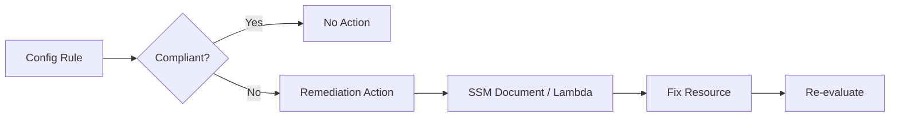

# How to Remediate Non-Compliant Resources with AWS Config

Author: [nawazdhandala](https://github.com/nawazdhandala)

Tags: AWS, Config, Compliance, Remediation, Security

Description: Learn how to set up automatic and manual remediation actions for non-compliant resources detected by AWS Config rules using SSM documents and custom Lambda functions.

---

Finding non-compliant resources is only half the battle. You've got [AWS Config rules](https://oneuptime.com/blog/post/aws-config-managed-rules-security/view) flagging security groups with open SSH, unencrypted S3 buckets, and IAM users without MFA. Great. But if nobody does anything about those findings, you've just built an expensive compliance report that nobody reads.

AWS Config remediation actions let you fix non-compliant resources automatically - or with a single click for manual review. You can use AWS-provided SSM automation documents or write your own Lambda-backed remediation logic. Let's walk through both approaches.

## How Remediation Works

When a Config rule evaluates a resource as non-compliant, a remediation action can be triggered. The action runs an SSM Automation document or a Lambda function that fixes the issue.



There are two modes:

- **Manual remediation** - You review the non-compliant resource and click "Remediate" in the console. The action runs on demand.
- **Automatic remediation** - The action runs automatically whenever Config detects non-compliance. No human in the loop.

## Setting Up Manual Remediation

Let's start with a manual remediation for S3 bucket encryption. When a bucket is found without encryption, you'll have the option to enable it with one click.

First, make sure you've got the Config rule in place.

```bash
# The Config rule that checks for S3 encryption
aws configservice put-config-rule \
  --config-rule '{
    "ConfigRuleName": "s3-bucket-server-side-encryption",
    "Source": {
      "Owner": "AWS",
      "SourceIdentifier": "S3_BUCKET_SERVER_SIDE_ENCRYPTION_ENABLED"
    }
  }'
```

Now add the remediation action using an AWS-provided SSM document.

```bash
# Set up manual remediation
aws configservice put-remediation-configurations \
  --remediation-configurations '[{
    "ConfigRuleName": "s3-bucket-server-side-encryption",
    "TargetType": "SSM_DOCUMENT",
    "TargetId": "AWS-EnableS3BucketEncryption",
    "Parameters": {
      "BucketName": {
        "ResourceValue": {
          "Value": "RESOURCE_ID"
        }
      },
      "SSEAlgorithm": {
        "StaticValue": {
          "Values": ["AES256"]
        }
      }
    },
    "Automatic": false,
    "MaximumAutomaticAttempts": 3,
    "RetryAttemptSeconds": 60
  }]'
```

The key parameters here:
- `RESOURCE_ID` is dynamically replaced with the actual bucket name when the action runs
- `Automatic: false` means you have to trigger it manually
- The SSM document `AWS-EnableS3BucketEncryption` is maintained by AWS

## Setting Up Automatic Remediation

For resources where you're confident auto-fixing is safe, set `Automatic` to `true`. Here's an example that automatically closes default security groups that have any rules added to them.

```bash
aws configservice put-remediation-configurations \
  --remediation-configurations '[{
    "ConfigRuleName": "vpc-default-security-group-closed",
    "TargetType": "SSM_DOCUMENT",
    "TargetId": "AWS-DisablePublicAccessForSecurityGroup",
    "Parameters": {
      "GroupId": {
        "ResourceValue": {
          "Value": "RESOURCE_ID"
        }
      }
    },
    "Automatic": true,
    "MaximumAutomaticAttempts": 5,
    "RetryAttemptSeconds": 60
  }]'
```

With automatic remediation, the remediation action runs every time Config evaluates the resource as non-compliant. If the remediation fails, it retries up to `MaximumAutomaticAttempts` times.

## Common AWS-Provided SSM Documents

AWS provides a bunch of pre-built SSM automation documents for remediation. Here are the most useful ones for security.

| SSM Document | What It Does |
|---|---|
| `AWS-EnableS3BucketEncryption` | Enables server-side encryption on an S3 bucket |
| `AWS-DisablePublicAccessForSecurityGroup` | Removes public access rules from a security group |
| `AWS-EnableCloudTrail` | Enables CloudTrail logging |
| `AWS-EnableEbsEncryptionByDefault` | Enables default EBS encryption |
| `AWS-ConfigureS3BucketLogging` | Enables access logging on an S3 bucket |
| `AWS-EnableCLBAccessLogging` | Enables access logging on a Classic Load Balancer |
| `AWS-PublishSNSNotification` | Sends a notification (useful for alerting instead of auto-fix) |

## Custom Remediation with Lambda

When the AWS-provided documents don't cover your use case, write a custom Lambda function. Here's an example that tags non-compliant resources with a "compliance-violation" tag.

```python
import boto3
import json

def handler(event, context):
    """
    Tags non-compliant resources to flag them for review.
    Receives resource details from Config remediation.
    """
    resource_type = event.get('ResourceType', '')
    resource_id = event.get('ResourceId', '')
    rule_name = event.get('ConfigRuleName', 'unknown')

    # Determine the right API to tag based on resource type
    if resource_type == 'AWS::EC2::Instance':
        ec2 = boto3.client('ec2')
        ec2.create_tags(
            Resources=[resource_id],
            Tags=[
                {'Key': 'ComplianceViolation', 'Value': rule_name},
                {'Key': 'RemediationRequired', 'Value': 'true'}
            ]
        )

    elif resource_type == 'AWS::S3::Bucket':
        s3 = boto3.client('s3')
        # Get existing tags
        try:
            response = s3.get_bucket_tagging(Bucket=resource_id)
            tags = response['TagSet']
        except s3.exceptions.ClientError:
            tags = []

        # Add compliance violation tag
        tags.append({'Key': 'ComplianceViolation', 'Value': rule_name})
        tags.append({'Key': 'RemediationRequired', 'Value': 'true'})

        s3.put_bucket_tagging(
            Bucket=resource_id,
            Tagging={'TagSet': tags}
        )

    return {
        'status': 'success',
        'resource': resource_id,
        'action': 'tagged-for-review'
    }
```

### Creating a Custom SSM Document

To use a Lambda function as a remediation action, wrap it in an SSM automation document.

```yaml
# custom-remediation-document.yaml
description: Tag non-compliant resource for review
schemaVersion: '0.3'
assumeRole: '{{ AutomationAssumeRole }}'
parameters:
  ResourceId:
    type: String
    description: The resource ID to remediate
  ResourceType:
    type: String
    description: The resource type
  ConfigRuleName:
    type: String
    description: The Config rule that flagged non-compliance
  AutomationAssumeRole:
    type: String
    description: The ARN of the role to assume
mainSteps:
  - name: TagResource
    action: 'aws:invokeLambdaFunction'
    inputs:
      FunctionName: config-remediation-tagger
      Payload: |
        {
          "ResourceId": "{{ ResourceId }}",
          "ResourceType": "{{ ResourceType }}",
          "ConfigRuleName": "{{ ConfigRuleName }}"
        }
```

Create the SSM document.

```bash
aws ssm create-document \
  --name CustomTagRemediation \
  --document-type Automation \
  --content file://custom-remediation-document.yaml \
  --document-format YAML
```

Then wire it up as a Config remediation action.

```bash
aws configservice put-remediation-configurations \
  --remediation-configurations '[{
    "ConfigRuleName": "encrypted-ebs-volumes",
    "TargetType": "SSM_DOCUMENT",
    "TargetId": "CustomTagRemediation",
    "Parameters": {
      "ResourceId": {
        "ResourceValue": {
          "Value": "RESOURCE_ID"
        }
      },
      "ResourceType": {
        "StaticValue": {
          "Values": ["AWS::EC2::Volume"]
        }
      },
      "ConfigRuleName": {
        "StaticValue": {
          "Values": ["encrypted-ebs-volumes"]
        }
      },
      "AutomationAssumeRole": {
        "StaticValue": {
          "Values": ["arn:aws:iam::111111111111:role/ConfigRemediationRole"]
        }
      }
    },
    "Automatic": true,
    "MaximumAutomaticAttempts": 3,
    "RetryAttemptSeconds": 120
  }]'
```

## Terraform Configuration

Here's the Terraform version for setting up remediation.

```hcl
resource "aws_config_remediation_configuration" "s3_encryption" {
  config_rule_name = aws_config_config_rule.s3_encryption.name
  target_type      = "SSM_DOCUMENT"
  target_id        = "AWS-EnableS3BucketEncryption"
  automatic        = true

  parameter {
    name           = "BucketName"
    resource_value = "RESOURCE_ID"
  }

  parameter {
    name         = "SSEAlgorithm"
    static_value = "AES256"
  }

  maximum_automatic_attempts = 3
  retry_attempt_seconds      = 60
}
```

## Checking Remediation Status

Monitor whether your remediation actions are actually working.

```bash
# Check remediation execution status
aws configservice describe-remediation-execution-status \
  --config-rule-name s3-bucket-server-side-encryption

# Get details on a specific remediation
aws configservice describe-remediation-execution-status \
  --config-rule-name s3-bucket-server-side-encryption \
  --resource-keys '[{"resourceType": "AWS::S3::Bucket", "resourceId": "my-bucket-name"}]'
```

## Safety Guidelines

Auto-remediation is powerful but dangerous if not handled carefully. Follow these guidelines:

1. **Always start with manual remediation** and test thoroughly before switching to automatic
2. **Never auto-remediate destructive actions** like deleting resources or revoking access
3. **Set reasonable retry limits** to avoid infinite loops
4. **Log everything** so you can audit what remediation actions have done
5. **Use SNS notifications** alongside remediation so your team knows what's being changed
6. **Exclude critical resources** from auto-remediation using resource exceptions

For a complete compliance monitoring setup, combine remediation with [conformance packs](https://oneuptime.com/blog/post/aws-config-conformance-packs/view) to manage rules in bulk, and use [Config aggregators](https://oneuptime.com/blog/post/aws-config-aggregators-multi-account/view) to track compliance across all your accounts from one place.
