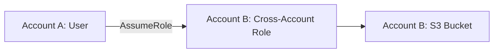
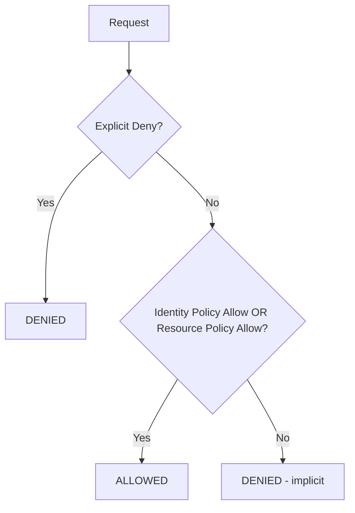
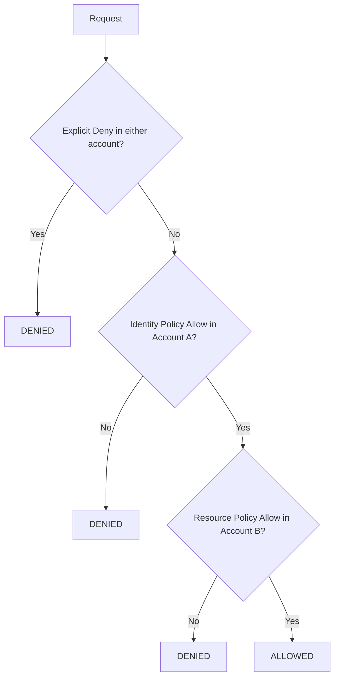

# How to Use Resource-Based Policies vs Identity-Based Policies

Author: [nawazdhandala](https://github.com/nawazdhandala)

Tags: AWS, IAM, Security, Policies

Description: Understand the differences between resource-based and identity-based IAM policies in AWS, when to use each, and how they interact in policy evaluation.

---

AWS has two main types of IAM policies, and understanding the difference between them is fundamental to getting access control right. Identity-based policies attach to users, groups, and roles. Resource-based policies attach directly to resources like S3 buckets, SQS queues, and Lambda functions. They look similar but behave differently - especially when it comes to cross-account access.

Let's break down both types, when to use each, and the tricky parts where they interact.

## Identity-Based Policies

These are the policies you're probably most familiar with. They attach to IAM principals (users, groups, roles) and define what those principals can do.

There are two flavors:

### Managed Policies

Standalone policies that can be attached to multiple principals:

```json
{
  "Version": "2012-10-17",
  "Statement": [
    {
      "Sid": "AllowS3ReadAccess",
      "Effect": "Allow",
      "Action": [
        "s3:GetObject",
        "s3:ListBucket"
      ],
      "Resource": [
        "arn:aws:s3:::my-bucket",
        "arn:aws:s3:::my-bucket/*"
      ]
    }
  ]
}
```

AWS provides hundreds of managed policies (like `AmazonS3ReadOnlyAccess`). You can also create customer-managed policies.

### Inline Policies

Embedded directly in a user, group, or role. They can't be reused:

```bash
# Attach an inline policy to a role
aws iam put-role-policy \
  --role-name MyAppRole \
  --policy-name s3-read-inline \
  --policy-document '{
    "Version": "2012-10-17",
    "Statement": [
      {
        "Effect": "Allow",
        "Action": "s3:GetObject",
        "Resource": "arn:aws:s3:::my-bucket/*"
      }
    ]
  }'
```

Use inline policies sparingly. They're harder to manage and audit.

## Resource-Based Policies

These attach to the resource itself and specify who can access it. The key difference: they include a `Principal` element that says who the policy applies to.

### S3 Bucket Policy

```json
{
  "Version": "2012-10-17",
  "Statement": [
    {
      "Sid": "AllowCrossAccountRead",
      "Effect": "Allow",
      "Principal": {
        "AWS": "arn:aws:iam::987654321098:role/PartnerReadRole"
      },
      "Action": [
        "s3:GetObject",
        "s3:ListBucket"
      ],
      "Resource": [
        "arn:aws:s3:::shared-data-bucket",
        "arn:aws:s3:::shared-data-bucket/*"
      ]
    }
  ]
}
```

### SQS Queue Policy

```json
{
  "Version": "2012-10-17",
  "Statement": [
    {
      "Sid": "AllowSNSToSendMessages",
      "Effect": "Allow",
      "Principal": {
        "Service": "sns.amazonaws.com"
      },
      "Action": "sqs:SendMessage",
      "Resource": "arn:aws:sqs:us-east-1:123456789012:my-queue",
      "Condition": {
        "ArnEquals": {
          "aws:SourceArn": "arn:aws:sns:us-east-1:123456789012:my-topic"
        }
      }
    }
  ]
}
```

### Lambda Function Policy

```bash
# Add a resource-based policy to allow API Gateway to invoke a Lambda function
aws lambda add-permission \
  --function-name my-api-function \
  --statement-id apigateway-invoke \
  --action lambda:InvokeFunction \
  --principal apigateway.amazonaws.com \
  --source-arn "arn:aws:execute-api:us-east-1:123456789012:api-id/*/GET/users"
```

### KMS Key Policy

```json
{
  "Version": "2012-10-17",
  "Statement": [
    {
      "Sid": "AllowKeyAdministration",
      "Effect": "Allow",
      "Principal": {
        "AWS": "arn:aws:iam::123456789012:role/KeyAdminRole"
      },
      "Action": [
        "kms:Create*",
        "kms:Describe*",
        "kms:Enable*",
        "kms:List*",
        "kms:Put*",
        "kms:Update*",
        "kms:Revoke*",
        "kms:Disable*",
        "kms:Get*",
        "kms:Delete*",
        "kms:ScheduleKeyDeletion",
        "kms:CancelKeyDeletion"
      ],
      "Resource": "*"
    },
    {
      "Sid": "AllowKeyUsage",
      "Effect": "Allow",
      "Principal": {
        "AWS": "arn:aws:iam::123456789012:role/AppRole"
      },
      "Action": [
        "kms:Encrypt",
        "kms:Decrypt",
        "kms:GenerateDataKey"
      ],
      "Resource": "*"
    }
  ]
}
```

## Key Differences

| Aspect | Identity-Based | Resource-Based |
|--------|---------------|----------------|
| Attached to | Users, groups, roles | Resources (S3, SQS, Lambda, etc.) |
| Has Principal? | No | Yes (specifies who) |
| Cross-account | Requires role in target account | Can grant directly |
| Managed by | IAM admin | Resource owner |
| Scope | Any AWS service | Only services that support it |

## The Cross-Account Difference

This is where the distinction really matters. Consider two accounts - Account A (requester) and Account B (resource owner).

### Cross-Account with Identity-Based Policies Only

Without resource-based policies, cross-account access requires a role in Account B:



The user in Account A assumes a role in Account B, then accesses the resource as that role. The user temporarily "becomes" an Account B entity.

### Cross-Account with Resource-Based Policies

With a resource-based policy, Account A can access Account B's resource directly:


No role assumption needed. The S3 bucket policy in Account B explicitly allows Account A's principal.

This matters because:

1. **Identity stays preserved**: CloudTrail logs show Account A's principal, not an assumed role
2. **No role chaining**: Simpler to set up
3. **Both sides must agree**: Account A's policy must allow the action, AND Account B's resource policy must allow it

## Policy Evaluation Logic

Understanding how AWS evaluates policies when both types are present is crucial.

### Same-Account Evaluation

When a principal and resource are in the same account:



In the same account, either an identity-based OR resource-based Allow is sufficient. They're combined with a logical OR.

### Cross-Account Evaluation

When the principal and resource are in different accounts:



Cross-account requires BOTH an identity-based Allow in the requester's account AND a resource-based Allow on the target resource. It's a logical AND.

## When to Use Each

### Use Identity-Based Policies When:

- Granting access to many resources across multiple services
- Managing permissions for groups of users
- The target service doesn't support resource-based policies
- You want centralized permission management

### Use Resource-Based Policies When:

- Granting cross-account access without role assumption
- Allowing AWS services to access your resources (S3 events to Lambda, SNS to SQS)
- You want the resource owner to control who can access their resource
- You need to grant access to principals in many different accounts

### Use Both When:

- Defense in depth (require both the user's policy and the resource policy to allow access)
- Different teams manage identity and resource access separately
- Cross-account scenarios where you want fine-grained control on both sides

## Services That Support Resource-Based Policies

Not all AWS services support resource-based policies. Here are the major ones that do:

- **S3** (bucket policies)
- **SQS** (queue policies)
- **SNS** (topic policies)
- **Lambda** (function policies)
- **KMS** (key policies)
- **ECR** (repository policies)
- **Secrets Manager** (secret policies)
- **API Gateway** (resource policies)
- **EventBridge** (event bus policies)
- **Glacier** (vault policies)
- **CloudWatch Logs** (resource policies)

Services like EC2, RDS, and DynamoDB don't support resource-based policies. For those, you need identity-based policies or tag-based conditions.

## Common Patterns

### Public S3 Bucket (Don't Do This)

```json
{
  "Version": "2012-10-17",
  "Statement": [
    {
      "Sid": "PublicRead",
      "Effect": "Allow",
      "Principal": "*",
      "Action": "s3:GetObject",
      "Resource": "arn:aws:s3:::my-public-bucket/*"
    }
  ]
}
```

This makes the bucket publicly readable. Use CloudFront with OAI/OAC instead.

### Lambda Invocation from Another Account

```bash
# Allow Account B to invoke your Lambda function
aws lambda add-permission \
  --function-name my-function \
  --statement-id cross-account-invoke \
  --action lambda:InvokeFunction \
  --principal "arn:aws:iam::987654321098:role/CallerRole"
```

### Shared Secrets Manager Secret

```json
{
  "Version": "2012-10-17",
  "Statement": [
    {
      "Sid": "AllowCrossAccountRead",
      "Effect": "Allow",
      "Principal": {
        "AWS": "arn:aws:iam::987654321098:root"
      },
      "Action": [
        "secretsmanager:GetSecretValue",
        "secretsmanager:DescribeSecret"
      ],
      "Resource": "*",
      "Condition": {
        "StringEquals": {
          "aws:PrincipalOrgID": "o-abc123def4"
        }
      }
    }
  ]
}
```

The `aws:PrincipalOrgID` condition restricts access to accounts within your AWS Organization.

## Debugging Policy Issues

When access is denied and you're not sure why:

```bash
# Simulate a policy evaluation
aws iam simulate-principal-policy \
  --policy-source-arn arn:aws:iam::123456789012:role/MyRole \
  --action-names s3:GetObject \
  --resource-arns arn:aws:s3:::my-bucket/test.txt
```

This tells you whether the identity-based policies would allow the action. For the full picture including resource-based policies, use CloudTrail to find the actual denial reason.

Understanding when to use identity-based versus resource-based policies - and how they interact - is one of those foundational AWS skills that makes everything else easier. Get this right, and your access control becomes cleaner, more secure, and easier to audit.
